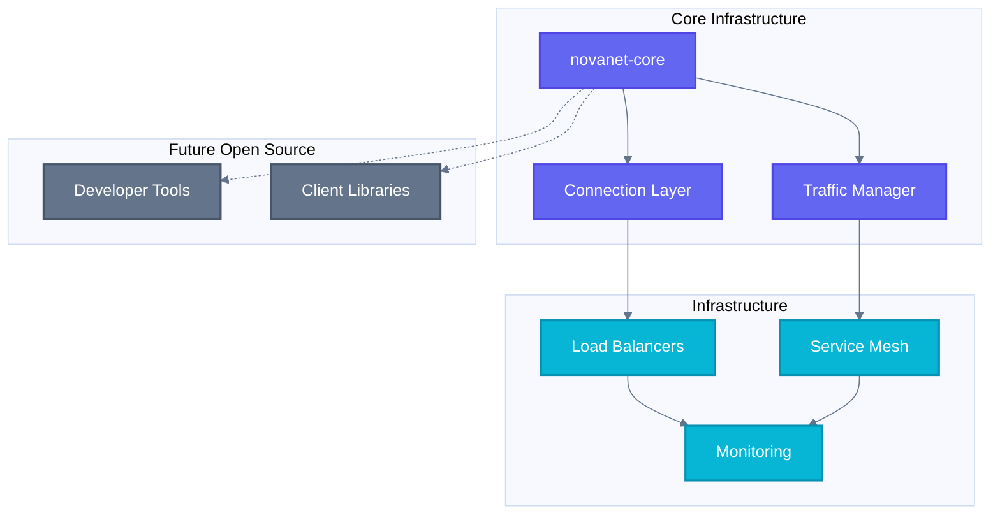

# Ecosystem

> All repositories that make up the NovaNET universe.

---

## Architecture Overview

---

## Core

| Repository | Description | Status |
|------------|-------------|--------|
| *Coming soon* | · | · |

---

## Open Source

| Repository | Description | Status |
|------------|-------------|--------|
| *Coming soon* | · | · |
