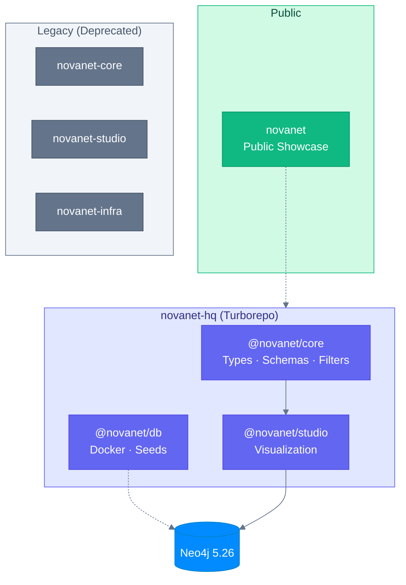

# Ecosystem

> All repositories that make up the NovaNet universe.

---

## Architecture Overview



---

## Repositories

### Active Development

| Repository | Description | Status | Access |
|------------|-------------|--------|--------|
| [**novanet**](https://github.com/supernovae-st/novanet) | Public showcase & documentation | Active | Public |
| [**novanet-hq**](https://github.com/supernovae-st/novanet-hq) | Turborepo monorepo (main development) | Active | Private |

### Monorepo Packages (novanet-hq)

| Package | Version | Description |
|---------|---------|-------------|
| **@novanet/core** | 8.1.0 | TypeScript types, Zod schemas, NovaNetFilter API, Cypher generators |
| **@novanet/db** | 1.0.0 | Neo4j Docker infrastructure, Cypher seeds, migrations |
| **@novanet/studio** | 0.1.0 | Interactive 2D/3D graph visualization with AI chat |

### Legacy (Deprecated)

| Repository | Migrated To | Notes |
|------------|-------------|-------|
| [novanet-core](https://github.com/supernovae-st/novanet-core) | `novanet-hq/packages/core` | Standalone repo → monorepo |
| [novanet-studio](https://github.com/supernovae-st/novanet-studio) | `novanet-hq/apps/studio` | Standalone repo → monorepo |
| [novanet-infra](https://github.com/supernovae-st/novanet-infra) | `novanet-hq/packages/db` | Merged into db package |

---

## Monorepo Structure

```
novanet-hq/
├── turbo.json              # Turborepo pipeline
├── pnpm-workspace.yaml     # Workspace definitions
├── packages/
│   ├── core/               # @novanet/core
│   │   ├── models/         # YAML schema (source of truth)
│   │   └── src/            # TypeScript implementation
│   ├── db/                 # @novanet/db
│   │   ├── docker-compose.yml
│   │   └── seed/           # Cypher scripts
│   └── cli/                # @novanet/cli (in development)
└── apps/
    └── studio/             # @novanet/studio
        └── src/            # Next.js 16 app
```

---

## Dependencies

```
@novanet/core ←── @novanet/studio
      ↑
@novanet/cli (future)

@novanet/db (standalone, manages Neo4j)
```

---

## Tech Stack

| Layer | Technologies |
|-------|--------------|
| **Build** | Turborepo 2.8, pnpm 9 |
| **Runtime** | React 19, Next.js 16, TypeScript 5.9 |
| **Database** | Neo4j 5.26 Community + APOC |
| **Validation** | Zod 3.24 |
| **State** | Zustand 5 |
| **Visualization** | React Flow, react-force-graph-3d |
| **AI** | Claude API (Anthropic) |

---

## Getting Started

All development happens in `novanet-hq`:

```bash
# Clone the monorepo
git clone git@github.com:supernovae-st/novanet-hq.git
cd novanet-hq

# Install dependencies
pnpm install

# Start Neo4j + seed
pnpm infra:up
pnpm infra:seed

# Start development
pnpm dev
```

---

<div align="center">

**[SuperNovae Studio](https://github.com/supernovae-st)**

</div>
