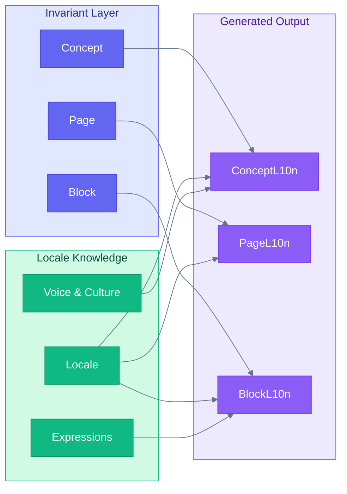
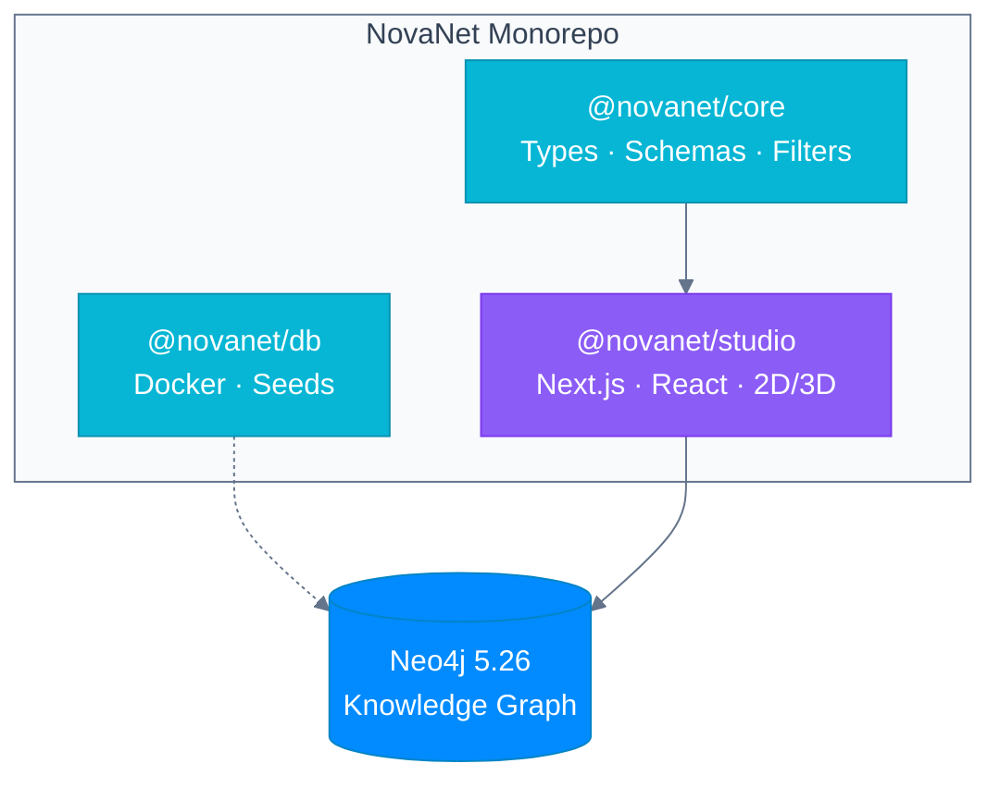

<div align="center">

# NovaNet

**Native content generation engine powered by Neo4j knowledge graphs**

Generate culturally-authentic content across 200+ locales — not translation, but true localization from semantic concepts.

[](https://github.com/supernovae-st/novanet)
[](https://neo4j.com)
[](https://typescriptlang.org)

<br>

**Part of [SuperNovae Studio](https://github.com/supernovae-st)**

[Why NovaNet?](#why-novanet) · [How It Works](#how-it-works) · [Features](#features) · [Architecture](#architecture) · [Ecosystem](#ecosystem)

</div>

---

## Why NovaNet?

Traditional translation pipelines lose context. They translate words, not meaning.

NovaNet builds a **knowledge graph** of your content — understanding relationships, terminology, and cultural context — then generates native-quality content that preserves meaning across languages.

```
❌ Traditional:  Source → Translate → Target
✅ NovaNet:      Concept (invariant) → Generate natively → L10n (localized)
```

| Problem | NovaNet Solution |
|---------|------------------|
| Lost context in translation | Knowledge graph preserves semantic relationships |
| Inconsistent terminology | Centralized concept mapping with locale-specific expressions |
| Generic AI translations | Domain-aware generation with cultural knowledge layers |
| Manual locale management | Automated multi-locale orchestration (200+ locales) |

---

## How It Works

NovaNet uses a **3-layer architecture** separating invariant concepts from locale-specific generation:



1. **Invariant Layer** — Define concepts, pages, and blocks in a language-neutral way
2. **Locale Knowledge** — Each locale has its own voice, cultural references, expressions, and formatting rules
3. **Generated Output** — Content is generated *natively* for each locale, not translated

---

## Features

### Knowledge Graph (Neo4j)

| Capability | Description |
|------------|-------------|
| **35 Node Types** | Concepts, Pages, Blocks, Locales, Expressions, and more |
| **50+ Relationships** | Semantic links with temperature for spreading activation |
| **3 Scopes** | Global (shared knowledge), Shared (cross-project), Project (specific) |
| **~19,000 Nodes** | Production graph for QR Code AI |

### Content Generation

| Capability | Description |
|------------|-------------|
| **200+ Locales** | Full international coverage with native generation |
| **Orchestrator Pattern** | Dispatches tasks to specialized sub-agents |
| **Locale Knowledge** | Voice, culture, market, lexicon per locale |
| **SEO & GEO** | Search and generative engine optimization |

### NovaNet Studio

| Capability | Description |
|------------|-------------|
| **2D/3D Visualization** | React Flow + force-graph with toggle (`V` key) |
| **AI Chat** | Natural language → Cypher with Claude API (`⌘J`) |
| **40+ Shortcuts** | Full keyboard navigation |
| **10 Filter Presets** | Quick views via number keys |

---

## Architecture



### Packages

| Package | Description |
|---------|-------------|
| **@novanet/core** | TypeScript types, Zod schemas, NovaNetFilter API, Cypher generators |
| **@novanet/db** | Neo4j Docker infrastructure, Cypher seeds, migrations |
| **@novanet/studio** | Interactive graph visualization with AI-powered queries |

---

## Ecosystem

| Repository | Description | Status |
|------------|-------------|--------|
| [**novanet**](https://github.com/supernovae-st/novanet) | Public showcase (this repo) | Public |
| [**novanet-hq**](https://github.com/supernovae-st/novanet-hq) | Turborepo monorepo (development) | Private |
| [**novanet-core**](https://github.com/supernovae-st/novanet-core) | Core library (types, schemas, filters) | Private |
| [**novanet-studio**](https://github.com/supernovae-st/novanet-studio) | Graph visualization app | Private |
| [**novanet-infra**](https://github.com/supernovae-st/novanet-infra) | Docker configurations | Private |

---

## Tech Stack

| Layer | Technologies |
|-------|--------------|
| **Runtime** | React 19, Next.js 16, TypeScript 5.9, Tailwind 3.4 |
| **Database** | Neo4j 5.26 Community + APOC |
| **State** | Zustand 5, Zod 3.24 |
| **Visualization** | React Flow, react-force-graph-3d |
| **AI** | Claude API (Anthropic) |
| **Build** | Turborepo 2.8, pnpm 9 |

---

## Target Application

NovaNet powers **[QR Code AI](https://qrcode-ai.com)** — generating native content across 200+ locales for the world's most advanced QR code platform.

---

## Links

| Resource | Description |
|----------|-------------|
| [Vision](./VISION.md) | Product vision and philosophy |
| [Ecosystem](./ECOSYSTEM.md) | Repository structure |

---

<div align="center">

**Built by [Thibaut MÉLEN](https://github.com/ThibautMelen) & [Nicolas CELLA](https://github.com/NicolasCELLA) at [SuperNovae Studio](https://supernovae.studio)**

[](https://github.com/supernovae-st)

</div>
