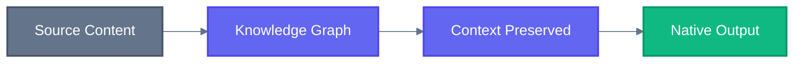
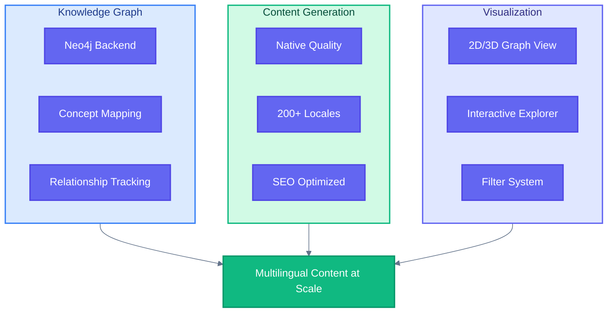
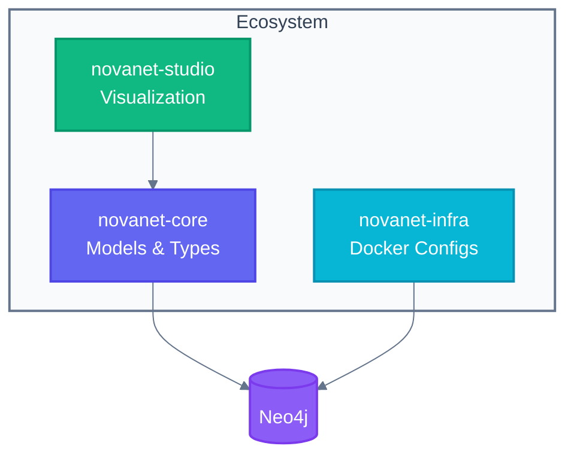

# NovaNET

**Knowledge graph localization orchestrator for native multilingual content generation.**

Turn your content into a living knowledge graph. Generate native-quality translations at scale.

 

**Part of [SuperNovae Studio](https://github.com/supernovae-st)**

[Why NovaNET?](#why-novanet) · [Features](#features) · [Architecture](#architecture) · [Ecosystem](#ecosystem)

---

## Why NovaNET?

Traditional translation pipelines lose context. They translate words, not meaning.

NovaNET builds a **knowledge graph** of your content — understanding relationships, terminology, and domain concepts — then generates native-quality content that preserves meaning across languages.

| Problem | NovaNET Solution |
|---------|------------------|
| Lost context in translation | Knowledge graph preserves relationships |
| Inconsistent terminology | Centralized concept mapping |
| Manual locale management | Automated multi-locale generation |
| Generic AI translations | Domain-aware native content |

---

## Features

| Feature | Description |
|---------|-------------|
| **Knowledge Graph** | Neo4j-powered content relationships |
| **Native Generation** | Context-aware multilingual content |
| **Visual Explorer** | Interactive 2D/3D graph visualization |
| **Filter System** | TypeScript-based query filters |
| **200+ Locales** | Full international coverage |

---

## Architecture

---

## Ecosystem

| Repository | Description | Status |
|------------|-------------|--------|
| [**novanet**](https://github.com/supernovae-st/novanet) | Public showcase (this repo) | Public |
| [**novanet-core**](https://github.com/supernovae-st/novanet-core) | Neo4j models & TypeScript types | Private |
| [**novanet-studio**](https://github.com/supernovae-st/novanet-studio) | Interactive graph visualization | Private |
| [**novanet-infra**](https://github.com/supernovae-st/novanet-infra) | Docker configurations | Private |
| [**novanet-hq**](https://github.com/supernovae-st/novanet-hq) | Development workspace | Private |

---

## Links

| Resource | Description |
|----------|-------------|
| [Vision](./VISION.md) | Where we're going |
| [Ecosystem](./ECOSYSTEM.md) | All repositories |

---

**Built by [Thibaut MÉLEN](https://github.com/ThibautMelen) & [Nicolas CELLA](https://github.com/NicolasCELLA) at [SuperNovae Studio](https://supernovae.studio)**

