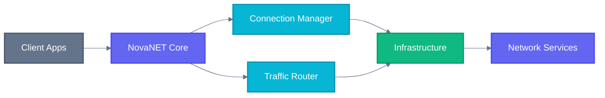

# NovaNET

**Network & Connectivity Solutions**

---

## About

NovaNET is SuperNovae's network and connectivity universe, providing robust infrastructure solutions that power seamless communication and data flow across distributed systems.

As shown in the architecture diagram above, NovaNET acts as the central connectivity layer, managing connections and routing traffic efficiently across all infrastructure components.

---

## Links

| | |
|--|--|
| 🎯 | [Vision](./VISION.md) |
| 🔗 | [Ecosystem](./ECOSYSTEM.md) |

---

Part of [SuperNovae](https://github.com/supernovae-ai) · Built with 💜

