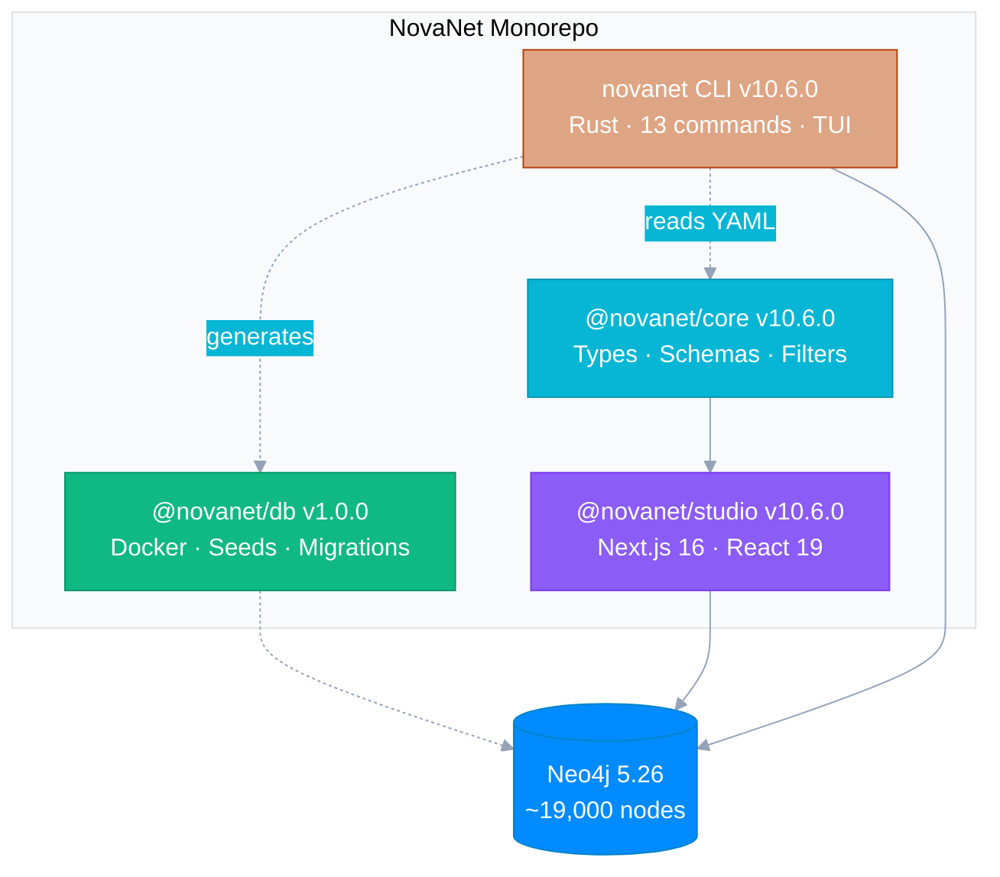

<div align="center">

# 🪽 NovaNet

**Native content generation engine powered by Neo4j knowledge graphs**

Generate culturally-native content across 200+ locales — not translation, but true localization from semantic concepts.

[](https://github.com/supernovae-st/novanet-dev/actions)
[](https://github.com/supernovae-st/novanet-dev)
[](https://rust-lang.org)
[](https://typescriptlang.org)
[](https://neo4j.com)
[](https://turbo.build)
[](https://pnpm.io)
[](https://nodejs.org)

</div>

---

> **Generation, NOT Translation**
>
> ```
> Source → Translate → Target                    ❌ Traditional
> Entity (invariant) → Generate natively → L10n  ✅ NovaNet
> ```
>
> Content is generated natively per locale from invariant semantic entities, not translated from a source language.

---

## Features

|  |  |  |  |
|:---:|:---:|:---:|:---:|
| **Knowledge Graph** | **200+ Locales** | **Graph Studio** | **AI-Powered** |
| 64 node types, 120 arcs | Native generation per locale | Interactive 2D visualization | Claude API for natural language queries |
| Neo4j with APOC | Locale knowledge layer | React Flow + ELK.js layouts | Cypher generation from text |

---

## Architecture


```mermaid
%%{init: {'theme': 'base', 'themeVariables': {
  'primaryColor': '#6366f1',
  'primaryTextColor': '#fff',
  'primaryBorderColor': '#4f46e5',
  'lineColor': '#94a3b8',
  'secondaryColor': '#06b6d4',
  'tertiaryColor': '#f8fafc'
}}}%%
flowchart TB
    subgraph MONO["NovaNet Monorepo"]
        direction TB
        CORE["@novanet/core v10.6.0\nTypes · Schemas · Filters"]
        DB["@novanet/db v1.0.0\nDocker · Seeds · Migrations"]
        STUDIO["@novanet/studio v10.6.0\nNext.js 16 · React 19"]
        RUST["novanet CLI v10.6.0\nRust · 13 commands · TUI"]
    end

    CORE --> STUDIO
    RUST -.->|reads YAML| CORE
    RUST -.->|generates| DB

    NEO4J[("Neo4j 5.26\n~19,000 nodes")]
    DB -.-> NEO4J
    STUDIO --> NEO4J
    RUST --> NEO4J

    style CORE fill:#06b6d4,stroke:#0891b2,color:#fff
    style DB fill:#10b981,stroke:#059669,color:#fff
    style STUDIO fill:#8b5cf6,stroke:#7c3aed,color:#fff
    style RUST fill:#DEA584,stroke:#B7410E,color:#fff
    style NEO4J fill:#018bff,stroke:#0284c7,color:#fff
```

---

## Quick Start

**Prerequisites**


```bash
# 1. Clone the repository
git clone git@github.com:supernovae-st/novanet-hq.git
cd novanet-hq

# 2. Install dependencies
pnpm install

# 3. Start Neo4j
pnpm infra:up

# 4. Seed the database
pnpm infra:seed

# 5. Start development server
pnpm dev
```

Open [http://localhost:3000](http://localhost:3000) — Neo4j Browser at [http://localhost:7474](http://localhost:7474)

---

## Monorepo Structure

```
novanet-hq/
├── turbo.json                 # Turborepo pipeline config
├── pnpm-workspace.yaml        # Workspace definitions
├── packages/
│   ├── core/                  # @novanet/core — types, schemas, filters
│   │   ├── models/            # YAML schema definitions (source of truth)
│   │   │   ├── taxonomy.yaml  # 2 realms, 9 layers, 5 traits
│   │   │   ├── node-kinds/    # node definitions by realm/layer
│   │   │   └── arc-kinds/     # arc definitions by family
│   │   └── src/               # TypeScript implementation
│   └── db/                    # @novanet/db — Neo4j infrastructure
│       ├── docker-compose.yml # Neo4j 5.26 + APOC
│       ├── seed/              # Cypher seed scripts
│       └── seed.sh            # Seed runner
├── tools/
│   └── novanet/               # Rust CLI + TUI binary
│       ├── src/               # Rust source (13 commands, 8 generators)
│       └── Cargo.toml         # 245 tests, zero clippy warnings
└── apps/
    └── studio/                # @novanet/studio — web visualization
        ├── src/app/           # Next.js App Router
        ├── src/components/    # React components
        ├── src/stores/        # Zustand state management
        └── src/lib/           # Utilities
```

---

## Packages

| Package | Version | Description |
|---------|---------|-------------|
| **@novanet/core** | `10.6.0` | Types, Zod schemas, NovaNetFilter API, Cypher generators |
| **@novanet/db** | `1.0.0` | Docker Compose for Neo4j, Cypher seeds, migrations |
| **@novanet/studio** | `10.6.0` | Interactive graph visualization with AI chat |
| **tools/novanet** | `10.6.0` | Rust CLI + TUI for schema generation, validation, queries |

---

## Commands

### Development

| Command | Description |
|---------|-------------|
| `pnpm dev` | Start Studio dev server |
| `pnpm build` | Build all packages |
| `pnpm lint` | Lint all packages |
| `pnpm type-check` | TypeScript type checking |
| `pnpm test` | Run all tests |

### Infrastructure

| Command | Description |
|---------|-------------|
| `pnpm infra:up` | Start Neo4j container |
| `pnpm infra:down` | Stop Neo4j container |
| `pnpm infra:seed` | Seed database with initial data |
| `pnpm infra:reset` | Reset database (down + up + seed) |

### Rust CLI (tools/novanet)

```bash
# Schema operations (YAML → Cypher/TS/Mermaid)
cargo run -- schema generate        # Regenerate all artifacts
cargo run -- schema validate        # Validate YAML coherence

# Navigation modes
cargo run -- meta                   # Mode 1: Meta-graph only
cargo run -- data                   # Mode 2: Data nodes only
cargo run -- overlay                # Mode 3: Data + Meta combined
cargo run -- query --realm=tenant   # Mode 4: Faceted query

# CRUD operations
cargo run -- node create --kind=Page --key=my-page
cargo run -- search --query="page" --kind=Page

# Interactive TUI
cargo run -- tui                    # Galaxy-themed terminal UI
```

### Turborepo Filters

```bash
pnpm build --filter=@novanet/core        # Build only core
pnpm test --filter=@novanet/studio       # Test only studio
pnpm build --filter=...[HEAD^1]          # Build changed packages
```

---

## Neo4j Access

```
Browser:  http://localhost:7474
Bolt:     bolt://localhost:7687
User:     neo4j
Password: (see NEO4J_PASSWORD env var)
```

---

## Graph Schema

NovaNet models content as a knowledge graph with **2 Realms** and **9 Layers** (v10.6.0):

| Realm | Layers | Description |
|-------|--------|-------------|
| **Global** | config, locale-knowledge, seo | Universal locale knowledge (READ-ONLY) |
| **Tenant** | config, foundation, structure, semantic, instruction, output | Business-specific content |

Each node type has a **Trait** (invariant / localized / knowledge / derived / job) and arcs are classified by **ArcFamily**.

See [`packages/core/models/taxonomy.yaml`](packages/core/models/taxonomy.yaml) for complete schema.

---

## Studio Features

**NovaNet Studio** is a web-based graph visualization tool:

```
┌─────────────────────────────────────────────────────────────────────────────┐
│  NovaNet Studio                                          ⌘K  ⌘J  ?  N  F   │
├─────────────────────────────────────────────────────────────────────────────┤
│ ┌─ Filters ──────┐  ┌─ Graph View ─────────────────────┐  ┌─ Details ────┐ │
│ │ Realm          │  │                                  │  │ Page         │ │
│ │ ☑ Global       │  │      [Locale]──┐                 │  │ key: home    │ │
│ │ ☑ Tenant       │  │          │     ▼                 │  │ realm: ten   │ │
│ │                │  │   [Project]──[Page]──[Block]     │  │ layer: struc │ │
│ │                │  │          │     │                 │  │              │ │
│ │ Layer          │  │          ▼     ▼                 │  │ Relations:   │ │
│ │ ☑ Foundation   │  │   [Entity]──[EntityContent]      │  │ → 3 blocks   │ │
│ │ ☑ Structure    │  │          │                       │  │ → 1 project  │ │
│ │ ☑ Semantic     │  │          ▼                       │  │              │ │
│ │ ...            │  │   [BlockGenerated]               │  │ [Copy JSON]  │ │
│ └────────────────┘  └──────────────────────────────────┘  └──────────────┘ │
├─────────────────────────────────────────────────────────────────────────────┤
│  Mode: Data  │  64 nodes  │  116 arcs  │  Zoom: 100%  │  Locale: fr-FR │
└─────────────────────────────────────────────────────────────────────────────┘
```
*Interactive 2D graph visualization with AI-powered queries (⌘J)*

- **4 Navigation Modes** — Meta, Data, Overlay, Query (cycle with `N`)
- **9 Filter Presets** — Quick views via `1-8, 0` keys
- **AI Chat** — Natural language to Cypher with `⌘J`
- **40+ Keyboard Shortcuts** — Full keyboard navigation
- **DX-First** — Every property is copyable (JSON/TS/YAML)

---

## Tech Stack

**Runtime**


**Data**


**Tools**


---

## Environment Variables

Copy `.env.example` to `.env.local` in `apps/studio/`:

```bash
# Required
NEO4J_PASSWORD=novanetpassword

# Optional (for AI features)
ANTHROPIC_API_KEY=sk-ant-xxx
```

---

## Target Application

NovaNet powers **[QR Code AI](https://qrcode-ai.com)** — generating native content across 200+ locales for the world's most advanced QR code platform.

---

## License

This project is **proprietary software** owned by [SuperNovae Studio](https://github.com/supernovae-st). All rights reserved.

---

<div align="center">

**[SuperNovae Studio](https://github.com/supernovae-st)**

</div>
