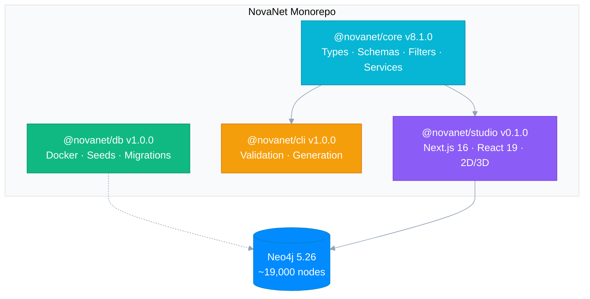

<div align="center">

# NovaNet

**Native content generation engine powered by Neo4j knowledge graphs**

Generate culturally-native content across 200+ locales — not translation, but true localization from semantic concepts.

[](https://github.com/supernovae-st/novanet-hq/actions)
[](https://typescriptlang.org)
[](https://neo4j.com)
[](https://turbo.build)
[](https://pnpm.io)
[](https://nodejs.org)

</div>

---

> **Generation, NOT Translation**
>
> ```
> Source → Translate → Target                    ❌ Traditional
> Concept (invariant) → Generate natively → L10n ✅ NovaNet
> ```
>
> Content is generated natively per locale from invariant semantic concepts, not translated from a source language.

---

## Features

|  |  |  |  |
|:---:|:---:|:---:|:---:|
| **Knowledge Graph** | **200+ Locales** | **Graph Studio** | **AI-Powered** |
| 35 node types, 50+ relations | Native generation per locale | Interactive 2D/3D visualization | Claude API for natural language queries |
| Neo4j with APOC | Locale knowledge layer | React Flow + force-graph | Cypher generation from text |

---

## Architecture


```mermaid
%%{init: {'theme': 'base', 'themeVariables': {
  'primaryColor': '#6366f1',
  'primaryTextColor': '#fff',
  'primaryBorderColor': '#4f46e5',
  'lineColor': '#94a3b8',
  'secondaryColor': '#06b6d4',
  'tertiaryColor': '#f8fafc'
}}}%%
flowchart TB
    subgraph MONO["NovaNet Monorepo"]
        direction TB
        CORE["@novanet/core v8.1.0\nTypes · Schemas · Filters · Services"]
        DB["@novanet/db v1.0.0\nDocker · Seeds · Migrations"]
        CLI["@novanet/cli v1.0.0\nValidation · Generation"]
        STUDIO["@novanet/studio v0.1.0\nNext.js 16 · React 19 · 2D/3D"]
    end

    CORE --> STUDIO
    CORE --> CLI

    NEO4J[("Neo4j 5.26\n~19,000 nodes")]
    DB -.-> NEO4J
    STUDIO --> NEO4J

    style CORE fill:#06b6d4,stroke:#0891b2,color:#fff
    style DB fill:#10b981,stroke:#059669,color:#fff
    style CLI fill:#f59e0b,stroke:#d97706,color:#fff
    style STUDIO fill:#8b5cf6,stroke:#7c3aed,color:#fff
    style NEO4J fill:#018bff,stroke:#0284c7,color:#fff
```

---

## Quick Start

**Prerequisites**


```bash
# 1. Clone the repository
git clone git@github.com:supernovae-st/novanet-hq.git
cd novanet-hq

# 2. Install dependencies
pnpm install

# 3. Start Neo4j
pnpm infra:up

# 4. Seed the database
pnpm infra:seed

# 5. Start development server
pnpm dev
```

Open [http://localhost:3000](http://localhost:3000) — Neo4j Browser at [http://localhost:7474](http://localhost:7474)

---

## Monorepo Structure

```
novanet-hq/
├── turbo.json                 # Turborepo pipeline config
├── pnpm-workspace.yaml        # Workspace definitions
├── packages/
│   ├── core/                  # @novanet/core — types, schemas, filters
│   │   ├── models/            # YAML schema definitions (source of truth)
│   │   │   ├── _index.yaml    # 35 nodes, 50+ relations
│   │   │   ├── nodes/         # Node definitions by scope
│   │   │   └── relations.yaml # Relationship definitions
│   │   └── src/               # TypeScript implementation
│   ├── db/                    # @novanet/db — Neo4j infrastructure
│   │   ├── docker-compose.yml # Neo4j 5.26 + APOC
│   │   ├── seed/              # Cypher seed scripts
│   │   └── seed.sh            # Seed runner
│   └── cli/                   # @novanet/cli — dev tools (stub)
└── apps/
    └── studio/                # @novanet/studio — web visualization
        ├── src/app/           # Next.js App Router
        ├── src/components/    # React components
        ├── src/stores/        # Zustand state management
        └── src/lib/           # Utilities
```

---

## Packages

| Package | Version | Description |
|---------|---------|-------------|
| **@novanet/core** | `8.1.0` | Types, Zod schemas, NovaNetFilter API, Cypher generators, Hybrid OntologyRAG services |
| **@novanet/db** | `1.0.0` | Docker Compose for Neo4j, Cypher seeds, migrations |
| **@novanet/cli** | `1.0.0` | Validation and generation tools (in development) |
| **@novanet/studio** | `0.1.0` | Interactive graph visualization with AI chat |

---

## Commands

### Development

| Command | Description |
|---------|-------------|
| `pnpm dev` | Start Studio dev server |
| `pnpm build` | Build all packages |
| `pnpm lint` | Lint all packages |
| `pnpm type-check` | TypeScript type checking |
| `pnpm test` | Run all tests |

### Infrastructure

| Command | Description |
|---------|-------------|
| `pnpm infra:up` | Start Neo4j container |
| `pnpm infra:down` | Stop Neo4j container |
| `pnpm infra:seed` | Seed database with initial data |
| `pnpm infra:reset` | Reset database (down + up + seed) |

### Turborepo Filters

```bash
pnpm build --filter=@novanet/core        # Build only core
pnpm test --filter=@novanet/studio       # Test only studio
pnpm build --filter=...[HEAD^1]          # Build changed packages
```

---

## Neo4j Access

```
Browser:  http://localhost:7474
Bolt:     bolt://localhost:7687
User:     neo4j
Password: (see NEO4J_PASSWORD env var)
```

---

## Graph Schema

NovaNet models content as a knowledge graph with **35 node types** across **7 categories**:

| Category | Nodes | Purpose |
|----------|-------|---------|
| **Project** | 3 | Business entity, brand identity |
| **Content** | 5 | Concepts, pages, blocks |
| **Locale** | 15 | Language knowledge layer |
| **Generation** | 5 | Prompts, rules, outputs |
| **SEO** | 3 | Search optimization |
| **GEO** | 3 | Generative engine optimization |
| **Analytics** | 1 | Performance metrics |

See [`packages/core/models/_index.yaml`](packages/core/models/_index.yaml) for complete schema.

---

## Studio Features

**NovaNet Studio** is a web-based graph visualization tool:

- **Dual View Mode** — Toggle between 2D (React Flow) and 3D (force-graph) with `V`
- **10 Filter Presets** — Quick views via `1-9, 0` keys
- **AI Chat** — Natural language to Cypher with `⌘J`
- **40+ Keyboard Shortcuts** — Full keyboard navigation
- **DX-First** — Every property is copyable (JSON/TS/YAML)

---

## Tech Stack

**Runtime**


**Data**


**Tools**


---

## Environment Variables

Copy `.env.example` to `.env.local` in `apps/studio/`:

```bash
# Required
NEO4J_PASSWORD=novanetpassword

# Optional (for AI features)
ANTHROPIC_API_KEY=sk-ant-xxx
```

---

## Target Application

NovaNet powers **[QR Code AI](https://qrcode-ai.com)** — generating native content across 200+ locales for the world's most advanced QR code platform.

---

<div align="center">

**[SuperNovae Studio](https://github.com/supernovae-st)**

</div>
