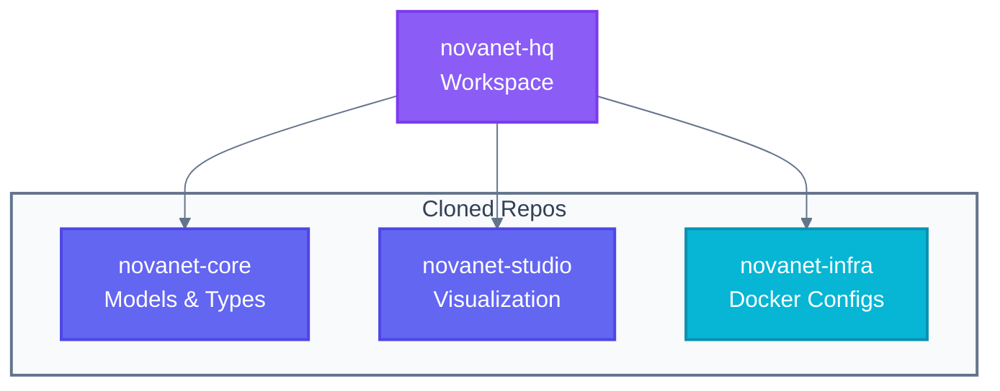

<div align="center">

# NovaNET HQ

**Development workspace for the NovaNET ecosystem**

Central orchestration point for Neo4j graph models, visualization tools, and infrastructure.

[](./studio/README.md)
[](./core/README.md)
[](./infra/README.md)

<br>

[](https://github.com/supernovae-st/novanet-hq)
[](https://typescriptlang.org)
[](https://neo4j.com)

---

**Part of [SuperNovae Studio](https://github.com/supernovae-st)** · [NovaNET Public](https://github.com/supernovae-st/novanet)

</div>

---

## Overview


```mermaid
%%{init: {'theme': 'base', 'themeVariables': {'lineColor': '#64748b'}}}%%
flowchart TB
    accTitle: NovaNET HQ Workspace Structure
    accDescr: Shows how HQ orchestrates the NovaNET ecosystem repos

    classDef hq fill:#8b5cf6,stroke:#7c3aed,stroke-width:2px,color:#ffffff
    classDef repo fill:#6366f1,stroke:#4f46e5,stroke-width:2px,color:#ffffff
    classDef infra fill:#06b6d4,stroke:#0891b2,stroke-width:2px,color:#ffffff

    HQ[novanet-hq<br/>Workspace]:::hq

    subgraph REPOS[" Cloned Repos "]
        CORE[novanet-core<br/>Models & Types]:::repo
        STUDIO[novanet-studio<br/>Visualization]:::repo
        INFRA[novanet-infra<br/>Docker Configs]:::infra
    end

    HQ --> CORE
    HQ --> STUDIO
    HQ --> INFRA

    style REPOS fill:#f8fafc,stroke:#64748b,stroke-width:2px,color:#334155
```

---

## Ecosystem

| Repo | Description | Status |
|------|-------------|--------|
| [novanet](https://github.com/supernovae-st/novanet) | Public showcase | Public |
| **novanet-hq** | Dev workspace (this repo) | Private |
| [novanet-core](https://github.com/supernovae-st/novanet-core) | Neo4j models & TypeScript | Private |
| [novanet-studio](https://github.com/supernovae-st/novanet-studio) | Graph visualization | Private |
| [novanet-infra](https://github.com/supernovae-st/novanet-infra) | Docker configs | Private |

---

## Quick Start

```bash
# Clone the workspace
git clone git@github.com:supernovae-st/novanet-hq.git
cd novanet-hq

# Clone sub-repositories
git clone git@github.com:supernovae-st/novanet-core.git core
git clone git@github.com:supernovae-st/novanet-studio.git studio
git clone git@github.com:supernovae-st/novanet-infra.git infra

# Install dependencies
npm install

# Start infrastructure
npm run infra:up

# Seed database
cd core/neo4j && ./seed.sh && cd ../..

# Start development
npm run dev
```

---

## Structure

```
novanet-hq/
├── .claude/              # Claude Code configuration
│   ├── agents/           # Custom agents
│   ├── project-info.json # Workspace metadata
│   └── settings.json     # Claude settings
├── .mcp.json             # MCP server configs (Neo4j)
├── CLAUDE.md             # AI assistant instructions
├── package.json          # npm workspaces orchestration
├── docs/                 # Planning documents
│   └── plans/
├── core/                 # → novanet-core (git clone)
├── studio/               # → novanet-studio (git clone)
└── infra/                # → novanet-infra (git clone)
```

---

## Commands

| Command | Description |
|---------|-------------|
| `npm run dev` | Start studio dev server |
| `npm run build` | Build studio |
| `npm run lint` | Lint all workspaces |
| `npm run type-check` | Type check all workspaces |
| `npm run test` | Test all workspaces |
| `npm run infra:up` | Start Neo4j |
| `npm run infra:down` | Stop Neo4j |
| `npm run infra:logs` | View logs |

---

## Configuration

### Claude Code

The `.claude/` directory contains AI assistant configurations:

- **agents/** — Custom agents for code review and Neo4j architecture
- **project-info.json** — Workspace and skill definitions
- **settings.json** — Claude Code settings

### MCP Servers

`.mcp.json` configures Model Context Protocol servers:

```json
{
  "mcpServers": {
    "neo4j": {
      "command": "uvx",
      "args": ["mcp-neo4j-cypher"]
    }
  }
}
```

---

<div align="center">

**Quick Navigation**

[🏢 HQ](./README.md) · [🎨 Studio](./studio/README.md) · [📦 Core](./core/README.md) · [🐳 Infra](./infra/README.md)

---

**Part of [SuperNovae Studio](https://github.com/supernovae-st)** · [NovaNET Public](https://github.com/supernovae-st/novanet)

</div>
