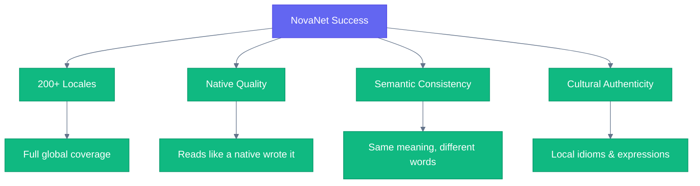

# Vision

## North Star

> **NovaNet · Generate natively, not translate.**

---

## The Problem

Traditional localization is fundamentally broken:

```
Source (English) → Machine Translation → Target (French)
                         ↓
              Context lost, meaning diluted
```

Translation services process words, not meaning. They strip away:
- **Semantic context** — How concepts relate to each other
- **Cultural nuance** — Local expressions, idioms, tone
- **Domain knowledge** — Industry-specific terminology
- **Brand voice** — Consistent messaging across markets

The result? Generic, robotic content that reads like... a translation.

---

## Our Approach

NovaNet inverts the paradigm:

```
Concept (invariant) → Knowledge Graph → Generate natively per locale
                            ↓
              Context preserved, meaning amplified
```

Instead of translating from a source language, we:

1. **Model content as concepts** — Language-neutral semantic units
2. **Build locale knowledge layers** — Voice, culture, expressions, formatting
3. **Generate natively** — Each locale gets content created *in* that language

The result? Content that reads like it was written by a native speaker, because semantically, it was.

---

## What Success Looks Like



| Metric | Target |
|--------|--------|
| **Locale Coverage** | 200+ locales supported |
| **Native Quality** | Indistinguishable from human-written content |
| **Semantic Consistency** | Same meaning preserved across all locales |
| **Cultural Authenticity** | Local expressions, idioms, and cultural references |

---

## Non-Negotiables

### Generation, NOT Translation

```
❌ We do NOT translate
✅ We generate natively
```

This is not a semantic distinction. It's a fundamental architectural choice that shapes every decision.

### Knowledge Graph First

Content lives in a graph, not flat files. Relationships matter. Context matters. Meaning matters.

### Locale Knowledge Layers

Each locale has its own:
- **Voice** — Formality, tone, register
- **Culture** — References, humor, taboos
- **Expressions** — Idioms, collocations, patterns
- **Rules** — Formatting, slug conventions, SEO patterns

### AI-Native Architecture

Built for LLM-powered generation from day one. Not retrofitted. Not bolted on.

---

## The Future

NovaNet is the foundation for a world where:

- **Every product speaks every language** — natively
- **Localization is instant** — not a bottleneck
- **Quality scales** — the 200th locale is as good as the 1st
- **Context is preserved** — across languages, across time

We're not building a translation tool. We're building the infrastructure for truly global products.

---

<div align="center">

**[SuperNovae Studio](https://github.com/supernovae-st)**

</div>
