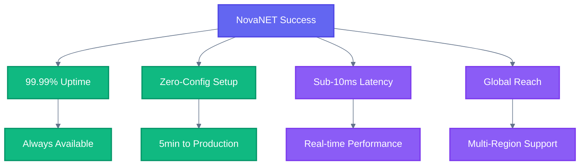

# Vision

## North Star

> **NovaNET — Network solutions that just work.**

---

## About

NovaNET delivers reliable, scalable network infrastructure that powers seamless connectivity across all SuperNovae products. By abstracting complexity and prioritizing reliability, we enable teams to focus on building features rather than fighting infrastructure.

---

## What Success Looks Like

- **99.99% uptime** — Reliability is non-negotiable
- **Zero-configuration deployment** — From zero to production in under 5 minutes
- **Sub-10ms latency** — Real-time performance for all connections
- **Global infrastructure** — Multi-region support out of the box

---

## Non-Negotiables

- **Reliability first** — It must work, always
- **Simple to use** — Complexity hidden behind clean APIs
- **Performance by default** — Speed is a feature, not an optimization
- **Transparent monitoring** — Full visibility into network health
