# NovaNet: The Book

```
    ╔═══════════════════════════════════════════════════════════════════════════╗
    ║                                                                           ║
    ║   ███╗   ██╗ ██████╗ ██╗   ██╗ █████╗ ███╗   ██╗███████╗████████╗         ║
    ║   ████╗  ██║██╔═══██╗██║   ██║██╔══██╗████╗  ██║██╔════╝╚══██╔══╝         ║
    ║   ██╔██╗ ██║██║   ██║██║   ██║███████║██╔██╗ ██║█████╗     ██║            ║
    ║   ██║╚██╗██║██║   ██║╚██╗ ██╔╝██╔══██║██║╚██╗██║██╔══╝     ██║            ║
    ║   ██║ ╚████║╚██████╔╝ ╚████╔╝ ██║  ██║██║ ╚████║███████╗   ██║            ║
    ║   ╚═╝  ╚═══╝ ╚═════╝   ╚═══╝  ╚═╝  ╚═╝╚═╝  ╚═══╝╚══════╝   ╚═╝            ║
    ║                                                                           ║
    ║              Native Content Generation Engine                             ║
    ║              Powered by Neo4j Knowledge Graphs                            ║
    ║                                                                           ║
    ╚═══════════════════════════════════════════════════════════════════════════╝
```

| | |
|:--|:--|
| **Version** | v0.14.0 |
| **Updated** | 2026-02-19 |
| **Status** | Production-Ready |
| **Target** | [QR Code AI](https://qrcode-ai.com) |

---

## Table of Contents

| # | Section | Description |
|:-:|---------|-------------|
| 1 | [Overview & Purpose](#1-overview--purpose) | Core philosophy and statistics |
| 2 | [Architecture](#2-architecture) | System design and data flow |
| 3 | [Schema System (6 BLOCs)](#3-schema-system-6-blocs) | YAML structure specification |
| 4 | [Node Classification](#4-node-classification) | Realms, layers, and traits |
| 5 | [Arc System](#5-arc-system) | Relationships and families |
| 6 | [MCP Server](#6-mcp-server) | 8 tools for AI integration |
| 7 | [Rust CLI Commands](#7-rust-cli-commands) | Complete command reference |
| 8 | [TUI Usage](#8-tui-usage) | Terminal interface guide |
| 9 | [ADR Summary](#9-adr-summary) | Architecture decisions |
| 10 | [Development Guide](#10-development-guide) | Setup and workflows |
| 11 | [API Reference](#11-api-reference) | Types and Cypher patterns |
| 12 | [Troubleshooting](#12-troubleshooting) | Common issues and fixes |

---

## 1. Overview & Purpose

### What is NovaNet?

NovaNet is a **native content generation engine** powered by Neo4j knowledge graphs. It generates culturally-native content across 200+ locales — not translation, but true localization from semantic concepts.

```
╔═══════════════════════════════════════════════════════════════════════════════╗
║                                                                               ║
║   CRITICAL PRINCIPLE: Generation, NOT Translation                            ║
║                                                                               ║
║   ┌─────────┐      Translate       ┌─────────┐                               ║
║   │ Source  │ ──────────────────── │ Target  │         ❌ WRONG              ║
║   └─────────┘                      └─────────┘                               ║
║                                                                               ║
║   ┌─────────┐   Generate natively  ┌──────────────┐                          ║
║   │ Entity  │ ──────────────────── │ EntityNative │   ✅ RIGHT               ║
║   │(defined)│                      │  (authored)  │                          ║
║   └─────────┘                      └──────────────┘                          ║
║                                                                               ║
╚═══════════════════════════════════════════════════════════════════════════════╝
```

Each locale's content is **generated natively** from the invariant Entity, NOT translated. The LLM receives context **entirely in the target locale** and generates natively.

### Target Application

**QR Code AI** (https://qrcode-ai.com) — a multilingual SaaS for QR code generation supporting 200+ locales.

### Core Statistics

```
┌────────────────────────────────────────────────────────────────────────────┐
│                          NovaNet v0.14.0 Statistics                        │
├──────────────────┬─────────┬──────────────────┬─────────┬─────────────────┤
│ NodeClasses      │    61   │ Layers           │    10   │ MCP Tools    │ 7 │
│ ArcClasses       │   182   │ Traits           │     5   │ Rust Tests   │1082│
│ Arc Families     │     6   │ Realms           │     2   │ TS Tests     │632│
└──────────────────┴─────────┴──────────────────┴─────────┴─────────────────┘
```

### Philosophy

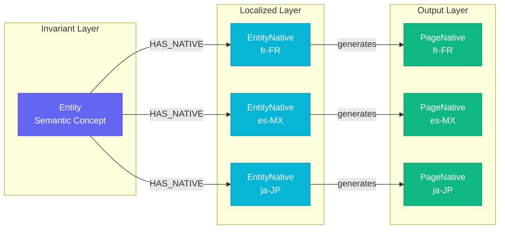

NovaNet treats localization as **semantic transformation**, not string replacement:

| Step | Component | Description |
|:----:|-----------|-------------|
| 1 | **Entity** | Defines semantic concepts (invariant, language-agnostic) |
| 2 | **EntityNative** | Contains locale-specific content (authored or generated) |
| 3 | **Page/Block** | Defines URL and content structure |
| 4 | **PageNative/BlockNative** | Contains the generated output per locale |

---

## 2. Architecture

### High-Level Overview

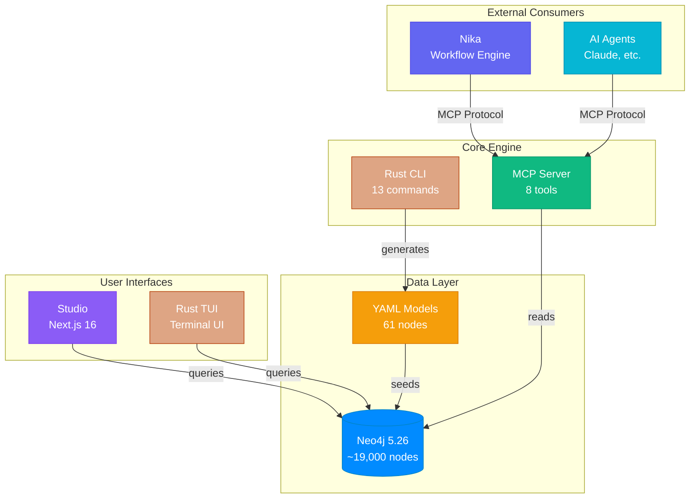

### ASCII Architecture View

```
╔═══════════════════════════════════════════════════════════════════════════════╗
║                           NovaNet Architecture                                 ║
╠═══════════════════════════════════════════════════════════════════════════════╣
║                                                                               ║
║   ┌─────────────────────────────────────────────────────────────────────────┐ ║
║   │                        USER INTERFACES                                  │ ║
║   │   ┌─────────────────┐                     ┌─────────────────┐          │ ║
║   │   │   Studio        │                     │   Rust TUI      │          │ ║
║   │   │   (Next.js 16)  │                     │   (ratatui)     │          │ ║
║   │   │   :3000         │                     │   terminal      │          │ ║
║   │   └────────┬────────┘                     └────────┬────────┘          │ ║
║   └────────────┼────────────────────────────────────────┼──────────────────┘ ║
║                │                                        │                    ║
║                ▼                                        ▼                    ║
║   ┌─────────────────────────────────────────────────────────────────────────┐ ║
║   │                          CORE ENGINE                                    │ ║
║   │                                                                         │ ║
║   │   ┌─────────────────┐      ┌─────────────────┐      ┌─────────────┐    │ ║
║   │   │   Rust CLI      │      │   MCP Server    │◄─────│  AI Agents  │    │ ║
║   │   │   13 commands   │      │   8 tools       │      │  Nika, etc. │    │ ║
║   │   │   8 generators  │      │   stdio/SSE     │      └─────────────┘    │ ║
║   │   └────────┬────────┘      └────────┬────────┘                         │ ║
║   │            │                        │                                   │ ║
║   └────────────┼────────────────────────┼───────────────────────────────────┘ ║
║                │                        │                                    ║
║                ▼                        ▼                                    ║
║   ┌─────────────────────────────────────────────────────────────────────────┐ ║
║   │                          DATA LAYER                                     │ ║
║   │                                                                         │ ║
║   │   ┌─────────────────┐           ┌─────────────────────────────────┐    │ ║
║   │   │   YAML Models   │──seeds───▶│         Neo4j 5.26              │    │ ║
║   │   │   61 nodes      │           │         ~19,000 nodes           │    │ ║
║   │   │   182 arcs      │           │         bolt://localhost:7687   │    │ ║
║   │   │   (source of    │           │                                 │    │ ║
║   │   │    truth)       │           └─────────────────────────────────┘    │ ║
║   │   └─────────────────┘                                                  │ ║
║   │                                                                         │ ║
║   └─────────────────────────────────────────────────────────────────────────┘ ║
║                                                                               ║
╚═══════════════════════════════════════════════════════════════════════════════╝
```

### Monorepo Structure

```
novanet-dev/
├── turbo.json                     # Turborepo pipeline config
├── pnpm-workspace.yaml            # Workspace definitions
│
├── packages/
│   ├── core/                      # @novanet/core - types, schemas, filters
│   │   ├── models/                # YAML schema definitions (SOURCE OF TRUTH)
│   │   │   ├── _index.yaml        #   Complete node index
│   │   │   ├── taxonomy.yaml      #   Realms, layers, traits, arc families
│   │   │   ├── node-classes/      #   61 node YAML files
│   │   │   │   ├── shared/        #     40 nodes (4 layers)
│   │   │   │   └── org/           #     21 nodes (6 layers)
│   │   │   ├── arc-classes/       #   182 arc YAML files
│   │   │   └── views/             #   View definitions
│   │   └── src/                   # TypeScript implementation
│   │
│   └── db/                        # @novanet/db - Neo4j infrastructure
│       ├── docker-compose.yml     #   Neo4j 5.26 + APOC
│       ├── seed/                  #   Cypher seed scripts
│       └── seed.sh                #   Seed runner
│
├── tools/
│   ├── novanet/                   # Rust CLI + TUI binary
│   │   ├── src/                   #   Rust source (13 commands, 8 generators)
│   │   └── Cargo.toml             #   1194 tests, zero clippy warnings
│   │
│   └── novanet-mcp/               # MCP Server (8 tools)
│       └── src/tools/             #   Tool implementations
│
└── apps/
    └── studio/                    # @novanet/studio - web visualization
        ├── src/app/               #   Next.js App Router
        ├── src/components/        #   React components
        └── src/stores/            #   Zustand state management
```

### Data Flow

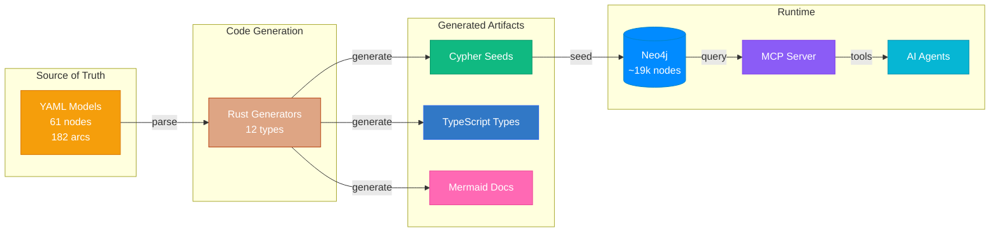

### Key Boundaries

| Boundary | TypeScript | Rust |
|:--------:|------------|------|
| **Schema parsing** | Types/validation | YAML parsers, generators |
| **Runtime execution** | Studio UI | CLI/TUI, MCP Server |
| **Database access** | Neo4j driver | neo4rs driver |
| **Code generation** | - | 12 artifact generators |

> **Boundary Rule**: TypeScript generates code artifacts. Rust executes at runtime.

### Entity-to-Content Flow

The core data flow in NovaNet transforms semantic entities into locale-native content.

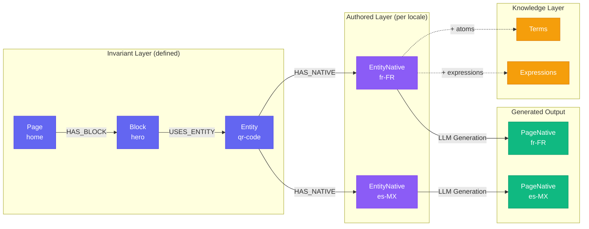

**Flow Explanation:**
1. **Entity** (invariant) defines semantic concept
2. **EntityNative** (authored) provides locale-specific content
3. **Knowledge atoms** (Terms, Expressions) add cultural context
4. **LLM generation** produces **PageNative** (generated output)

---

## 3. Schema System (6 BLOCs)

Every node-class YAML file follows a canonical 6-BLOC structure optimized for LLM comprehension.

### BLOC Architecture

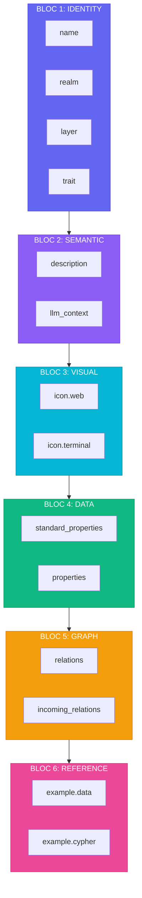

### BLOC Overview

```
╔════════╤═══════════════╤═══════════════════════════════════════════════════════╗
║  BLOC  │     Name      │                     Purpose                           ║
╠════════╪═══════════════╪═══════════════════════════════════════════════════════╣
║   1    │   IDENTITY    │  Node name, realm, layer, trait                       ║
║   2    │   SEMANTIC    │  Description and LLM context (USE/TRIGGERS/NOT)       ║
║   3    │   VISUAL      │  Icons (web: Lucide, terminal: Unicode)               ║
║   4    │   DATA        │  Properties (standard + custom)                       ║
║   5    │   GRAPH       │  Relationships (outgoing + incoming)                  ║
║   6    │   REFERENCE   │  Examples and sample Cypher                           ║
╚════════╧═══════════════╧═══════════════════════════════════════════════════════╝
```

### Complete BLOC Structure

```yaml
node:
  # ===========================================================================
  # BLOC 1: IDENTITY (required)
  # Order: name -> realm -> layer -> trait
  # ===========================================================================
  name: Entity
  realm: org                    # shared | org
  layer: semantic               # 10 possible values
  trait: defined                # defined | authored | imported | generated | retrieved

  # ===========================================================================
  # BLOC 2: SEMANTIC (required)
  # ===========================================================================
  description: "Semantic unit representing a product, feature, or concept."

  llm_context: |
    USE: when loading semantic context for content generation.
    TRIGGERS: "entity", "semantic", "concept", "product", "feature".
    NOT: for locale-specific content (use EntityNative instead).
    RELATES: EntityNative (locale content), Page (URL structure), Block (content slots).

  # ===========================================================================
  # BLOC 3: VISUAL (required)
  # ===========================================================================
  icon:
    web: diamond               # Lucide icon name for Studio
    terminal: "diamond"        # Unicode symbol for TUI

  # ===========================================================================
  # BLOC 4: DATA (required)
  # ===========================================================================
  standard_properties:
    # Order: key -> *_key (denormalized) -> display_name -> description -> created_at -> updated_at
    key:
      type: string
      required: true
      pattern: "^[a-z0-9-]+$"
      examples: ["qr-code", "pricing-plan"]
      description: "Unique identifier for this entity."

    display_name:
      type: string
      required: true
      description: "Human-readable name."

    description:
      type: string
      required: true
      description: "Brief description of the entity."

    created_at:
      type: datetime
      required: true
      description: "Creation timestamp."

    updated_at:
      type: datetime
      required: true
      description: "Last modification timestamp."

  properties:
    denomination_forms:
      type: object
      required: true
      description: "Prescriptive canonical forms for LLM references (ADR-033)."
      properties:
        text:
          type: string
          description: "Full prose form: 'a QR code'"
        title:
          type: string
          description: "Title case: 'QR Code'"
        abbrev:
          type: string
          description: "Abbreviation: 'QR'"
        mixed:
          type: string
          description: "Brand-preferred mixed case: 'QRcode'"
        base:
          type: string
          description: "Lowercase invariant: 'qr-code'"
        url:
          type: string
          description: "URL-safe slug: 'qr-code'"

    llm_context:
      type: string
      required: false
      description: "Instance-specific context for LLM generation."

  # ===========================================================================
  # BLOC 5: GRAPH (optional but recommended)
  # ===========================================================================
  relations:
    outgoing:
      - type: HAS_NATIVE
        to: EntityNative
        cardinality: "1:N"
        description: "Locale-specific content for this entity."

      - type: BELONGS_TO
        to: EntityCategory
        cardinality: "N:1"
        scope: cross_realm
        description: "Classification category."

    incoming:
      - type: HAS_ENTITY
        from: Project
        cardinality: "1:N"
        description: "Project owning this entity."

      - type: USES_ENTITY
        from: Block
        cardinality: "N:M"
        description: "Blocks referencing this entity."

  # ===========================================================================
  # BLOC 6: REFERENCE (optional but recommended)
  # ===========================================================================
  example:
    data:
      key: "qr-code"
      display_name: "QR Code"
      description: "Two-dimensional barcode for data encoding."
      denomination_forms:
        text: "a QR code"
        title: "QR Code"
        abbrev: "QR"
        mixed: "QRcode"
        base: "qr-code"
        url: "qr-code"
    cypher: |
      // Find entity with its native content
      MATCH (e:Entity {key: "qr-code"})
      OPTIONAL MATCH (e)-[:HAS_NATIVE]->(en:EntityNative)-[:FOR_LOCALE]->(l:Locale)
      RETURN e, collect({native: en, locale: l.key}) AS content
```

### Standard Properties Order

Every node MUST have these properties in this exact order:

1. `key` (if node has identity)
2. `*_key` denormalized properties (for composite keys: entity_key, page_key, block_key, locale_key)
3. `display_name`
4. `description`
5. `created_at`
6. `updated_at`

### Nodes Without Key (Satellites)

These 8 nodes are identified by relation chain, not key:

| Node | Identification Pattern |
|------|----------------------|
| ProjectNative | Project->HAS_NATIVE->ProjectNative->FOR_LOCALE->Locale |
| BlockRules | BlockType->HAS_RULES->BlockRules |
| TermSet | Locale->HAS_TERMS->TermSet + domain property |
| ExpressionSet | Locale->HAS_EXPRESSIONS->ExpressionSet + domain property |
| PatternSet | Locale->HAS_PATTERNS->PatternSet + domain property |
| CultureSet | Locale->HAS_CULTURE->CultureSet + domain property |
| TabooSet | Locale->HAS_TABOOS->TabooSet + domain property |
| AudienceSet | Locale->HAS_AUDIENCE->AudienceSet + domain property |

---

## 4. Node Classification

### Classification Hierarchy

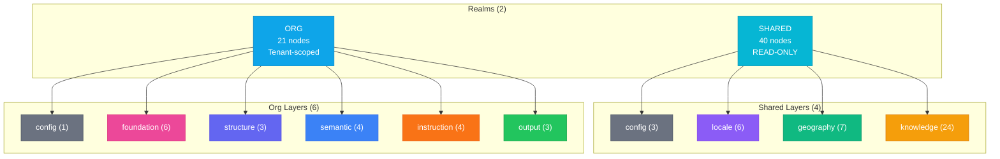

### Realms (2)

```
┌─────────────────────────────────────────────────────────────────────────────┐
│                              REALMS                                         │
├─────────────────────────────────┬───────────────────────────────────────────┤
│           SHARED                │                 ORG                       │
│   ┌───────────────────────┐     │     ┌───────────────────────┐             │
│   │  40 nodes             │     │     │  21 nodes             │             │
│   │  Universal definitions│     │     │  Organization-specific│             │
│   │  READ-ONLY            │     │     │  Tenant-scoped        │             │
│   │                       │     │     │                       │             │
│   │  config      (3)      │     │     │  config      (1)      │             │
│   │  locale      (6)      │     │     │  foundation  (6)      │             │
│   │  geography   (7)      │     │     │  structure   (3)      │             │
│   │  knowledge  (24)      │     │     │  semantic    (4)      │             │
│   │                       │     │     │  instruction (4)      │             │
│   │                       │     │     │  output      (3)      │             │
│   └───────────────────────┘     │     └───────────────────────┘             │
└─────────────────────────────────┴───────────────────────────────────────────┘
```

| Realm | Description | Node Count | Behavior |
|:-----:|-------------|:----------:|----------|
| **shared** | Universal definitions, READ-ONLY | 40 | Same across all organizations |
| **org** | Organization-specific content | 21 | Tenant-scoped |

### Layers (10)

#### Shared Realm (4 layers, 40 nodes)

| Layer | Count | Key Nodes |
|:-----:|:-----:|-----------|
| **config** | 3 | Locale, EntityCategory, SEOKeywordFormat |
| **locale** | 6 | LocaleVoice, LocaleCulture, LocaleAdaptation, LocaleMarket, LocaleSlugification, LocaleFormatting |
| **geography** | 7 | Continent, GeoRegion, GeoSubRegion, Country, EconomicRegion, IncomeGroup, LendingCategory |
| **knowledge** | 24 | Term, TermSet, Expression, ExpressionSet, Pattern, PatternSet, Culture, CultureSet, Taboo, TabooSet, Audience, AudienceSet, LanguageFamily, LanguageBranch, CulturalRealm, CulturalSubRealm, PopulationCluster, PopulationSubCluster, SEOPillar, SEOCluster, SEOKeyword, SEOKeywordMetrics, GEOQuery, GEOAnswer |

#### Org Realm (6 layers, 21 nodes)

| Layer | Count | Key Nodes |
|:-----:|:-----:|-----------|
| **config** | 1 | OrgConfig |
| **foundation** | 6 | Project, ProjectNative, Brand, BrandDesign, BrandPrinciples, PromptStyle |
| **structure** | 3 | Page, Block, ContentSlot |
| **semantic** | 4 | Entity, EntityNative, EntityCategory, EntitySlot |
| **instruction** | 4 | PageStructure, PageInstruction, BlockType, BlockInstruction |
| **output** | 3 | PageNative, BlockNative, OutputArtifact |

### Traits (5) - ADR-024: Data Origin

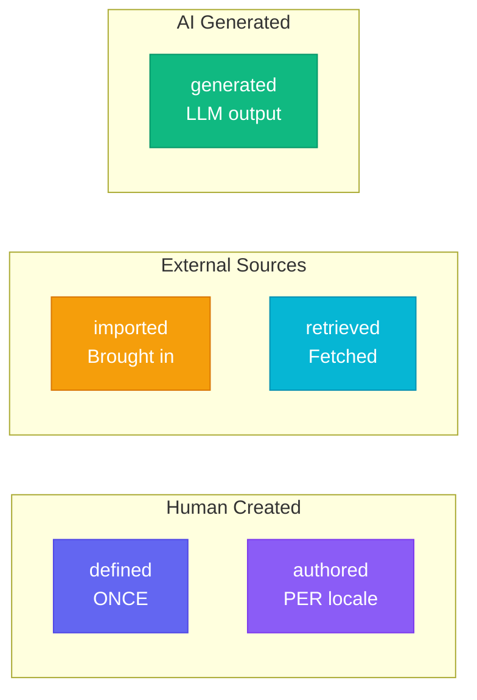

| Trait | Who Creates | When | Examples | Border Style |
|:-----:|-------------|------|----------|:------------:|
| **defined** | Human | ONCE | Page, Block, Entity, Locale | solid |
| **authored** | Human | PER locale | EntityNative, ProjectNative | dashed |
| **imported** | External data | Brought in | Term, SEOKeyword, GEOQuery | dotted |
| **generated** | Our LLM | Produced | PageNative, BlockNative | double |
| **retrieved** | External APIs | Fetched | GEOAnswer, SEOKeywordMetrics | wavy |

### Visual Encoding System

```
╔═════════════════════════════════════════════════════════════════════════════╗
║                         VISUAL ENCODING SYSTEM                              ║
╠═════════════════════════════════════════════════════════════════════════════╣
║                                                                             ║
║   Fill Color ────────▶ Layer                                                ║
║   ┌─────────────────────────────────────────────────────────────────────┐   ║
║   │  config=#6b7280  locale=#8b5cf6  geography=#10b981  knowledge=#f59e0b  ║
║   │  foundation=#ec4899  structure=#6366f1  semantic=#3b82f6            │   ║
║   │  instruction=#f97316  output=#22c55e                                │   ║
║   └─────────────────────────────────────────────────────────────────────┘   ║
║                                                                             ║
║   Border Color ──────▶ Realm                                                ║
║   ┌─────────────────────────────────────────────────────────────────────┐   ║
║   │  shared=#06b6d4 (teal)          org=#0ea5e9 (sky)                   │   ║
║   └─────────────────────────────────────────────────────────────────────┘   ║
║                                                                             ║
║   Border Style ──────▶ Trait                                                ║
║   ┌─────────────────────────────────────────────────────────────────────┐   ║
║   │  ━━━━━ defined   ╌╌╌╌╌ authored   ····· imported                    │   ║
║   │  ═════ generated ∿∿∿∿∿ retrieved                                    │   ║
║   └─────────────────────────────────────────────────────────────────────┘   ║
║                                                                             ║
║   Icons ─────────────▶ Dual Format                                          ║
║   ┌─────────────────────────────────────────────────────────────────────┐   ║
║   │  { web: "lucide-icon", terminal: "unicode-symbol" }                 │   ║
║   │  Example: { web: "diamond", terminal: "◆" }                         │   ║
║   └─────────────────────────────────────────────────────────────────────┘   ║
║                                                                             ║
╚═════════════════════════════════════════════════════════════════════════════╝
```

---

## 5. Arc System

### Arc Families Overview

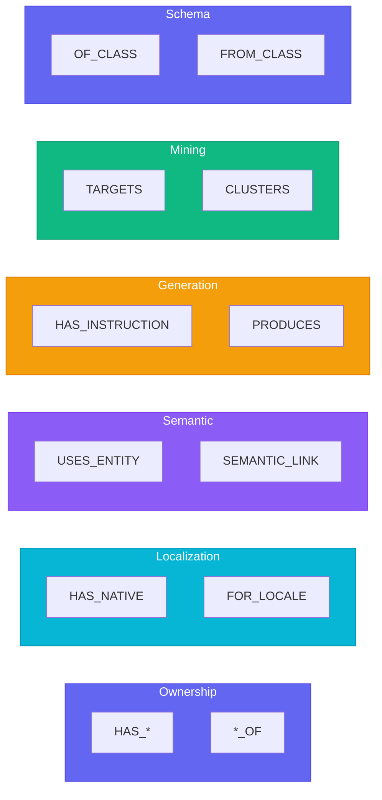

### Arc Families (6)

```
┌─────────────────────────────────────────────────────────────────────────────┐
│                           ARC FAMILIES (182 arcs)                           │
├────────────────┬─────────────────┬────────────┬─────────────────────────────┤
│    Family      │     Color       │   Stroke   │        Description          │
├────────────────┼─────────────────┼────────────┼─────────────────────────────┤
│  ownership     │  #6366f1 indigo │   solid    │  HAS_*, *_OF containment    │
│  localization  │  #06b6d4 cyan   │   solid    │  FOR_LOCALE, HAS_NATIVE     │
│  semantic      │  #8b5cf6 violet │   dashed   │  USES_ENTITY, SEMANTIC_LINK │
│  generation    │  #f59e0b amber  │   solid    │  HAS_INSTRUCTION, PRODUCES  │
│  mining        │  #10b981 emerald│   dotted   │  TARGETS, CLUSTERS          │
│  schema        │  #6366f1 indigo │   dotted   │  OF_CLASS, FROM_CLASS       │
└────────────────┴─────────────────┴────────────┴─────────────────────────────┘
```

### Cardinality Patterns

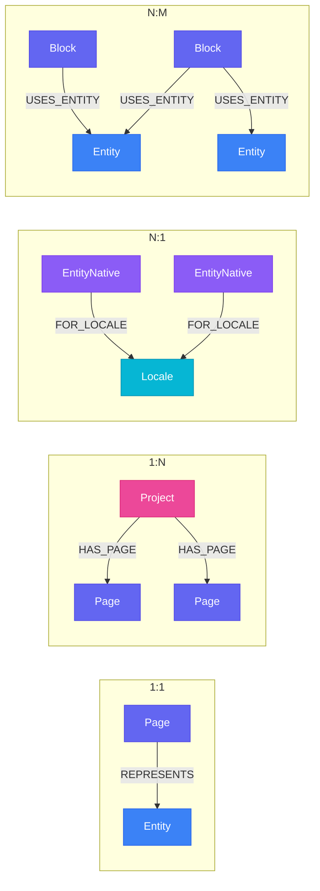

| Pattern | Symbol | Example |
|:-------:|:------:|---------|
| One-to-One | `1:1` | `Page-[:REPRESENTS]->Entity` |
| One-to-Many | `1:N` | `Project-[:HAS_PAGE]->Page` |
| Many-to-One | `N:1` | `EntityNative-[:FOR_LOCALE]->Locale` |
| Many-to-Many | `N:M` | `Block-[:USES_ENTITY]->Entity` |

### Scope Rules

```
┌─────────────────────────────────────────────────────────────────────────────┐
│                              SCOPE RULES                                    │
├─────────────────────────────────────────────────────────────────────────────┤
│                                                                             │
│   INTRA_REALM                           CROSS_REALM                         │
│   ═══════════                           ═══════════                         │
│                                                                             │
│   ┌─────────────────────────┐           ┌─────────────────────────┐        │
│   │         ORG             │           │    ORG     │   SHARED   │        │
│   │                         │           │            │            │        │
│   │  Page ──HAS_BLOCK──▶ Block│          │  Entity ───BELONGS_TO──▶ │        │
│   │                         │           │            │  Category  │        │
│   └─────────────────────────┘           └────────────┴────────────┘        │
│                                                                             │
│   Both nodes in SAME realm              Nodes in DIFFERENT realms           │
│                                                                             │
└─────────────────────────────────────────────────────────────────────────────┘
```

| Scope | Description | Example |
|:-----:|-------------|---------|
| **intra_realm** | Both nodes in same realm | `Page->HAS_BLOCK->Block` (both org) |
| **cross_realm** | Nodes in different realms | `Entity->BELONGS_TO->EntityCategory` (org->shared) |

### Inverse Arc Tiers (ADR-026)

```
╔═══════════════════════════════════════════════════════════════════════════════╗
║                         INVERSE ARC TIERS (ADR-026)                           ║
╠═══════════════════════════════════════════════════════════════════════════════╣
║                                                                               ║
║   TIER 1 ──────────▶ REQUIRED (frequent bidirectional traversal)             ║
║   ┌───────────────────────────────────────────────────────────────────────┐   ║
║   │  HAS_ENTITY ◄──────────────────────────────────────────▶ ENTITY_OF    │   ║
║   │  HAS_PAGE ◄────────────────────────────────────────────▶ PAGE_OF      │   ║
║   │  HAS_PROJECT ◄─────────────────────────────────────────▶ PROJECT_OF   │   ║
║   └───────────────────────────────────────────────────────────────────────┘   ║
║                                                                               ║
║   TIER 2 ──────────▶ RECOMMENDED (knowledge/locale arcs)                     ║
║   ┌───────────────────────────────────────────────────────────────────────┐   ║
║   │  HAS_TERMS ◄───────────────────────────────────────────▶ TERMS_OF     │   ║
║   │  USES_ENTITY ◄─────────────────────────────────────────▶ USED_BY      │   ║
║   └───────────────────────────────────────────────────────────────────────┘   ║
║                                                                               ║
║   TIER 3 ──────────▶ OPTIONAL (low-frequency config arcs)                    ║
║   ┌───────────────────────────────────────────────────────────────────────┐   ║
║   │  CONTAINS_*                         (no inverse needed)               │   ║
║   │  BELONGS_TO_ORG                     (no inverse needed)               │   ║
║   └───────────────────────────────────────────────────────────────────────┘   ║
║                                                                               ║
╚═══════════════════════════════════════════════════════════════════════════════╝
```

### Key Arcs Reference

| Arc | From | To | Cardinality | Family | Description |
|:----|:----:|:--:|:-----------:|:------:|-------------|
| `HAS_NATIVE` | Entity, Page, Block | *Native | 1:N | localization | Locale-specific content |
| `FOR_LOCALE` | *Native | Locale | N:1 | localization | Locale binding |
| `HAS_PAGE` | Project | Page | 1:N | ownership | Project owns pages |
| `HAS_BLOCK` | Page | Block | 1:N | ownership | Page contains blocks |
| `USES_ENTITY` | Block | Entity | N:M | semantic | Block references entity |
| `REPRESENTS` | Page | Entity | 1:1 | semantic | Page represents entity |
| `HAS_INSTRUCTION` | Page, Block | *Instruction | 1:1 | generation | LLM instructions |
| `HAS_STRUCTURE` | Page | PageStructure | 1:1 | generation | Block composition order |

---

## 6. MCP Server

NovaNet exposes 7 MCP tools for AI agent integration. The MCP Server enables workflow engines like Nika and AI agents to query and generate content from the knowledge graph.

### MCP Architecture

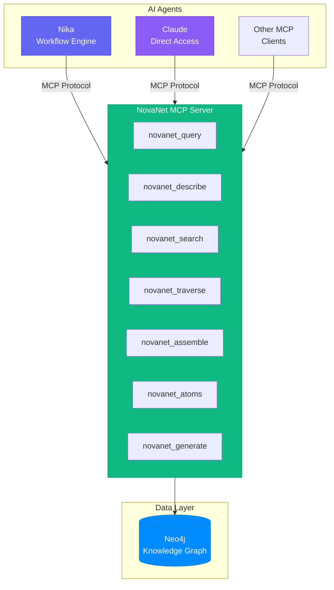

### MCP Request Flow (novanet_generate)

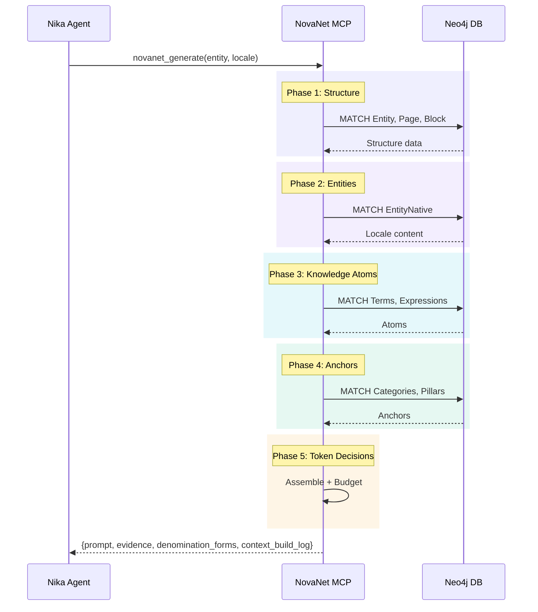

### Tool Overview

```
╔═══════════════════════════════════════════════════════════════════════════════╗
║                           MCP TOOLS (8 tools) - v0.14.0                        ║
╠══════════════════════╤════════════════════════════════════════════════════════╣
║  novanet_query       │  Execute read-only Cypher queries                      ║
║  novanet_describe    │  Schema bootstrap (schema|entity|category|relations|   ║
║                      │  locales|stats)                                        ║
║  novanet_search      │  Fulltext/property/hybrid search                       ║
║  novanet_traverse    │  Graph traversal with depth/direction/filters          ║
║  novanet_assemble    │  Token-aware context assembly (breadth|depth|relevance)║
║  novanet_atoms       │  Knowledge atoms (term|expression|pattern|cultureref|  ║
║                      │  taboo|audiencetrait|all)                              ║
║  novanet_generate    │  Full RLM-on-KG context (block|page mode)              ║
╚══════════════════════╧════════════════════════════════════════════════════════╝
```

| Tool | Purpose | Key Parameters |
|:-----|---------|----------------|
| `novanet_query` | Execute read-only Cypher | cypher, params, limit, timeout_ms |
| `novanet_describe` | Schema bootstrap | describe (schema\|entity\|...), entity_key |
| `novanet_search` | Fulltext/property/hybrid search | query, mode, kinds, realm, limit |
| `novanet_traverse` | Graph traversal | start_key, max_depth, direction, arc_families |
| `novanet_assemble` | Token-aware context assembly | focus_key, locale, token_budget, strategy |
| `novanet_atoms` | Knowledge atoms for locale | locale, atom_type, domain |
| `novanet_generate` | Full RLM-on-KG context | focus_key, locale, mode, token_budget |

### Integration with Nika

NovaNet MCP integrates with the Nika workflow engine for automated content generation.

```yaml
# Example Nika workflow using NovaNet MCP
workflow: generate-page
mcp:
  servers:
    novanet:
      command: "cargo run --manifest-path ../novanet-dev/tools/novanet-mcp/Cargo.toml"

tasks:
  - id: load_context
    invoke: novanet_generate
    params:
      focus_key: "entity:qr-code"
      locale: "fr-FR"
      mode: "page"
      token_budget: 8000
    use.ctx: entity_context

  - id: generate_content
    infer: "Generate landing page content using the provided context"
    context: $entity_context.prompt
    model: claude-3-5-sonnet
```

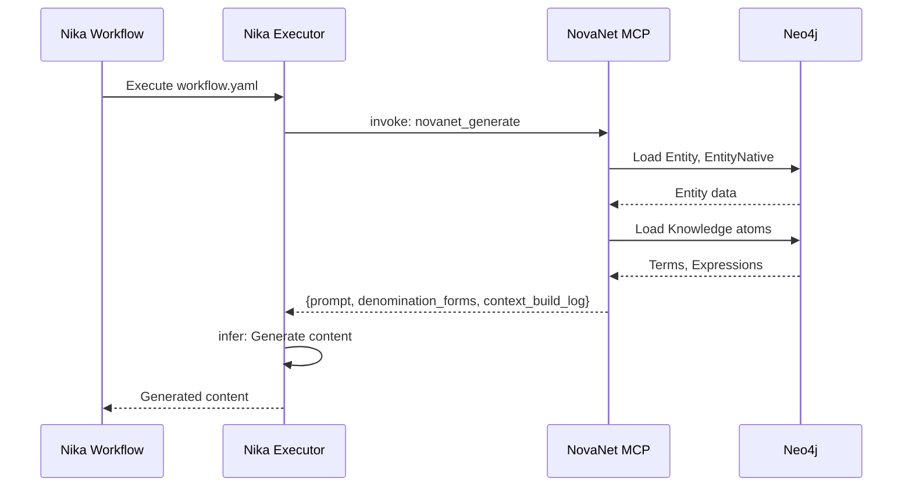

### novanet_query

Execute read-only Cypher queries against the knowledge graph.

```json
{
  "tool": "novanet_query",
  "params": {
    "cypher": "MATCH (e:Entity {key: $key}) RETURN e",
    "params": { "key": "qr-code" },
    "limit": 100,
    "timeout_ms": 5000
  }
}
```

**Parameters:**
| Name | Type | Required | Description |
|------|------|----------|-------------|
| cypher | string | Yes | Read-only Cypher query |
| params | object | No | Query parameters (bind variables) |
| limit | number | No | Max rows to return (default: 100) |
| timeout_ms | number | No | Query timeout in milliseconds (default: 5000) |

**Returns:**
```json
{
  "rows": [...],
  "row_count": 42,
  "token_estimate": 1250,
  "cached": false
}
```

### novanet_describe

Bootstrap agent understanding of the knowledge graph. Provides schema and data overviews.

```json
{
  "tool": "novanet_describe",
  "params": {
    "describe": "entity",
    "entity_key": "qr-code"
  }
}
```

**Describe Modes:**
| Mode | Description | Returns |
|------|-------------|---------|
| `schema` | Full schema overview | All node/arc classes, realms, layers |
| `entity` | Specific entity details | Entity + natives + relations |
| `category` | Entity category | Category + child entities |
| `relations` | Arc types for a class | Available arcs, cardinalities |
| `locales` | Available locales | Locale list with coverage |
| `stats` | Database statistics | Node/arc counts by type |

**Parameters:**
| Name | Type | Required | Description |
|------|------|----------|-------------|
| describe | string | Yes | Mode: schema\|entity\|category\|relations\|locales\|stats |
| entity_key | string | No | Entity key (for entity mode) |
| category_key | string | No | Category key (for category mode) |

**Returns:**
```json
{
  "target": "entity:qr-code",
  "data": { ... },
  "token_estimate": 850
}
```

### novanet_search

Fulltext, property, or hybrid search across nodes.

```json
{
  "tool": "novanet_search",
  "params": {
    "query": "qr code generator",
    "mode": "hybrid",
    "kinds": ["Entity", "Page"],
    "realm": "org",
    "limit": 20
  }
}
```

**Search Modes:**
| Mode | Description |
|------|-------------|
| `fulltext` | Lucene fulltext index search |
| `property` | Exact property matching |
| `hybrid` | Combined fulltext + property (default) |

**Parameters:**
| Name | Type | Required | Description |
|------|------|----------|-------------|
| query | string | Yes | Search query |
| mode | string | No | Search mode: fulltext\|property\|hybrid |
| kinds | array | No | Filter by node classes |
| realm | string | No | Filter by realm: shared\|org |
| limit | number | No | Max results (default: 20) |

**Returns:**
```json
{
  "hits": [
    { "key": "qr-code", "class": "Entity", "score": 0.95, "snippet": "..." }
  ],
  "total_hits": 42,
  "mode": "hybrid",
  "token_estimate": 1100
}
```

### novanet_traverse

Graph traversal with configurable depth, direction, and filters.

```json
{
  "tool": "novanet_traverse",
  "params": {
    "start_key": "entity:qr-code",
    "max_depth": 3,
    "direction": "outgoing",
    "arc_families": ["localization", "ownership"],
    "target_kinds": ["EntityNative", "Page"]
  }
}
```

**Parameters:**
| Name | Type | Required | Description |
|------|------|----------|-------------|
| start_key | string | Yes | Starting node (format: "class:key") |
| max_depth | number | No | Max traversal depth (default: 2) |
| direction | string | No | outgoing\|incoming\|both (default: outgoing) |
| arc_families | array | No | Filter by arc families |
| target_kinds | array | No | Filter target node classes |

**Returns:**
```json
{
  "start": { "key": "qr-code", "class": "Entity" },
  "nodes": [...],
  "arcs": [...],
  "max_depth_reached": false,
  "token_estimate": 2100
}
```

### novanet_assemble

Token-aware context assembly for LLM generation. Assembles context using configurable strategies.

```json
{
  "tool": "novanet_assemble",
  "params": {
    "focus_key": "page:home",
    "locale": "fr-FR",
    "token_budget": 4000,
    "strategy": "relevance"
  }
}
```

**Assembly Strategies:**
| Strategy | Description |
|----------|-------------|
| `breadth` | Expand neighbors uniformly at each depth |
| `depth` | Follow most relevant paths deeply |
| `relevance` | Score-based prioritization (default) |
| `custom` | User-defined expansion rules |

**Parameters:**
| Name | Type | Required | Description |
|------|------|----------|-------------|
| focus_key | string | Yes | Focus node (format: "class:key") |
| locale | string | Yes | Target locale (BCP-47) |
| token_budget | number | No | Max tokens to assemble (default: 4000) |
| strategy | string | No | Assembly strategy: breadth\|depth\|relevance\|custom |

**Returns:**
```json
{
  "focus": { "key": "home", "class": "Page" },
  "evidence": [...],
  "locale_context": { ... },
  "truncated": false,
  "context_build_log": [
    { "phase": "structure_phase", "duration_ms": 12, "nodes": 5 },
    { "phase": "entities_phase", "duration_ms": 45, "nodes": 3 },
    { "phase": "atoms_phase", "duration_ms": 23, "nodes": 50 }
  ]
}
```

### novanet_atoms

Retrieve knowledge atoms (granular locale-specific content) for a locale.

```json
{
  "tool": "novanet_atoms",
  "params": {
    "locale": "fr-FR",
    "atom_type": "expression",
    "domain": "urgency"
  }
}
```

**Atom Types:**
| Type | Description | Container |
|------|-------------|-----------|
| `term` | Locale-specific terminology | TermSet |
| `expression` | Common expressions | ExpressionSet |
| `pattern` | Text patterns | PatternSet |
| `cultureref` | Cultural references | CultureSet |
| `taboo` | Things to avoid | TabooSet |
| `audiencetrait` | Audience characteristics | AudienceSet |
| `all` | All atom types | - |

**Parameters:**
| Name | Type | Required | Description |
|------|------|----------|-------------|
| locale | string | Yes | Locale code (BCP-47) |
| atom_type | string | No | Atom type (default: all) |
| domain | string | No | Semantic domain filter |

**Returns:**
```json
{
  "locale": "fr-FR",
  "atoms": [...],
  "containers": ["TermSet:urgency", "ExpressionSet:value"],
  "total_count": 156,
  "token_estimate": 2400
}
```

### novanet_generate

Full RLM-on-KG (Recursive Language Model on Knowledge Graph) context assembly for content generation. This is the primary tool for generating native content.

```json
{
  "tool": "novanet_generate",
  "params": {
    "focus_key": "entity:qr-code",
    "locale": "fr-FR",
    "mode": "page",
    "token_budget": 8000,
    "spreading_depth": 2
  }
}
```

**Generation Modes:**
| Mode | Description |
|------|-------------|
| `block` | Single block context (smaller, focused) |
| `page` | Full page context with all blocks (default) |

**Parameters:**
| Name | Type | Required | Description |
|------|------|----------|-------------|
| focus_key | string | Yes | Focus node (format: "class:key") |
| locale | string | Yes | Target locale (BCP-47) |
| mode | string | No | Generation mode: block\|page (default: page) |
| token_budget | number | No | Max tokens (default: 8000) |
| spreading_depth | number | No | Graph spreading depth (default: 2) |

**Returns:**
```json
{
  "prompt": "...",
  "evidence_summary": "...",
  "locale_context": { ... },
  "context_anchors": [...],
  "denomination_forms": {
    "text": "un code QR",
    "title": "Code QR",
    "abbrev": "QR",
    "mixed": "codeQR",
    "base": "code-qr",
    "url": "code-qr"
  },
  "context_build_log": {
    "structure_phase": { "duration_ms": 12, "nodes": 5, "details": "..." },
    "entities_phase": { "duration_ms": 45, "nodes": 3, "details": "..." },
    "atoms_phase": { "duration_ms": 23, "nodes": 50, "details": "..." },
    "anchors_phase": { "duration_ms": 8, "nodes": 2, "details": "..." },
    "token_decisions": { "budget": 8000, "used": 6234, "truncated": [] }
  },
  "token_estimate": 6234
}
```

### Denomination Forms (ADR-033)

The `denomination_forms` object provides prescriptive canonical forms for LLM references.

```
╔═══════════════════════════════════════════════════════════════════════════════╗
║                      DENOMINATION FORMS (ADR-033)                             ║
╠═══════════════════════════════════════════════════════════════════════════════╣
║                                                                               ║
║   ┌─────────────────────────────────────────────────────────────────────────┐ ║
║   │                    ABSOLUTE RULE                                        │ ║
║   │                                                                         │ ║
║   │    LLMs MUST use these forms. NO INVENTION ALLOWED.                     │ ║
║   │                                                                         │ ║
║   └─────────────────────────────────────────────────────────────────────────┘ ║
║                                                                               ║
╚═══════════════════════════════════════════════════════════════════════════════╝
```

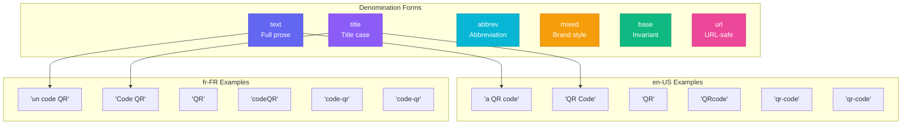

| Form | Description | en-US | fr-FR | Usage |
|:----:|-------------|:-----:|:-----:|-------|
| **text** | Full prose form with article | "a QR code" | "un code QR" | Body paragraphs |
| **title** | Title case for headings | "QR Code" | "Code QR" | H1, H2, meta_title |
| **abbrev** | Abbreviation | "QR" | "QR" | After first mention |
| **mixed** | Brand-preferred mixed case | "QRcode" | "codeQR" | Logo text, branding |
| **base** | Lowercase invariant | "qr-code" | "code-qr" | Internal references |
| **url** | URL-safe slug | "qr-code" | "code-qr" | URL paths |

### Context Build Log (v0.14.0)

The `context_build_log` provides step-by-step debugging for context assembly. This feature was added in v0.14.0 to help understand how NovaNet assembles context for LLM generation.

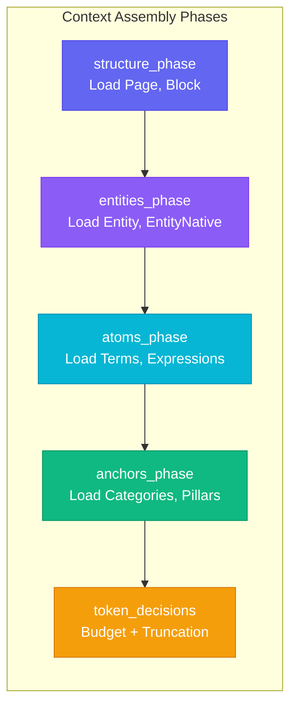

**Phase Details:**

| Phase | Description | Logs |
|-------|-------------|------|
| `structure_phase` | Load structural nodes (Page, Block) | Duration, node count |
| `entities_phase` | Load semantic nodes (Entity, EntityNative) | Duration, node count |
| `atoms_phase` | Load knowledge atoms (Term, Expression) | Duration, atom count |
| `anchors_phase` | Load context anchors (Category, Pillar) | Duration, anchor count |
| `token_decisions` | Token budgeting and truncation | Budget, used, truncated items |

**Example Log:**
```json
{
  "context_build_log": {
    "structure_phase": {
      "duration_ms": 12,
      "nodes": 5,
      "details": "Page:home, Block:hero, Block:features, Block:pricing, Block:cta"
    },
    "entities_phase": {
      "duration_ms": 45,
      "nodes": 3,
      "details": "Entity:qr-code, EntityNative:qr-code@fr-FR, EntityNative:qr-code@en-US"
    },
    "atoms_phase": {
      "duration_ms": 23,
      "nodes": 50,
      "details": "Terms:20, Expressions:15, Patterns:10, CultureRefs:5"
    },
    "anchors_phase": {
      "duration_ms": 8,
      "nodes": 2,
      "details": "Category:qr-generators, SEOPillar:qr-code-creation"
    },
    "token_decisions": {
      "budget": 8000,
      "used": 6234,
      "truncated": []
    }
  }
}
```

**Use Cases:**
- Debug slow context assembly (identify which phase is slow)
- Understand what data is being loaded
- Verify token budget usage
- Identify truncated content

---

## 7. Rust CLI Commands

### Command Overview

```
╔═══════════════════════════════════════════════════════════════════════════════╗
║                           novanet <COMMAND>                                    ║
╠═══════════════════════════════════════════════════════════════════════════════╣
║                                                                               ║
║   NAVIGATION                        DATA OPERATIONS                           ║
║   ──────────                        ───────────────                           ║
║   blueprint   Schema visualization  node      Node CRUD                       ║
║   data        Data nodes only       arc       Arc CRUD                        ║
║   overlay     Data + Schema         search    Fulltext search                 ║
║   query       Faceted query                                                   ║
║                                                                               ║
║   SCHEMA                            DATABASE                                  ║
║   ──────                            ────────                                  ║
║   schema generate   Regenerate      db seed     Seed database                 ║
║   schema validate   Validate YAML   db migrate  Run migrations                ║
║   doc generate      Mermaid docs    db reset    Reset database                ║
║                                                                               ║
║   CONTENT                           UTILITIES                                 ║
║   ───────                           ─────────                                 ║
║   locale      Locale operations     tui          Terminal UI                  ║
║   knowledge   Knowledge gen         completions  Shell completions            ║
║   entity      Entity seeding        doctor       System health                ║
║   filter      Filter build          help         Show help                    ║
║                                                                               ║
╚═══════════════════════════════════════════════════════════════════════════════╝
```

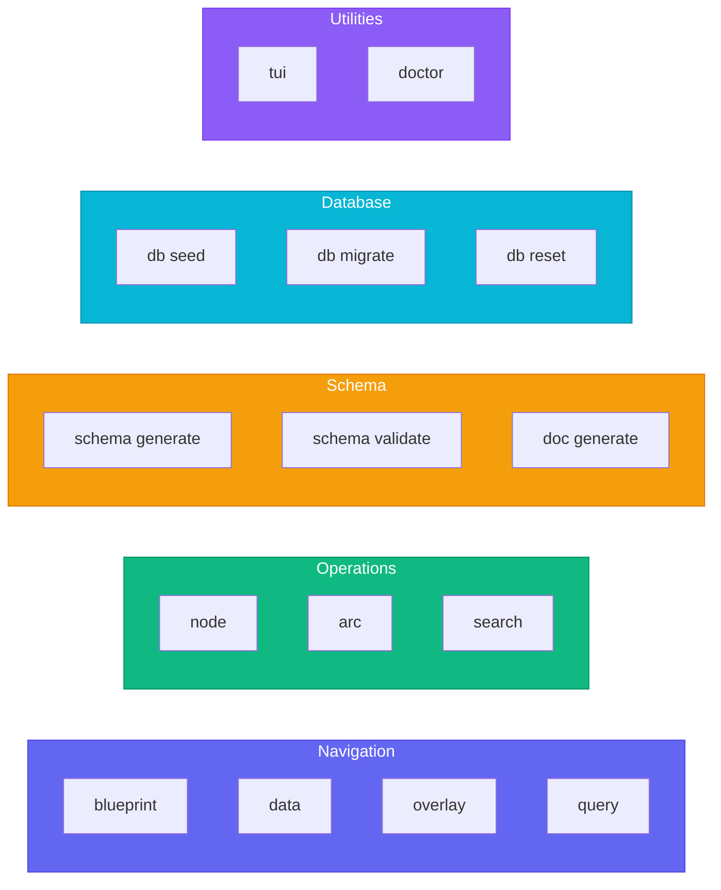

### Blueprint

Visualize the schema graph.

```bash
# Default overview with all sections
cargo run -- blueprint

# Specific views
cargo run -- blueprint --view=tree       # Realm > Layer > Class hierarchy
cargo run -- blueprint --view=flow       # 6 flow diagrams
cargo run -- blueprint --view=arcs       # Arc families with relationships
cargo run -- blueprint --view=stats      # Raw counts (supports --format=json)
cargo run -- blueprint --view=glossary   # Term definitions
cargo run -- blueprint --view=cardinality # 1:1, 1:N, N:M constraints

# Skip validation for faster output
cargo run -- blueprint --no-validate
```

### Data Navigation

```bash
# Data nodes only (production data)
cargo run -- data

# Schema nodes only (meta-graph)
cargo run -- blueprint

# Combined view
cargo run -- overlay

# Faceted query
cargo run -- query --realm=org --layer=semantic --format=json
cargo run -- query --trait=generated --family=ownership
```

### Node Operations

```bash
# Create node
cargo run -- node create --class=Page --key=my-page --props='{"display_name":"My Page"}'

# Edit node
cargo run -- node edit --key=my-page --set='{"description":"Updated description"}'

# Delete node
cargo run -- node delete --key=my-page --confirm
```

### Arc Operations

```bash
# Create arc
cargo run -- arc create --from=page1 --to=entity1 --class=USES_ENTITY

# Delete arc
cargo run -- arc delete --from=page1 --to=entity1 --class=USES_ENTITY --confirm
```

### Search

```bash
# Fulltext search
cargo run -- search --query="qr code"

# Filter by class
cargo run -- search --query="page" --class=Page --limit=20

# Property search
cargo run -- search --query="pricing" --properties=key,display_name
```

### Schema Operations

```bash
# Generate all 12 artifacts from YAML
cargo run -- schema generate

# Preview without writing
cargo run -- schema generate --dry-run

# Validate YAML coherence
cargo run -- schema validate

# Strict mode (fail on warnings)
cargo run -- schema validate --strict
```

### Documentation

```bash
# Generate all 11 view Mermaid diagrams
cargo run -- doc generate

# Single view
cargo run -- doc generate --view=block-generation

# Preview without writing
cargo run -- doc generate --dry-run

# List available views
cargo run -- doc generate --list
```

### Database Operations

```bash
# Seed database with Cypher files
cargo run -- db seed

# Run migrations
cargo run -- db migrate

# Reset (drop + seed)
cargo run -- db reset
```

### Locale Operations

```bash
# List locales
cargo run -- locale list --format=table

# Import locale data
cargo run -- locale import --file=path/to/locale.cypher

# Generate 20-locales.cypher
cargo run -- locale generate --csv=... --output=...
```

### Entity Operations

```bash
# Seed all phases
cargo run -- entity seed --project=qrcode-ai

# Seed specific phase
cargo run -- entity seed --project=qrcode-ai --phase=1

# List available phases
cargo run -- entity list --project=qrcode-ai

# Validate phase data
cargo run -- entity validate --project=qrcode-ai
```

### System Utilities

```bash
# Generate shell completions
cargo run -- completions bash
cargo run -- completions zsh
cargo run -- completions fish

# System health check
cargo run -- doctor
cargo run -- doctor --skip-db  # Skip Neo4j connectivity check
```

---

## 8. TUI Usage

The NovaNet TUI provides an interactive terminal interface for exploring the knowledge graph.

### Starting the TUI

```bash
cargo run -- tui
```

### TUI Layout

```
╔═══════════════════════════════════════════════════════════════════════════════╗
║  NovaNet TUI                                              [1]Graph  [2]Nexus  ║
╠══════════════════════╤══════════════════════╤════════════════════════════════╣
║                      │                      │                                ║
║   Tree Panel         │   Info Panel         │   YAML Panel                   ║
║   ──────────         │   ──────────         │   ──────────                   ║
║                      │                      │                                ║
║   ▼ SHARED           │   Entity             │   node:                        ║
║     ▼ config         │   ────────           │     name: Entity               ║
║       ▶ Locale       │   key: qr-code       │     realm: org                 ║
║       ▶ EntityCat... │   realm: org         │     layer: semantic            ║
║     ▼ knowledge      │   layer: semantic    │     trait: defined             ║
║       ▶ Term         │   trait: defined     │                                ║
║       ▶ Expression   │                      │     description: |             ║
║   ▼ ORG              │   Relations:         │       Semantic unit...         ║
║     ▼ semantic       │   ─ HAS_NATIVE (3)   │                                ║
║       ▶ Entity  ◀    │   ─ REPRESENTS (1)   │     llm_context: |             ║
║       ▶ EntityNat... │                      │       USE: when loading...     ║
║                      │   Properties: 12     │                                ║
║                      │                      │                                ║
╠══════════════════════╧══════════════════════╧════════════════════════════════╣
║  Mode: Graph │ 61 nodes │ 182 arcs │ Neo4j: connected │ Press ? for help    ║
╚═══════════════════════════════════════════════════════════════════════════════╝
```

### Navigation Modes

| Mode | Key | Description |
|:----:|:---:|-------------|
| **Graph** | `[1]` | Unified tree (Realm > Layer > Class > Instance) |
| **Nexus** | `[2]` | Hub for Quiz, Audit, Stats, Help |

### Keybindings

#### Navigation

```
╔═══════════════════════════════════════════════════════════════════════════════╗
║                         NAVIGATION KEYBINDINGS                                ║
╠═══════════════════════════════════════════════════════════════════════════════╣
║                                                                               ║
║   Movement              Expansion               Paging                        ║
║   ────────              ─────────               ──────                        ║
║   j / Down   Move down  l / Right  Expand       d   Page down (10)            ║
║   k / Up     Move up    h / Left   Collapse     u   Page up (10)              ║
║   Enter      Select                             g   Go to top                 ║
║                                                 G   Go to bottom              ║
║                                                                               ║
║   Quick Navigation                   Mode Switching                           ║
║   ────────────────                   ──────────────                           ║
║   gr  Go to Realms                   1   Graph mode                           ║
║   gl  Go to Layers                   2   Nexus mode                           ║
║   gc  Go to Classes                                                           ║
║   gf  Go to Arc Families             Overlays                                 ║
║   ga  Go to ArcClasses               ────────                                 ║
║   gt  Go to Traits                   /   Search overlay                       ║
║                                      ?   Help overlay                         ║
║                                      Esc Close overlay                        ║
║                                                                               ║
╚═══════════════════════════════════════════════════════════════════════════════╝
```

#### Panels

| Key | Action |
|:---:|--------|
| `Tab` | Cycle focus: Tree -> Info -> YAML |
| `ENC1` | Scroll tree panel |
| `ENC2` | Scroll YAML panel |

#### Actions

| Key | Action |
|:---:|--------|
| `q` | Quit |
| `r` | Refresh data |
| `y` | Yank (copy) current node key |

### Search Workflow

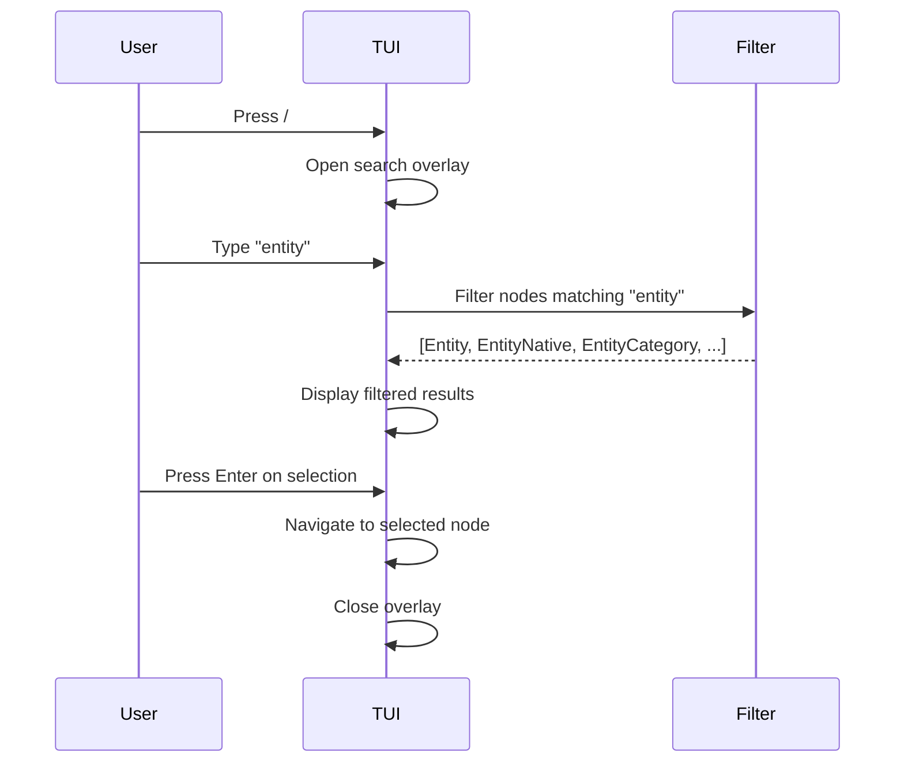

### YAML Panel

The YAML panel shows the raw YAML source for the selected node:

- Syntax highlighted
- Scrollable with `ENC2`
- Shows all 6 BLOCs

---

## 9. ADR Summary

### Architecture Decision Records

NovaNet follows a rigorous ADR process. Key decisions are documented in `.claude/rules/adr/`.

```
╔═══════════════════════════════════════════════════════════════════════════════╗
║                    MUST-KNOW ADRs FOR v0.14.0                                 ║
╠═══════════════════════════════════════════════════════════════════════════════╣
║                                                                               ║
║   ADR-029  *Native Pattern      EntityNative, PageNative (unified suffix)     ║
║   ADR-030  Slug Ownership       Page owns URL, Entity owns semantics          ║
║   ADR-033  Denomination Forms   Prescriptive canonical forms for LLM refs     ║
║   ADR-024  Trait = Data Origin  defined/authored/imported/generated/retrieved ║
║                                                                               ║
╚═══════════════════════════════════════════════════════════════════════════════╝
```

### ADR Quick Reference

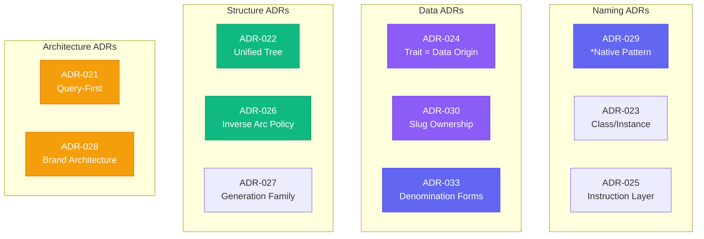

| ADR | Name | Status | Impact |
|:---:|------|:------:|--------|
| **029** | *Native Pattern | Accepted | EntityNative, PageNative unified suffix |
| **030** | Slug Ownership | Accepted | Page owns URL, Entity owns semantics |
| **033** | Denomination Forms | Accepted | Prescriptive canonical forms for LLM refs |
| **024** | Trait = Data Origin | Accepted | defined/authored/imported/generated/retrieved |
| **025** | Instruction Layer | Accepted | PageStructure, PageInstruction naming |
| **026** | Inverse Arc Policy | Accepted | Tiered policy for bidirectional arcs |
| **027** | Generation Family | Accepted | Arc semantics for generation pipeline |
| **028** | Brand Architecture | Accepted | Brand, BrandDesign, BrandPrinciples nodes |
| **021** | Query-First | Accepted | Cypher = source of truth |
| **022** | Unified Tree | Accepted | 2 modes: Graph + Nexus |
| **023** | Class/Instance | Accepted | Kind -> Class terminology |

> **Tip**: Use `/adr <number>` command for quick ADR lookup in Claude Code.

### ADR-029: *Native Pattern

**Decision**: All locale-specific nodes use `*Native` suffix.

```
BEFORE                          AFTER
------                          -----
EntityContent                   EntityNative (authored)
PageGenerated                   PageNative (generated)
HAS_CONTENT + HAS_GENERATED     HAS_NATIVE (unified)
```

**Why**: Unified naming pattern makes relationships clearer. The trait (authored vs generated) indicates who creates the content.

### ADR-030: Slug Ownership

**Decision**: Page owns URL structure, Entity owns semantic identity.

| Property | Owner | Why |
|----------|-------|-----|
| `slug` | PageNative | URL is a presentation concern |
| `slug_source` | PageNative | Derivation strategy |
| `key` | Entity | Semantic identity |
| `denomination_forms` | Entity | How to reference in text |

### ADR-033: Denomination Forms

**Decision**: Prescriptive canonical forms for LLM references.

| Form | Description | LLM Usage |
|------|-------------|-----------|
| text | Full prose | "Generate a paragraph about {text}" |
| title | Title case | "# {title}" |
| abbrev | Short form | "The {abbrev} feature..." |
| mixed | Brand style | Logo text, special formatting |
| base | Invariant | Internal references |
| url | URL-safe | Link generation |

**ABSOLUTE RULE**: LLMs MUST use these forms. No invention.

### ADR-024: Trait = Data Origin

**Decision**: Trait answers "WHERE does data come from?"

| Trait | Source | Mutability |
|-------|--------|------------|
| defined | Human | Once, version-controlled |
| authored | Human | Per locale |
| imported | External | Periodic updates |
| generated | LLM | On-demand |
| retrieved | APIs | Real-time/cached |

---

## 10. Development Guide

### Prerequisites

```
┌─────────────────────────────────────────────────────────────────────────────┐
│                           PREREQUISITES                                     │
├─────────────────────────────────────────────────────────────────────────────┤
│                                                                             │
│   Node.js   >= 20      https://nodejs.org                                  │
│   pnpm      >= 9       https://pnpm.io                                     │
│   Docker    Latest     https://docker.com                                  │
│   Rust      >= 1.84    https://rustup.rs                                   │
│                                                                             │
└─────────────────────────────────────────────────────────────────────────────┘
```

### Setup

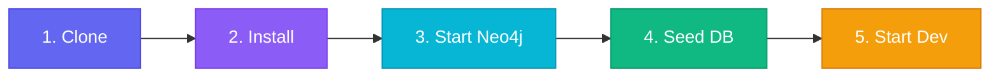

```bash
# 1. Clone
git clone git@github.com:supernovae-st/supernovae-agi.git
cd supernovae-agi/novanet-dev

# 2. Install dependencies
pnpm install

# 3. Start Neo4j
pnpm infra:up

# 4. Seed database
pnpm infra:seed

# 5. Start Studio
pnpm dev
```

> Open [http://localhost:3000](http://localhost:3000) for Studio, [http://localhost:7474](http://localhost:7474) for Neo4j Browser

### Development Commands

```bash
# Build all packages
pnpm build

# Type check
pnpm type-check

# Lint
pnpm lint

# Test
pnpm test
```

### Rust Development

```bash
cd tools/novanet

# Build
cargo build

# Test
cargo test                    # 1194 tests
cargo nextest run             # Parallel test runner

# Quality
cargo clippy -- -D warnings   # Zero warnings policy
cargo fmt --check             # Formatting check

# Security
cargo deny check              # License/security policy
cargo audit                   # Vulnerability scanning
cargo machete                 # Unused dependencies
```

### Adding a New Node

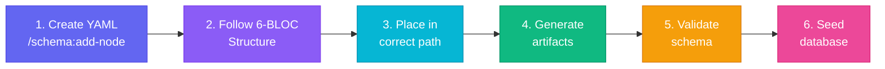

| Step | Command | Description |
|:----:|---------|-------------|
| 1 | `/schema:add-node` | Use the schema skill for Socratic discovery |
| 2 | Follow 6-BLOC structure | See Section 3 for complete structure |
| 3 | Place in correct location | `packages/core/models/node-classes/{realm}/{layer}/{name}.yaml` |
| 4 | `cargo run -- schema generate` | Regenerate all artifacts from YAML |
| 5 | `cargo run -- schema validate --strict` | Validate YAML coherence |
| 6 | `pnpm infra:seed` | Seed the database |

### Adding a New Arc

1. **Create YAML file**:
   ```
   packages/core/models/arc-classes/{family}/{arc-name}.yaml
   ```

2. **Define properties**:
   ```yaml
   arc:
     name: NEW_ARC
     family: semantic
     from: SourceClass
     to: TargetClass
     cardinality: "N:M"
     scope: intra_realm
     description: "What this arc represents."
     llm_context: |
       USE: when [use case].
       TRIGGERS: "keyword1", "keyword2".
       NOT: for [not this].
       RELATES: Source (role), Target (role).
   ```

3. **Consider inverse** (see ADR-026 tiers)

4. **Regenerate and validate**

### Testing

**Rust tests**:
```bash
cargo test                           # All tests
cargo test -- --ignored              # Integration tests (needs Neo4j)
cargo test node_                     # Filter by name
cargo test --test schema_test        # Specific test file
```

**Snapshot testing** (insta):
```bash
cargo insta test                     # Run and review
cargo insta review                   # Interactive review
```

**Property-based testing** (proptest):
- Auto-fix invariants
- Cypher utilities
- Parser edge cases

### Debugging

```bash
# Enable debug logging
RUST_LOG=debug cargo run -- blueprint

# Trace Neo4j queries
RUST_LOG=neo4rs=trace cargo run -- data

# TUI debugging
RUST_LOG=novanet::tui=debug cargo run -- tui
```

---

## 11. API Reference

### Neo4j Connection

```
URL: http://localhost:7474
Bolt: bolt://localhost:7687
User: neo4j
Password: novanetpassword
```

### TypeScript Types

```typescript
import {
  NodeClass,
  ArcClass,
  Realm,
  Layer,
  Trait,
  ArcFamily,
  NovaNetFilter
} from '@novanet/core';

// Node class definition
interface NodeClass {
  name: string;
  realm: 'shared' | 'org';
  layer: Layer;
  trait: Trait;
  description: string;
  llm_context: string;
  icon: DualIcon;
  standard_properties: PropertyMap;
  properties: PropertyMap;
  relations?: Relations;
  example?: Example;
}

// Filter for querying
interface NovaNetFilter {
  realms?: Realm[];
  layers?: Layer[];
  traits?: Trait[];
  families?: ArcFamily[];
  classes?: string[];
}
```

### Rust Types

```rust
use novanet::{
    NodeClass,
    ArcClass,
    Realm,
    Layer,
    Trait,
    ArcFamily,
    FacetFilter,
};

// Facet filter for queries
pub struct FacetFilter {
    pub realms: Option<Vec<Realm>>,
    pub layers: Option<Vec<Layer>>,
    pub traits: Option<Vec<Trait>>,
    pub families: Option<Vec<ArcFamily>>,
    pub classes: Option<Vec<String>>,
}

// Query builder
let cypher = CypherStatement::query()
    .with_filter(&filter)
    .build()?;
```

### Common Cypher Patterns

```cypher
-- Count all nodes by type
MATCH (n) RETURN labels(n)[0] AS label, count(*) AS count ORDER BY count DESC;

-- Get project with its pages
MATCH (p:Project {key: "qrcode-ai"})-[:HAS_PAGE]->(page:Page)
RETURN p.key, collect(page.key) AS pages;

-- Load block context for generation
MATCH (b:Block {key: "hero-pricing"})
MATCH (b)-[:USES_ENTITY]->(e:Entity)-[:HAS_NATIVE]->(en:EntityNative)-[:FOR_LOCALE]->(l:Locale {key: "fr-FR"})
MATCH (b)-[:OF_TYPE]->(bt:BlockType)
MATCH (l)-[:HAS_VOICE]->(v:LocaleVoice)
MATCH (l)-[:HAS_LEXICON]->(lex:LocaleLexicon)-[:HAS_EXPRESSION]->(ex:Expression)
WHERE ex.semantic_field IN ['urgency', 'value']
RETURN b.instructions, e.key, en.title, bt.rules, v.formality_score, collect(ex.text) AS expressions;

-- Navigate schema-graph (Realm -> Layer -> Class)
MATCH (r:Realm {key: "org"})-[:HAS_LAYER]->(l:Layer)-[:HAS_CLASS]->(c:Schema:Class)
RETURN r.key, l.key, collect(c.label) AS classes;

-- Find all Classes with a specific Trait
MATCH (c:Schema:Class)-[:HAS_TRAIT]->(t:Trait {key: "generated"})
RETURN c.label, t.key;

-- Arc schema for a Class
MATCH (ac:Schema:ArcClass)-[:FROM_CLASS]->(c:Schema:Class {label: "Block"})
MATCH (ac)-[:TO_CLASS]->(target:Schema:Class)
MATCH (ac)-[:IN_FAMILY]->(af:Schema:ArcFamily)
RETURN ac.key, af.key AS family, target.label AS target_class;
```

---

## 12. Troubleshooting

### Quick Diagnostic

```bash
# Run system health check
cargo run -- doctor
```

### Common Issues

```
╔═══════════════════════════════════════════════════════════════════════════════╗
║                         TROUBLESHOOTING GUIDE                                 ║
╠═══════════════════════════════════════════════════════════════════════════════╣
║                                                                               ║
║   Neo4j Connection                                                            ║
║   ────────────────                                                            ║
║   Symptom: ConnectionError: Failed to connect to Neo4j                        ║
║   Fix:     docker ps                    (check Docker running)               ║
║            docker logs novanet-neo4j   (check container logs)                ║
║            cargo run -- doctor          (run diagnostics)                    ║
║                                                                               ║
║   Schema Validation                                                           ║
║   ─────────────────                                                           ║
║   Symptom: schema validate fails                                              ║
║   Fix:     cargo run -- schema validate --verbose                            ║
║            Check: standard_properties, trait, layer, llm_context             ║
║                                                                               ║
║   Seed Failures                                                               ║
║   ─────────────                                                               ║
║   Symptom: infra:seed fails                                                   ║
║   Fix:     pnpm infra:reset            (reset database)                      ║
║            Check Cypher syntax, node dependencies, constraints               ║
║                                                                               ║
║   TUI Rendering                                                               ║
║   ─────────────                                                               ║
║   Symptom: TUI displays incorrectly                                           ║
║   Fix:     TERM=xterm-256color         (set terminal type)                   ║
║            Resize terminal to 120x40 minimum                                  ║
║            Use font with Unicode support                                      ║
║                                                                               ║
║   MCP Server                                                                  ║
║   ──────────                                                                  ║
║   Symptom: MCP tools return errors                                            ║
║   Fix:     RUST_LOG=debug cargo run    (enable debug logging)               ║
║            Check context_build_log for step failures                         ║
║                                                                               ║
╚═══════════════════════════════════════════════════════════════════════════════╝
```

### Error Code Reference

| Code | Description | Quick Fix |
|:----:|-------------|-----------|
| `E001` | Node not found | Check key exists in database |
| `E002` | Arc not found | Check from/to nodes exist |
| `E003` | Invalid Cypher | Review query syntax |
| `E004` | Schema violation | Run `schema validate` |
| `E005` | Locale not found | Check BCP-47 code format |
| `E006` | Permission denied | Check Neo4j credentials |

### Debug Commands

```bash
# Enable debug logging
RUST_LOG=debug cargo run -- blueprint

# Trace Neo4j queries
RUST_LOG=neo4rs=trace cargo run -- data

# TUI debugging
RUST_LOG=novanet::tui=debug cargo run -- tui

# Verbose schema validation
cargo run -- schema validate --verbose
```

---

## Appendix A: File Index

### YAML Models

```
packages/core/models/
├── node-classes/
│   ├── shared/                    # 40 nodes
│   │   ├── config/               #   3 nodes
│   │   ├── locale/               #   6 nodes
│   │   ├── geography/            #   7 nodes
│   │   └── knowledge/            #  24 nodes
│   └── org/                       # 21 nodes
│       ├── config/               #   1 node
│       ├── foundation/           #   6 nodes
│       ├── structure/            #   3 nodes
│       ├── semantic/             #   4 nodes
│       ├── instruction/          #   4 nodes
│       └── output/               #   3 nodes
├── arc-classes/                   # 182 arcs
├── views/                         # 11 views
├── taxonomy.yaml                  # Master taxonomy
└── _index.yaml                    # Node index
```

| Path | Count | Description |
|:-----|:-----:|-------------|
| `packages/core/models/node-classes/shared/` | 40 | Shared realm nodes |
| `packages/core/models/node-classes/org/` | 21 | Org realm nodes |
| `packages/core/models/arc-classes/` | 182 | Arc definitions |
| `packages/core/models/views/` | 11 | View definitions |
| `packages/core/models/taxonomy.yaml` | 1 | Master taxonomy |
| `packages/core/models/_index.yaml` | 1 | Node index |

### Generated Artifacts

| Path | Generator | Description |
|:-----|:---------:|-------------|
| `packages/db/seed/*.cypher` | seed | Database seeds |
| `packages/core/src/graph/hierarchy.ts` | hierarchy | Type exports |
| `packages/core/src/graph/layers.ts` | layers | Layer definitions |
| `packages/core/src/graph/visual-encoding.ts` | visual | Icons/colors |
| `tools/novanet/src/tui/icons.rs` | tui_icons | TUI icons |

---

## Appendix B: Version History

```
╔═══════════════════════════════════════════════════════════════════════════════╗
║                            VERSION HISTORY                                     ║
╠═══════════════════════════════════════════════════════════════════════════════╣
║                                                                               ║
║   v0.14.0  2026-02-19  MCP v0.4.0: context_build_log (5-phase debugging),     ║
║                        denomination_forms (ADR-033), tracing instrumentation, ║
║                        1082 tests passing                                      ║
║   v0.13.1  2026-02-17  6th Arc Family (Schema), 182 arcs total                ║
║   v0.13.0  2026-02-15  *Native Pattern (ADR-029), Slug Ownership (ADR-030)    ║
║   v0.12.5  2026-02-14  Brand Architecture (ADR-028), 61 nodes, 169 arcs       ║
║   v0.12.0  2026-02-13  Kind->Class (ADR-023), Trait=Data Origin (ADR-024)     ║
║   v11.7.0  2026-02-11  Unified Tree Architecture (ADR-022), 2 modes           ║
║                                                                               ║
╚═══════════════════════════════════════════════════════════════════════════════╝
```

---

## Appendix C: Glossary

```
╔═══════════════════════════════════════════════════════════════════════════════╗
║                              GLOSSARY                                          ║
╠══════════════════╤════════════════════════════════════════════════════════════╣
║  Arc             │  Directed relationship between nodes (never "edge")        ║
║  ArcClass        │  Schema definition for an arc type                         ║
║  ArcFamily       │  Category of arcs (ownership, localization, etc.)          ║
║  BLOC            │  Section of a node YAML file (6 BLOCs total)               ║
║  Class           │  Schema definition for a node type (never "Kind")          ║
║  Entity          │  Semantic concept (invariant, language-agnostic)           ║
║  EntityNative    │  Locale-specific content for an Entity                     ║
║  Layer           │  Functional grouping within a realm                        ║
║  Locale          │  BCP-47 language-region code (e.g., "fr-FR")               ║
║  Native          │  Locale-specific content (suffix pattern)                  ║
║  NodeClass       │  See "Class"                                               ║
║  Realm           │  Top-level partition (shared or org)                       ║
║  Trait           │  Data origin (defined/authored/imported/generated/retr.)  ║
╚══════════════════╧════════════════════════════════════════════════════════════╝
```

---

## Appendix D: Quick Reference Card

```
╔═══════════════════════════════════════════════════════════════════════════════╗
║                         NOVANET QUICK REFERENCE                                ║
╠═══════════════════════════════════════════════════════════════════════════════╣
║                                                                               ║
║   COMMANDS                                                                    ║
║   ────────                                                                    ║
║   pnpm dev                    Start Studio at :3000                           ║
║   cargo run -- tui            Launch TUI                                      ║
║   cargo run -- schema generate  Regenerate artifacts                          ║
║   cargo run -- doctor         Run diagnostics                                 ║
║                                                                               ║
║   STATISTICS                                                                  ║
║   ──────────                                                                  ║
║   61 NodeClasses  |  182 ArcClasses  |  10 Layers  |  2 Realms  |  5 Traits  ║
║                                                                               ║
║   KEY ADRs                                                                    ║
║   ────────                                                                    ║
║   ADR-029  *Native Pattern      ADR-030  Slug Ownership                       ║
║   ADR-033  Denomination Forms   ADR-024  Trait = Data Origin                  ║
║                                                                               ║
║   MCP TOOLS                                                                   ║
║   ─────────                                                                   ║
║   novanet_query   novanet_describe   novanet_search   novanet_traverse       ║
║   novanet_assemble   novanet_atoms   novanet_generate                        ║
║                                                                               ║
║   USEFUL LINKS                                                                ║
║   ────────────                                                                ║
║   Studio:     http://localhost:3000                                           ║
║   Neo4j:      http://localhost:7474                                           ║
║   Bolt:       bolt://localhost:7687                                           ║
║                                                                               ║
╚═══════════════════════════════════════════════════════════════════════════════╝
```

---

```
╔═══════════════════════════════════════════════════════════════════════════════╗
║                                                                               ║
║                    NovaNet is developed by SuperNovae Studio                  ║
║                       https://github.com/supernovae-st                        ║
║                                                                               ║
║                         Last generated: 2026-02-19                            ║
║                                                                               ║
╚═══════════════════════════════════════════════════════════════════════════════╝
```
