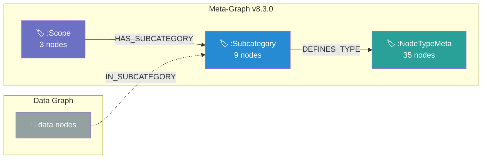
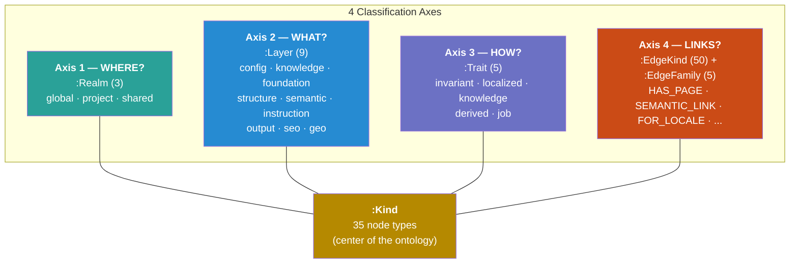
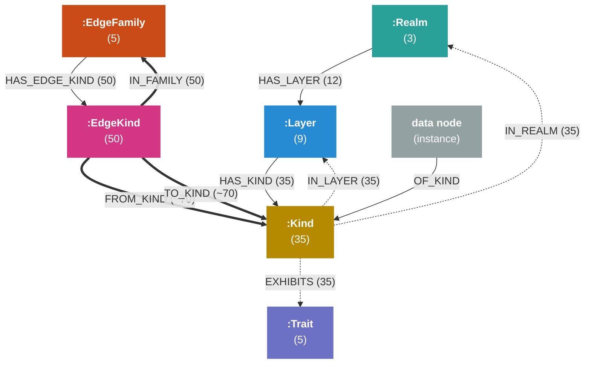
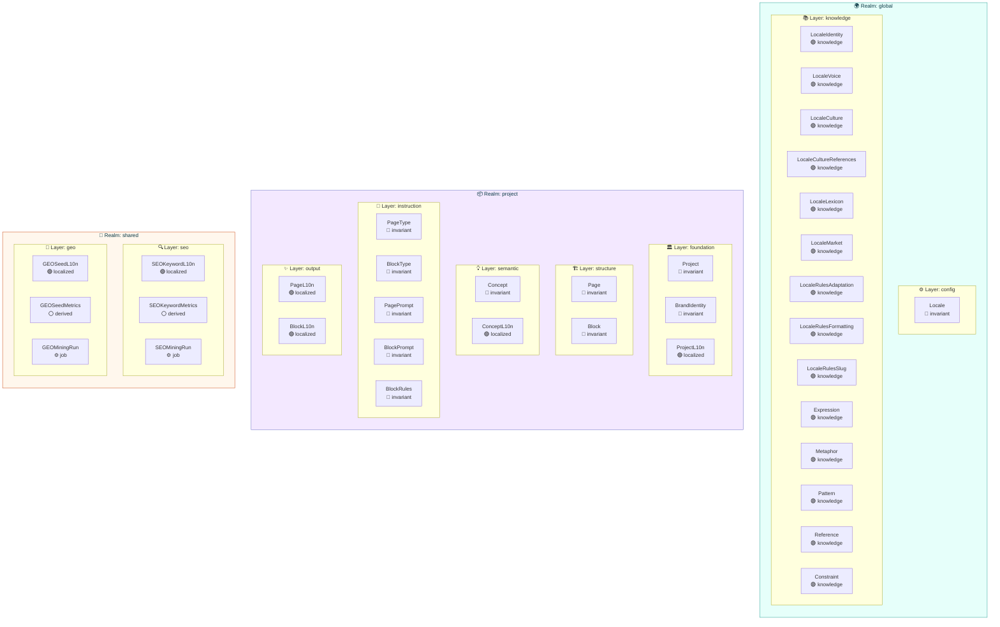
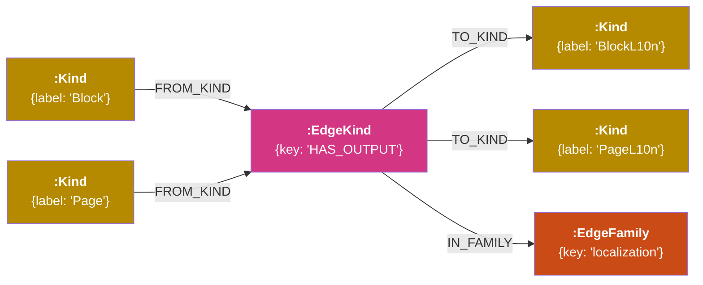
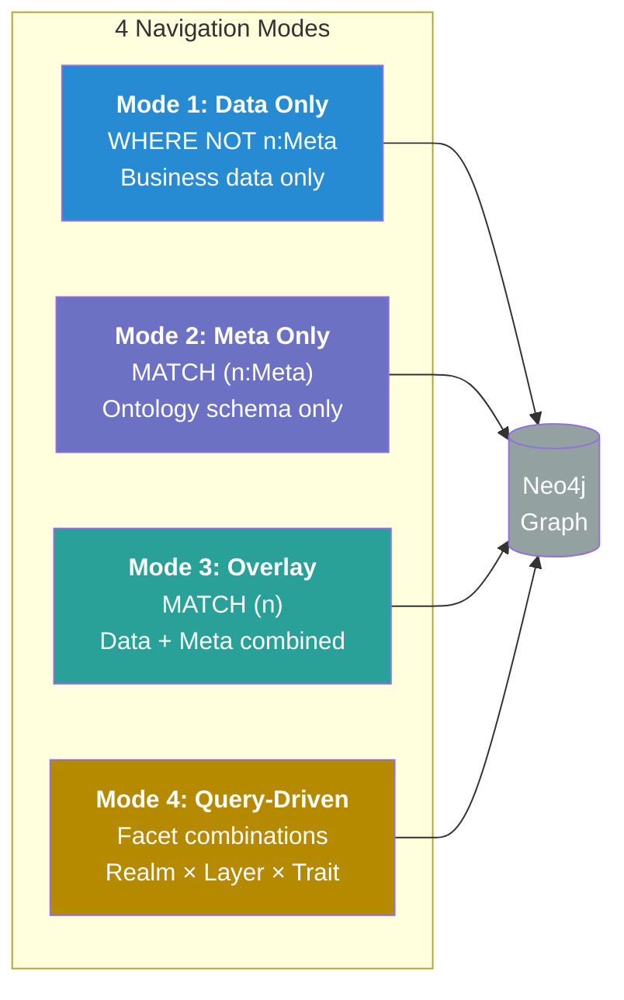
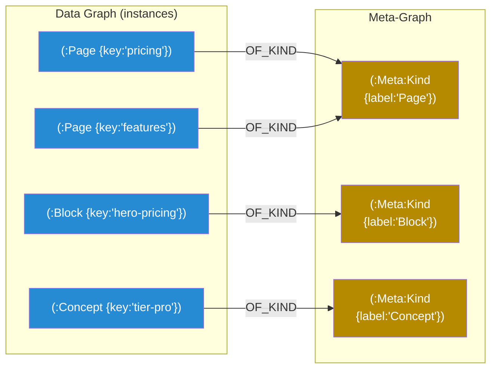
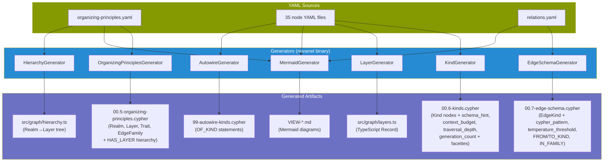

# NovaNet Ontology v9–v11 — Technical Specification

> **Status**: Draft | **Versions**: 9.0.0 → 10.0.0 → 11.0.0 | **Supersedes**: v8.3.0
> **Design source**: [`docs/plans/2026-02-01-ontology-v9-design.md`](plans/2026-02-01-ontology-v9-design.md)

---

## Table of Contents

1. [Introduction](#introduction)
2. [Why v9 — Problems with v8.3.0](#why-v9--problems-with-v830)
3. [Architecture Overview](#architecture-overview)
4. [Meta-Node Types](#meta-node-types)
5. [Meta-Graph Relations](#meta-graph-relations)
6. [Complete Kind Inventory](#complete-kind-inventory)
7. [Complete EdgeKind Inventory](#complete-edgekind-inventory)
8. [YAML Source Structure](#yaml-source-structure)
9. [Neo4j Schema](#neo4j-schema)
10. [Navigation Modes](#navigation-modes)
11. [Navigation Queries](#navigation-queries)
12. [Instance Bridge](#instance-bridge)
13. [Generator Architecture](#generator-architecture)
14. [Studio Impact](#studio-impact)
15. [CLI Integration](#cli-integration)
16. [Migration Strategy](#migration-strategy)
17. [Nomenclature & Conventions](#nomenclature--conventions)
18. [Testing Strategy](#testing-strategy)
19. [File Inventory](#file-inventory)
20. [Future Considerations & Evolution Roadmap](#future-considerations--evolution-roadmap)

---

## Introduction

NovaNet is a **self-describing context graph** powered by Neo4j. It orchestrates
the native generation of locale-specific content across 200+ locales for
[QR Code AI](https://qrcode-ai.com), a multilingual SaaS application.

Unlike a traditional knowledge graph, NovaNet is a **context graph**: a knowledge
graph enriched with operational metadata (schema hints, Cypher patterns, context
budgets) that enables AI agents to discover, query, and reason about the entire
schema autonomously. The meta-graph carries enough information for an LLM
orchestrator to assemble token-aware context windows without hardcoded logic.

The **meta-graph** is the layer that *describes* the data graph — it classifies
every node type and every relationship type into a structured ontology. Think of it
as the schema of the schema: while Neo4j has labels and relationship types, the
meta-graph gives those labels semantic meaning, hierarchical structure, and
machine-queryable classification.

**v9.0.0** replaces the flat three-level tree of v8.3.0 with a **faceted ontology**
inspired by OWL (Web Ontology Language) and validated against TrustGraph's Context
Graph Manifesto (Dec 2025). Every node type sits at the intersection of multiple
classification axes, and every relationship type is a first-class citizen with
typed source/target constraints.

The data graph itself — the 35 node types and 50 relationship types that hold actual
content — does **not** change. Only the meta-graph that describes them is refactored.

---

## Why v9 — Problems with v8.3.0

### v8.3.0 Architecture



### Problems

| # | Problem | Impact |
|---|---------|--------|
| 1 | **Generic naming** — "Scope", "Subcategory", "NodeTypeMeta" are implementation terms, not domain concepts | Confusing for new developers and LLMs |
| 2 | **Missing behavior axis** — locale behavior (`invariant`, `localized`, `knowledge`, `derived`, `job`) exists only in hardcoded TypeScript | Cannot query "all localized types" in Neo4j |
| 3 | **No edge metadata** — 50 relationship types have no classification, no typed source/target constraints | Cannot query "what edges can come out of Block?" |
| 4 | **Single axis** — the tree only classifies by WHERE (Scope) > WHAT (Subcategory), missing HOW (behavior) and LINKS (edges) | Incomplete classification |
| 5 | **Weak instance link** — `IN_SUBCATEGORY` skips the type level, linking instances to their Subcategory, not their Kind | Cannot query "all instances of type Page" via meta-graph |
| 6 | **PascalCase keys** — Scope values use PascalCase (`'Global'`, `'Project'`, `'Shared'`) while Node labels use PascalCase too, creating inconsistency | Mixed conventions across TypeScript and Cypher |
| 7 | **camelCase behavior** — `localeKnowledge` in TypeScript is the only compound value | Inconsistent with flat `invariant`, `localized`, `derived`, `job` |

---

## Architecture Overview

v9.0.0 introduces a **faceted classification** where each Kind (node type) sits at
the intersection of 4 independent axes:



### The 6 Meta-Node Types

| Meta-Node | Count | Role | PK Field |
|-----------|-------|------|----------|
| `:Realm` | 3 | Visibility boundary / data governance zone | `key` |
| `:Layer` | 9 | Functional classification / architectural layer | `key` |
| `:Kind` | 35 | Node type definition (one per Neo4j label) | `label` |
| `:Trait` | 5 | Locale behavior — how a type changes across locales | `key` |
| `:EdgeFamily` | 5 | Relationship family classification | `key` |
| `:EdgeKind` | 50 | Relationship type definition (one per Neo4j rel type) | `key` |

All 6 types receive a secondary **`:Meta`** label for grouping/filtering.

**Totals**: ~107 meta-nodes, ~392 meta-relations.

---

## Meta-Node Types

### :Realm (3 nodes)

Visibility boundary and data governance zone.

| Key | Display Name | Emoji | Color | Description |
|-----|-------------|-------|-------|-------------|
| `global` | Global | `🌍` | `#2aa198` | Shared across ALL projects — locale config and cultural knowledge |
| `project` | Project | `📦` | `#6c71c4` | Project-specific — content structure, concepts, generation |
| `shared` | Shared | `🎯` | `#cb4b16` | Cross-project — SEO/GEO intelligence data |

Properties:

```
key:          string    (PK, unique)
display_name: string
emoji:        string
color:        string    (hex, for Studio)
llm_context:  string
created_at:   datetime
updated_at:   datetime
```

### :Layer (9 nodes)

Functional classification within a Realm.

| Key | Display Name | Emoji | Parent Realm | Description |
|-----|-------------|-------|-------------|-------------|
| `config` | Configuration | `⚙️` | global | Core locale configuration |
| `knowledge` | Locale Knowledge | `📚` | global | Cultural/linguistic expertise per locale |
| `foundation` | Foundation | `🏛️` | project | Project identity and brand |
| `structure` | Structure | `🏗️` | project | Page/Block content structure |
| `semantic` | Semantic Layer | `💡` | project | Concepts and meaning |
| `instruction` | Instructions | `📝` | project | Generation rules and prompts |
| `output` | Generated Output | `✨` | project | LLM-generated content |
| `seo` | SEO Intelligence | `🔍` | shared | Search engine optimization data |
| `geo` | GEO Intelligence | `📍` | shared | Geographic/market intelligence |

Properties:

```
key:          string    (PK, unique)
display_name: string
emoji:        string
llm_context:  string
created_at:   datetime
updated_at:   datetime
```

### :Kind (35 nodes)

A node type in the data graph. One Kind per Neo4j label.

Properties:

```
label:                string      (PK, unique — the Neo4j label)
display_name:         string
llm_context:          string
yaml_path:            string      (path to YAML source file)
properties:           string[]    (all schema fields)
required_properties:  string[]    (mandatory fields)
schema_hint:          string      (human-readable property summary for LLM context assembly)
context_budget:       string      ('high' | 'medium' | 'low' | 'minimal')
traversal_depth:      integer     (nullable — v10: max hops to follow from this Kind)
generation_count:     integer     (default 0 — v11: incremented on each generation)
created_at:           datetime
updated_at:           datetime
```

**`schema_hint`** — Auto-generated by KindGenerator from node YAML property definitions.
Provides a one-line summary like `"key, display_name, instructions (req), locale_behavior"`.
Enables an LLM orchestrator to understand what data a Kind carries without reading YAML.

**`context_budget`** — Token-aware priority for context window assembly. The orchestrator
uses this to decide how much of a Kind's data to include when building prompts:

| Budget | Behavior | Example Kinds |
|--------|----------|--------------|
| `high` | Full properties + related nodes | Concept, Page, Block |
| `medium` | Key properties | BlockType, LocaleVoice, BrandIdentity |
| `low` | Summary only | SEOKeywordMetrics, GEOSeedMetrics |
| `minimal` | key + display_name only | SEOMiningRun, GEOMiningRun |

**`traversal_depth`** — **v10 preparation**. Nullable in v9 (ignored by orchestrator).
In v10, defines how many relationship hops to follow from instances of this Kind
when assembling context. Example: `Concept = 2` (follow SEMANTIC_LINK 2 hops), `Locale = 1`.

**`generation_count`** — **v11 preparation**. Defaults to 0 in v9. In v11, incremented
each time an instance of this Kind is generated or regenerated. Enables frequency-based
analysis for context tuning.

### :Trait (5 nodes)

Locale behavior — how a node type changes across locales.

| Key | Display Name | Color | Description |
|-----|-------------|-------|-------------|
| `invariant` | Invariant | `#3b82f6` | Does not change between locales |
| `localized` | Localized | `#22c55e` | Generated natively per locale |
| `knowledge` | Knowledge | `#8b5cf6` | Cultural/linguistic expertise per locale |
| `derived` | Derived | `#9ca3af` | Computed/aggregated data |
| `job` | Job | `#6b7280` | Background processing tasks |

Properties:

```
key:          string    (PK, unique)
display_name: string
llm_context:  string
color:        string    (hex, for Studio node colors)
created_at:   datetime
updated_at:   datetime
```

### :EdgeFamily (5 nodes)

Classification of relationship types.

| Key | Display Name | Color | Arrow Style | Description |
|-----|-------------|-------|------------|-------------|
| `ownership` | Ownership | `#3b82f6` | `-->` | Parent-child structural relationships |
| `localization` | Localization | `#22c55e` | `-.->` | Invariant ↔ locale-specific content |
| `semantic` | Semantic | `#f97316` | `-.->` | Meaning and concept connections |
| `generation` | Generation | `#8b5cf6` | `==>` | LLM generation pipeline flow |
| `mining` | Mining | `#ec4899` | `--o` | SEO/GEO data extraction |

Properties:

```
key:          string    (PK, unique)
display_name: string
llm_context:  string
color:             string    (hex, for Studio edge colors)
arrow_style:       string    (Mermaid arrow syntax)
default_traversal: string    (nullable — 'always' | 'conditional' | 'on_demand')
created_at:        datetime
updated_at:        datetime
```

**`default_traversal`** — **v10 preparation**. Nullable in v9 (ignored by orchestrator).
In v10, tells the context assembly engine how to handle edges of this family:
- `'always'`: ownership — always follow (structural parents/children)
- `'conditional'`: semantic — follow only if temperature >= threshold
- `'on_demand'`: mining — follow only when task explicitly requests

### :EdgeKind (50 nodes)

Individual relationship type in the data graph. One EdgeKind per Neo4j relationship type.

Properties:

```
key:                  string      (PK, unique — the Neo4j rel type)
display_name:         string
llm_context:          string
cardinality:          string      ('one_to_one' | 'one_to_many' | 'many_to_many')
is_self_referential:  boolean
inverse_name:         string      (semantic inverse, nullable)
edge_properties:      string[]    (properties carried on the relationship)
cypher_pattern:          string      (traversal pattern, e.g. '(Page)-[:HAS_BLOCK]->(Block)')
temperature_threshold:   float       (nullable — v10: min temperature for conditional traversal)
created_at:              datetime
updated_at:              datetime
```

**`cypher_pattern`** — Auto-generated by EdgeSchemaGenerator from `source`/`target` in
relations.yaml. Provides a ready-to-use Cypher fragment like
`'(Block)-[:HAS_OUTPUT]->(BlockL10n, PageL10n)'`. An LLM orchestrator can use this
to construct traversal queries without reading the schema definition.

**`temperature_threshold`** — **v10 preparation**. Nullable in v9. In v10, used by the
context assembly engine for `conditional` traversal edges (semantic, mining families).
Only follow this edge if its `temperature` property >= threshold.
Example: `SEMANTIC_LINK` threshold = 0.3, `USES_CONCEPT` threshold = 0.5.

---

## Meta-Graph Relations

### Overview Diagram



### 3 Navigation Systems

#### 1. Hierarchy (top-down)

Navigate from broad categories down to specific types.

```
:Realm ──[:HAS_LAYER]──>      :Layer      (12 rels: 3 realms x avg 3 layers)
:Layer ──[:HAS_KIND]──>        :Kind       (35 rels: one per Kind)
:EdgeFamily ──[:HAS_EDGE_KIND]──> :EdgeKind (50 rels: one per EdgeKind)
```

#### 2. Facettes (Kind-centric)

Start from any Kind and discover its classification on all axes.

```
:Kind ──[:IN_REALM]──>   :Realm    (35 rels: one per Kind)
:Kind ──[:IN_LAYER]──>   :Layer    (35 rels: one per Kind)
:Kind ──[:EXHIBITS]──>   :Trait    (35 rels: one per Kind)
```

The facette relations are **redundant** with the hierarchy — they exist for
fast lookups without traversing the tree.

#### 3. Edge Schema (OWL-inspired)

Describe which Kinds can be connected by each edge type.

```
:EdgeKind ──[:FROM_KIND]──>  :Kind        (N sources per EdgeKind)
:EdgeKind ──[:TO_KIND]──>    :Kind        (M targets per EdgeKind)
:EdgeKind ──[:IN_FAMILY]──>  :EdgeFamily  (1 family per EdgeKind)
```

This is the key innovation of v9: edges are **first-class citizens** with
typed source/target constraints, enabling questions like "what edges can
connect to a Block?" without hardcoding.

### Relation Counts

| Meta-Relation | Count | Pattern |
|--------------|-------|---------|
| `HAS_LAYER` | 12 | Realm → Layer |
| `HAS_KIND` | 35 | Layer → Kind |
| `IN_REALM` | 35 | Kind → Realm |
| `IN_LAYER` | 35 | Kind → Layer |
| `EXHIBITS` | 35 | Kind → Trait |
| `HAS_EDGE_KIND` | 50 | EdgeFamily → EdgeKind |
| `FROM_KIND` | ~70 | EdgeKind → Kind (N sources) |
| `TO_KIND` | ~70 | EdgeKind → Kind (M targets) |
| `IN_FAMILY` | 50 | EdgeKind → EdgeFamily |
| **Total** | **~392** | |

Instance bridge (`OF_KIND`): proportional to data volume.

---

## Complete Kind Inventory

### By Realm and Layer



### Full Reference Table

| # | Kind (label) | Realm | Layer | Trait | YAML Path |
|---|-------------|-------|-------|-------|-----------|
| 1 | `Locale` | global | config | invariant | `nodes/global/config/locale.yaml` |
| 2 | `LocaleIdentity` | global | knowledge | knowledge | `nodes/global/knowledge/locale-identity.yaml` |
| 3 | `LocaleVoice` | global | knowledge | knowledge | `nodes/global/knowledge/locale-voice.yaml` |
| 4 | `LocaleCulture` | global | knowledge | knowledge | `nodes/global/knowledge/locale-culture.yaml` |
| 5 | `LocaleCultureReferences` | global | knowledge | knowledge | `nodes/global/knowledge/locale-culture-references.yaml` |
| 6 | `LocaleLexicon` | global | knowledge | knowledge | `nodes/global/knowledge/locale-lexicon.yaml` |
| 7 | `LocaleMarket` | global | knowledge | knowledge | `nodes/global/knowledge/locale-market.yaml` |
| 8 | `LocaleRulesAdaptation` | global | knowledge | knowledge | `nodes/global/knowledge/locale-rules-adaptation.yaml` |
| 9 | `LocaleRulesFormatting` | global | knowledge | knowledge | `nodes/global/knowledge/locale-rules-formatting.yaml` |
| 10 | `LocaleRulesSlug` | global | knowledge | knowledge | `nodes/global/knowledge/locale-rules-slug.yaml` |
| 11 | `Expression` | global | knowledge | knowledge | `nodes/global/knowledge/expression.yaml` |
| 12 | `Metaphor` | global | knowledge | knowledge | `nodes/global/knowledge/metaphor.yaml` |
| 13 | `Pattern` | global | knowledge | knowledge | `nodes/global/knowledge/pattern.yaml` |
| 14 | `Reference` | global | knowledge | knowledge | `nodes/global/knowledge/reference.yaml` |
| 15 | `Constraint` | global | knowledge | knowledge | `nodes/global/knowledge/constraint.yaml` |
| 16 | `Project` | project | foundation | invariant | `nodes/project/foundation/project.yaml` |
| 17 | `BrandIdentity` | project | foundation | invariant | `nodes/project/foundation/brand-identity.yaml` |
| 18 | `ProjectL10n` | project | foundation | localized | `nodes/project/foundation/project-l10n.yaml` |
| 19 | `Page` | project | structure | invariant | `nodes/project/structure/page.yaml` |
| 20 | `Block` | project | structure | invariant | `nodes/project/structure/block.yaml` |
| 21 | `Concept` | project | semantic | invariant | `nodes/project/semantic/concept.yaml` |
| 22 | `ConceptL10n` | project | semantic | localized | `nodes/project/semantic/concept-l10n.yaml` |
| 23 | `PageType` | project | instruction | invariant | `nodes/project/instruction/page-type.yaml` |
| 24 | `BlockType` | project | instruction | invariant | `nodes/project/instruction/block-type.yaml` |
| 25 | `PagePrompt` | project | instruction | invariant | `nodes/project/instruction/page-prompt.yaml` |
| 26 | `BlockPrompt` | project | instruction | invariant | `nodes/project/instruction/block-prompt.yaml` |
| 27 | `BlockRules` | project | instruction | invariant | `nodes/project/instruction/block-rules.yaml` |
| 28 | `PageL10n` | project | output | localized | `nodes/project/output/page-l10n.yaml` |
| 29 | `BlockL10n` | project | output | localized | `nodes/project/output/block-l10n.yaml` |
| 30 | `SEOKeywordL10n` | shared | seo | localized | `nodes/shared/seo/seo-keyword-l10n.yaml` |
| 31 | `SEOKeywordMetrics` | shared | seo | derived | `nodes/shared/seo/seo-keyword-metrics.yaml` |
| 32 | `SEOMiningRun` | shared | seo | job | `nodes/shared/seo/seo-mining-run.yaml` |
| 33 | `GEOSeedL10n` | shared | geo | localized | `nodes/shared/geo/geo-seed-l10n.yaml` |
| 34 | `GEOSeedMetrics` | shared | geo | derived | `nodes/shared/geo/geo-seed-metrics.yaml` |
| 35 | `GEOMiningRun` | shared | geo | job | `nodes/shared/geo/geo-mining-run.yaml` |

### Trait Distribution

| Trait | Count | Kinds |
|-------|-------|-------|
| invariant | 11 | Locale, Project, BrandIdentity, Page, Block, Concept, PageType, BlockType, PagePrompt, BlockPrompt, BlockRules |
| localized | 6 | ProjectL10n, ConceptL10n, PageL10n, BlockL10n, SEOKeywordL10n, GEOSeedL10n |
| knowledge | 14 | LocaleIdentity, LocaleVoice, LocaleCulture, LocaleCultureReferences, LocaleLexicon, LocaleMarket, LocaleRulesAdaptation, LocaleRulesFormatting, LocaleRulesSlug, Expression, Metaphor, Pattern, Reference, Constraint |
| derived | 2 | SEOKeywordMetrics, GEOSeedMetrics |
| job | 2 | SEOMiningRun, GEOMiningRun |
| **Total** | **35** | |

---

## Complete EdgeKind Inventory

### By EdgeFamily

#### Ownership (23 edge types)

Parent-child structural relationships. Arrow: `-->`

| # | EdgeKind | Source(s) | Target(s) | Cardinality | Self-ref | Properties |
|---|----------|-----------|-----------|-------------|----------|------------|
| 1 | `HAS_PAGE` | Project | Page | 1:N | | |
| 2 | `HAS_BLOCK` | Page | Block | 1:N | | `position` |
| 3 | `HAS_BRAND_IDENTITY` | Project | BrandIdentity | 1:1 | | |
| 4 | `HAS_CONCEPT` | Project | Concept | 1:N | | |
| 5 | `OF_TYPE` | Block, Page | BlockType, PageType | N:1 | | |
| 6 | `HAS_RULES` | BlockType | BlockRules | 1:1 | | |
| 7 | `SUBTOPIC_OF` | Page | Page | N:N | yes | |
| 8 | `BELONGS_TO_PROJECT_L10N` | PageL10n | ProjectL10n | N:1 | | |
| 9 | `HAS_CULTURE` | Locale | LocaleCulture | 1:1 | | |
| 10 | `HAS_IDENTITY` | Locale | LocaleIdentity | 1:1 | | |
| 11 | `HAS_LEXICON` | Locale | LocaleLexicon | 1:1 | | |
| 12 | `HAS_MARKET` | Locale | LocaleMarket | 1:1 | | |
| 13 | `HAS_RULES_ADAPTATION` | Locale | LocaleRulesAdaptation | 1:1 | | |
| 14 | `HAS_RULES_FORMATTING` | Locale | LocaleRulesFormatting | 1:1 | | |
| 15 | `HAS_RULES_SLUG` | Locale | LocaleRulesSlug | 1:1 | | |
| 16 | `HAS_VOICE` | Locale | LocaleVoice | 1:1 | | |
| 17 | `HAS_CONSTRAINT` | LocaleCulture | Constraint | 1:N | | |
| 18 | `HAS_CULTURE_REFERENCES` | LocaleCulture | LocaleCultureReferences | 1:1 | | |
| 19 | `HAS_METAPHOR` | LocaleCultureReferences | Metaphor | 1:N | | |
| 20 | `HAS_REFERENCE` | LocaleCultureReferences | Reference | 1:N | | |
| 21 | `HAS_EXPRESSION` | LocaleLexicon | Expression | 1:N | | |
| 22 | `HAS_PATTERN` | LocaleRulesFormatting | Pattern | 1:N | | |
| 23 | `HAS_METRICS` | SEOKeywordL10n, GEOSeedL10n | SEOKeywordMetrics, GEOSeedMetrics | 1:N | | |

#### Localization (7 edge types)

Links between invariant nodes and locale-specific content. Arrow: `-.->`.

| # | EdgeKind | Source(s) | Target(s) | Cardinality | Self-ref | Properties |
|---|----------|-----------|-----------|-------------|----------|------------|
| 24 | `HAS_L10N` | Concept, Project | ConceptL10n, ProjectL10n | 1:N | | |
| 25 | `HAS_OUTPUT` | Block, Page | BlockL10n, PageL10n | 1:N | | |
| 26 | `FOR_LOCALE` | ConceptL10n, ProjectL10n, BlockL10n, PageL10n, SEOKeywordL10n, GEOSeedL10n | Locale | N:1 | | |
| 27 | `DEFAULT_LOCALE` | Project | Locale | N:1 | | |
| 28 | `SUPPORTS_LOCALE` | Project | Locale | N:N | | |
| 29 | `FALLBACK_TO` | Locale | Locale | N:1 | yes | |
| 30 | `VARIANT_OF` | Locale | Locale | N:1 | yes | |

#### Semantic (7 edge types)

Meaning and concept connections. Arrow: `-.->`.

| # | EdgeKind | Source(s) | Target(s) | Cardinality | Self-ref | Properties |
|---|----------|-----------|-----------|-------------|----------|------------|
| 31 | `SEMANTIC_LINK` | Concept | Concept | N:N | yes | `temperature`, `semantic_field` |
| 32 | `USES_CONCEPT` | Block, Page | Concept | N:N | | `temperature` |
| 33 | `LINKS_TO` | Page | Page | N:N | yes | |
| 34 | `TARGETS_SEO` | Concept | SEOKeywordL10n | N:N | | `status` |
| 35 | `TARGETS_GEO` | Concept | GEOSeedL10n | N:N | | `status` |
| 36 | `HAS_SEO_TARGET` | ConceptL10n | SEOKeywordL10n | N:N | | |
| 37 | `HAS_GEO_TARGET` | ConceptL10n | GEOSeedL10n | N:N | | |

#### Generation (6 edge types)

LLM generation pipeline flow. Arrow: `==>`.

| # | EdgeKind | Source(s) | Target(s) | Cardinality | Self-ref | Properties |
|---|----------|-----------|-----------|-------------|----------|------------|
| 38 | `HAS_PROMPT` | Block, Page | BlockPrompt, PagePrompt | 1:1 | | |
| 39 | `GENERATED` | BlockPrompt, PagePrompt | BlockL10n, PageL10n | 1:N | | `generated_at` |
| 40 | `GENERATED_FROM` | BlockL10n | BlockType | N:1 | | |
| 41 | `INFLUENCED_BY` | BlockL10n | ConceptL10n | N:N | | |
| 42 | `PREVIOUS_VERSION` | BlockL10n, PageL10n | BlockL10n, PageL10n | 1:1 | yes | |
| 43 | `ASSEMBLES` | PageL10n | BlockL10n | 1:N | | |

#### Mining (2 edge types)

SEO/GEO data extraction. Arrow: `--o`.

| # | EdgeKind | Source(s) | Target(s) | Cardinality | Self-ref | Properties |
|---|----------|-----------|-----------|-------------|----------|------------|
| 44 | `SEO_MINES` | SEOMiningRun | SEOKeywordL10n | 1:N | | |
| 45 | `GEO_MINES` | GEOMiningRun | GEOSeedL10n | 1:N | | |

#### Inverse (2 edge types)

Navigational convenience — reverse traversals without full scans.

| # | EdgeKind | Source(s) | Target(s) | Cardinality | Self-ref | Properties |
|---|----------|-----------|-----------|-------------|----------|------------|
| 46 | `OUTPUT_OF` | BlockL10n, PageL10n | Block, Page | N:1 | | |
| 47 | `BLOCK_OF` | Block | Page | N:1 | | |

### Edge Schema Diagram (OWL pattern)

Each EdgeKind has N `FROM_KIND` and M `TO_KIND` relationships pointing to Kind nodes:



### Special Edge Patterns

#### Self-Referential Edges

These EdgeKinds have `FROM_KIND` and `TO_KIND` pointing to the same Kind:

| EdgeKind | Kind | Family |
|----------|------|--------|
| `SEMANTIC_LINK` | Concept | semantic |
| `FALLBACK_TO` | Locale | localization |
| `VARIANT_OF` | Locale | localization |
| `LINKS_TO` | Page | semantic |
| `SUBTOPIC_OF` | Page | ownership |
| `PREVIOUS_VERSION` | BlockL10n, PageL10n | generation |

#### Polymorphic Edges (multiple sources OR targets)

| EdgeKind | Sources | Targets |
|----------|---------|---------|
| `HAS_OUTPUT` | Block, Page | BlockL10n, PageL10n |
| `HAS_PROMPT` | Block, Page | BlockPrompt, PagePrompt |
| `GENERATED` | BlockPrompt, PagePrompt | BlockL10n, PageL10n |
| `OF_TYPE` | Block, Page | BlockType, PageType |
| `HAS_METRICS` | SEOKeywordL10n, GEOSeedL10n | SEOKeywordMetrics, GEOSeedMetrics |
| `HAS_L10N` | Concept, Project | ConceptL10n, ProjectL10n |
| `PREVIOUS_VERSION` | BlockL10n, PageL10n | BlockL10n, PageL10n |
| `FOR_LOCALE` | 6 localized Kinds | Locale |

---

## YAML Source Structure

**YAML is the single source of truth.** Everything else — Neo4j seeds, TypeScript
types, Mermaid diagrams — is generated from YAML.

```
organizing-principles.yaml  →  generate  →  Neo4j seed (Cypher)
node YAML files (35)         →  generate  →  TypeScript types
relations.yaml               →  generate  →  EdgeKind/EdgeFamily seed
```

### organizing-principles.yaml

```yaml
version: "9.0.0"

realms:
  - key: global
    display_name: Global
    emoji: "🌍"
    color: "#2aa198"
    llm_context: |
      Shared across ALL projects. Contains locale configuration
      and cultural/linguistic knowledge.
    layers:
      - key: config
        display_name: Configuration
        emoji: "⚙️"
        llm_context: "Core locale configuration nodes."
      - key: knowledge
        display_name: Locale Knowledge
        emoji: "📚"
        llm_context: "Cultural and linguistic expertise per locale."

  - key: project
    display_name: Project
    emoji: "📦"
    color: "#6c71c4"
    llm_context: |
      Project-specific content. Contains structure, concepts,
      generation instructions, and output.
    layers:
      - key: foundation
        # ...
      - key: structure
        # ...
      - key: semantic
        # ...
      - key: instruction
        # ...
      - key: output
        # ...

  - key: shared
    display_name: Shared
    emoji: "🎯"
    color: "#cb4b16"
    llm_context: "Cross-project SEO and GEO intelligence."
    layers:
      - key: seo
        # ...
      - key: geo
        # ...

traits:
  - key: invariant
    display_name: Invariant
    color: "#3b82f6"
    llm_context: "Nodes that do not change between locales."
  - key: localized
    display_name: Localized
    color: "#22c55e"
    llm_context: "Content generated natively per locale."
  - key: knowledge
    display_name: Knowledge
    color: "#8b5cf6"
    llm_context: "Cultural/linguistic expertise per locale."
  - key: derived
    display_name: Derived
    color: "#9ca3af"
    llm_context: "Computed or aggregated data."
  - key: job
    display_name: Job
    color: "#6b7280"
    llm_context: "Background processing tasks."

edge_families:
  - key: ownership
    display_name: Ownership
    color: "#3b82f6"
    arrow_style: "-->"
    llm_context: "Parent-child structural relationships."
  - key: localization
    display_name: Localization
    color: "#22c55e"
    arrow_style: ".->"
    llm_context: "Links between invariant and locale-specific content."
  - key: semantic
    display_name: Semantic
    color: "#f97316"
    arrow_style: ".->"
    llm_context: "Meaning and concept connections."
  - key: generation
    display_name: Generation
    color: "#8b5cf6"
    arrow_style: "==>"
    llm_context: "LLM generation pipeline flow."
  - key: mining
    display_name: Mining
    color: "#ec4899"
    arrow_style: "--o"
    llm_context: "SEO/GEO data extraction."
```

### Node YAML Files

Each of the 35 node YAML files lives at `models/nodes/{realm}/{layer}/{file}.yaml`
and must include `locale_behavior`:

```yaml
# models/nodes/project/structure/page.yaml
node:
  name: Page
  locale_behavior: invariant    # REQUIRED — maps to Trait
  # No 'category' field — realm and layer are inferred from the folder path
  description: "A page in the project content structure."
  properties:
    - key:
        type: string
        required: true
    # ...
```

The generator infers `realm` and `layer` from the folder path:
`models/nodes/{realm}/{layer}/{file}.yaml` → `realm: project`, `layer: structure`.

### Data Node v10/v11 Preparations

Two output nodes receive nullable properties for the autonomous learning pipeline:

**PageL10n** and **BlockL10n** (`localized` Trait, `output` Layer):

```yaml
# models/nodes/project/output/page-l10n.yaml (same for block-l10n.yaml)
node:
  name: PageL10n
  locale_behavior: localized
  properties:
    # ... existing properties ...
    - quality_score:
        type: float
        required: false        # v11 preparation — nullable in v9
    - prompt_fingerprint:
        type: string
        required: false        # v11 preparation — nullable in v9
```

**`quality_score`** — **v11 preparation**. Nullable in v9. In v11, filled by the
evaluation pipeline (0.0–1.0). Feeds back into `context_budget` tuning on the
corresponding `:Kind` node: low scores → increase context, high scores → reduce context.
Enables pattern analysis across locale × concept × block type dimensions.

**`prompt_fingerprint`** — **v11 preparation**. Nullable in v9. Stores a SHA-256
truncated hash (16 chars) of the assembled prompt that produced this output. Enables
A/B analysis ("same prompt, different locales → quality delta?") and cache invalidation
when prompt composition changes.

### relations.yaml

v9 format uses a **list** with `family` and multi-source/target support:

```yaml
# v9.0.0 format
- type: HAS_PAGE
  family: ownership
  source: Project
  target: Page
  cardinality: one_to_many
  llm_context: "A Project contains Pages."

- type: HAS_OUTPUT
  family: localization
  source: [Block, Page]            # multi-source
  target: [BlockL10n, PageL10n]    # multi-target
  cardinality: one_to_many
  llm_context: "Links an invariant structure node to its generated output."

- type: SEMANTIC_LINK
  family: semantic
  source: Concept
  target: Concept
  cardinality: many_to_many
  is_self_referential: true
  properties:
    - temperature
    - semantic_field
  llm_context: "Weighted semantic connection between concepts."

- type: FOR_LOCALE
  family: localization
  source:                          # expanded from v8 wildcard "*"
    - ConceptL10n
    - ProjectL10n
    - BlockL10n
    - PageL10n
    - SEOKeywordL10n
    - GEOSeedL10n
  target: Locale
  cardinality: many_to_one
  llm_context: "Links localized content to its target Locale."
```

**Key change from v8.3.0**: the old flat dictionary format (`HAS_PAGE: {from: Project, to: Page}`)
is replaced by a list of objects with `type`, `family`, `source`, `target`, `cardinality`.

---

## Neo4j Schema

### Constraints

#### Drop v8.3.0

```cypher
DROP CONSTRAINT scope_key IF EXISTS;
DROP CONSTRAINT subcategory_key IF EXISTS;
DROP CONSTRAINT nodetypemeta_label IF EXISTS;
```

#### Create v9.0.0

```cypher
CREATE CONSTRAINT realm_key IF NOT EXISTS
  FOR (r:Realm) REQUIRE r.key IS UNIQUE;
CREATE CONSTRAINT layer_key IF NOT EXISTS
  FOR (l:Layer) REQUIRE l.key IS UNIQUE;
CREATE CONSTRAINT kind_label IF NOT EXISTS
  FOR (k:Kind) REQUIRE k.label IS UNIQUE;
CREATE CONSTRAINT trait_key IF NOT EXISTS
  FOR (t:Trait) REQUIRE t.key IS UNIQUE;
CREATE CONSTRAINT edge_family_key IF NOT EXISTS
  FOR (ef:EdgeFamily) REQUIRE ef.key IS UNIQUE;
CREATE CONSTRAINT edge_kind_key IF NOT EXISTS
  FOR (ek:EdgeKind) REQUIRE ek.key IS UNIQUE;
```

Each `UNIQUE` constraint automatically creates a backing index — 6 constraints = 6 indexes.
Existing data node constraints (7 uniqueness + 15 property + 6 relationship indexes) are unchanged.

### :Meta Double-Labeling

All meta-nodes receive a secondary `:Meta` label:

```cypher
CREATE (:Meta:Realm      {key: 'global', ...})
CREATE (:Meta:Layer      {key: 'config', ...})
CREATE (:Meta:Kind       {label: 'Page', ...})
CREATE (:Meta:Trait      {key: 'invariant', ...})
CREATE (:Meta:EdgeFamily {key: 'ownership', ...})
CREATE (:Meta:EdgeKind   {key: 'HAS_PAGE', ...})
```

Benefits:
- `MATCH (n:Meta) RETURN n` — returns all ~107 meta-nodes in one query
- `MATCH (n) WHERE NOT n:Meta` — excludes meta-graph from data queries
- Studio toggle: "show/hide meta-graph" becomes a simple label filter
- Standard OWL pattern, consistent with neosemantics (n10s) conventions

---

## Navigation Modes

The `:Meta` double-labeling enables **4 distinct navigation modes** for exploring
the NovaNet graph. These modes are the primary way developers and LLMs interact with
the graph through both CLI and Studio.

### Overview



### Mode 1: Data Only

Show only business data — no meta-graph noise. This is the **default view**.

| Aspect | Details |
|--------|---------|
| **Cypher** | `MATCH (n) WHERE NOT n:Meta RETURN n` |
| **Shows** | Pages, Blocks, Concepts, Locales, L10n content, SEO/GEO data |
| **Hides** | Realm, Layer, Kind, Trait, EdgeFamily, EdgeKind + all meta-relationships |
| **Use case** | Day-to-day content work, generation pipeline debugging |
| **CLI** | `novanet data` |
| **Studio** | Toggle "Data Only" (default) |

### Mode 2: Meta Only

Show only the ontology schema — the "schema of the schema".

| Aspect | Details |
|--------|---------|
| **Cypher** | `MATCH (n:Meta) RETURN n` |
| **Shows** | 3 Realms, 9 Layers, 35 Kinds, 5 Traits, 5 EdgeFamilies, 50 EdgeKinds (~107 nodes) |
| **Hides** | All data instances and data relationships |
| **Use case** | Schema exploration, ontology documentation, LLM context assembly |
| **CLI** | `novanet meta` |
| **Studio** | Toggle "Meta Only" |

### Mode 3: Data + Meta Overlay

Show everything — data graph with meta-graph overlaid. The `OF_KIND` bridge
relationships connect data instances to their Kind nodes.

| Aspect | Details |
|--------|---------|
| **Cypher** | `MATCH (n) RETURN n` (no filter) |
| **Shows** | All data + all meta + OF_KIND bridges |
| **Hides** | Nothing |
| **Use case** | Understanding how data maps to schema, debugging OF_KIND wiring |
| **CLI** | `novanet overlay` |
| **Studio** | Toggle "Overlay" |

### Mode 4: Query-Driven Views

Combine facets (Realm, Layer, Trait, EdgeFamily) to create custom subgraph views.
This is the key power feature — no hardcoding, fully dynamic.

| Filter | Values | Cypher Pattern |
|--------|--------|----------------|
| Realm | `global`, `project`, `shared` | `(k:Kind)-[:IN_REALM]->(:Realm {key: ?})` |
| Layer | `config`, `knowledge`, `foundation`, `structure`, `semantic`, `instruction`, `output`, `seo`, `geo` | `(k:Kind)-[:IN_LAYER]->(:Layer {key: ?})` |
| Trait | `invariant`, `localized`, `knowledge`, `derived`, `job` | `(k:Kind)-[:EXHIBITS]->(:Trait {key: ?})` |
| EdgeFamily | `ownership`, `localization`, `semantic`, `generation`, `mining` | `(ek:EdgeKind)-[:IN_FAMILY]->(:EdgeFamily {key: ?})` |
| Kind | Any of the 35 labels | `(k:Kind {label: ?})` |

All filters are **composable** — combining `--realm=project --trait=localized` returns
the intersection (only project-scoped, localized nodes).

#### Example: Localized nodes in the project realm

```cypher
MATCH (k:Kind)-[:IN_REALM]->(:Realm {key: 'project'})
MATCH (k)-[:EXHIBITS]->(:Trait {key: 'localized'})
MATCH (k)<-[:OF_KIND]-(instance)
RETURN labels(instance)[0] AS type, count(*) AS count
-- Returns: ConceptL10n, ProjectL10n, PageL10n, BlockL10n
```

#### Example: Generation pipeline edges

```cypher
MATCH (ek:EdgeKind)-[:IN_FAMILY]->(:EdgeFamily {key: 'generation'})
OPTIONAL MATCH (ek)-[:FROM_KIND]->(src:Kind)
OPTIONAL MATCH (ek)-[:TO_KIND]->(tgt:Kind)
RETURN ek.key AS edge, collect(DISTINCT src.label) AS sources,
       collect(DISTINCT tgt.label) AS targets
-- Returns: HAS_PROMPT, GENERATED, GENERATED_FROM, INFLUENCED_BY, PREVIOUS_VERSION, ASSEMBLES
```

#### Example: Knowledge for fr-FR

```cypher
MATCH (k:Kind)-[:IN_REALM]->(:Realm {key: 'global'})
MATCH (k)-[:EXHIBITS]->(:Trait {key: 'knowledge'})
MATCH (k)<-[:OF_KIND]-(instance)-[:FOR_LOCALE|HAS_CULTURE|HAS_IDENTITY|HAS_LEXICON
  |HAS_VOICE|HAS_MARKET|HAS_RULES_ADAPTATION|HAS_RULES_FORMATTING|HAS_RULES_SLUG*1..2]
  -(:Locale {key: 'fr-FR'})
RETURN labels(instance)[0] AS type, count(*) AS count
```

| **CLI** | `novanet query --realm=global --trait=knowledge` |
|---------|-----|
| **Studio** | Facet Filter Panel (checkboxes per axis) |

---

## Navigation Queries

### Describe a Kind with full context

```cypher
MATCH (k:Kind {label: 'Page'})
MATCH (k)-[:IN_REALM]->(r:Realm)
MATCH (k)-[:IN_LAYER]->(l:Layer)
MATCH (k)-[:EXHIBITS]->(t:Trait)
OPTIONAL MATCH (k)<-[:FROM_KIND]-(ek:EdgeKind)-[:IN_FAMILY]->(f:EdgeFamily)
OPTIONAL MATCH (ek)-[:TO_KIND]->(target:Kind)
RETURN k, r, l, t,
       collect(DISTINCT {edge: ek.key, family: f.key, targets: target.label}) AS edges
```

### All localized Kinds in the project realm

```cypher
MATCH (k:Kind)-[:IN_REALM]->(:Realm {key: 'project'})
MATCH (k)-[:EXHIBITS]->(:Trait {key: 'localized'})
RETURN k.label, k.llm_context
```

### What edges can connect to Block?

```cypher
MATCH (:Kind {label: 'Block'})<-[:FROM_KIND]-(ek:EdgeKind)
      -[:TO_KIND]->(target:Kind)
MATCH (ek)-[:IN_FAMILY]->(f:EdgeFamily)
RETURN ek.key AS edge, f.key AS family, target.label AS target,
       ek.llm_context AS description
```

### Full taxonomy top-down

```cypher
MATCH (r:Realm)-[:HAS_LAYER]->(l:Layer)-[:HAS_KIND]->(k:Kind)
MATCH (k)-[:EXHIBITS]->(t:Trait)
RETURN r.key AS realm, l.key AS layer, k.label AS kind, t.key AS trait
ORDER BY r.key, l.key, k.label
```

### All meta-nodes

```cypher
MATCH (n:Meta)
RETURN labels(n) AS types, properties(n) AS props
ORDER BY labels(n)[1]
```

### Find instances by layer

```cypher
-- Schema-driven: no hardcoded label names
MATCH (k:Kind)-[:IN_LAYER]->(:Layer {key: 'semantic'})
MATCH (k)<-[:OF_KIND]-(instance)
RETURN instance
```

---

## Instance Bridge

### OF_KIND Relationship

Every data instance gets **one** `OF_KIND` relationship to its Kind node:



### Autowiring

Same pattern as v8.3.0, renamed from `IN_SUBCATEGORY` to `OF_KIND`:

```cypher
-- 35 statements, one per Kind (idempotent via MERGE)
MATCH (n:Page)
MATCH (k:Kind {label: 'Page'})
MERGE (n)-[:OF_KIND]->(k);

MATCH (n:Block)
MATCH (k:Kind {label: 'Block'})
MERGE (n)-[:OF_KIND]->(k);
-- ... for all 35 node types
```

Runs after all other seeds. Estimated production volume: ~5,000-10,000 OF_KIND
relationships (200 locales x ~20 knowledge nodes + project/shared instances).

### Why OF_KIND

| Without OF_KIND | With OF_KIND |
|----------------|-------------|
| Hardcoded, fragile | Schema-driven, self-describing |
| `MATCH (n) WHERE labels(n)[0] IN ['Concept', 'ConceptL10n']` | `MATCH (k:Kind)-[:IN_LAYER]->(:Layer {key:'semantic'})` |
| Must update code when types change | Automatically correct from meta-graph |

---

## Generator Architecture

The v8.3.0 monolithic `OrganizingPrinciplesGenerator.ts` is split into
7 focused generators:



`novanet schema generate` orchestrates them in dependency order.

---

## Studio Impact

### Architecture

Studio already queries Neo4j dynamically for taxonomy via
`/api/graph/organizing-principles`. The migration requires updating queries
and component names, not architecture.

### Component Renames

| v8.3.0 Component | v9.0.0 Component |
|-------------------|-------------------|
| `ScopeGroupNode.tsx` | `RealmGroupNode.tsx` |
| `SubcategoryGroupNode.tsx` | `LayerGroupNode.tsx` |
| `ScopeAttractorNode.tsx` | `RealmAttractorNode.tsx` |
| `SubcategoryAttractorNode.tsx` | `LayerAttractorNode.tsx` |

### Category Alignment

Studio's 6 visual categories are replaced by the 9 Layers from the meta-graph:

| Old Studio Category | New Layer(s) |
|--------------------|----|
| project | foundation |
| content | structure + semantic |
| locale | config + knowledge |
| generation | instruction + output |
| seo | seo |
| geo | geo |

Colors and grouping come from `Layer.emoji` and `Realm.color` in Neo4j, not
hardcoded constants.

### New Capability: Trait-Based Filtering

The meta-graph enables a new filter: "show only localized nodes",
"show only invariant nodes", etc. — queryable via `Kind -[:EXHIBITS]-> Trait`.

### Navigation Mode Toggle (toolbar)

```
[ Data Only ] [ Meta Only ] [ Overlay ] [ Query ]
     ●
```

One toggle active at a time. "Data Only" is the default (current behavior).

### Facet Filter Panel (sidebar, active in Query mode)

When "Query" mode is selected, a sidebar panel appears with checkboxes for each axis.
Values are populated dynamically from the meta-graph (`MATCH (n:Meta) ...`).
Unchecking a facet filters out matching nodes/edges in real-time.

### New Studio Files

| File | Description |
|------|-------------|
| `src/components/toolbar/NavigationModeToggle.tsx` | Mode 1-4 toggle buttons |
| `src/components/sidebar/FacetFilterPanel.tsx` | Realm/Layer/Trait/EdgeFamily checkboxes |
| `src/stores/navigationStore.ts` | Active mode + selected facets state |
| `src/hooks/useNavigationMode.ts` | Mode-aware Cypher query builder |
| `src/app/api/graph/navigation/route.ts` | API endpoint for filtered subgraph |

---

## CLI Integration

Single `novanet` Rust binary handles all navigation modes, schema operations, and
interactive exploration. See ADR-010/011 for the Rust-first architecture decision.

| Tool | Language | Purpose | Location |
|------|----------|---------|----------|
| **novanet** | Rust | All schema, graph, and TUI operations | `tools/novanet/` |

### CLI Commands

| Command | Mode | Output |
|---------|------|--------|
| `novanet data` | 1 — Data only | Node/edge counts by type |
| `novanet meta` | 2 — Meta only | Taxonomy tree (Realm > Layer > Kind) |
| `novanet overlay` | 3 — Overlay | Combined stats |
| `novanet query` | 4 — Query | Filtered subgraph |

**`novanet query` options:**

| Flag | Values | Description |
|------|--------|-------------|
| `--realm` | `global`, `project`, `shared` | Filter by Realm |
| `--layer` | `config`, `knowledge`, ...9 values | Filter by Layer |
| `--trait` | `invariant`, `localized`, `knowledge`, `derived`, `job` | Filter by Trait |
| `--edge-family` | `ownership`, `localization`, `semantic`, `generation`, `mining` | Filter by EdgeFamily |
| `--kind` | Any of the 35 Kind labels | Filter by specific Kind |
| `--format` | `table`, `json`, `cypher` | Output format (default: `table`) |

All flags are **composable**: `--realm=project --trait=localized` returns the intersection.

```bash
# Show all data node counts
novanet data

# Show the full ontology tree
novanet meta

# Find all localized content in the project realm
novanet query --realm=project --trait=localized

# Explore the generation pipeline edges
novanet query --edge-family=generation --format=json
```

### Interactive TUI (`novanet tui`)

Interactive terminal UI for graph exploration. Built with
[ratatui](https://ratatui.rs/) + [neo4rs](https://docs.rs/neo4rs).

```
╔══════════════════════════════════════════════════════════════════════════════╗
║  NovaNet TUI            [ Data ] [ Meta ] [ Overlay ] [ Query ]    ?:help  ║
╠═══════════════════╦══════════════════════════════════════════════════════════╣
║  📁 TAXONOMY TREE ║  MAIN VIEW                                             ║
║  ───────────────  ║  ──────────────────────────────────────────────────     ║
║  🌍 global        ║  Kind: Page                                            ║
║  ├─ ⚙️ config     ║  Realm: project │ Layer: structure │ Trait: invariant   ║
║  │  └─ Locale     ║  ──────────────────────────────────────────────────     ║
║  └─ 📚 knowledge  ║  Outgoing edges:                                       ║
║     ├─ LocaleId.. ║  ├─ HAS_BLOCK → Block (ownership, 1:N)                ║
║     └─ ...        ║  ├─ HAS_OUTPUT → BlockL10n, PageL10n (localization)   ║
║  📦 project       ║  └─ OF_TYPE → BlockType, PageType (ownership)         ║
║  ├─ 🏛️ foundation ║  ──────────────────────────────────────────────────     ║
║  │  ├─ Project    ║  Instances: 4 Page nodes                               ║
║  │  └─ BrandId.. ║  ├─ pricing (4 blocks, 3 concepts)                     ║
║  ├─ 🏗️ structure  ║  ├─ features (3 blocks, 2 concepts)                    ║
║  │  ├─ Page  ◄── ║  └─ home (4 blocks, 5 concepts)                       ║
║  │  └─ Block     ║                                                         ║
║  └─ ...          ║                                                         ║
╠═══════════════════╩══════════════════════════════════════════════════════════╣
║  ↑↓: navigate  Enter: select  Tab: pane  1-4: mode  f: filter  /: search  ║
╚══════════════════════════════════════════════════════════════════════════════╝
```

#### Features

| Key | Feature | Description |
|-----|---------|-------------|
| `↑↓` | Navigate | Browse taxonomy tree (Realm > Layer > Kind) |
| `1`–`4` | Mode toggle | Switch Data/Meta/Overlay/Query modes |
| `Enter` | Drill-down | Select Kind → show instances + edge detail |
| `f` | Facet filter | Popup with Realm/Layer/Trait/EdgeFamily checkboxes |
| `/` | Search | Fuzzy search across Kind labels and EdgeKind keys |
| `e` | Edge explorer | Browse EdgeKind → FROM_KIND/TO_KIND schema |
| `c` | Cypher preview | Show the Cypher query behind the current view |
| `q` | Quit | Exit |

#### Tech Stack

| Crate | Purpose |
|-------|---------|
| `ratatui` + `crossterm` | Terminal UI framework + backend |
| `neo4rs` | Neo4j Bolt driver (async) |
| `tokio` | Async runtime |
| `clap` | CLI args (--uri, --user, --password) |
| `serde` / `serde_json` | Result deserialization |

```bash
# Default connection (Docker dev)
novanet tui

# Custom
novanet tui --uri bolt://localhost:7687 --user neo4j --password novanetpassword
```

---

## Migration Strategy

### Approach: Clean Slate

This is a **breaking change** (v8.3 → v9.0). No incremental migration.
All dev data lives in seed files, so a clean rebuild is safe and simple.

```bash
# 1. Stop and destroy
novanet db down
docker volume rm novanet_neo4j_data

# 2. Update source files (YAML, generators, Studio)
# ... (implementation work)

# 3. Regenerate artifacts
novanet schema generate

# 4. Rebuild and seed
novanet db up
novanet db seed

# 5. Verify
# Run meta-graph integrity queries
```

### Rollback Strategy

- Tag current codebase: `git tag v8.3.0-stable`
- Create feature branch: `git checkout -b feat/ontology-v9`
- All work on the feature branch — `main` stays on v8.3.0
- If migration fails: `git checkout main` restores v8.3.0

### Implementation Steps

0. **Rollback prep**: `git tag v8.3.0-stable && git checkout -b feat/ontology-v9`
1. Add `locale_behavior` to all 35 node YAML files (33/35 missing), remove `category`
2. **Full rewrite** of `relations.yaml` (dict→list format + `family` + multi-source/target)
3. Rewrite `organizing-principles.yaml` to v9 format
4. Rewrite generators (split into 7)
5. Run `novanet schema generate` to regenerate Cypher + TypeScript
6. Update `00-constraints.cypher` (drop old, add new)
7. Rename `99-autowire-subcategories.cypher` → `99-autowire-kinds.cypher`
8. Clean rebuild: `novanet db reset`
9. Run meta-graph integrity tests
10. **PascalCase→lowercase audit**: `'Global'`→`'global'`, `'Project'`→`'project'`, `'Shared'`→`'shared'`, `'localeKnowledge'`→`'knowledge'` (~140 string literals)
11. Update Studio API + components (rename Scope → Realm, Subcategory → Layer)
12. Align Studio visual categories to 9 Layers
13. Implement navigation mode toggle in Studio (NavigationModeToggle, navigationStore)
14. Implement facet filter panel in Studio (FacetFilterPanel, useNavigationMode)
15. Add navigation API endpoint (`/api/graph/navigation/route.ts`)
16. Build `novanet` Rust binary (`tools/novanet/`) — schema, db, data, meta, overlay, query, tui commands
17. Build TUI module (`novanet tui`) — ratatui + neo4rs, taxonomy tree, mode toggle, facet filters
18. Run full test suite

### TypeScript Migration

#### Kill NodeCategory + Unified KIND_META

v8.3.0 has 4 separate classification systems (`NODE_TYPES`, `NODE_CATEGORIES`, `NODE_BEHAVIORS`,
`NODE_SCOPES`) with `NodeCategory` duplicated in 3 files (core, Studio filterAdapter, Studio nodeTypes).

v9 replaces all of them with a single generated `KIND_META` record:

```typescript
// GENERATED from models/ — do not edit manually
export type Realm = 'global' | 'project' | 'shared';
export type Layer = 'config' | 'knowledge' | 'foundation' | 'structure'
                  | 'semantic' | 'instruction' | 'output' | 'seo' | 'geo';
export type Trait = 'invariant' | 'localized' | 'knowledge' | 'derived' | 'job';

export interface KindMeta { realm: Realm; layer: Layer; trait: Trait; }

// Single source of truth — all 35 node facets in one record
export const KIND_META: Record<NodeType, KindMeta> = {
  Page:       { realm: 'project', layer: 'structure',  trait: 'invariant' },
  Block:      { realm: 'project', layer: 'structure',  trait: 'invariant' },
  ConceptL10n:{ realm: 'project', layer: 'semantic',   trait: 'localized' },
  // ... 35 entries, all generated from YAML
};

// Derived lookups (computed, not maintained separately)
function deriveMap<K extends keyof KindMeta>(field: K): Record<NodeType, KindMeta[K]> {
  return Object.fromEntries(
    Object.entries(KIND_META).map(([k, v]) => [k, v[field]])
  ) as Record<NodeType, KindMeta[K]>;
}
export const NODE_REALMS = deriveMap('realm');   // replaces NODE_SCOPES
export const NODE_TRAITS = deriveMap('trait');    // replaces NODE_BEHAVIORS
export const NODE_LAYERS = deriveMap('layer');    // replaces NODE_SUBCATEGORIES
// NODE_CATEGORIES is DELETED — use Layer directly
export const NODE_TYPES = Object.keys(KIND_META) as NodeType[];
```

`NodeCategory` (6 values) is killed entirely — Studio uses `Layer` (9 values) directly.

### Breaking: PascalCase → Lowercase

| Area | v8.3.0 (PascalCase) | v9.0.0 (lowercase) |
|------|---------------------|---------------------|
| Scope/Realm type | `'Global' \| 'Shared' \| 'Project'` | `'global' \| 'project' \| 'shared'` |
| Behavior/Trait | `'localeKnowledge'` | `'knowledge'` |
| Neo4j keys | `(:Scope {key: 'Global'})` | `(:Realm {key: 'global'})` |
| Studio constants | `SCOPE_COLORS['Global']` | `REALM_COLORS['global']` |

---

## Nomenclature & Conventions

### Neo4j Labels

| Type | Convention | Examples |
|------|-----------|---------|
| Meta-node labels | PascalCase | `Realm`, `Layer`, `Kind`, `Trait`, `EdgeFamily`, `EdgeKind` |
| Data-node labels | PascalCase | `Page`, `Block`, `Concept`, `Locale`, `SEOKeywordL10n` |
| Double-label (meta) | `:Meta` prefix | `:Meta:Realm`, `:Meta:Kind`, `:Meta:EdgeKind` |

### Relationships

| Type | Convention | Examples |
|------|-----------|---------|
| Meta-relations | UPPER_SNAKE_CASE | `HAS_LAYER`, `HAS_KIND`, `IN_REALM`, `EXHIBITS`, `FROM_KIND` |
| Data-relations | UPPER_SNAKE_CASE | `HAS_PAGE`, `SEMANTIC_LINK`, `FOR_LOCALE` |
| Instance bridge | UPPER_SNAKE_CASE | `OF_KIND` |

### Properties

| Type | Convention | Examples |
|------|-----------|---------|
| All properties | snake_case | `display_name`, `llm_context`, `edge_properties` |
| PKs (most) | `key` | Realm, Layer, Trait, EdgeFamily, EdgeKind |
| PK (Kind) | `label` | matches the Neo4j label it describes |

### Key Values

| Type | Convention | Examples |
|------|-----------|---------|
| Realm keys | lowercase | `global`, `project`, `shared` |
| Layer keys | lowercase | `config`, `knowledge`, `foundation`, `structure`, ... |
| Trait keys | lowercase | `invariant`, `localized`, `knowledge`, `derived`, `job` |
| EdgeFamily keys | lowercase | `ownership`, `localization`, `semantic`, `generation`, `mining` |
| Kind labels | PascalCase | `Page`, `BlockL10n`, `SEOKeywordMetrics` |
| EdgeKind keys | UPPER_SNAKE | `HAS_PAGE`, `SEMANTIC_LINK`, `FOR_LOCALE` |

### YAML Fields

| File | Required Fields |
|------|----------------|
| `organizing-principles.yaml` | `realms[].key`, `layers[].key`, `traits[].key`, `edge_families[].key` |
| Node YAML files | `locale_behavior` (maps to Trait). No `category` field (inferred from path). |
| `relations.yaml` | `type`, `family`, `source`, `target`, `cardinality` |

### Rename Mapping (v8.3.0 → v9.0.0)

| v8.3.0 | v9.0.0 | Notes |
|--------|--------|-------|
| `:Scope` | `:Realm` | Visibility boundary |
| `:Subcategory` | `:Layer` | Functional classification |
| `:NodeTypeMeta` | `:Kind` | Node type definition |
| — | `:Trait` | Locale behavior (NEW) |
| — | `:EdgeFamily` | Relation family (NEW) |
| — | `:EdgeKind` | Relation type (NEW) |
| — | `:Meta` | Double-label on all meta-nodes (NEW) |
| `HAS_SUBCATEGORY` | `HAS_LAYER` | Hierarchy |
| `DEFINES_TYPE` | `HAS_KIND` | Hierarchy |
| `IN_SUBCATEGORY` | `OF_KIND` | Instance bridge |
| — | `IN_REALM` | Facette (NEW) |
| — | `IN_LAYER` | Facette (NEW) |
| — | `EXHIBITS` | Facette (NEW) |
| — | `IN_FAMILY` | Edge classification (NEW) |
| — | `HAS_EDGE_KIND` | Edge hierarchy (NEW) |
| — | `FROM_KIND` | Edge source (NEW) |
| — | `TO_KIND` | Edge target (NEW) |
| `'Global'` | `'global'` | Lowercase keys |
| `'localeKnowledge'` | `'knowledge'` | Simplified |
| `category` (YAML) | — | Removed (folder-based inference) |
| `NodeCategory` (TS) | `Layer` | Kill 6-value grouping → use 9 Layers directly |
| `NODE_SCOPES` (TS) | `NODE_REALMS` | Derived from KIND_META |
| `NODE_BEHAVIORS` (TS) | `NODE_TRAITS` | Derived from KIND_META |
| `NODE_SUBCATEGORIES` (TS) | `NODE_LAYERS` | Derived from KIND_META |
| `SCOPE_HIERARCHY` (TS) | `REALM_HIERARCHY` | Auto-generated by HierarchyGenerator |
| ViewCategory `'scope'` | `'overview'` | Rename in view YAML categories |

---

## Testing Strategy

### 1. Schema Sync Tests (adapt existing)

- YAML ↔ TypeScript sync (all 35 node types)
- YAML ↔ Neo4j sync (meta-graph matches YAML)
- Every node YAML has `locale_behavior` field
- Every relation in relations.yaml has `family` field

### 2. Meta-Graph Integrity Tests (new)

```cypher
-- Every Kind has exactly 1 IN_REALM, 1 IN_LAYER, 1 EXHIBITS
MATCH (k:Kind)
OPTIONAL MATCH (k)-[:IN_REALM]->(r:Realm)
OPTIONAL MATCH (k)-[:IN_LAYER]->(l:Layer)
OPTIONAL MATCH (k)-[:EXHIBITS]->(t:Trait)
WITH k, count(DISTINCT r) AS realms, count(DISTINCT l) AS layers,
     count(DISTINCT t) AS traits
WHERE realms <> 1 OR layers <> 1 OR traits <> 1
RETURN k.label AS broken_kind, realms, layers, traits
```

```cypher
-- Every EdgeKind has >= 1 FROM_KIND, >= 1 TO_KIND, exactly 1 IN_FAMILY
MATCH (ek:EdgeKind)
OPTIONAL MATCH (ek)-[:FROM_KIND]->(src:Kind)
OPTIONAL MATCH (ek)-[:TO_KIND]->(tgt:Kind)
OPTIONAL MATCH (ek)-[:IN_FAMILY]->(f:EdgeFamily)
WITH ek, count(DISTINCT src) AS sources, count(DISTINCT tgt) AS targets,
     count(DISTINCT f) AS families
WHERE sources < 1 OR targets < 1 OR families <> 1
RETURN ek.key AS broken_edge, sources, targets, families
```

```cypher
-- Full hierarchy path exists for all 35 Kinds
MATCH (r:Realm)-[:HAS_LAYER]->(l:Layer)-[:HAS_KIND]->(k:Kind)
WITH count(k) AS connected
MATCH (k2:Kind) WITH connected, count(k2) AS total
WHERE connected <> total
RETURN 'HIERARCHY BROKEN' AS status, connected, total
```

### 3. Generator Tests (adapt existing)

- Each generator produces valid Cypher with MERGE (idempotent)
- All 6 meta-node types are created
- All meta-relationships are created
- TypeScript output compiles

### 4. Studio API Tests (adapt existing)

- `/api/graph/organizing-principles` returns v9 format
- Response includes realms, layers, kinds, traits
- Correct Realm → Layer → Kind hierarchy

### 5. Performance Benchmarks

Target latencies (local Neo4j with seed data):

| Query | Target | Description |
|-------|--------|-------------|
| Mode 1: Data Only | < 100ms | 10,000 data nodes |
| Mode 2: Meta Only | < 10ms | ~107 meta-nodes |
| Mode 3: Overlay | < 200ms | All data + meta |
| Mode 4: Facet (single) | < 100ms | OF_KIND traversal |
| Mode 4: Facet (combo) | < 200ms | Multi-facet intersection |
| OF_KIND autowiring | < 100ms | 35 MERGE statements |

### 6. Test Coverage Targets

| Area | Coverage |
|------|----------|
| Meta-graph integrity | 100% (all 6 meta-node types) |
| Generators | 100% (all artifacts match YAML) |
| Schema sync | 100% (YAML ↔ TS ↔ Neo4j) |
| Studio navigation | 100% (all 4 modes) |
| TS CLI commands | 100% (all 4 graph commands) |

---

## File Inventory

~125 files across 5 packages + 1 Rust tool + turbo generators + docs + Claude config. See the full detailed inventory in
[`docs/plans/2026-02-01-ontology-v9-design.md` § Files to Create / Modify](plans/2026-02-01-ontology-v9-design.md#files-to-create--modify).

### Summary by Package

| Package | Files | Key Changes |
|---------|-------|-------------|
| `@novanet/core` | ~24 | YAML migration (35 nodes + relations + organizing-principles), TypeScript types (KIND_META), graph module, filters (kill NodeCategory, ViewCategory rename) |
| `@novanet/db` | ~8 | Constraints, seeds, autowire, queries audit |
| `@novanet/studio` | ~48 | Component renames (SchemaNode, tokens), API queries, hooks, stores, filters, 6 layout algorithms, kill NodeCategory (filterAdapter + nodeTypes + categoryColors), ViewCategory rename (viewStore, views/route, view.schema), tailwind, ELK test, e2e tests, navigation modes (5 new) |
| `tools/novanet` | ~25 | Single Rust binary: 7 generators, parsers, schema/db/data/meta/overlay/query/tui commands, filters, search |
| `turbo/generators` | ~3 | Scaffold templates with v9 terminology |
| Documentation + Claude | ~17 | CLAUDE.md files, generated view docs, Claude skills + commands, plan docs, terminology rules, NOVANET-PITCH |

---

## Future Considerations & Evolution Roadmap

### TrustGraph Evolution Path

NovaNet's roadmap follows the TrustGraph RAG Progression
(TrustGraph Context Graph Manifesto, Dec 2025):

| Level | Name | NovaNet Version |
|-------|------|-----------------|
| 1 | RAG — text chunks + vector search | Foundational |
| 2 | GraphRAG — entities as nodes, relations as edges | v8.x |
| 3 | OntologyRAG — structured ontologies for precision | v8.x |
| 4 | Context Graph — self-describing, operational metadata | v9.0 |
| 5 | **Self-describing information stores** | **v9.0** |
| 6 | **Dynamic retrieval strategies** | **v10.0** |
| 7 | **Autonomous learning** | **v11.0** |

v9 achieves Level 5 through `schema_hint`, `cypher_pattern`, and `context_budget`
on meta-nodes — the schema carries enough information for an AI agent to discover
and query the graph without external documentation.

v9 also bakes in 6 nullable properties (zero runtime cost) that v10 and v11 will
activate without schema migrations. These are documented in the individual
meta-node and data-node sections of this spec. The full implementation roadmap
(Phases 0–15 across 3 milestones) is in the
[design plan](plans/2026-02-01-ontology-v9-design.md).

The faceted ontology makes this evolution achievable: each learning signal maps
to a specific axis (Trait for behavior, Kind for priority, EdgeFamily for
traversal depth).

### LinkML Compatibility

[LinkML](https://linkml.io/) is a YAML-based schema language for knowledge graphs
that generates JSON Schema, SHACL, SQL DDL, and Python dataclasses from YAML sources.
NovaNet's YAML → generators → artifacts pipeline is structurally similar to LinkML's
approach.

**Not in v9 scope**, but worth noting for future interoperability:
- NovaNet node YAML files could be converted to LinkML `classes` with minimal adaptation
- `relations.yaml` maps to LinkML `slots` with `range` constraints
- The `organizing-principles.yaml` hierarchy maps to LinkML `enums`
- A future `linkml-export` generator could produce standard LinkML schemas for
  interoperability with RDF/OWL ecosystems (e.g., via n10s/neosemantics in Neo4j)

This is a **zero-cost awareness note** — no action required for v9. The architectural
decisions made here (YAML-first, typed source/target, faceted classification) are
naturally compatible with LinkML's model.

---

*Generated for NovaNet v9–v11 ontology roadmap.*
*Design source: [`docs/plans/2026-02-01-ontology-v9-design.md`](plans/2026-02-01-ontology-v9-design.md)*
