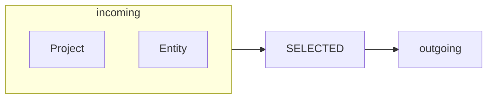
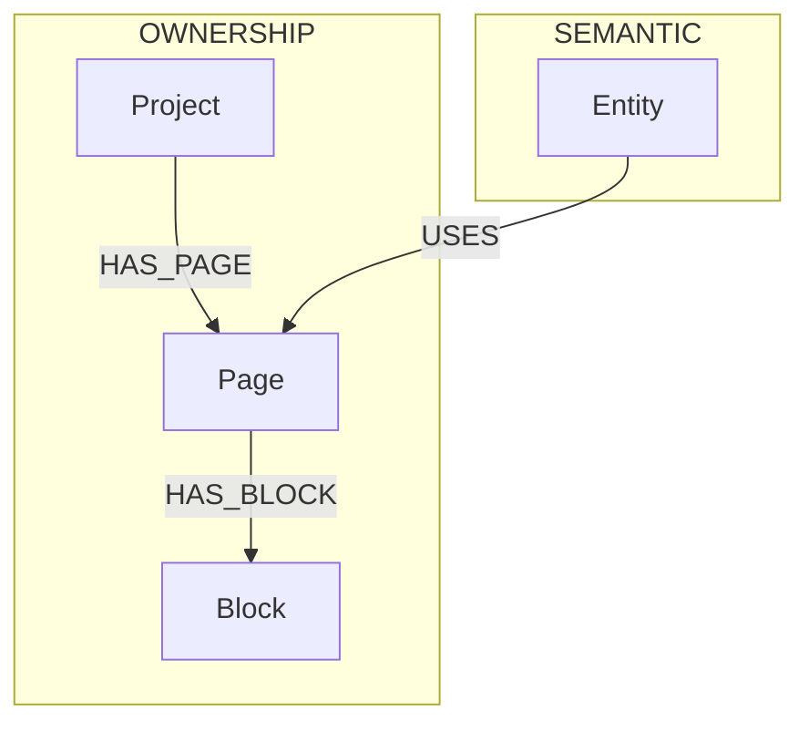
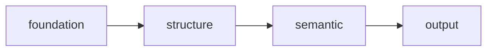
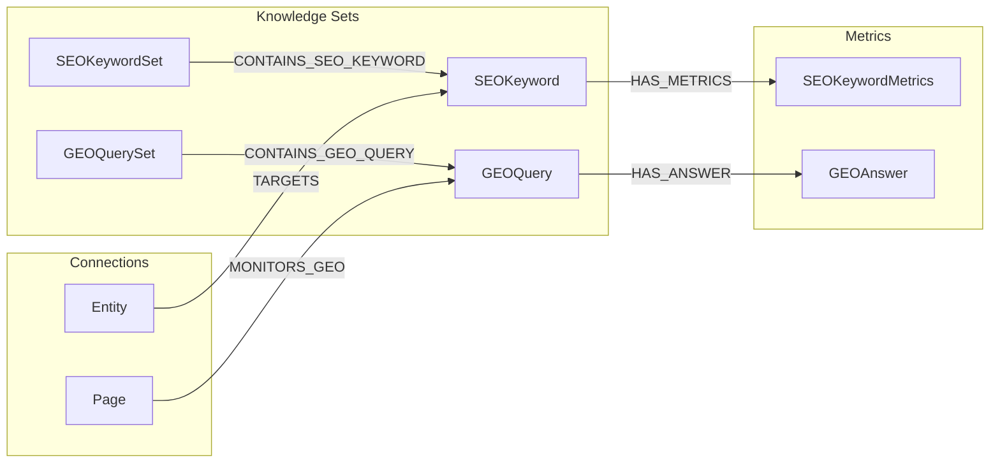
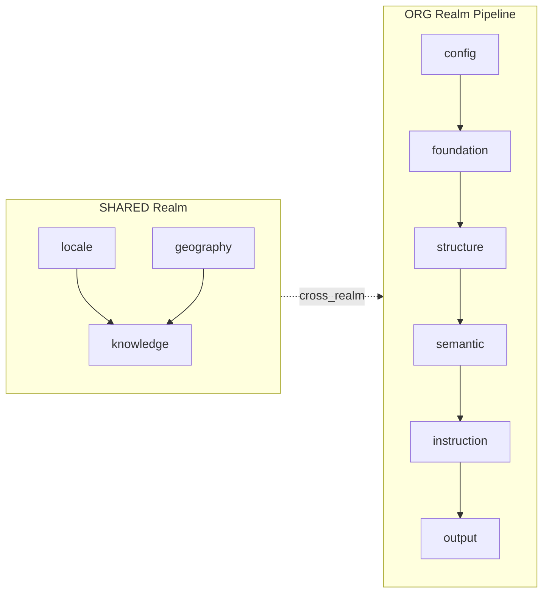

# Tabbed Detail Panel Design

**Version:** v1.0
**Date:** 2025-02-10
**Status:** Approved (Brainstorm Complete)

## Overview

Refonte du panel de détails de nodes dans NovaNet Studio avec:
- Interface à tabs pour densité d'information
- Parité structure avec TUI, design web-native
- Features avancées (Mermaid, Neo4j live, stats)

## Decisions

| Question | Choice |
|----------|--------|
| Objectif | D) Tout: Densité + Parité TUI + Features avancées |
| Structure tabs | B) 4 tabs: [Overview] [Data] [Graph] [Code] |
| Mermaid views | D) 3 switchables: Ego, Arc-type, Layer-flow |
| Code formats | B) 4 formats: JSON, YAML, Cypher, TypeScript |
| Parité TUI | AB) Structure identique + design web-adapté |

## Architecture

```
TabbedDetailPanel (wrapper principal)
├── TabBar (SegmentedTabs)
│   └── [Overview] [Data] [Graph] [Code]
│
├── OverviewTab
│   ├── HeaderCard (type badge, title, key + copy)
│   ├── ClassificationGrid (realm, layer, trait)
│   └── DescriptionBlock (description + llmContext)
│
├── DataTab
│   ├── StatsBar (incoming/outgoing/properties counts)
│   ├── PropertiesTable (key-value avec type badges)
│   └── PropertyCoverage (progress bar style TUI)
│
├── GraphTab
│   ├── ViewSwitcher [Ego] [Arcs] [Flow] [Context]
│   ├── MermaidDiagram (react-x-mermaid)
│   ├── ActionBar [Refresh] [Load More] [Expand] [Copy Query] [Run]
│   ├── QueryPanel (Cypher editor + status)
│   └── RelationsList (navigation cards)
│
└── CodeTab
    ├── FormatSwitcher [JSON] [YAML] [Cypher] [TS]
    └── CodeViewer (Prism syntax highlighting)
```

## Visual Design Language

Inspirations: Context7 + Perplexity + Magic UI

### Context7 Style
- Cards avec subtle border glow on hover
- Compact metadata badges (version, source, tokens)
- Monospace code avec copy-on-click

### Perplexity Style
- Answer cards avec gradient headers
- Source chips cliquables (→ relation cards)
- Streaming text animation (Cypher live)
- Floating action buttons

### Magic UI Style
- Glassmorphism panels (backdrop-blur)
- Gradient borders animés (pulse on selection)
- Bento grid layout pour Stats
- Shimmer loading states

### Design Tokens

```css
--panel-bg: hsl(240, 10%, 4%);      /* near-black */
--card-bg: hsl(240, 8%, 8%);        /* elevated surface */
--border: rgba(255,255,255, 0.06);  /* subtle */
--border-hover: rgba(primary, 0.4); /* glow effect */
--tab-active: gradient(primary → secondary);
--code-bg: hsl(240, 12%, 6%);       /* darker for contrast */
```

## Graph Tab — 3 Mermaid Views

### 1. Ego View (default)

Node au centre, voisins directs groupés par direction.

### 2. Arc-Type View

Groupé par ArcFamily (ownership, semantic, generation).

### 3. Layer-Flow View

Position du node dans le pipeline de layers.

### 4. Context View (NEW - Type-Specific)

Vue contextuelle selon le type de node, basée sur l'exploration des patterns de connexion:

#### Page Construction View
```mermaid
flowchart TB
  subgraph Structure
    Page -->|HAS_BLOCK| Block1[Block: hero]
    Page -->|HAS_BLOCK| Block2[Block: features]
    Block1 -->|FILLS_SLOT| CS1[ContentSlot]
    Block2 -->|FILLS_SLOT| CS2[ContentSlot]
  end
  subgraph Generation
    Page -->|HAS_GENERATED| PG[PageGenerated@fr-FR]
    Block1 -->|HAS_GENERATED| BG1[BlockGenerated]
  end
  subgraph Instructions
    Page -->|HAS_TYPE| PT[PageType]
    Block1 -->|HAS_PROMPT| BP[BlockPrompt]
  end
```

#### Entity Connections View
```mermaid
flowchart LR
  subgraph Classification
    Entity -->|BELONGS_TO| EC[EntityCategory]
  end
  subgraph Content
    Entity -->|HAS_CONTENT| ECont[EntityContent@fr-FR]
  end
  subgraph SEO
    Entity -->|TARGETS| SK[SEOKeyword]
    SK -->|IN_SET| SKS[SEOKeywordSet]
  end
  subgraph Usage
    Block -.->|USES_ENTITY| Entity
  end
```

#### Block Hierarchy View
```mermaid
flowchart TB
  subgraph Parent
    Page -->|HAS_BLOCK| Block
  end
  subgraph Block Content
    Block -->|FILLS_SLOT| CS[ContentSlot]
    Block -->|USES_ENTITY| Entity
  end
  subgraph Instructions
    Block -->|HAS_TYPE| BT[BlockType]
    Block -->|HAS_PROMPT| BP[BlockPrompt]
    BP -->|GENERATES| PA[PromptArtifact]
  end
  subgraph Output
    Block -->|HAS_GENERATED| BG[BlockGenerated@fr-FR]
  end
```

#### Project Overview View
```mermaid
flowchart TB
  subgraph Project Config
    OC[OrgConfig] -->|HAS_PROJECT| Project
    Project -->|HAS_BRAND| BI[BrandIdentity]
    Project -->|HAS_CONTENT| PC[ProjectContent@fr-FR]
  end
  subgraph Content Structure
    Project -->|HAS_PAGE| P1[Page: homepage]
    Project -->|HAS_PAGE| P2[Page: pricing]
    Project -->|HAS_ENTITY| E1[Entity: qr-code]
  end
  subgraph Localization
    Project -->|SUPPORTS_LOCALE| L1[Locale: fr-FR]
    Project -->|DEFAULT_LOCALE| L2[Locale: en-US]
  end
```

#### SEO/GEO Network View


#### Layer Flow View (Pipeline)


| Node Type | Context View | Key Arcs |
|-----------|--------------|----------|
| Page | Construction | HAS_BLOCK, HAS_GENERATED, HAS_TYPE |
| Entity | Connections | HAS_CONTENT, BELONGS_TO, TARGETS |
| Block | Hierarchy | FILLS_SLOT, HAS_PROMPT, USES_ENTITY |
| Project | Overview | HAS_PAGE, HAS_ENTITY, SUPPORTS_LOCALE |
| SEOKeyword | Network | IN_SET, HAS_METRICS, targeted by TARGETS |
| GEOQuery | Intelligence | IN_SET, HAS_ANSWER, MONITORS_GEO |
| Locale | Settings | HAS_STYLE, HAS_FORMATTING, FOR_LOCALE |
| BrandIdentity | Branding | BRAND_OF (inverse of HAS_BRAND) |

## Interactive Features

### Action Bar
```
[🔄 Refresh] [📥 Load More] [🔍 Expand] [📋 Copy Query] [▶️ Run]
```

- **Refresh**: Re-fetch depuis Neo4j
- **Load More**: +1 niveau de profondeur
- **Expand**: Fullscreen modal
- **Copy Query**: Cypher → clipboard
- **Run**: Execute live

### Neo4j Live Sync

```
┌─────────────────────────────────────────────────────────┐
│ ▼ Cypher Query                           [Edit] [Run]  │
│ ┌─────────────────────────────────────────────────────┐ │
│ │ MATCH (n:Page {key: "homepage"})-[r]-(m)            │ │
│ │ RETURN n, r, m LIMIT 25                             │ │
│ └─────────────────────────────────────────────────────┘ │
│ Status: ● Connected │ Last sync: 2s ago │ 4 nodes     │
└─────────────────────────────────────────────────────────┘
```

### View Modes
```
Mode: [Schema ◉] [Data ○] [Overlay ○]     Depth: [1] [2] [3]
```

- **Schema**: KIND relationships (meta-graph)
- **Data**: Vraies instances Neo4j
- **Overlay**: Schema + Data superposés
- **Depth**: 1/2/3 niveaux de neighbors

### Results Panel
```
┌─────────────────────────────────────────────────────────┐
│ Results (4 nodes, 3 relationships)     [Table] [Graph] │
│ ┌─────────────────────────────────────────────────────┐ │
│ │ n.key      │ type(r)     │ m.key        │ m.type   │ │
│ │ homepage   │ HAS_BLOCK   │ hero-section │ Block    │ │
│ │ homepage   │ HAS_CONTENT │ homepage@fr  │ PageGen  │ │
│ └─────────────────────────────────────────────────────┘ │
│ [← Prev] Page 1/1 [Next →]              [Export CSV]   │
└─────────────────────────────────────────────────────────┘
```

## Files to Create

| File | Purpose |
|------|---------|
| `components/sidebar/TabbedDetailPanel.tsx` | Main wrapper |
| `components/sidebar/tabs/OverviewTab.tsx` | Summary view |
| `components/sidebar/tabs/DataTab.tsx` | Properties + Stats |
| `components/sidebar/tabs/GraphTab.tsx` | Mermaid + Relations |
| `components/sidebar/tabs/CodeTab.tsx` | JSON/YAML/Cypher/TS |
| `components/sidebar/tabs/index.ts` | Barrel export |
| `components/graph/MermaidView.tsx` | Mermaid renderer |
| `components/graph/QueryPanel.tsx` | Cypher editor |
| `hooks/useNeo4jQuery.ts` | Neo4j live queries |

## Files to Modify

| File | Changes |
|------|---------|
| `stores/uiStore.ts` | Add `detailPanelTab` state |
| `app/page.tsx` | Replace NodeDetailsPanel with TabbedDetailPanel |

## Dependencies to Add

```bash
pnpm add mermaid react-x-mermaid
```

## Next Steps

1. [x] Explorer agents pour comprendre les patterns de connexion par type ✅
2. [ ] Implémenter TabbedDetailPanel wrapper
3. [ ] Créer les 4 tabs (Overview, Data, Graph, Code)
4. [ ] Intégrer Mermaid avec dark theme (react-x-mermaid)
5. [ ] Ajouter Neo4j live sync avec Cypher editor
6. [ ] Implémenter Context Views par type de node (8 types identifiés)
7. [ ] Ajouter action buttons (Refresh, Load More, Expand, Copy Query, Run)

## Exploration Results Summary

Les 10 agents d'exploration ont identifié:

- **114 arcs** répartis en 5 familles (ownership, localization, semantic, generation, mining)
- **8 patterns de Context Views** (Page, Entity, Block, Project, SEOKeyword, GEOQuery, Locale, BrandIdentity)
- **Layer pipeline**: config → foundation → structure → semantic → instruction → output
- **Cross-realm arcs**: shared/knowledge ↔ org/semantic (FOR_LOCALE, BELONGS_TO)
- **Composite keys**: `page:homepage@fr-FR`, `entity:qr-code@de-DE`
- **Studio patterns**: GraphStore avec maps indexées, TurboNode/FloatingEdge, LOD system
