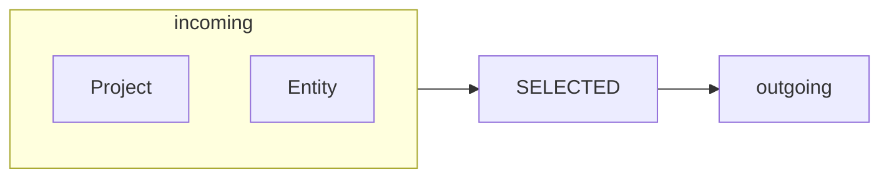
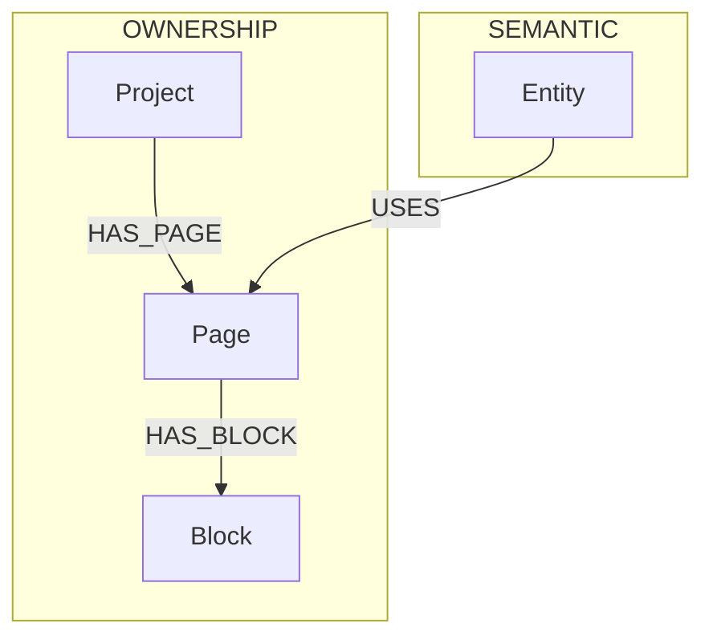
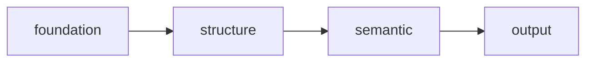
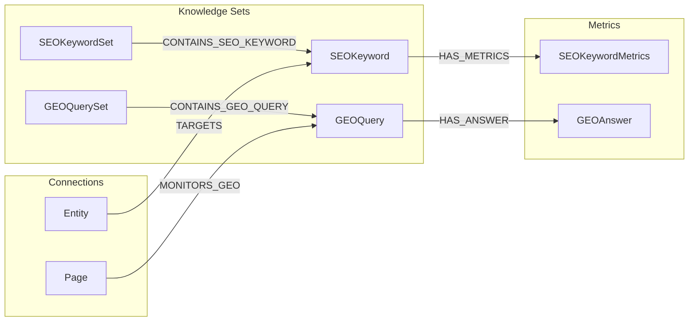
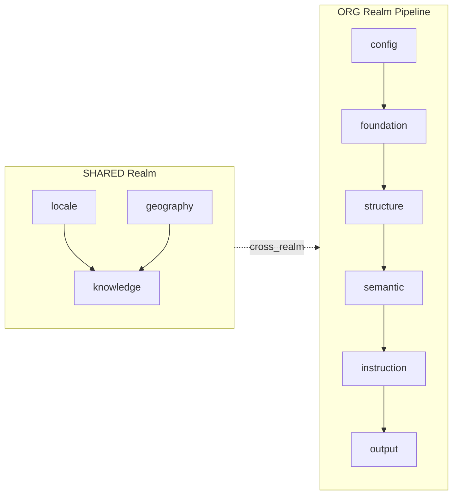
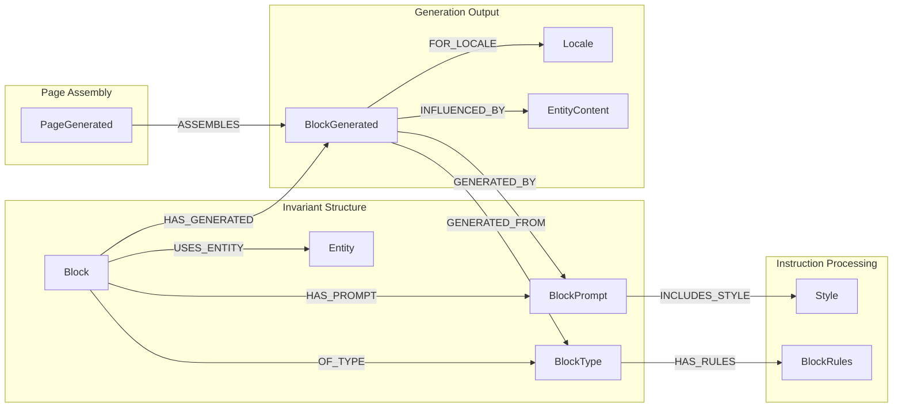
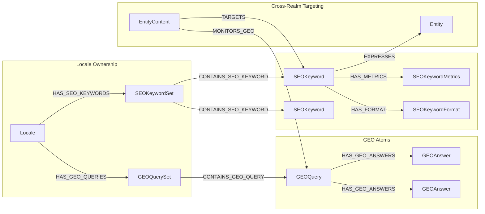
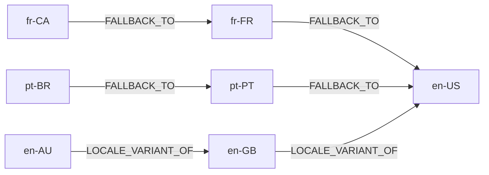
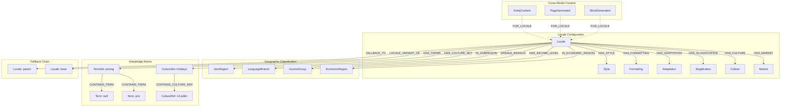

# Tabbed Detail Panel Design

**Version:** v1.0
**Date:** 2025-02-10
**Status:** Approved (Brainstorm Complete)

## Overview

Refonte du panel de détails de nodes dans NovaNet Studio avec:
- Interface à tabs pour densité d'information
- Parité structure avec TUI, design web-native
- Features avancées (Mermaid, Neo4j live, stats)

## Decisions

| Question | Choice |
|----------|--------|
| Objectif | D) Tout: Densité + Parité TUI + Features avancées |
| Structure tabs | B) 4 tabs: [Overview] [Data] [Graph] [Code] |
| Mermaid views | D) 3 switchables: Ego, Arc-type, Layer-flow |
| Code formats | B) 4 formats: JSON, YAML, Cypher, TypeScript |
| Parité TUI | AB) Structure identique + design web-adapté |

## Architecture

```
TabbedDetailPanel (wrapper principal)
├── TabBar (SegmentedTabs)
│   └── [Overview] [Data] [Graph] [Code]
│
├── OverviewTab
│   ├── HeaderCard (type badge, title, key + copy)
│   ├── ClassificationGrid (realm, layer, trait)
│   └── DescriptionBlock (description + llmContext)
│
├── DataTab
│   ├── StatsBar (incoming/outgoing/properties counts)
│   ├── PropertiesTable (key-value avec type badges)
│   └── PropertyCoverage (progress bar style TUI)
│
├── GraphTab
│   ├── ViewSwitcher [Ego] [Arcs] [Flow] [Context]
│   ├── MermaidDiagram (react-x-mermaid)
│   ├── ActionBar [Refresh] [Load More] [Expand] [Copy Query] [Run]
│   ├── QueryPanel (Cypher editor + status)
│   └── RelationsList (navigation cards)
│
└── CodeTab
    ├── FormatSwitcher [JSON] [YAML] [Cypher] [TS]
    └── CodeViewer (Prism syntax highlighting)
```

## Visual Design Language

Inspirations: Context7 + Perplexity + Magic UI

### Context7 Style
- Cards avec subtle border glow on hover
- Compact metadata badges (version, source, tokens)
- Monospace code avec copy-on-click

### Perplexity Style
- Answer cards avec gradient headers
- Source chips cliquables (→ relation cards)
- Streaming text animation (Cypher live)
- Floating action buttons

### Magic UI Style
- Glassmorphism panels (backdrop-blur)
- Gradient borders animés (pulse on selection)
- Bento grid layout pour Stats
- Shimmer loading states

### Design Tokens

```css
--panel-bg: hsl(240, 10%, 4%);      /* near-black */
--card-bg: hsl(240, 8%, 8%);        /* elevated surface */
--border: rgba(255,255,255, 0.06);  /* subtle */
--border-hover: rgba(primary, 0.4); /* glow effect */
--tab-active: gradient(primary → secondary);
--code-bg: hsl(240, 12%, 6%);       /* darker for contrast */
```

## Graph Tab — 3 Mermaid Views

### 1. Ego View (default)

Node au centre, voisins directs groupés par direction.

### 2. Arc-Type View

Groupé par ArcFamily (ownership, semantic, generation).

### 3. Layer-Flow View

Position du node dans le pipeline de layers.

### 4. Context View (NEW - Type-Specific)

Vue contextuelle selon le type de node, basée sur l'exploration des patterns de connexion:

#### Page Construction View
```mermaid
flowchart TB
  subgraph Structure
    Page -->|HAS_BLOCK| Block1[Block: hero]
    Page -->|HAS_BLOCK| Block2[Block: features]
    Block1 -->|FILLS_SLOT| CS1[ContentSlot]
    Block2 -->|FILLS_SLOT| CS2[ContentSlot]
  end
  subgraph Generation
    Page -->|HAS_GENERATED| PG[PageGenerated@fr-FR]
    Block1 -->|HAS_GENERATED| BG1[BlockGenerated]
  end
  subgraph Instructions
    Page -->|HAS_TYPE| PT[PageType]
    Block1 -->|HAS_PROMPT| BP[BlockPrompt]
  end
```

#### Entity Connections View
```mermaid
flowchart LR
  subgraph Classification
    Entity -->|BELONGS_TO| EC[EntityCategory]
  end
  subgraph Content
    Entity -->|HAS_CONTENT| ECont[EntityContent@fr-FR]
  end
  subgraph SEO
    Entity -->|TARGETS| SK[SEOKeyword]
    SK -->|IN_SET| SKS[SEOKeywordSet]
  end
  subgraph Usage
    Block -.->|USES_ENTITY| Entity
  end
```

#### Block Hierarchy View
```mermaid
flowchart TB
  subgraph Parent
    Page -->|HAS_BLOCK| Block
  end
  subgraph Block Content
    Block -->|FILLS_SLOT| CS[ContentSlot]
    Block -->|USES_ENTITY| Entity
  end
  subgraph Instructions
    Block -->|HAS_TYPE| BT[BlockType]
    Block -->|HAS_PROMPT| BP[BlockPrompt]
    BP -->|GENERATES| PA[PromptArtifact]
  end
  subgraph Output
    Block -->|HAS_GENERATED| BG[BlockGenerated@fr-FR]
  end
```

#### Project Overview View
```mermaid
flowchart TB
  subgraph Project Config
    OC[OrgConfig] -->|HAS_PROJECT| Project
    Project -->|HAS_BRAND| BI[BrandIdentity]
    Project -->|HAS_CONTENT| PC[ProjectContent@fr-FR]
  end
  subgraph Content Structure
    Project -->|HAS_PAGE| P1[Page: homepage]
    Project -->|HAS_PAGE| P2[Page: pricing]
    Project -->|HAS_ENTITY| E1[Entity: qr-code]
  end
  subgraph Localization
    Project -->|SUPPORTS_LOCALE| L1[Locale: fr-FR]
    Project -->|DEFAULT_LOCALE| L2[Locale: en-US]
  end
```

#### SEO/GEO Network View


#### Layer Flow View (Pipeline)


| Node Type | Context View | Key Arcs |
|-----------|--------------|----------|
| Page | Construction | HAS_BLOCK, HAS_GENERATED, HAS_TYPE |
| Entity | Connections | HAS_CONTENT, BELONGS_TO, TARGETS |
| Block | Hierarchy | FILLS_SLOT, HAS_PROMPT, USES_ENTITY |
| Project | Overview | HAS_PAGE, HAS_ENTITY, SUPPORTS_LOCALE |
| SEOKeyword | Network | IN_SET, HAS_METRICS, targeted by TARGETS |
| GEOQuery | Intelligence | IN_SET, HAS_ANSWER, MONITORS_GEO |
| Locale | Settings | HAS_STYLE, HAS_FORMATTING, FOR_LOCALE |
| BrandIdentity | Branding | BRAND_OF (inverse of HAS_BRAND) |

## Interactive Features

### Action Bar
```
[🔄 Refresh] [📥 Load More] [🔍 Expand] [📋 Copy Query] [▶️ Run]
```

- **Refresh**: Re-fetch depuis Neo4j
- **Load More**: +1 niveau de profondeur
- **Expand**: Fullscreen modal
- **Copy Query**: Cypher → clipboard
- **Run**: Execute live

### Neo4j Live Sync

```
┌─────────────────────────────────────────────────────────┐
│ ▼ Cypher Query                           [Edit] [Run]  │
│ ┌─────────────────────────────────────────────────────┐ │
│ │ MATCH (n:Page {key: "homepage"})-[r]-(m)            │ │
│ │ RETURN n, r, m LIMIT 25                             │ │
│ └─────────────────────────────────────────────────────┘ │
│ Status: ● Connected │ Last sync: 2s ago │ 4 nodes     │
└─────────────────────────────────────────────────────────┘
```

### View Modes
```
Mode: [Schema ◉] [Data ○] [Overlay ○]     Depth: [1] [2] [3]
```

- **Schema**: KIND relationships (meta-graph)
- **Data**: Vraies instances Neo4j
- **Overlay**: Schema + Data superposés
- **Depth**: 1/2/3 niveaux de neighbors

### Results Panel
```
┌─────────────────────────────────────────────────────────┐
│ Results (4 nodes, 3 relationships)     [Table] [Graph] │
│ ┌─────────────────────────────────────────────────────┐ │
│ │ n.key      │ type(r)     │ m.key        │ m.type   │ │
│ │ homepage   │ HAS_BLOCK   │ hero-section │ Block    │ │
│ │ homepage   │ HAS_CONTENT │ homepage@fr  │ PageGen  │ │
│ └─────────────────────────────────────────────────────┘ │
│ [← Prev] Page 1/1 [Next →]              [Export CSV]   │
└─────────────────────────────────────────────────────────┘
```

## Cypher Pill Component (Persistent)

La Cypher Pill est **toujours visible** en haut du canvas, montrant la query active qui "drive" la vue actuelle.

### Position & Layout
```
┌─────────────────────────────────────────────────────────────────────────────┐
│ ⚡ MATCH (p:Page)-[r]->(n) WHERE p.key = "homepage"... │ 12 │ 34 │ 45ms │ 📋 ▶ │
└─────────────────────────────────────────────────────────────────────────────┘
  │                                                        │    │    │      │  │
  query (truncated, hover=full)                          nodes arcs time  copy run

┌─────────────────────────────────────────────────────────────────────────────┐
│                              GRAPH CANVAS                                   │
│                         (avec Matrix overlay)                               │
└─────────────────────────────────────────────────────────────────────────────┘
```

### Pill States

| State | Appearance |
|-------|------------|
| **IDLE** | `⚡ Query... │ 12 │ 34 │ 45ms │ 📋 ▶` — query terminée, stats affichées |
| **LOADING** | `⚡ Query... │ ◐ Loading...` — spinner, Matrix rain active |
| **ERROR** | `✗ Neo4j connection timeout │ 🔄 Retry` — rouge, retry button |

### Interactions

- **Click query text** → expand en Cypher editor modal
- **📋 Copy** → copie la query complète dans clipboard
- **▶ Run** → re-execute la query (refresh)
- **Hover** → affiche query complète en tooltip

### CSS
```css
.cypher-pill {
  position: sticky;
  top: 0;
  z-index: 100;
  background: rgba(0, 0, 0, 0.8);
  backdrop-filter: blur(8px);
  border: 1px solid rgba(255, 255, 255, 0.1);
  border-radius: 8px;
  padding: 8px 16px;
  font-family: 'JetBrains Mono', monospace;
  font-size: 13px;
}

.cypher-pill.loading {
  border-color: var(--accent-color);
  animation: pillPulse 1.5s infinite;
}

.cypher-pill.error {
  border-color: var(--error-color);
  background: rgba(220, 38, 38, 0.1);
}
```

## Node Click → Aside Open Flow

Quand l'utilisateur clique sur une node dans le graph, l'Aside s'ouvre avec les tabs.

### Sequence
```
1. CLICK sur une Node dans le graph
       │
       ▼
2. NODE SELECTION EFFECTS activés
   ├── Border épais + glow pulse
   ├── Lévitation (translateY -8px)
   ├── Expanding rings
   ├── Space dust particles
   └── Hyperspace burst (0.5s)
       │
       ▼
3. ASIDE OUVRE (slide in from right, 0.3s)
   ├── Animation: translateX(100%) → translateX(0)
   └── Backdrop subtle blur sur le graph
       │
       ▼
4. TABS LOADED avec données de la node
   ├── [Overview] - active par défaut
   ├── [Data] - properties, stats
   ├── [Graph] - Mermaid views, Context views
   └── [Code] - JSON, YAML, Cypher, TS
       │
       ▼
5. CYPHER PILL UPDATE
   ├── Query pour charger les relations de la node
   └── Stats: incoming/outgoing arcs count
```

### Tab Navigation dans l'Aside
```
┌─────────────────────────────────────────────────────────────────┐
│  ✕ Close                                        Page: homepage  │
├─────────────────────────────────────────────────────────────────┤
│  [Overview]  [Data]  [Graph]  [Code]                            │
├─────────────────────────────────────────────────────────────────┤
│                                                                 │
│  Tab Content Area                                               │
│                                                                 │
│  ┌───────────────────────────────────────────────────────────┐  │
│  │                                                           │  │
│  │   (Contenu du tab actif)                                  │  │
│  │                                                           │  │
│  └───────────────────────────────────────────────────────────┘  │
│                                                                 │
└─────────────────────────────────────────────────────────────────┘
```

### Tab Content by Type

| Tab | Content | Data Source |
|-----|---------|-------------|
| **Overview** | Type badge, key, realm/layer/trait, description | Node metadata |
| **Data** | Properties table, stats (in/out arcs), coverage | Node properties + Cypher count |
| **Graph** | ViewSwitcher: [Ego] [Arcs] [Flow] [Context] | Cypher queries per view |
| **Code** | FormatSwitcher: [JSON] [YAML] [Cypher] [TS] | Serialized node data |

### Graph Tab — View Buttons

Quand on clique sur un bouton de vue dans le Graph tab :

```
┌─────────────────────────────────────────────────────────────────┐
│  [Ego ◉]  [Arcs ○]  [Flow ○]  [Context ▼]                      │
├─────────────────────────────────────────────────────────────────┤
│                                                                 │
│  Mermaid diagram ou liste de relations                          │
│                                                                 │
└─────────────────────────────────────────────────────────────────┘

Context dropdown (type-specific):
┌─────────────────────────┐
│ Page Construction       │  <- Pour nodes de type Page
│ Entity Connections      │  <- Pour nodes de type Entity
│ Block Hierarchy         │  <- Pour nodes de type Block
│ Project Overview        │  <- Pour nodes de type Project
│ SEO/GEO Network         │  <- Pour nodes SEO/GEO
│ Locale Settings         │  <- Pour nodes de type Locale
└─────────────────────────┘
```

### Context View Click → Graph Focus

Quand on clique sur un **Context View** button (ex: "Page Construction") :

```
1. ASIDE FERME (slide out)
2. GRAPH FOCUS avec Context View
   ├── Cypher Pill: nouvelle query
   ├── Matrix rain pendant loading
   └── HYBRID animation sur le graph
```

Ceci déclenche le flow décrit dans "Context View Transitions" ci-dessous.

---

## Context View Transitions

Flow complet quand l'utilisateur clique sur un Context View button (ex: "Page Context").

### Sequence
```
1. CLICK Context View button
       │
       ▼
2. ASIDE FERME (slide out, 0.3s ease-out)
       │
       ▼
3. CYPHER PILL UPDATE
   ├── Nouvelle query affichée
   └── State: LOADING (spinner)
       │
       ▼
4. MATRIX RAIN OVERLAY
   ├── Canvas overlay avec caractères qui tombent
   ├── Couleur: var(--accent-color) avec fade
   └── Opacity: 0.3 (ne cache pas le graph)
       │
       ▼
5. QUERY COMPLETE
   ├── Pill state: IDLE (stats affichées)
   └── Matrix rain fade out (0.3s)
       │
       ▼
6. HYBRID ANIMATION (Graph transformation)
   ├── Phase 1: Fade out nodes non-pertinentes (0.3s)
   ├── Phase 2: Remove nodes du DOM (0.2s)
   └── Phase 3: Re-layout centré force-directed (0.5s)
       │
       ▼
7. FOCUSED VIEW READY
   └── Graph filtré, focus node au centre
```

### Matrix Rain Effect
```css
.matrix-overlay {
  position: absolute;
  inset: 0;
  pointer-events: none;
  overflow: hidden;
  z-index: 50;
}

.matrix-char {
  position: absolute;
  color: var(--accent-color);
  font-family: 'JetBrains Mono', monospace;
  font-size: 14px;
  animation: matrixFall linear infinite;
  text-shadow: 0 0 10px var(--accent-color);
}

@keyframes matrixFall {
  0% { transform: translateY(-100%); opacity: 1; }
  90% { opacity: 1; }
  100% { transform: translateY(100vh); opacity: 0; }
}
```

### HYBRID Animation Timing
```javascript
const TRANSITION_TIMING = {
  asideClose: 300,      // ms - slide out
  queryExecute: 'async', // variable Neo4j response
  matrixFade: 300,      // ms - rain fade out
  nodeFadeOut: 300,     // ms - opacity 1 → 0
  nodeRemove: 200,      // ms - scale down + remove
  relayout: 500,        // ms - force-directed settle
  total: '~1.3s + query time'
};
```

## Node Selection Effects ("Waouh" Mode)

Effets visuels premium quand une node est sélectionnée/focus.

### État Normal vs Selected

```
NORMAL                              SELECTED (waouh mode)
┌─ ─ ─ ─ ─ ─ ─ ─┐                     ·  ✦  ·    ·  ✧  ·
│  📖 Geography  │                  ·    ·    ✦      ·    ·
│     6 types    │                ╔════════════════════════╗
└─ ─ ─ ─ ─ ─ ─ ─┘                ║ ┌────────────────────┐ ║
                                  ║ │  📖 Geography      │ ║
border: 2px dashed                ║ │     6 types        │ ║
shadow: subtle                    ║ └────────────────────┘ ║
transform: none                   ╚════════════════════════╝
                                     ·    ✧    ·    ·    ✦

                                  border: 4px solid + GLOW
                                  shadow: multi-layer glow
                                  transform: translateY(-8px)
                                  particles: space dust ✦ ✧
                                  rings: expanding opacity
```

### Effect 1: Border Épais + Glow Pulse

```css
.node-card {
  border: 2px dashed var(--layer-color);
  transition: all 0.4s cubic-bezier(0.34, 1.56, 0.64, 1);
}

.node-card.selected {
  border: 4px solid var(--layer-color);
  box-shadow:
    0 0 20px var(--layer-color),
    0 0 40px color-mix(in srgb, var(--layer-color) 50%, transparent),
    0 0 60px color-mix(in srgb, var(--layer-color) 25%, transparent);
  animation: borderGlow 1.5s ease-in-out infinite;
}

@keyframes borderGlow {
  0%, 100% {
    box-shadow:
      0 0 20px var(--layer-color),
      0 0 40px color-mix(in srgb, var(--layer-color) 50%, transparent);
  }
  50% {
    box-shadow:
      0 0 30px var(--layer-color),
      0 0 60px color-mix(in srgb, var(--layer-color) 50%, transparent),
      0 0 80px color-mix(in srgb, var(--layer-color) 25%, transparent);
  }
}
```

### Effect 2: Lévitation

```css
.node-card {
  transform: translateY(0);
  box-shadow: 0 4px 6px rgba(0, 0, 0, 0.1);
}

.node-card.selected {
  transform: translateY(-8px);
  box-shadow:
    0 20px 40px rgba(0, 0, 0, 0.3),
    0 0 60px color-mix(in srgb, var(--layer-color) 30%, transparent);
  transition: transform 0.4s cubic-bezier(0.34, 1.56, 0.64, 1); /* bounce */
}
```

### Effect 3: Expanding Border Rings

```css
.node-card.selected::before,
.node-card.selected::after {
  content: '';
  position: absolute;
  inset: -4px;
  border: 2px solid var(--layer-color);
  border-radius: inherit;
  opacity: 0;
  pointer-events: none;
}

.node-card.selected::before {
  animation: expandRing 2s ease-out infinite;
}

.node-card.selected::after {
  animation: expandRing 2s ease-out infinite 1s; /* staggered */
}

@keyframes expandRing {
  0% {
    transform: scale(1);
    opacity: 0.6;
  }
  100% {
    transform: scale(1.5);
    opacity: 0;
  }
}
```

### Effect 4: Space Dust Particles

```typescript
// SpaceDustParticles.tsx
const PARTICLE_COUNT = 25;
const PARTICLE_CHARS = ['✦', '✧', '·', '⋆', '∗'];

function SpaceDustParticles({ active, color }: Props) {
  return (
    <div className="space-dust-container">
      {active && Array.from({ length: PARTICLE_COUNT }).map((_, i) => (
        <span
          key={i}
          className="space-dust-particle"
          style={{
            left: `${Math.random() * 100}%`,
            animationDelay: `${Math.random() * 3}s`,
            animationDuration: `${2 + Math.random() * 2}s`,
            color: color,
          }}
        >
          {PARTICLE_CHARS[Math.floor(Math.random() * PARTICLE_CHARS.length)]}
        </span>
      ))}
    </div>
  );
}
```

```css
.space-dust-container {
  position: absolute;
  inset: -40px;
  pointer-events: none;
  overflow: hidden;
}

.space-dust-particle {
  position: absolute;
  font-size: 12px;
  opacity: 0;
  animation: spaceDust 3s ease-in-out infinite;
  text-shadow: 0 0 6px currentColor;
}

@keyframes spaceDust {
  0% {
    transform: translateY(20px) rotate(0deg);
    opacity: 0;
  }
  20% {
    opacity: 0.8;
  }
  80% {
    opacity: 0.8;
  }
  100% {
    transform: translateY(-40px) rotate(180deg);
    opacity: 0;
  }
}
```

### Effect 5: Hyperspace Streaks (Click Burst)

```css
.node-card.just-selected::before {
  content: '';
  position: absolute;
  inset: 50%;
  animation: hyperspaceBurst 0.5s ease-out forwards;
}

@keyframes hyperspaceBurst {
  0% {
    box-shadow:
      0 0 0 0 var(--layer-color),
      0 0 0 0 var(--layer-color),
      0 0 0 0 var(--layer-color);
    opacity: 1;
  }
  100% {
    box-shadow:
      100px 0 20px -10px transparent,
      -100px 0 20px -10px transparent,
      0 100px 20px -10px transparent,
      0 -100px 20px -10px transparent;
    opacity: 0;
  }
}
```

### Combined Effect Summary

| Effect | Trigger | Duration | Purpose |
|--------|---------|----------|---------|
| Border Glow | selected | infinite (1.5s loop) | Attention indicator |
| Lévitation | selected | 0.4s | Depth/importance |
| Expanding Rings | selected | infinite (2s loop) | Radar/pulse effect |
| Space Dust | selected | infinite (3s loop) | Premium feel |
| Hyperspace Burst | click moment | 0.5s once | Satisfying feedback |

### Performance Considerations

```css
/* GPU acceleration for smooth animations */
.node-card {
  will-change: transform, box-shadow;
  transform: translateZ(0); /* force GPU layer */
}

/* Reduce motion for accessibility */
@media (prefers-reduced-motion: reduce) {
  .node-card.selected {
    animation: none;
  }
  .node-card.selected::before,
  .node-card.selected::after {
    animation: none;
  }
  .space-dust-particle {
    display: none;
  }
}
```

## Files to Create

| File | Purpose |
|------|---------|
| `components/sidebar/TabbedDetailPanel.tsx` | Main wrapper |
| `components/sidebar/tabs/OverviewTab.tsx` | Summary view |
| `components/sidebar/tabs/DataTab.tsx` | Properties + Stats |
| `components/sidebar/tabs/GraphTab.tsx` | Mermaid + Relations |
| `components/sidebar/tabs/CodeTab.tsx` | JSON/YAML/Cypher/TS |
| `components/sidebar/tabs/index.ts` | Barrel export |
| `components/graph/MermaidView.tsx` | Mermaid renderer |
| `components/graph/QueryPanel.tsx` | Cypher editor |
| `components/graph/CypherPill.tsx` | Persistent query status bar (top) |
| `components/graph/MatrixRain.tsx` | Matrix rain overlay effect |
| `components/graph/SpaceDustParticles.tsx` | Selection particle effects |
| `components/nodes/NodeCard.tsx` | Enhanced node card with waouh effects |
| `hooks/useNeo4jQuery.ts` | Neo4j live queries |
| `hooks/useNodeSelection.ts` | Selection state + effects trigger |
| `hooks/useMatrixRain.ts` | Matrix rain animation state |

## Files to Modify

| File | Changes |
|------|---------|
| `stores/uiStore.ts` | Add `detailPanelTab` state |
| `app/page.tsx` | Replace NodeDetailsPanel with TabbedDetailPanel |

## Dependencies to Add

```bash
pnpm add mermaid react-x-mermaid
```

## Next Steps

1. [x] Explorer agents pour comprendre les patterns de connexion par type ✅
2. [ ] Implémenter TabbedDetailPanel wrapper
3. [ ] Créer les 4 tabs (Overview, Data, Graph, Code)
4. [ ] Intégrer Mermaid avec dark theme (react-x-mermaid)
5. [ ] Ajouter Neo4j live sync avec Cypher editor
6. [ ] Implémenter Context Views par type de node (8 types identifiés)
7. [ ] Ajouter action buttons (Refresh, Load More, Expand, Copy Query, Run)

## Exploration Results Summary

Les 10 agents d'exploration ont identifié:

- **114 arcs** répartis en 5 familles (ownership, localization, semantic, generation, mining)
- **8 patterns de Context Views** (Page, Entity, Block, Project, SEOKeyword, GEOQuery, Locale, BrandIdentity)
- **Layer pipeline**: config → foundation → structure → semantic → instruction → output
- **Cross-realm arcs**: shared/knowledge ↔ org/semantic (FOR_LOCALE, BELONGS_TO)
- **Composite keys**: `page:homepage@fr-FR`, `entity:qr-code@de-DE`
- **Studio patterns**: GraphStore avec maps indexées, TurboNode/FloatingEdge, LOD system

---

# APPENDIX A: Detailed Node Patterns

## A.1 Page Node — Complete Arc Network

### Node Definition
| Property | Value |
|----------|-------|
| **Realm** | org |
| **Layer** | structure |
| **Trait** | invariant |
| **Icon** | 🔷 |

### Page Properties
| Property | Type | Required | Example |
|----------|------|----------|---------|
| key | string | ✓ | `page-pricing` |
| slug | string | ✓ | `pricing` |
| display_name | string | ✓ | `Pricing Page` |
| description | string | ✓ | `Main pricing page` |
| llm_context | string | ✓ | `USE: orchestrate pricing...` |
| embedding | vector | ✗ | 1536-dim |

### Outgoing Arcs (Page →)
| Arc | Target | Family | Cardinality | Properties | Description |
|-----|--------|--------|-------------|------------|-------------|
| **OF_TYPE** | PageType | ownership | N:1 | — | Template defining layout rules |
| **HAS_BLOCK** | Block | ownership | 1:N | `position` (int) | Content blocks with ordering |
| **HAS_GENERATED** | PageGenerated | generation | 1:N | — | Generated outputs per locale |
| **HAS_PROMPT** | PagePrompt | ownership | 1:N | — | Orchestrator instructions |
| **USES_ENTITY** | Entity | semantic | N:N | `purpose`, `temperature` | Referenced entities |
| **LINKS_TO** | Page | semantic | N:N | `anchor_type`, `seo_weight` | Internal SEO links |
| **SUBTOPIC_OF** | Page | semantic | N:1 | — | Cluster→Pillar hierarchy |

### Incoming Arcs (→ Page)
| Arc | Source | Family | Cardinality | Description |
|-----|--------|--------|-------------|-------------|
| **HAS_PAGE** | Project | ownership | 1:N | Project owns pages |
| **BLOCK_OF** | Block | ownership | N:1 | Inverse of HAS_BLOCK |
| **LINKS_TO** | Page | semantic | N:N | Self-referential incoming |
| **REFERENCES_PAGE** | BlockInstruction | semantic | N:N | @link:key references |

### Complete Page Context Diagram
```mermaid
flowchart TB
  subgraph ownership[Ownership Family]
    Project -->|HAS_PAGE| Page
    Page -->|OF_TYPE| PageType
    Page -->|HAS_BLOCK| Block1[Block]
    Page -->|HAS_BLOCK| Block2[Block]
    Page -->|HAS_PROMPT| PagePrompt
  end

  subgraph generation[Generation Family]
    Page -->|HAS_GENERATED| PG1[PageGenerated@fr-FR]
    Page -->|HAS_GENERATED| PG2[PageGenerated@en-US]
    PG1 -->|FOR_LOCALE| L1[Locale: fr-FR]
    PG2 -->|FOR_LOCALE| L2[Locale: en-US]
    PG1 -->|ASSEMBLES| BG1[BlockGenerated]
  end

  subgraph semantic[Semantic Family]
    Page -->|USES_ENTITY| Entity
    Page -->|LINKS_TO| Page2[Page: about]
    Page -->|SUBTOPIC_OF| Pillar[Page: pillar]
  end

  subgraph instruction[Instruction Layer]
    PageType -->|HAS_RULES| PageRules
    Block1 -->|OF_TYPE| BlockType
    Block1 -->|HAS_PROMPT| BlockPrompt
  end
```

### Key Query Patterns
```cypher
-- Page with all blocks ordered
MATCH (p:Page {key: $key})-[r:HAS_BLOCK]->(b:Block)
RETURN p, b ORDER BY r.position

-- Page with generated output for locale
MATCH (p:Page {key: $key})-[:HAS_GENERATED]->(pg:PageGenerated)
      -[:FOR_LOCALE]->(l:Locale {key: $locale})
RETURN p, pg

-- Page pillar with cluster pages
MATCH (pillar:Page {key: $key})<-[:SUBTOPIC_OF]-(cluster:Page)
RETURN pillar, collect(cluster.key) AS clusters
```

---

## A.2 Entity Node — Complete Arc Network

### Node Definition
| Property | Value |
|----------|-------|
| **Realm** | org |
| **Layer** | semantic |
| **Trait** | invariant |
| **Icon** | 🔷 |

### Entity Properties
| Property | Type | Required | Example |
|----------|------|----------|---------|
| key | string | ✓ | `qr-code-generator` |
| display_name | string | ✓ | `QR Code Generator` |
| description | string | ✓ | `Tool for creating QR codes` |
| llm_context | string | ✓ | `USE: for QR code topics...` |
| is_pillar | boolean | ✗ | `true` |
| schema_org_type | string | ✗ | `Product` |
| embedding | vector | ✗ | 1536-dim |

### Outgoing Arcs (Entity →)
| Arc | Target | Family | Cardinality | Properties | Description |
|-----|--------|--------|-------------|------------|-------------|
| **HAS_CONTENT** | EntityContent | localization | 1:N | — | Localized content per locale |
| **BELONGS_TO** | EntityCategory | semantic | N:1 | — | Category classification (cross_realm) |
| **HAS_CHILD** | Entity | ownership | N:N | `position`, `featured` | URL hierarchy |
| **SUBTOPIC_OF** | Entity | ownership | N:1 | `depth` | Pillar hierarchy |
| **MATERIALIZES_AS** | Page | semantic | N:M | `role` | Entity→Page mapping |
| **TYPE_OF** | Entity | semantic | N:1 | `strength`, `temperature` | Taxonomy parent |
| **VARIANT_OF** | Entity | semantic | N:1 | `variant_type` | Variant of base |
| **INCLUDES** | Entity | semantic | 1:N | `containment_type` | Part-whole |
| **REQUIRES** | Entity | semantic | N:N | `dependency_type` | Dependencies |
| **ENABLES** | Entity | semantic | N:N | `enablement_type` | Unlocks |
| **SIMILAR_TO** | Entity | semantic | N:N | `similarity_type` | Symmetric |
| **COMPETES_WITH** | Entity | semantic | N:N | `competition_type` | Symmetric |
| **ALTERNATIVE_TO** | Entity | semantic | N:N | `alternative_type` | Symmetric |
| **ACTS_ON** | Entity | semantic | N:N | `operation_type` | ACTION→THING |
| **ENHANCES** | Entity | semantic | N:N | `enhancement_type` | FEATURE→THING |
| **POPULAR_IN** | GeoRegion | semantic | N:N | `weight` | Geographic relevance |

### Incoming Arcs (→ Entity)
| Arc | Source | Family | Cardinality | Description |
|-----|--------|--------|-------------|-------------|
| **HAS_ENTITY** | Project | ownership | 1:N | Project owns entities |
| **USES_ENTITY** | Page, Block | semantic | N:N | Content references |
| **EXPRESSES** | SEOKeyword | semantic | N:1 | Keyword→Entity mapping |
| **COMPARES_A/B** | SEOKeyword | semantic | N:1 | Comparison keywords |
| **USE_CASE_FOR** | SEOKeyword | semantic | N:1 | Preposition keywords |
| **INCLUDES_ENTITY** | PromptArtifact | generation | 1:N | Prompt context |

### Complete Entity Context Diagram
```mermaid
flowchart TB
  subgraph ownership[Ownership - Project]
    Project -->|HAS_ENTITY| Entity
  end

  subgraph classification[Classification - Cross Realm]
    Entity -->|BELONGS_TO| EC[EntityCategory]
    EC -.->|shared/config| note1[THING, FEATURE, ACTION, TOOL...]
  end

  subgraph localization[Localization]
    Entity -->|HAS_CONTENT| EC1[EntityContent@fr-FR]
    Entity -->|HAS_CONTENT| EC2[EntityContent@en-US]
    EC1 -->|FOR_LOCALE| L1[Locale: fr-FR]
  end

  subgraph seo[SEO Targeting]
    EC1 -->|TARGETS| SK1[SEOKeyword: générateur qr]
    EC1 -->|TARGETS| SK2[SEOKeyword: code qr]
    SK1 -->|EXPRESSES| Entity
  end

  subgraph semantic[Semantic Relations]
    Entity -->|TYPE_OF| Parent[Entity: parent]
    Entity -->|INCLUDES| Child[Entity: child]
    Entity -->|SIMILAR_TO| Similar[Entity: similar]
    Entity -->|COMPETES_WITH| Competitor[Entity: competitor]
  end

  subgraph usage[Content Usage]
    Page -.->|USES_ENTITY| Entity
    Block -.->|USES_ENTITY| Entity
  end

  subgraph geo[Geographic]
    Entity -->|POPULAR_IN| GR[GeoRegion: Europe]
  end
```

### 34 Direct Arcs Summary
| Category | Count | Key Arcs |
|----------|-------|----------|
| Intra-realm semantic | 30 | TYPE_OF, INCLUDES, REQUIRES, ENABLES, SIMILAR_TO... |
| Cross-realm | 7 | BELONGS_TO, POPULAR_IN, EXPRESSES, COMPARES_A/B... |
| Localization | 1 | HAS_CONTENT |
| Generation | 1 | INCLUDES_ENTITY |

---

## A.3 Block Node — Complete Arc Network

### Node Definition
| Property | Value |
|----------|-------|
| **Realm** | org |
| **Layer** | structure |
| **Trait** | invariant |
| **Icon** | 🔷 |

### Block Properties
| Property | Type | Required | Example |
|----------|------|----------|---------|
| key | string | ✓ | `block-pricing-hero` |
| display_name | string | ✓ | `Pricing Hero` |
| description | string | ✓ | `Hero section for pricing` |
| llm_context | string | ✓ | `USE: for hero sections...` |

### Outgoing Arcs (Block →)
| Arc | Target | Family | Cardinality | Properties | Description |
|-----|--------|--------|-------------|------------|-------------|
| **OF_TYPE** | BlockType | ownership | N:1 | — | Template reference |
| **HAS_GENERATED** | BlockGenerated | generation | 1:N | — | Generated per locale |
| **HAS_PROMPT** | BlockPrompt | ownership | 1:N | — | Instructions (versioned) |
| **USES_ENTITY** | Entity | semantic | N:N | `purpose`, `temperature` | Entity references |
| **FILLS_SLOT** | ContentSlot | semantic | N:N | `variant_id`, `traffic_allocation` | A/B testing |
| **TARGETS_PERSONA** | AudiencePersona | semantic | N:N | — | Audience targeting |

### Incoming Arcs (→ Block)
| Arc | Source | Family | Cardinality | Properties | Description |
|-----|--------|--------|-------------|------------|-------------|
| **HAS_BLOCK** | Page | ownership | 1:N | `position` | Parent page |
| **USED_BY** | Entity | semantic | N:N | — | Inverse of USES_ENTITY |

### Generation Pipeline


### BlockGenerated Properties
| Property | Type | Description |
|----------|------|-------------|
| key | string | `block:{block_key}@{locale_key}` |
| generated | json | LLM output matching BlockType.structure |
| status | enum | draft / approved / published |
| version | int | 1, 2, 3... |
| generated_at | datetime | Timestamp |

---

## A.4 Project Node — Complete Arc Network

### Node Definition
| Property | Value |
|----------|-------|
| **Realm** | org |
| **Layer** | foundation |
| **Trait** | invariant |
| **Icon** | 🏢 |

### Project Properties
| Property | Type | Required | Example |
|----------|------|----------|---------|
| key | string | ✓ | `project-qrcode-ai` |
| display_name | string | ✓ | `QR Code AI` |
| brand_name | string | ✓ | `QR Code AI` |
| website_url | string | ✗ | `https://qrcode-ai.com` |
| core_values | string[] | ✗ | `["Innovation", "Simplicity"]` |
| competitors | string[] | ✗ | `["QR Tiger", "Beaconstac"]` |

### Outgoing Arcs (Project →)
| Arc | Target | Family | Scope | Cardinality | Properties |
|-----|--------|--------|-------|-------------|------------|
| **BELONGS_TO_ORG** | OrgConfig | ownership | intra_realm | N:1 | — |
| **HAS_CONTENT** | ProjectContent | localization | intra_realm | 1:N | — |
| **HAS_BRAND_IDENTITY** | BrandIdentity | ownership | intra_realm | 1:1 | — |
| **HAS_ENTITY** | Entity | ownership | intra_realm | 1:N | — |
| **HAS_PAGE** | Page | ownership | intra_realm | 1:N | — |
| **SUPPORTS_LOCALE** | Locale | ownership | cross_realm | M:M | `status` |
| **DEFAULT_LOCALE** | Locale | ownership | cross_realm | N:1 | — |

### Incoming Arcs (→ Project)
| Arc | Source | Family | Description |
|-----|--------|--------|-------------|
| **HAS_PROJECT** | OrgConfig | ownership | Organization owns projects |

### Complete Project Context Diagram
```mermaid
flowchart TB
  subgraph org[Organization]
    OrgConfig -->|HAS_PROJECT| Project
  end

  subgraph brand[Branding]
    Project -->|HAS_BRAND_IDENTITY| BI[BrandIdentity]
    BI -.-> Colors[colors, fonts, style]
  end

  subgraph localization[Localization - Cross Realm]
    Project -->|SUPPORTS_LOCALE| L1[Locale: fr-FR]
    Project -->|SUPPORTS_LOCALE| L2[Locale: en-US]
    Project -->|DEFAULT_LOCALE| L2
    Project -->|HAS_CONTENT| PC1[ProjectContent@fr-FR]
    Project -->|HAS_CONTENT| PC2[ProjectContent@en-US]
    PC1 -->|FOR_LOCALE| L1
  end

  subgraph content[Content Structure]
    Project -->|HAS_PAGE| P1[Page: homepage]
    Project -->|HAS_PAGE| P2[Page: pricing]
    Project -->|HAS_PAGE| P3[Page: features]
    Project -->|HAS_ENTITY| E1[Entity: qr-generator]
    Project -->|HAS_ENTITY| E2[Entity: qr-customizer]
  end
```

### ProjectContent Properties (Localized)
| Property | Type | Description |
|----------|------|-------------|
| what_short | string | 50-word description |
| what_medium | string | 100-word description |
| tagline | string | 3-7 memorable words |
| pitch_one_liner | string | < 15 words |
| voice_personality | string[] | Tone adjectives |
| cta_primary | string | Main call-to-action |
| meta_description | string | SEO meta (< 160 chars) |

---

## A.5 SEO/GEO Nodes — Complete Arc Network

### Knowledge Atoms Pattern


### SEOKeyword Properties
| Property | Type | Description |
|----------|------|-------------|
| key | string | Unique keyword identifier |
| value | string | Keyword text |
| volume | int | Monthly search volume |
| difficulty | float | 0.0-1.0 ranking difficulty |
| traffic_potential | int | Estimated traffic |

### SEOKeywordFormat Types
| Format | Entity Links | Example |
|--------|--------------|---------|
| standard | ✗ | "QR code generator" |
| question | ✗ | "how to create QR code" |
| comparison | COMPARES_A/B | "QR code vs barcode" |
| preposition | USE_CASE_FOR | "QR code for events" |
| long_tail | ✗ | "best free online QR generator" |
| brand | EXPRESSES | "QR Code AI pricing" |
| local | ✗ | "QR code generator near me" |

### GEOAnswer Properties
| Property | Type | Description |
|----------|------|-------------|
| engine | enum | gemini, gpt, perplexity, claude |
| answer_text | string | LLM response text |
| cited_domains | string[] | Domains cited in response |
| brand_mentions | int | Brand mention count |
| relevance_score | float | 0.0-1.0 |
| observed_at | datetime | Observation timestamp |

---

## A.6 Locale Node — Complete Arc Network

### Node Definition
| Property | Value |
|----------|-------|
| **Realm** | shared |
| **Layer** | config |
| **Trait** | invariant |

### Locale Settings (1:1 Ownership)
| Arc | Target | Layer | Purpose |
|-----|--------|-------|---------|
| HAS_STYLE | Style | locale | Tone, formality, directness, warmth |
| HAS_FORMATTING | Formatting | locale | Dates, numbers, currency, time |
| HAS_ADAPTATION | Adaptation | locale | FACT vs ILLUSTRATION rules |
| HAS_SLUGIFICATION | Slugification | locale | URL slug generation rules |
| HAS_CULTURE | Culture | locale | Calendar, seasons, values |
| HAS_MARKET | Market | locale | Demographics, digital maturity |

### Geographic Classification
| Arc | Target | Purpose |
|-----|--------|---------|
| IN_SUBREGION | GeoRegion | Geographic region |
| SPEAKS_BRANCH | LanguageBranch | Language family |
| HAS_INCOME_LEVEL | IncomeGroup | World Bank income classification |
| HAS_LENDING_TYPE | LendingCategory | IBRD/IDA classification |
| IN_ECONOMIC_REGION | EconomicRegion | EAS/ECA/LAC/MENA/SSA/NA |
| IN_CULTURAL_SUBREALM | CulturalSubRealm | Cultural grouping |
| HAS_PRIMARY_POPULATION | PopulationCluster | Primary demographic |
| HAS_POPULATION | PopulationSubCluster | Demographics with % |

### Fallback Chains


### Knowledge Atoms (1:N by domain/register)
| Arc | Target | Properties | Purpose |
|-----|--------|------------|---------|
| HAS_TERMS | TermSet | `domain` | Domain-specific terminology |
| HAS_EXPRESSIONS | ExpressionSet | `register` | Register-specific phrases |
| HAS_PATTERNS | PatternSet | — | Usage patterns (titles, CTAs) |
| HAS_CULTURE_SET | CultureSet | `type` | Cultural references |
| HAS_TABOOS | TabooSet | `severity` | Taboo sets |
| HAS_AUDIENCE | AudienceSet | `segment` | Audience traits |

### Complete Locale Context Diagram


---

# APPENDIX B: Arc Statistics

## By Family
| Family | Count | Examples |
|--------|-------|----------|
| ownership | 43 | HAS_PAGE, HAS_BLOCK, HAS_CONTENT, OF_TYPE |
| semantic | 35 | USES_ENTITY, LINKS_TO, TYPE_OF, SIMILAR_TO |
| localization | 15 | FOR_LOCALE, FALLBACK_TO, HAS_STYLE |
| generation | 12 | HAS_GENERATED, GENERATED_BY, ASSEMBLES |
| mining | 9 | HAS_METRICS, HAS_GEO_ANSWERS |

## By Scope
| Scope | Count | Examples |
|-------|-------|----------|
| intra_realm | 97 | Most ownership/semantic arcs |
| cross_realm | 17 | FOR_LOCALE, BELONGS_TO, TARGETS, POPULAR_IN |

## By Cardinality
| Cardinality | Count | Examples |
|-------------|-------|----------|
| 1:1 | 8 | HAS_BRAND_IDENTITY, DEFAULT_LOCALE |
| 1:N | 45 | HAS_PAGE, HAS_BLOCK, HAS_CONTENT |
| N:1 | 28 | OF_TYPE, BELONGS_TO, CONTENT_OF |
| N:N | 33 | USES_ENTITY, SIMILAR_TO, LINKS_TO |

---

# APPENDIX C: Cypher Query Patterns for Context Views

## Page Context Query
```cypher
MATCH (p:Page {key: $key})
OPTIONAL MATCH (p)-[:OF_TYPE]->(pt:PageType)
OPTIONAL MATCH (p)-[hb:HAS_BLOCK]->(b:Block)-[:OF_TYPE]->(bt:BlockType)
OPTIONAL MATCH (p)-[:USES_ENTITY]->(e:Entity)
OPTIONAL MATCH (p)-[:HAS_GENERATED]->(pg:PageGenerated)-[:FOR_LOCALE]->(l:Locale)
OPTIONAL MATCH (p)-[:LINKS_TO]->(linked:Page)
OPTIONAL MATCH (p)-[:SUBTOPIC_OF]->(pillar:Page)
RETURN p, pt,
       collect(DISTINCT {block: b.key, type: bt.key, position: hb.position}) AS blocks,
       collect(DISTINCT e.key) AS entities,
       collect(DISTINCT {key: pg.key, locale: l.key}) AS generated,
       collect(DISTINCT linked.key) AS internal_links,
       pillar.key AS pillar_page
```

## Entity Context Query
```cypher
MATCH (e:Entity {key: $key})
OPTIONAL MATCH (e)-[:BELONGS_TO]->(cat:EntityCategory)
OPTIONAL MATCH (e)-[:HAS_CONTENT]->(ec:EntityContent)-[:FOR_LOCALE]->(l:Locale)
OPTIONAL MATCH (ec)-[:TARGETS]->(kw:SEOKeyword)-[:HAS_FORMAT]->(fmt:SEOKeywordFormat)
OPTIONAL MATCH (e)-[:TYPE_OF]->(parent:Entity)
OPTIONAL MATCH (e)<-[:TYPE_OF]-(child:Entity)
OPTIONAL MATCH (e)-[:SIMILAR_TO]-(similar:Entity)
OPTIONAL MATCH (e)-[:POPULAR_IN]->(region:GeoRegion)
RETURN e, cat.key AS category,
       collect(DISTINCT {content: ec.key, locale: l.key}) AS localized_content,
       collect(DISTINCT {keyword: kw.value, format: fmt.key}) AS seo_keywords,
       parent.key AS parent_type,
       collect(DISTINCT child.key) AS child_types,
       collect(DISTINCT similar.key) AS similar_entities,
       collect(DISTINCT region.key) AS popular_regions
```

## Block Context Query
```cypher
MATCH (b:Block {key: $key})
OPTIONAL MATCH (p:Page)-[hb:HAS_BLOCK]->(b)
OPTIONAL MATCH (b)-[:OF_TYPE]->(bt:BlockType)
OPTIONAL MATCH (b)-[:HAS_PROMPT]->(bp:BlockPrompt {active: true})
OPTIONAL MATCH (b)-[:USES_ENTITY]->(e:Entity)
OPTIONAL MATCH (b)-[:FILLS_SLOT]->(cs:ContentSlot)
OPTIONAL MATCH (b)-[:HAS_GENERATED]->(bg:BlockGenerated)-[:FOR_LOCALE]->(l:Locale)
RETURN b, p.key AS page, hb.position AS position,
       bt.key AS block_type,
       bp.prompt AS active_prompt,
       collect(DISTINCT e.key) AS entities,
       collect(DISTINCT cs.key) AS slots,
       collect(DISTINCT {key: bg.key, locale: l.key, status: bg.status}) AS generated
```

## Locale Context Query
```cypher
MATCH (l:Locale {key: $key})
OPTIONAL MATCH (l)-[:HAS_STYLE]->(style:Style)
OPTIONAL MATCH (l)-[:HAS_FORMATTING]->(fmt:Formatting)
OPTIONAL MATCH (l)-[:HAS_CULTURE]->(cult:Culture)
OPTIONAL MATCH (l)-[:IN_SUBREGION]->(region:GeoRegion)
OPTIONAL MATCH (l)-[:SPEAKS_BRANCH]->(branch:LanguageBranch)
OPTIONAL MATCH (l)-[:HAS_INCOME_LEVEL]->(income:IncomeGroup)
OPTIONAL MATCH (l)-[:FALLBACK_TO*0..3]->(fallback:Locale)
OPTIONAL MATCH (l)-[:HAS_TERMS {domain: 'pricing'}]->(ts:TermSet)-[:CONTAINS_TERM]->(t:Term)
RETURN l, style, fmt, cult,
       region.key AS geo_region,
       branch.key AS language_branch,
       income.key AS income_group,
       [fb IN collect(DISTINCT fallback.key) | fb] AS fallback_chain,
       collect(DISTINCT t.value) AS pricing_terms
```
