# Plan A: MVP 8 Phase 1 - Reasoning Capture

> Complete token tracking and reasoning capture in Nika v0.4.1

**Status:** Ready for Implementation
**Effort:** 2-3 hours
**Priority:** High (enables v0.4.1 release)
**Prerequisites:** MVP 7 complete (v0.4 released)

---

## Overview

```mermaid
%%{init: {'theme': 'base', 'themeVariables': {'lineColor': '#64748b'}}}%%
flowchart TD
    classDef done fill:#10b981,stroke:#059669,stroke-width:2px,color:#ffffff
    classDef inprogress fill:#f59e0b,stroke:#d97706,stroke-width:2px,color:#ffffff
    classDef todo fill:#ef4444,stroke:#dc2626,stroke-width:2px,color:#ffffff
    classDef info fill:#6366f1,stroke:#4f46e5,stroke-width:2px,color:#ffffff

    subgraph "Phase 1: Reasoning Capture"
        A[AgentTurnMetadata struct]:::done
        B[thinking: Option field]:::done
        C[run_claude_with_thinking]:::done
        D[StreamedAssistantContent::Reasoning]:::done
        E[Token tracking in streaming]:::todo
        F[Integration test]:::todo
        G[Documentation update]:::inprogress
    end

    A --> B --> C --> D --> E --> F --> G
```

Phase 1 of MVP 8 is 70% complete. The `AgentTurnMetadata` struct already has a `thinking: Option<String>` field, and `run_claude_with_thinking()` captures streaming reasoning blocks. What remains is fixing token counting in streaming mode and adding integration tests.



---

## Current State Analysis

### What's Done (70%)

| Component | File | Status |
|-----------|------|--------|
| `AgentTurnMetadata.thinking` | `event/log.rs:67` | ✅ Field exists |
| `with_usage()` helper | `event/log.rs` | ✅ Implemented |
| `has_thinking()` helper | `event/log.rs` | ✅ Implemented |
| `run_claude_with_thinking()` | `rig_agent_loop.rs:373-490` | ✅ Captures reasoning blocks |
| Streaming delta handling | `rig_agent_loop.rs` | ✅ ThinkingDelta → String |

### What's Missing (30%)

| Component | Issue | Fix Required |
|-----------|-------|--------------|
| Token counts | Always 0 in streaming mode | Accumulate from deltas |
| Integration test | None exists | Add `thinking_capture_test.rs` |
| CLAUDE.md | Mentions v0.4.1 | Document reasoning capture |

---

## Implementation Tasks

### Task 1: Fix Token Tracking (1 hour)

**File:** `nika-dev/tools/nika/src/runtime/rig_agent_loop.rs`

**Problem:** In streaming mode, `usage.input_tokens` and `usage.output_tokens` are 0 because the final `Usage` isn't available until stream completion.

**Solution:** Accumulate tokens from streaming deltas:

```rust
// Current (broken)
let usage = AgentTurnMetadata {
    input_tokens: 0,  // Always 0 in streaming
    output_tokens: 0,
    thinking: collected_thinking,
};

// Fixed
let mut input_tokens = 0;
let mut output_tokens = 0;

while let Some(delta) = stream.next().await {
    match delta {
        StreamedAssistantContent::Usage(u) => {
            input_tokens += u.input_tokens;
            output_tokens += u.output_tokens;
        }
        StreamedAssistantContent::Reasoning(r) => {
            thinking_buffer.push_str(&r.thinking);
        }
        // ...
    }
}

let usage = AgentTurnMetadata {
    input_tokens,
    output_tokens,
    thinking: Some(thinking_buffer),
};
```

### Task 2: Add Integration Test (1 hour)

**File:** `nika-dev/tools/nika/tests/thinking_capture_test.rs`

```rust
#[tokio::test]
#[ignore = "requires ANTHROPIC_API_KEY"]
async fn test_reasoning_capture_in_agent_turn() {
    // Arrange
    let workflow = parse_workflow(r#"
        schema: nika/workflow@0.4
        provider: claude
        tasks:
          - id: think_aloud
            agent:
              prompt: "Think step by step about why 2+2=4"
              max_turns: 1
    "#);

    // Act
    let events = run_workflow(workflow).await.unwrap();

    // Assert
    let agent_turn = events.iter()
        .find(|e| matches!(e.kind, EventKind::AgentTurnCompleted { .. }))
        .expect("Should have AgentTurnCompleted event");

    if let EventKind::AgentTurnCompleted { metadata, .. } = &agent_turn.kind {
        assert!(metadata.thinking.is_some(), "thinking should be captured");
        assert!(metadata.input_tokens > 0, "input_tokens should be non-zero");
        assert!(metadata.output_tokens > 0, "output_tokens should be non-zero");
    }
}
```

### Task 3: Update Documentation (30 min)

**Files to update:**
- `nika-dev/tools/nika/CLAUDE.md` - Add v0.4.1 section on reasoning capture
- `nika-dev/tools/nika/README.md` - Add example showing `thinking` in traces

---

## Execution Order

```mermaid
%%{init: {'theme': 'base', 'themeVariables': {'lineColor': '#64748b'}}}%%
gantt
    title Plan A: Reasoning Capture Timeline
    dateFormat HH:mm
    axisFormat %H:%M

    section TDD
    Write failing test for token tracking    :t1, 00:00, 15m
    Implement token accumulation             :t2, after t1, 30m
    Verify test passes                       :t3, after t2, 15m

    section Integration
    Write thinking_capture_test.rs           :t4, after t3, 45m
    Run with real API key                    :t5, after t4, 15m

    section Docs
    Update CLAUDE.md                         :t6, after t5, 20m
    Update README.md                         :t7, after t6, 10m
```



---

## Success Criteria

- [ ] All 621+ existing tests still pass
- [ ] New `thinking_capture_test.rs` passes with real API key
- [ ] Token counts are non-zero in streaming mode
- [ ] `nika trace show <id>` displays `thinking` content
- [ ] CLAUDE.md documents v0.4.1 reasoning capture

---

## Risks & Mitigations

| Risk | Impact | Mitigation |
|------|--------|------------|
| Claude API changes streaming format | Medium | Pin rig-core version, add schema validation |
| Token deltas not available in all modes | Low | Fall back to estimating from text length |
| Extended thinking adds latency | Low | Already captured, just needs storage |

---

## Files Changed

```
nika-dev/tools/nika/
├── src/runtime/rig_agent_loop.rs  # Token accumulation fix
├── tests/thinking_capture_test.rs # NEW: Integration test
├── CLAUDE.md                      # v0.4.1 documentation
└── README.md                      # Example with thinking
```

---

## Version Bump

After completion:
- `VERSION` → `0.4.1`
- `Cargo.toml` version → `0.4.1`
- Tag: `v0.4.1` with message "feat(agent): capture reasoning and fix token tracking"

---

## Next Phase Preview

After Phase 1, MVP 8 continues with:

| Phase | Feature | Effort |
|-------|---------|--------|
| **2** | Nested agents (`spawn_agent` tool) | 8-12h |
| **3** | Schema introspection (`novanet_introspect`) | 6-8h |
| **4** | Dynamic decomposition (`decompose:` modifier) | 10-14h |
| **5** | Lazy bindings (`lazy: true`) | 5-7h |

Phase 1 is the foundation - once reasoning is captured, nested agents (Phase 2) can share thinking chains.
