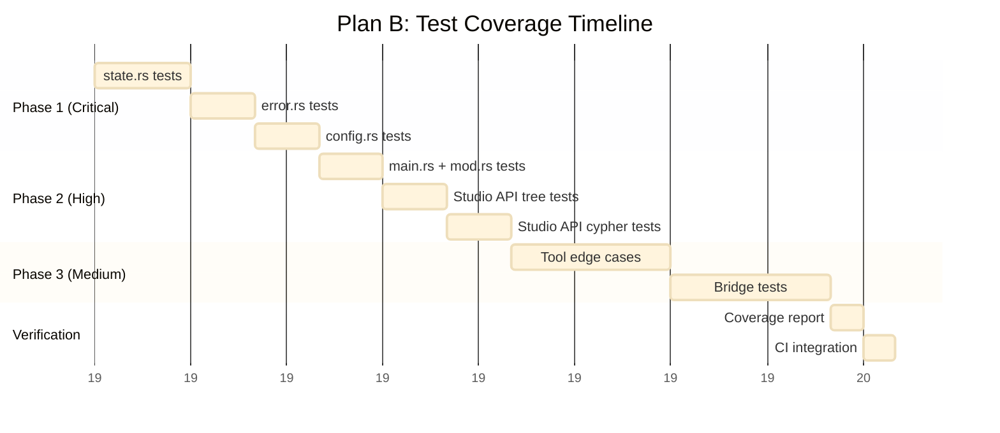
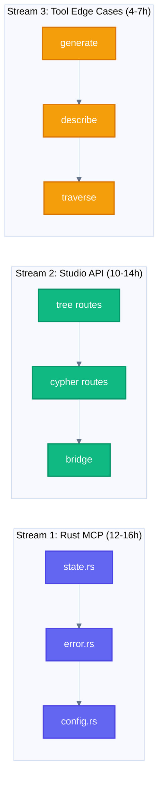

# Plan B: Fix Test Coverage Gaps

> Achieve 90%+ test coverage for NovaNet MCP Server and Studio API

**Status:** Ready for Implementation
**Effort:** 26-37 hours (can be parallelized)
**Priority:** Medium (improves reliability)
**Prerequisites:** None (independent work)

---

## Overview

NovaNet MCP Server has 65% test coverage with 8 files lacking tests. Studio API routes have partial coverage. This plan adds ~102 tests to achieve 90%+ coverage across both projects.

```mermaid
%%{init: {'theme': 'base', 'themeVariables': {'lineColor': '#64748b'}}}%%
flowchart TD
    classDef critical fill:#ef4444,stroke:#dc2626,stroke-width:2px,color:#ffffff
    classDef high fill:#f59e0b,stroke:#d97706,stroke-width:2px,color:#ffffff
    classDef medium fill:#6366f1,stroke:#4f46e5,stroke-width:2px,color:#ffffff
    classDef low fill:#10b981,stroke:#059669,stroke-width:2px,color:#ffffff

    subgraph "NovaNet MCP Server (40 tests needed)"
        A[state.rs - 114 lines]:::critical
        B[error.rs - 132 lines]:::critical
        C[config.rs - 101 lines]:::high
        D[main.rs - 35 lines]:::high
        E[mod.rs - 47 lines]:::high
        F[7 tool files - partial]:::medium
    end

    subgraph "Studio API (62 tests needed)"
        G[/api/tree - partial]:::high
        H[/api/filter - partial]:::high
        I[/api/cypher - security]:::critical
        J[/api/novanet - bridge]:::medium
    end

    subgraph "Target"
        K[90%+ Coverage]:::low
    end

    A & B & C & D & E & F --> K
    G & H & I & J --> K
```

---

## Current Coverage Analysis

### NovaNet MCP Server

**Location:** `novanet-dev/tools/novanet-mcp/`

| File | Lines | Tests | Coverage | Priority |
|------|-------|-------|----------|----------|
| `src/server/state.rs` | 114 | 0 | 0% | 🔴 CRITICAL |
| `src/error.rs` | 132 | 0 | 0% | 🔴 CRITICAL |
| `src/server/config.rs` | 101 | 0 | 0% | 🟡 HIGH |
| `src/main.rs` | 35 | 0 | 0% | 🟡 HIGH |
| `src/server/mod.rs` | 47 | 0 | 0% | 🟡 HIGH |
| `src/tools/*.rs` | ~800 | partial | ~60% | 🟢 MEDIUM |

**Tests Needed:** ~40

### Studio API Routes

**Location:** `novanet-dev/packages/studio/app/api/`

| Route | Tests | Coverage | Priority |
|-------|-------|----------|----------|
| `/api/tree/[id]/children` | 2 | 40% | 🟡 HIGH |
| `/api/filter/build` | 1 | 30% | 🟡 HIGH |
| `/api/cypher/execute` | 3 | 50% | 🔴 CRITICAL (security) |
| `/api/novanet/bridge` | 0 | 0% | 🟢 MEDIUM |
| Error responses | 0 | 0% | 🟡 HIGH |
| Edge cases | 0 | 0% | 🟢 MEDIUM |

**Tests Needed:** ~62

---

## Implementation Plan

### Phase 1: Critical Files (8-12 hours)

#### 1.1 state.rs Tests (3 hours)

**File:** `novanet-dev/tools/novanet-mcp/tests/state_test.rs`

```rust
// Test categories:
// 1. ServerState initialization
// 2. Neo4j connection handling
// 3. Tool registration
// 4. Concurrent access (parking_lot RwLock)

#[tokio::test]
async fn test_server_state_initializes_with_neo4j() {
    let config = McpConfig::test_default();
    let state = ServerState::new(config).await.unwrap();
    assert!(state.neo4j_client().is_connected());
}

#[tokio::test]
async fn test_server_state_registers_all_tools() {
    let state = ServerState::test_instance().await;
    let tools = state.list_tools();
    assert_eq!(tools.len(), 7);
    assert!(tools.iter().any(|t| t.name == "novanet_generate"));
}

#[tokio::test]
async fn test_concurrent_tool_access() {
    let state = Arc::new(ServerState::test_instance().await);
    let handles: Vec<_> = (0..10).map(|i| {
        let s = state.clone();
        tokio::spawn(async move {
            s.get_tool("novanet_describe").unwrap()
        })
    }).collect();

    for handle in handles {
        assert!(handle.await.is_ok());
    }
}
```

**Tests to add:** 12

#### 1.2 error.rs Tests (2 hours)

**File:** `novanet-dev/tools/novanet-mcp/tests/error_test.rs`

```rust
// Test categories:
// 1. Error code mapping
// 2. Error message formatting
// 3. Error conversion (From impls)
// 4. Serialization (MCP protocol)

#[test]
fn test_error_codes_are_unique() {
    let codes: HashSet<_> = NovanetMcpError::all_codes().collect();
    assert_eq!(codes.len(), NovanetMcpError::VARIANT_COUNT);
}

#[test]
fn test_neo4j_error_converts_correctly() {
    let neo4j_err = neo4j::Error::connection_failed("localhost");
    let mcp_err: NovanetMcpError = neo4j_err.into();
    assert!(matches!(mcp_err, NovanetMcpError::DatabaseConnection { .. }));
}

#[test]
fn test_error_serializes_to_mcp_format() {
    let err = NovanetMcpError::EntityNotFound { key: "qr-code".into() };
    let mcp_response = err.to_mcp_error();
    assert_eq!(mcp_response.code, -32001);
    assert!(mcp_response.message.contains("qr-code"));
}
```

**Tests to add:** 10

#### 1.3 config.rs Tests (2 hours)

**File:** `novanet-dev/tools/novanet-mcp/tests/config_test.rs`

```rust
// Test categories:
// 1. Environment variable parsing
// 2. Default values
// 3. Validation rules
// 4. Config file loading

#[test]
fn test_config_from_env_variables() {
    std::env::set_var("NOVANET_MCP_NEO4J_URI", "bolt://test:7687");
    let config = McpConfig::from_env().unwrap();
    assert_eq!(config.neo4j_uri, "bolt://test:7687");
}

#[test]
fn test_config_defaults_when_env_missing() {
    std::env::remove_var("NOVANET_MCP_NEO4J_URI");
    let config = McpConfig::from_env().unwrap();
    assert_eq!(config.neo4j_uri, "bolt://localhost:7687");
}

#[test]
fn test_config_validates_neo4j_uri_format() {
    let config = McpConfig { neo4j_uri: "invalid".into(), ..Default::default() };
    assert!(config.validate().is_err());
}
```

**Tests to add:** 8

### Phase 2: High Priority Files (6-8 hours)

#### 2.1 main.rs Tests (1 hour)

- CLI argument parsing
- Server startup sequence
- Graceful shutdown

**Tests to add:** 5

#### 2.2 mod.rs Tests (1 hour)

- Module exports
- Tool initialization
- Feature flags

**Tests to add:** 5

#### 2.3 Studio API Tests (4-6 hours)

**File:** `novanet-dev/packages/studio/__tests__/api/`

```typescript
// /api/tree/[id]/children
describe('GET /api/tree/[id]/children', () => {
  it('returns children for realm node', async () => {
    const res = await GET('/api/tree/realm:shared/children');
    expect(res.status).toBe(200);
    expect(res.json().children).toContainEqual(
      expect.objectContaining({ type: 'layer' })
    );
  });

  it('returns 404 for unknown node', async () => {
    const res = await GET('/api/tree/unknown:xyz/children');
    expect(res.status).toBe(404);
  });

  it('handles pagination correctly', async () => {
    const res = await GET('/api/tree/layer:knowledge/children?limit=5');
    expect(res.json().children.length).toBeLessThanOrEqual(5);
    expect(res.json().hasMore).toBeDefined();
  });
});

// /api/cypher/execute (CRITICAL - security)
describe('POST /api/cypher/execute', () => {
  it('executes read-only queries', async () => {
    const res = await POST('/api/cypher/execute', {
      query: 'MATCH (n:Entity) RETURN count(n)'
    });
    expect(res.status).toBe(200);
  });

  it('rejects write queries', async () => {
    const res = await POST('/api/cypher/execute', {
      query: 'CREATE (n:Test)'
    });
    expect(res.status).toBe(403);
    expect(res.json().error).toContain('read-only');
  });

  it('sanitizes injection attempts', async () => {
    const res = await POST('/api/cypher/execute', {
      query: "MATCH (n) WHERE n.name = 'x' OR 1=1 --'"
    });
    expect(res.status).toBe(400);
  });
});
```

**Tests to add:** 44

### Phase 3: Medium Priority (8-12 hours)

#### 3.1 Tool Files Enhancement (4-6 hours)

Add edge case tests to all 7 MCP tools:

| Tool | Missing Tests |
|------|---------------|
| `novanet_generate` | Empty forms array, invalid locale |
| `novanet_describe` | Non-existent entity, malformed key |
| `novanet_traverse` | Circular references, depth limits |
| `novanet_search` | Empty results, special characters |
| `novanet_atoms` | Missing domain, large result sets |
| `novanet_assemble` | Context overflow, missing refs |
| `novanet_query` | Complex filters, performance |

**Tests to add:** 21

#### 3.2 Studio API Bridge Tests (4-6 hours)

**File:** `novanet-dev/packages/studio/__tests__/api/novanet-bridge.test.ts`

- Subprocess spawning
- Timeout handling
- Error propagation
- JSON parsing edge cases

**Tests to add:** 18

---

## Execution Timeline



---

## Parallel Execution Option

These can be parallelized across 3 work streams:



**With 3 parallel streams:** 12-16 hours total (instead of 26-37 sequential)

---

## Success Criteria

- [ ] NovaNet MCP Server: 90%+ line coverage
- [ ] Studio API Routes: 85%+ line coverage
- [ ] All new tests follow TDD (written before implementation fixes)
- [ ] CI pipeline runs all tests on PR
- [ ] Coverage report generated and tracked

---

## Files Changed

```
novanet-dev/
├── tools/novanet-mcp/
│   ├── tests/
│   │   ├── state_test.rs          # NEW: 12 tests
│   │   ├── error_test.rs          # NEW: 10 tests
│   │   ├── config_test.rs         # NEW: 8 tests
│   │   ├── main_test.rs           # NEW: 5 tests
│   │   └── tools/                 # Enhanced: 21 tests
│   └── src/
│       └── lib.rs                 # Test helpers
├── packages/studio/
│   ├── __tests__/api/
│   │   ├── tree.test.ts           # Enhanced: 15 tests
│   │   ├── cypher.test.ts         # Enhanced: 12 tests
│   │   ├── filter.test.ts         # Enhanced: 10 tests
│   │   └── novanet-bridge.test.ts # NEW: 18 tests
│   └── jest.config.js             # Coverage thresholds
└── .github/workflows/ci.yml       # Coverage gates
```

---

## Test Infrastructure Improvements

### 1. Test Fixtures

Create shared fixtures in `tests/fixtures/`:

```rust
// novanet-dev/tools/novanet-mcp/tests/fixtures/mod.rs
pub fn mock_neo4j_client() -> MockNeo4jClient {
    MockNeo4jClient::new()
        .with_entity("qr-code", entity_fixture())
        .with_locale("fr-FR", locale_fixture())
}

pub fn entity_fixture() -> Entity {
    Entity {
        key: "qr-code".into(),
        display_name: "QR Code".into(),
        // ...
    }
}
```

### 2. Coverage Gates

Add to CI pipeline:

```yaml
# .github/workflows/ci.yml
- name: Check coverage
  run: |
    cargo llvm-cov --workspace --lcov --output-path lcov.info
    # Fail if under 90%
    cargo llvm-cov report --fail-under 90
```

### 3. Snapshot Testing

For complex MCP responses:

```rust
#[test]
fn test_generate_response_format() {
    let response = novanet_generate(params).unwrap();
    insta::assert_yaml_snapshot!(response);
}
```

---

## Risks & Mitigations

| Risk | Impact | Mitigation |
|------|--------|------------|
| Tests slow down CI | Medium | Use test parallelization, mock heavy deps |
| Flaky Neo4j tests | High | Use testcontainers or in-memory mode |
| API tests need auth | Low | Add test auth bypass for CI |
| Coverage gaming | Low | Focus on behavior tests, not line coverage |

---

## Next Steps After Completion

1. **Enable coverage gates** in GitHub Actions
2. **Add coverage badges** to README
3. **Document test patterns** in CONTRIBUTING.md
4. **Schedule mutation testing** for critical paths
