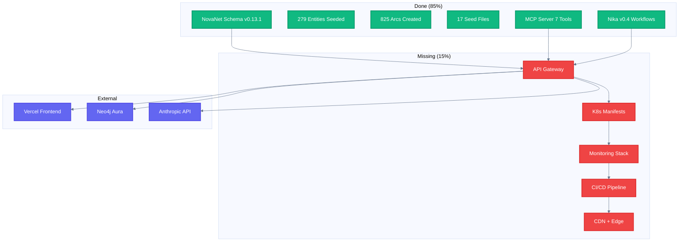
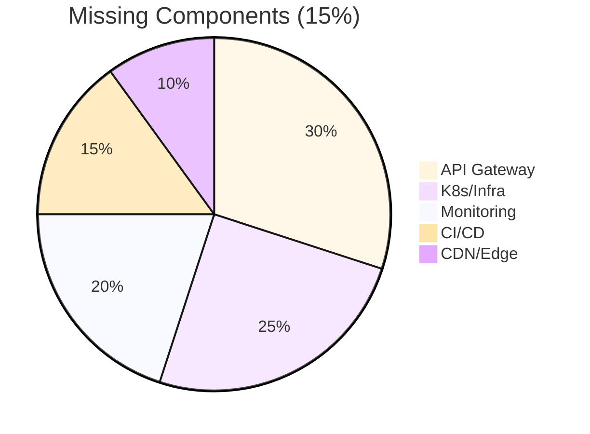
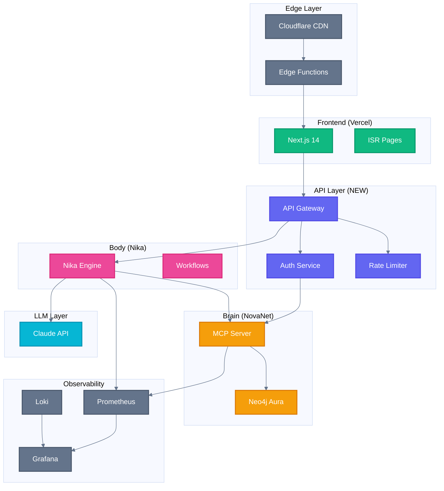
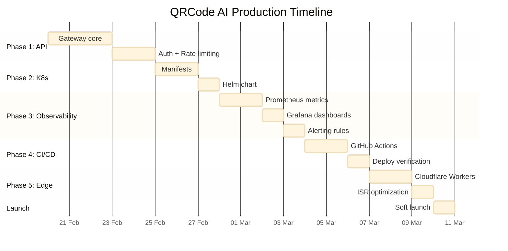

# Plan C: QRCode AI Production Deployment

> Deploy qrcode-ai.com with NovaNet + Nika integration

**Status:** 85% Ready - Missing Production Infrastructure
**Effort:** 40-60 hours (phased over 2-3 weeks)
**Priority:** Strategic (product launch)
**Prerequisites:** MVP 7 complete, Neo4j running

---

## Executive Summary

QRCode AI (https://qrcode-ai.com) is 85% production-ready. The knowledge graph is seeded with 279 entities and 825 arcs across 17 phased files. What's missing is the production infrastructure: API layer, Kubernetes deployment, monitoring, and CI/CD pipeline.



---

## Current State

### What's Complete

#### Knowledge Graph (279 Entities)

| Category | Count | Examples |
|----------|-------|----------|
| QR Code Types | 12 | Static, Dynamic, Artistic, vCard |
| Use Cases | 45 | Restaurant Menu, Event Tickets, Product Auth |
| Industries | 28 | Retail, Healthcare, Hospitality |
| Features | 34 | Logo Embedding, Color Customization, Analytics |
| Integrations | 22 | Shopify, WordPress, Zapier |
| Locales | 18 | en-US, fr-FR, de-DE, es-ES, ja-JP... |
| Pages | 67 | Landing, Pricing, Features, Use Cases |
| Blocks | 53 | Hero, CTA, FAQ, Testimonial |

#### Seed Files (17 Phased)

```
novanet-dev/packages/db/seed/entities/
├── qrcode-ai-phase1-core.cypher       # Core entities
├── qrcode-ai-phase2-types.cypher      # QR code types
├── qrcode-ai-phase3-usecases.cypher   # Use cases
├── qrcode-ai-phase4-industries.cypher # Industry verticals
├── qrcode-ai-phase5-features.cypher   # Product features
├── qrcode-ai-phase6-integrations.cypher
├── qrcode-ai-phase7-pages-en.cypher   # English pages
├── qrcode-ai-phase8-pages-fr.cypher   # French pages
├── qrcode-ai-phase9-seo-en.cypher     # SEO keywords
├── qrcode-ai-phase10-seo-fr.cypher
├── ... (7 more phases)
└── qrcode-ai-phase17-final.cypher     # Final relationships
```

#### MCP Tools Ready

| Tool | QRCode AI Usage |
|------|-----------------|
| `novanet_generate` | Generate page content for all locales |
| `novanet_describe` | Get entity details for QR type pages |
| `novanet_traverse` | Navigate use case → industry relationships |
| `novanet_atoms` | Retrieve terminology sets |
| `novanet_search` | Find entities by keyword |
| `novanet_assemble` | Build page context |
| `novanet_query` | Complex filtering |

### What's Missing



---

## Architecture Target



---

## Implementation Phases

### Phase 1: API Gateway (12-16 hours)

Create a thin API layer that wraps NovaNet MCP and Nika workflows.

#### 1.1 Gateway Service

**Tech:** Rust + Axum (consistent with NovaNet/Nika)

**File:** `qrcode-ai/api-gateway/`

```rust
// src/main.rs
#[tokio::main]
async fn main() {
    let app = Router::new()
        .route("/api/v1/generate", post(generate_content))
        .route("/api/v1/pages/:slug", get(get_page))
        .route("/api/v1/entities/:key", get(get_entity))
        .route("/api/v1/search", get(search))
        .layer(AuthLayer::new())
        .layer(RateLimitLayer::new(100, Duration::from_secs(60)));

    axum::serve(listener, app).await.unwrap();
}

async fn generate_content(
    State(state): State<AppState>,
    Json(params): Json<GenerateParams>,
) -> Result<Json<GenerateResponse>, ApiError> {
    // Call NovaNet MCP
    let context = state.mcp_client
        .call("novanet_generate", params.to_mcp_params())
        .await?;

    // Run Nika workflow if needed
    if params.workflow.is_some() {
        let result = state.nika_runner
            .run(params.workflow.unwrap(), context)
            .await?;
        return Ok(Json(result.into()));
    }

    Ok(Json(context.into()))
}
```

#### 1.2 Authentication

**Strategy:** API keys for external, JWT for internal

```rust
pub enum AuthStrategy {
    ApiKey { key: String, rate_limit: u32 },
    Jwt { claims: Claims },
    Internal { service: String },
}

impl AuthStrategy {
    pub async fn verify(headers: &HeaderMap) -> Result<Self, AuthError> {
        if let Some(api_key) = headers.get("X-Api-Key") {
            return Self::verify_api_key(api_key).await;
        }
        if let Some(bearer) = headers.get("Authorization") {
            return Self::verify_jwt(bearer).await;
        }
        Err(AuthError::MissingCredentials)
    }
}
```

#### 1.3 Rate Limiting

**Strategy:** Token bucket per API key

```rust
pub struct RateLimiter {
    buckets: DashMap<String, TokenBucket>,
    default_rate: u32,
    default_burst: u32,
}

impl RateLimiter {
    pub fn check(&self, key: &str) -> Result<(), RateLimitError> {
        let bucket = self.buckets
            .entry(key.to_string())
            .or_insert_with(|| TokenBucket::new(self.default_rate, self.default_burst));

        if bucket.try_acquire() {
            Ok(())
        } else {
            Err(RateLimitError::TooManyRequests {
                retry_after: bucket.time_to_next_token(),
            })
        }
    }
}
```

### Phase 2: Kubernetes Deployment (8-12 hours)

#### 2.1 K8s Manifests

**Location:** `qrcode-ai/k8s/`

```yaml
# deployment.yaml
apiVersion: apps/v1
kind: Deployment
metadata:
  name: qrcode-ai-api
spec:
  replicas: 3
  selector:
    matchLabels:
      app: qrcode-ai-api
  template:
    spec:
      containers:
        - name: api-gateway
          image: ghcr.io/supernovae-st/qrcode-ai-api:latest
          ports:
            - containerPort: 8080
          env:
            - name: NOVANET_MCP_URL
              valueFrom:
                secretKeyRef:
                  name: qrcode-ai-secrets
                  key: mcp-url
            - name: ANTHROPIC_API_KEY
              valueFrom:
                secretKeyRef:
                  name: qrcode-ai-secrets
                  key: anthropic-key
          resources:
            limits:
              memory: "512Mi"
              cpu: "500m"
            requests:
              memory: "256Mi"
              cpu: "250m"
          livenessProbe:
            httpGet:
              path: /health
              port: 8080
            initialDelaySeconds: 5
          readinessProbe:
            httpGet:
              path: /ready
              port: 8080
---
# service.yaml
apiVersion: v1
kind: Service
metadata:
  name: qrcode-ai-api
spec:
  selector:
    app: qrcode-ai-api
  ports:
    - port: 80
      targetPort: 8080
  type: ClusterIP
---
# ingress.yaml
apiVersion: networking.k8s.io/v1
kind: Ingress
metadata:
  name: qrcode-ai-api
  annotations:
    kubernetes.io/ingress.class: nginx
    cert-manager.io/cluster-issuer: letsencrypt-prod
spec:
  tls:
    - hosts:
        - api.qrcode-ai.com
      secretName: qrcode-ai-tls
  rules:
    - host: api.qrcode-ai.com
      http:
        paths:
          - path: /
            pathType: Prefix
            backend:
              service:
                name: qrcode-ai-api
                port:
                  number: 80
```

#### 2.2 Helm Chart

```yaml
# Chart.yaml
apiVersion: v2
name: qrcode-ai
version: 0.1.0
appVersion: "1.0.0"

# values.yaml
replicaCount: 3

image:
  repository: ghcr.io/supernovae-st/qrcode-ai-api
  tag: latest

resources:
  limits:
    memory: 512Mi
    cpu: 500m

autoscaling:
  enabled: true
  minReplicas: 2
  maxReplicas: 10
  targetCPUUtilizationPercentage: 70

novanet:
  mcpUrl: "http://novanet-mcp:8080"

neo4j:
  uri: "neo4j+s://xxx.databases.neo4j.io"
```

### Phase 3: Monitoring Stack (8-10 hours)

#### 3.1 Prometheus Metrics

```rust
// src/metrics.rs
use prometheus::{Counter, Histogram, Registry};

lazy_static! {
    pub static ref API_REQUESTS: Counter = Counter::new(
        "qrcode_ai_api_requests_total",
        "Total API requests"
    ).unwrap();

    pub static ref API_LATENCY: Histogram = Histogram::with_opts(
        HistogramOpts::new("qrcode_ai_api_latency_seconds", "API latency")
            .buckets(vec![0.01, 0.05, 0.1, 0.25, 0.5, 1.0, 2.5, 5.0])
    ).unwrap();

    pub static ref MCP_CALLS: Counter = Counter::new(
        "qrcode_ai_mcp_calls_total",
        "Total MCP tool calls"
    ).unwrap();

    pub static ref LLM_TOKENS: Counter = Counter::new(
        "qrcode_ai_llm_tokens_total",
        "Total LLM tokens used"
    ).unwrap();
}
```

#### 3.2 Grafana Dashboards

```json
{
  "dashboard": {
    "title": "QRCode AI Production",
    "panels": [
      {
        "title": "Request Rate",
        "type": "graph",
        "targets": [
          { "expr": "rate(qrcode_ai_api_requests_total[5m])" }
        ]
      },
      {
        "title": "P99 Latency",
        "type": "stat",
        "targets": [
          { "expr": "histogram_quantile(0.99, rate(qrcode_ai_api_latency_seconds_bucket[5m]))" }
        ]
      },
      {
        "title": "Error Rate",
        "type": "graph",
        "targets": [
          { "expr": "rate(qrcode_ai_api_errors_total[5m])" }
        ]
      },
      {
        "title": "LLM Token Usage",
        "type": "stat",
        "targets": [
          { "expr": "increase(qrcode_ai_llm_tokens_total[24h])" }
        ]
      }
    ]
  }
}
```

#### 3.3 Alerting Rules

```yaml
# alerts.yaml
groups:
  - name: qrcode-ai
    rules:
      - alert: HighErrorRate
        expr: rate(qrcode_ai_api_errors_total[5m]) > 0.1
        for: 5m
        labels:
          severity: critical
        annotations:
          summary: "High error rate on QRCode AI API"

      - alert: HighLatency
        expr: histogram_quantile(0.99, rate(qrcode_ai_api_latency_seconds_bucket[5m])) > 2
        for: 5m
        labels:
          severity: warning
        annotations:
          summary: "P99 latency exceeds 2 seconds"

      - alert: LLMQuotaWarning
        expr: increase(qrcode_ai_llm_tokens_total[24h]) > 900000
        labels:
          severity: warning
        annotations:
          summary: "Approaching daily LLM token limit"
```

### Phase 4: CI/CD Pipeline (6-8 hours)

#### 4.1 GitHub Actions

```yaml
# .github/workflows/deploy.yml
name: Deploy QRCode AI

on:
  push:
    branches: [main]
    paths:
      - 'qrcode-ai/**'

jobs:
  build:
    runs-on: ubuntu-latest
    steps:
      - uses: actions/checkout@v4

      - name: Build Docker image
        run: |
          docker build -t ghcr.io/supernovae-st/qrcode-ai-api:${{ github.sha }} .

      - name: Push to GHCR
        run: |
          echo ${{ secrets.GITHUB_TOKEN }} | docker login ghcr.io -u ${{ github.actor }} --password-stdin
          docker push ghcr.io/supernovae-st/qrcode-ai-api:${{ github.sha }}

  deploy:
    needs: build
    runs-on: ubuntu-latest
    steps:
      - name: Deploy to K8s
        uses: azure/k8s-deploy@v4
        with:
          manifests: |
            k8s/deployment.yaml
            k8s/service.yaml
          images: |
            ghcr.io/supernovae-st/qrcode-ai-api:${{ github.sha }}

      - name: Verify deployment
        run: |
          kubectl rollout status deployment/qrcode-ai-api
```

### Phase 5: CDN & Edge (6-8 hours)

#### 5.1 Cloudflare Workers

```typescript
// workers/cache-api.ts
export default {
  async fetch(request: Request, env: Env): Promise<Response> {
    const url = new URL(request.url);

    // Cache GET requests for 1 hour
    if (request.method === "GET") {
      const cacheKey = new Request(url.toString(), request);
      const cache = caches.default;

      let response = await cache.match(cacheKey);
      if (response) {
        return response;
      }

      response = await fetch(request);
      response = new Response(response.body, response);
      response.headers.set("Cache-Control", "public, max-age=3600");

      await cache.put(cacheKey, response.clone());
      return response;
    }

    // Pass through other requests
    return fetch(request);
  }
};
```

#### 5.2 ISR Strategy

```typescript
// pages/[locale]/[...slug].tsx
export async function generateStaticParams() {
  // Pre-render high-traffic pages
  const pages = await fetch(`${API_URL}/api/v1/pages?limit=100`);
  return pages.json().map((page) => ({
    locale: page.locale,
    slug: page.slug.split("/"),
  }));
}

export const revalidate = 3600; // ISR: revalidate every hour
```

---

## Timeline



---

## Success Criteria

- [ ] API Gateway responds to `/health` with 200
- [ ] Authentication works with API keys
- [ ] Rate limiting enforces 100 req/min
- [ ] K8s deployment scales to 3 replicas
- [ ] Prometheus scrapes metrics
- [ ] Grafana dashboard shows key metrics
- [ ] Alerts fire on test threshold breaches
- [ ] CI/CD deploys on push to main
- [ ] CDN caches GET requests
- [ ] ISR pre-renders top 100 pages

---

## Cost Estimate

| Service | Monthly Cost | Notes |
|---------|--------------|-------|
| Neo4j Aura | $65 | Professional tier |
| Anthropic API | ~$200 | Based on 500K tokens/day |
| K8s (GKE) | ~$100 | 3 nodes, preemptible |
| Cloudflare | $20 | Pro plan |
| Vercel | $20 | Pro plan |
| Monitoring | $0 | Self-hosted |
| **Total** | **~$405/mo** | |

---

## Risk Matrix

| Risk | Probability | Impact | Mitigation |
|------|-------------|--------|------------|
| LLM costs spike | Medium | High | Set daily token limits, cache aggressively |
| Neo4j connection issues | Low | High | Connection pooling, retry logic |
| K8s scaling issues | Low | Medium | HPA + pod disruption budgets |
| CDN cache invalidation | Medium | Low | Purge API, short TTLs for dynamic |
| Auth bypass | Low | Critical | Security audit, penetration testing |

---

## Files to Create

```
qrcode-ai/
├── api-gateway/
│   ├── Cargo.toml
│   ├── src/
│   │   ├── main.rs
│   │   ├── handlers/
│   │   ├── auth/
│   │   ├── rate_limit/
│   │   └── metrics/
│   └── Dockerfile
├── k8s/
│   ├── deployment.yaml
│   ├── service.yaml
│   ├── ingress.yaml
│   ├── configmap.yaml
│   └── secrets.yaml.template
├── helm/
│   ├── Chart.yaml
│   ├── values.yaml
│   └── templates/
├── monitoring/
│   ├── dashboards/
│   ├── alerts/
│   └── prometheus.yaml
├── workers/
│   ├── cache-api.ts
│   └── wrangler.toml
└── .github/workflows/
    └── deploy.yml
```

---

## Next Steps After Launch

1. **A/B Testing** - Experiment with different page layouts
2. **Personalization** - User-specific content recommendations
3. **Analytics** - Track conversion funnels
4. **Multi-region** - Deploy to EU for GDPR compliance
5. **API Marketplace** - Expose public API for developers
