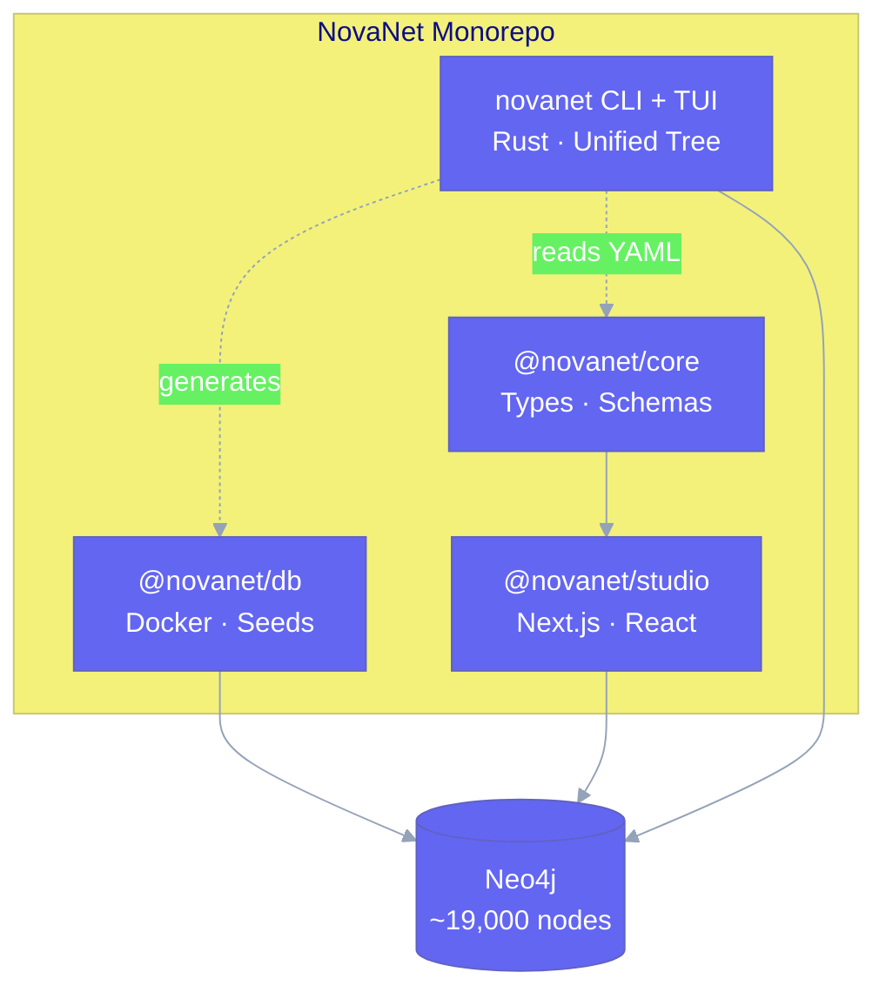

# NovaNet Documentation

**Native content generation engine powered by Neo4j knowledge graphs.**

Generate culturally-native content across 200+ locales — not translation, but true localization from semantic concepts.

```
CRITICAL: Generation, NOT Translation

Source → Translate → Target            ❌ Traditional
Concept (invariant) → Generate → Content  ✅ NovaNet
```

## What is NovaNet?

NovaNet is a **self-describing context graph** that orchestrates native content generation for [QR Code AI](https://qrcode-ai.com). Unlike traditional translation workflows, NovaNet:

1. **Stores semantic concepts** as invariant nodes (meaning, not text)
2. **Generates natively** per locale using locale knowledge
3. **Assembles context** autonomously via meta-graph queries

## Quick Start

```bash
# Clone and install
git clone git@github.com:supernovae-st/novanet-hq.git
cd novanet-hq && pnpm install

# Start Neo4j + seed
pnpm infra:up && pnpm infra:seed

# Start Studio
pnpm dev  # → http://localhost:3000

# Interactive TUI
cd tools/novanet && cargo run -- tui
```

## Architecture at a Glance



## Key Numbers (v0.12.4)

| Metric | Value |
|--------|-------|
| Node types (Classes) | 61 |
| Arc types (ArcClasses) | 128 |
| Realms | 2 (shared, org) |
| Layers | 10 (4 shared + 6 org) |
| Traits | 5 |
| Locales supported | 200+ |
| Tests passing | 998 |

> **v0.12.0 ADR-023**: "Kind" → "Class", "ArcKind" → "ArcClass"

### v0.12.0 Highlights

- **Unified Tree Architecture**: 2 modes (Graph/Nexus) replace 5 modes
- **Nexus Hub**: Quiz, Audit, Stats (Matrix Control Tower), Help
- **Lazy Instance Loading**: Class nodes expand with pagination
- **Dual Icons**: Lucide (web) + Unicode (terminal), no emoji

## Documentation Sections

- **[Architecture](./architecture/overview.md)** — System design, ontology, schema graph
- **[Claude Code DX](./claude-dx/overview.md)** — Skills, agents, advanced patterns
- **[Guides](./guides/quick-start.md)** — Tutorials and how-tos
- **[Reference](./reference/commands.md)** — Commands, API documentation
