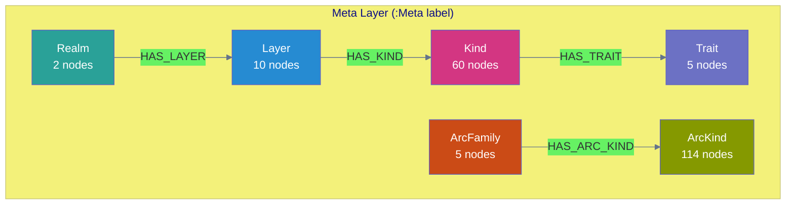

# Meta-Graph

The meta-graph is NovaNet's self-describing schema layer. It enables the graph to describe its own structure.

## Overview



## Meta-Node Types

All meta-nodes carry the `:Meta` label in addition to their specific label.

### Realm

**Labels**: `:Meta:Realm`

Represents the top-level organizational scope.

| Property | Type | Description |
|----------|------|-------------|
| `key` | string | Unique identifier (`shared`, `org`) |
| `display_name` | string | Human-readable name |
| `color` | string | Hex color code |

### Layer

**Labels**: `:Meta:Layer`

Represents functional categories within a realm.

| Property | Type | Description |
|----------|------|-------------|
| `key` | string | Unique identifier |
| `realm` | string | Parent realm |
| `display_name` | string | Human-readable name |
| `color` | string | Hex color code |

**Shared layers**: config, locale, geography, knowledge
**Org layers**: config, foundation, structure, semantic, instruction, output

### Trait

**Labels**: `:Meta:Trait`

Represents locale behavior patterns.

| Property | Type | Description |
|----------|------|-------------|
| `key` | string | Unique identifier |
| `display_name` | string | Human-readable name |
| `border_style` | string | CSS border style |

**Values**: invariant, localized, knowledge, generated, aggregated

### Kind

**Labels**: `:Meta:Kind`

Represents a node type definition.

| Property | Type | Description |
|----------|------|-------------|
| `name` | string | PascalCase type name |
| `realm` | string | Parent realm |
| `layer` | string | Parent layer |
| `trait` | string | Locale behavior |
| `display_name` | string | Human-readable name |
| `description` | string | Purpose description |
| `llm_context` | string | Context for AI generation |

### ArcFamily

**Labels**: `:Meta:ArcFamily`

Represents arc functional categories.

| Property | Type | Description |
|----------|------|-------------|
| `key` | string | Unique identifier |
| `display_name` | string | Human-readable name |
| `color` | string | Hex color code |

**Values**: ownership, localization, semantic, generation, mining

### ArcKind

**Labels**: `:Meta:ArcKind`

Represents an arc type definition.

| Property | Type | Description |
|----------|------|-------------|
| `name` | string | UPPER_SNAKE_CASE type name |
| `family` | string | Parent family |
| `scope` | string | intra_realm or cross_realm |
| `cardinality` | string | 1:1, 1:N, N:M |
| `source` | string | Source Kind name |
| `target` | string | Target Kind name |

## Classification Axes

### Node Classification

| Axis | Question | Property | Values |
|------|----------|----------|--------|
| WHERE? | Scope | `realm` | shared, org |
| WHAT? | Function | `layer` | 10 layers |
| HOW? | Behavior | `trait` | 5 traits |

### Arc Classification

| Axis | Question | Property | Values |
|------|----------|----------|--------|
| SCOPE? | Realm crossing | `scope` | intra_realm, cross_realm |
| FUNCTION? | Purpose | `family` | 5 families |
| MULT? | Cardinality | `cardinality` | 1:1, 1:N, N:M |

## Visual Encoding

The meta-graph drives visual encoding in both Studio and TUI:

| Visual Channel | Encodes | Source |
|----------------|---------|--------|
| Fill color | Layer | `taxonomy.yaml` |
| Border style | Trait | `visual-encoding.yaml` |
| Border color | Realm | `taxonomy.yaml` |
| Arc stroke | ArcFamily | `taxonomy.yaml` |
| Arc dash | ArcScope | solid/dashed |

### Trait Border Styles

| Trait | Border Style |
|-------|--------------|
| invariant | solid |
| localized | dashed |
| knowledge | double |
| generated | dotted |
| aggregated | dotted thin |

## Querying the Meta-Graph

### List All Kinds

```cypher
MATCH (k:Meta:Kind)
RETURN k.name, k.realm, k.layer, k.trait
ORDER BY k.realm, k.layer, k.name
```

### List All Arcs

```cypher
MATCH (a:Meta:ArcKind)
RETURN a.name, a.family, a.scope, a.source, a.target
ORDER BY a.family, a.name
```

### Kinds by Layer

```cypher
MATCH (l:Meta:Layer {key: $layer})-[:HAS_KIND]->(k:Meta:Kind)
RETURN k.name, k.trait
```

### Arcs by Family

```cypher
MATCH (f:Meta:ArcFamily {key: $family})-[:HAS_ARC_KIND]->(a:Meta:ArcKind)
RETURN a.name, a.source, a.target
```

## Generation from YAML

The meta-graph is generated from YAML sources:

```
packages/core/models/
├── taxonomy.yaml          → Realms, Layers, Traits, Families
├── node-classes/**/*.yaml   → Kind nodes
└── arc-classes/**/*.yaml    → ArcKind nodes
```

Regenerate with:

```bash
cd tools/novanet
cargo run -- schema generate
cargo run -- db seed
```

## Statistics (v0.12.0)

| Meta Type | Count |
|-----------|-------|
| Realm | 2 |
| Layer | 10 |
| Trait | 5 |
| Kind | 60 |
| ArcFamily | 5 |
| ArcKind | 114 |
| **Total Meta Nodes** | 196 |

## Related Documentation

- [Architecture Overview](./overview.md) — System architecture
- [Ontology Evolution](./ontology-v9.md) — Version history
- [Rust CLI](./rust-cli.md) — Command reference
