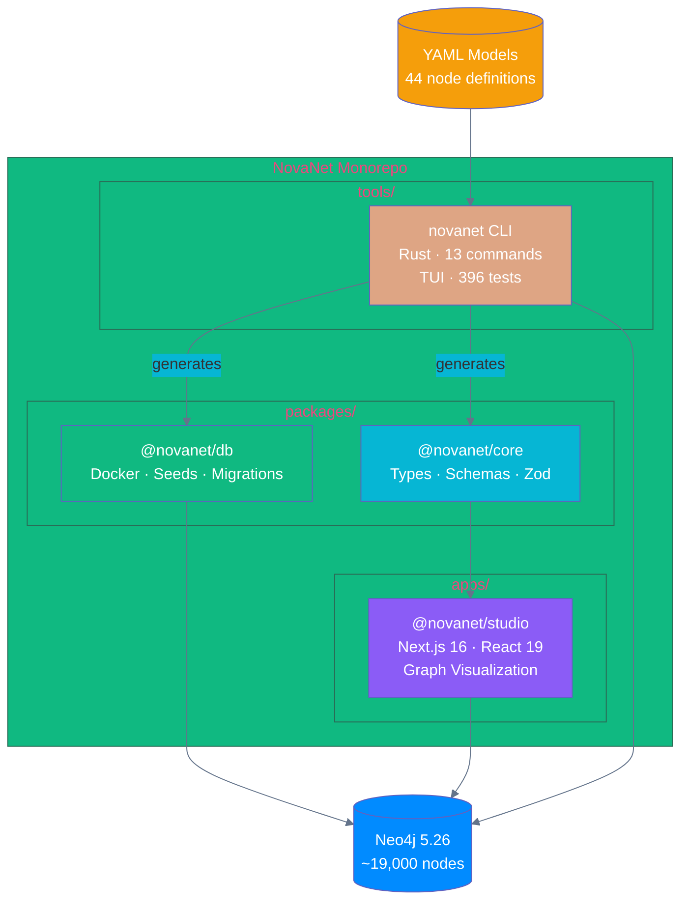
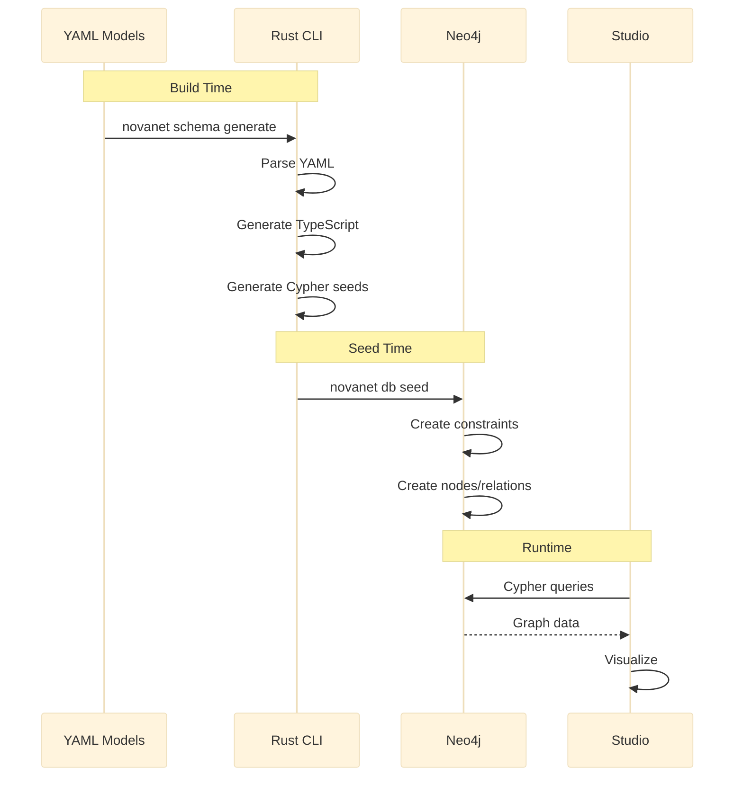

# Architecture Overview

NovaNet is a **self-describing context graph** for native content generation.

## System Architecture



## Core Principle: Generation, NOT Translation

```
Traditional:  Source → Translate → Target        ❌
NovaNet:      Concept → Generate → L10n          ✅
```

Content is generated natively per locale from invariant semantic concepts, not translated from a source language.

## Package Responsibilities

| Package | Responsibility | Language |
|---------|----------------|----------|
| **@novanet/core** | Types, Zod schemas, filter API | TypeScript |
| **@novanet/db** | Neo4j Docker, seeds, migrations | Cypher |
| **@novanet/studio** | Web visualization, AI chat | TypeScript/React |
| **tools/novanet** | CLI, TUI, generators, queries | Rust |

## Data Flow



## Source of Truth

**YAML is the single source of truth:**

```
packages/core/models/
├── _index.yaml              # Schema registry
├── organizing-principles.yaml  # Meta-graph definition
├── relations.yaml           # 50 relationship types
└── nodes/
    ├── global/              # 15 global nodes
    ├── project/             # 21 project nodes
    └── shared/              # 8 shared nodes
```

All other artifacts (TypeScript, Cypher, Mermaid) are generated from YAML.

## Key Technologies

| Layer | Technology | Purpose |
|-------|------------|---------|
| **Graph DB** | Neo4j 5.26 + APOC | Knowledge storage |
| **Backend** | Rust (neo4rs, tokio) | CLI, generators, queries |
| **Frontend** | Next.js 16, React 19 | Web visualization |
| **State** | Zustand + Zod | Client state management |
| **Build** | Turborepo + pnpm | Monorepo orchestration |

## Boundary Rule (v9)

```
TypeScript = Types + Presentation
Rust       = Runtime + Generation
```

- **TypeScript**: Generates type artifacts, UI components
- **Rust**: Executes all runtime operations (queries, CRUD, validation)

## Related Documentation

- [Ontology v9](./ontology-v9.md) — Meta-graph structure
- [Meta-Graph](./meta-graph.md) — Classification system
- [Rust CLI](./rust-cli.md) — Command reference
