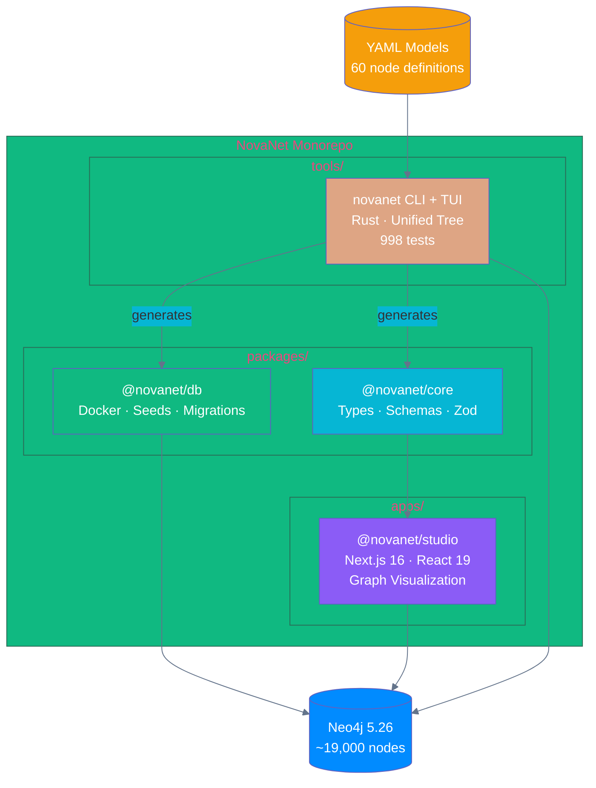
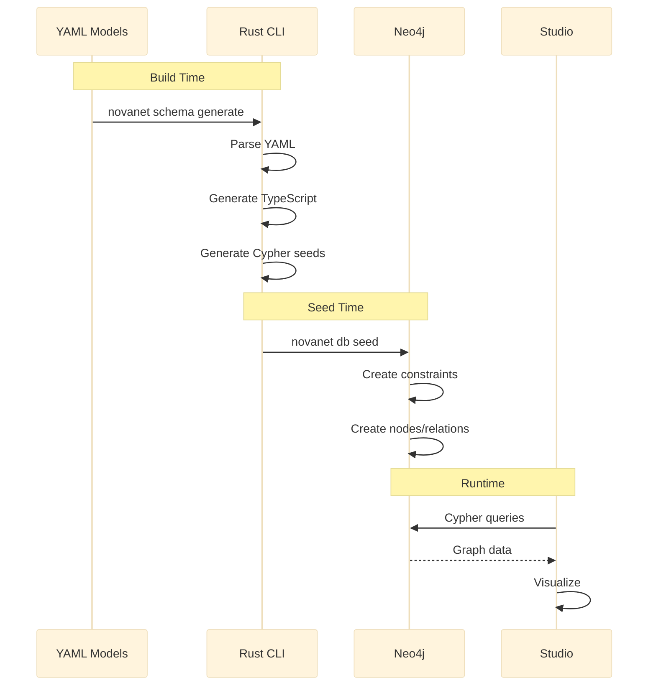

# Architecture Overview

NovaNet is a **self-describing context graph** for native content generation.

## System Architecture (v0.12.0)



## Core Principle: Generation, NOT Translation

```
Traditional:  Source → Translate → Target        ❌
NovaNet:      Concept → Generate → Content       ✅
```

Content is generated natively per locale from invariant semantic concepts, not translated from a source language.

## Package Responsibilities

| Package | Responsibility | Language |
|---------|----------------|----------|
| **@novanet/core** | Types, Zod schemas, filter API | TypeScript |
| **@novanet/db** | Neo4j Docker, seeds, migrations | Cypher |
| **@novanet/studio** | Web visualization, AI chat | TypeScript/React |
| **tools/novanet** | CLI, TUI, generators, queries | Rust |

## Data Flow



## Source of Truth

**YAML is the single source of truth:**

```
packages/core/models/
├── _index.yaml               # Schema registry
├── taxonomy.yaml             # Realms, Layers, Traits, Colors
├── visual-encoding.yaml      # Icons, border styles
├── node-classes/
│   ├── shared/               # 39 nodes (4 layers)
│   │   ├── config/           # 3 nodes
│   │   ├── locale/           # 6 nodes
│   │   ├── geography/        # 6 nodes
│   │   └── knowledge/        # 24 nodes (incl. SEO/GEO)
│   └── org/                  # 21 nodes (6 layers)
│       ├── config/           # 1 node
│       ├── foundation/       # 3 nodes
│       ├── structure/        # 3 nodes
│       ├── semantic/         # 4 nodes
│       ├── instruction/      # 7 nodes
│       └── output/           # 3 nodes
└── arc-classes/                # 114 arcs by family
    ├── ownership/
    ├── localization/
    ├── semantic/
    ├── generation/
    └── mining/
```

All other artifacts (TypeScript, Cypher, Mermaid) are generated from YAML.

## v0.12.0: Unified Tree Architecture

NovaNet v0.12.0 introduces the **Unified Tree** principle:

> "If it's a node in Neo4j, it's a node everywhere"

### Navigation Modes

| Mode | Key | Content |
|------|-----|---------|
| **Graph** | `1` | Unified tree: Realm > Layer > Class > Instance + Arcs |
| **Nexus** | `2` | Hub: Quiz, Audit, Stats (Matrix Control Tower), Help |

### Key Changes from v11.x

| Aspect | Before (v11.6) | After (v0.12.0) |
|--------|----------------|-----------------|
| Nav modes | 5 (Meta/Data/Overlay/Query/Atlas) | 2 (Graph/Nexus) |
| Realm/Layer | Visual groupings | Clickable nodes |
| Instances | Hidden | Under Kind, expandable |
| Icons | Mixed emoji | Dual: Lucide + Unicode |

### Unified Tree Structure

```
▼ Nodes (61)
  ▼ ◉ Realm:shared           ← Clickable node
    ▼ ⚙ Layer:config         ← Clickable node
      ▼ ◆ Class:Locale [200] ← Expandable (v0.12.0: Kind→Class)
        ● Locale:fr-FR       ← Instance
        ● Locale:en-US
▼ Arcs (128)
  ▼ → ArcFamily:ownership
    → ArcClass:HAS_PROJECT   (v0.12.0: ArcKind→ArcClass)
```

## Classification System

### Node Classification (Faceted)

| Axis | Question | Type | Values |
|------|----------|------|--------|
| WHERE? | `NodeRealm` | realm | `shared`, `org` |
| WHAT? | `NodeLayer` | layer | 10 layers (4 shared + 6 org) |
| HOW? | `NodeTrait` | trait | `defined`, `authored`, `imported`, `generated`, `retrieved` |

> **v0.12.0 ADR-024**: Trait = Data Origin. `invariant`→`defined`, `localized`→`authored`, `knowledge`→`imported`, `aggregated`→`retrieved`

### Arc Classification (Faceted)

| Axis | Question | Type | Values |
|------|----------|------|--------|
| SCOPE? | `ArcScope` | scope | `intra_realm`, `cross_realm` |
| FUNCTION? | `ArcFamily` | family | `ownership`, `localization`, `semantic`, `generation`, `mining` |
| MULT? | `ArcCardinality` | cardinality | `1:1`, `1:N`, `N:M` |

## Key Technologies

| Layer | Technology | Purpose |
|-------|------------|---------|
| **Graph DB** | Neo4j 5.26 + APOC | Knowledge storage |
| **Backend** | Rust (neo4rs, tokio, ratatui) | CLI, TUI, generators |
| **Frontend** | Next.js 16, React 19 | Web visualization |
| **State** | Zustand + Zod | Client state management |
| **Build** | Turborepo + pnpm | Monorepo orchestration |

## Boundary Rule

```
TypeScript = Types + Presentation
Rust       = Runtime + Generation
```

- **TypeScript**: Generates type artifacts, UI components
- **Rust**: Executes all runtime operations (queries, CRUD, validation)

## Related Documentation

- [Ontology v9](./ontology-v9.md) — Schema graph structure and history
- [Schema Graph](./schema-graph.md) — Classification system details (v0.12.0: was meta-graph)
- [Rust CLI](./rust-cli.md) — Command reference and TUI documentation
