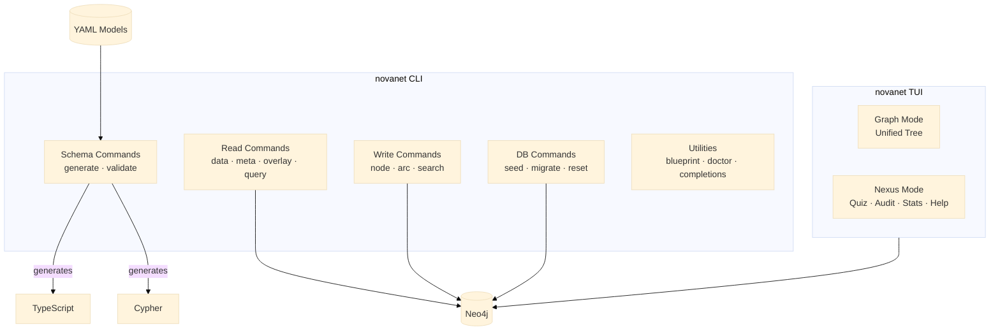

# Rust CLI & TUI

The `novanet` binary is a unified Rust CLI + TUI for managing the NovaNet context graph.

## Overview

**Version**: v0.12.0 (Unified Tree Architecture)
**Location**: `tools/novanet/`
**Tests**: 998 passing



## Command Categories

### Read Commands

Query the Neo4j graph in different modes.

| Command | Description |
|---------|-------------|
| `data` | Query data nodes only |
| `meta` | Query meta-graph (schema) |
| `overlay` | Combined data + meta view |
| `query` | Faceted query with filters |
| `search` | Fulltext + property search |

```bash
cargo run -- meta --format=json
cargo run -- query --realm=org --layer=semantic
cargo run -- search --query="page" --kind=Page --limit=20
```

### Write Commands

Create, modify, and delete graph nodes.

| Command | Description |
|---------|-------------|
| `node create` | Create a new node |
| `node edit` | Modify node properties |
| `node delete` | Remove a node |
| `arc create` | Create a relationship |
| `arc delete` | Remove a relationship |

```bash
cargo run -- node create --kind=Page --key=my-page --props='{"title":"My Page"}'
cargo run -- arc create --from=page1 --to=entity1 --kind=USES_ENTITY
```

### Schema Commands

Manage YAML source of truth.

| Command | Description |
|---------|-------------|
| `schema generate` | Generate all artifacts from YAML |
| `schema validate` | Validate YAML coherence |

```bash
cargo run -- schema generate           # All 12 artifacts
cargo run -- schema generate --dry-run # Preview without writing
cargo run -- schema validate --strict  # Fail on warnings
```

### Database Commands

Manage Neo4j seeding and migrations.

| Command | Description |
|---------|-------------|
| `db seed` | Execute seed Cypher files |
| `db migrate` | Run migrations |
| `db reset` | Drop and re-seed |

### Documentation Commands

Generate documentation artifacts.

| Command | Description |
|---------|-------------|
| `doc generate` | Generate Mermaid diagrams |
| `doc generate --list` | List available views |

### Utility Commands

| Command | Description |
|---------|-------------|
| `blueprint` | Rich ASCII visualization |
| `doctor` | System health check |
| `completions` | Generate shell completions |
| `locale list` | List available locales |

## Terminal UI (v0.12.0)

The TUI provides interactive graph exploration with the **Unified Tree Architecture**.

### Launch

```bash
cargo run -- tui
```

### Navigation Modes

| Key | Mode | Description |
|-----|------|-------------|
| `1` | Graph | Unified tree (Realm > Layer > Kind > Instance + Arcs) |
| `2` | Nexus | Hub (Quiz, Audit, Stats, Help) |

### Graph Mode

The unified tree shows everything as clickable nodes:

```
▼ Nodes (60)
  ▼ ◉ Realm:shared           ← Clickable
    ▼ ⚙ Layer:config         ← Clickable
      ▼ ◆ Kind:Locale [200]  ← Expandable
        ● Locale:fr-FR       ← Instance
        ● Locale:en-US
▼ Arcs (114)
  ▼ → ArcFamily:ownership
    → ArcKind:HAS_PROJECT
```

#### Keybindings

| Key | Action |
|-----|--------|
| `j/k` | Navigate up/down |
| `h/l` | Collapse/expand |
| `d/u` | Page down/up |
| `g/G` | Top/bottom |
| `Tab` | Switch panels |
| `Enter` | Expand/select |
| `Space` | Toggle expand |

### Nexus Mode

The Nexus hub provides gamified learning and system tools.

#### Tabs

| Tab | Key | Description |
|-----|-----|-------------|
| Quiz | `Q` | Test NovaNet knowledge with multiple choice questions |
| Audit | `A` | Validate schema consistency |
| Stats | `S` | Matrix Control Tower dashboard |
| Help | `?` | Keybindings reference |

#### Stats Dashboard (Matrix Control Tower)

The Stats tab displays schema statistics with cyberpunk aesthetics:

- **Hero Panel**: Big animated counters (NODES, ARCS, LAYERS, TRAITS, REALMS)
- **Heartbeat**: Pulsing EKG sparkline (system status indicator)
- **Bar Charts**: Realm, Layer, and Arc Family distributions

Boot animation plays on first view (~2s), then heartbeat pulses continuously.

| Key | Action |
|-----|--------|
| `r` | Refresh stats from Neo4j |
| `y` | Yank stats summary |

### Search Overlay

Press `/` from anywhere to open fuzzy search.

| Key | Action |
|-----|--------|
| `Enter` | Jump to selected result |
| `Esc` | Close search |
| `j/k` | Navigate results |

### Help Overlay

Press `?` for keybindings reference or `F1` for color legend.

## Module Structure

```
src/
├── main.rs         # Entry point (clap parse + dispatch)
├── lib.rs          # Public API
├── config.rs       # Root discovery + paths
├── db.rs           # Neo4j connection pool
├── error.rs        # NovaNetError enum
├── cypher.rs       # Cypher statement builder
├── facets.rs       # FacetFilter types
├── output.rs       # OutputFormat rendering
├── commands/       # Command implementations
├── parsers/        # YAML parsers
├── generators/     # Code generators (12)
└── tui/            # Terminal UI
    ├── mod.rs      # Entry point
    ├── app.rs      # State machine + async
    ├── data.rs     # UnifiedTree builder
    ├── theme.rs    # Colors + icons
    ├── ui.rs       # Layout + rendering
    └── nexus/      # Nexus hub modules
        ├── quiz.rs
        ├── audit.rs
        ├── stats.rs
        └── help.rs
```

## Performance Optimizations

- **rayon**: Parallel YAML loading (~4x speedup)
- **FxHashSet**: 30% faster string key lookups
- **SmallVec**: Stack-allocated vectors for properties

## Security Toolchain

| Tool | Command | Purpose |
|------|---------|---------|
| cargo-deny | `cargo deny check` | License/security policy |
| cargo-audit | `cargo audit` | Vulnerability scanning |
| cargo-machete | `cargo machete` | Unused dependencies |

## Feature Flags

```toml
[features]
default = ["tui"]
tui = ["dep:ratatui", "dep:crossterm", "dep:arboard", "dep:tui-piechart", "dep:tui-bar-graph"]
```

Build CLI-only without TUI dependencies:

```bash
cargo build --no-default-features
```

## Related Documentation

- [KEYBINDINGS.md](../../tools/novanet/KEYBINDINGS.md) — Complete keyboard shortcuts
- [Architecture Overview](./overview.md) — System architecture
- [Schema Management](../guides/schema-management.md) — YAML workflow
