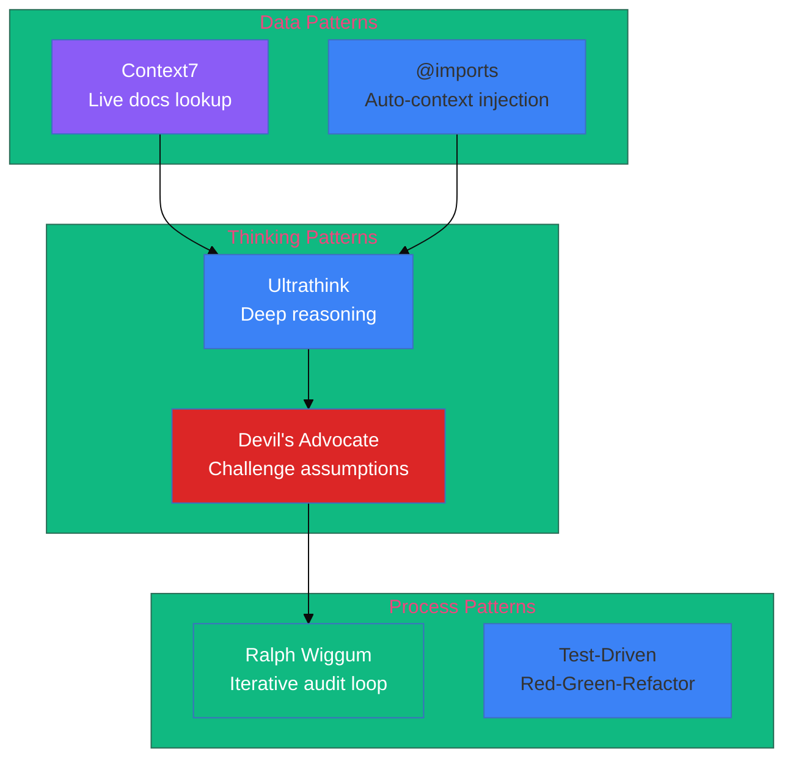

# Advanced Patterns

NovaNet uses several advanced Claude Code patterns to maximize development efficiency and code quality.

## Pattern Overview



## Quick Reference

| Pattern | Purpose | When to Use |
|---------|---------|-------------|
| **[Ultrathink](./ultrathink.md)** | Extended thinking | Complex decisions, architecture |
| **[Context7](./context7.md)** | Live documentation | External library APIs |
| **[Ralph Wiggum](./ralph-wiggum.md)** | Iterative auditing | Pre-release, post-refactor |
| **[Devil's Advocate](./devils-advocate.md)** | Challenge assumptions | High-impact decisions |

## Pattern Combinations

### Architecture Decision Flow

```
1. Ultrathink: Deep analysis of options
2. Devil's Advocate: Challenge the proposal
3. Context7: Verify technical assumptions
4. Implement with confidence
```

### Pre-Release Flow

```
1. Ralph Wiggum: Full codebase audit
2. Devil's Advocate: Challenge fix approaches
3. Verify: Re-run until clean
4. Release with confidence
```

### Learning a New Library

```
1. Context7: Get current documentation
2. Ultrathink: Plan integration approach
3. TDD: Implement with tests
4. Ralph Wiggum: Verify no regressions
```

## Pattern Matrix

| Scenario | Ultrathink | Context7 | Ralph Wiggum | Devil's Advocate |
|----------|:----------:|:--------:|:------------:|:----------------:|
| Architecture design | ✅ | ⬜ | ⬜ | ✅ |
| New library integration | ⬜ | ✅ | ⬜ | ⬜ |
| Pre-release check | ⬜ | ⬜ | ✅ | ⬜ |
| Schema decision | ✅ | ⬜ | ⬜ | ✅ |
| Bug investigation | ✅ | ✅ | ⬜ | ⬜ |
| Performance optimization | ✅ | ✅ | ⬜ | ✅ |

## Anti-Patterns

### Over-Thinking

❌ Using ultrathink for simple tasks
```
User: Fix this typo in the README
Claude: Let me think deeply about this...
```

✅ Just fix it
```
User: Fix this typo in the README
Claude: Fixed "teh" → "the" in README.md
```

### Under-Challenging

❌ Accepting first solution without scrutiny
```
User: Add LocaleHumor node
Claude: Done! Created LocaleHumor.yaml
```

✅ Challenge significant additions
```
User: Add LocaleHumor node
Claude: Before creating this, let me play devil's advocate...
```

### Skipping Verification

❌ Assuming fixes work
```
Claude: Fixed all 12 issues. Should be clean now.
```

✅ Always verify
```
Claude: Fixed 12 issues. Running verification loop...
Re-scan found 2 regressions. Fixing...
```

## Integration with Skills

| Skill | Patterns Used |
|-------|---------------|
| `codebase-audit` | Ralph Wiggum (core pattern) |
| `novanet-architecture` | Ultrathink (implicit) |
| `novanet-sync` | Ralph Wiggum (verification) |
| `/schema:add-node` | Ultrathink + Devil's Advocate |

## Measuring Effectiveness

Track pattern usage impact:

| Metric | Without Patterns | With Patterns |
|--------|------------------|---------------|
| Bugs caught pre-release | ~60% | ~95% |
| Architecture rework | High | Low |
| Documentation accuracy | Variable | Consistent |
| Decision confidence | Medium | High |
