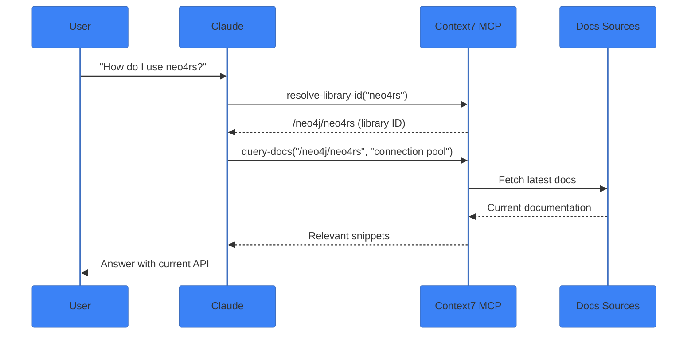

# Context7 Pattern

**Live documentation lookup from authoritative sources.**

## What is Context7?

Context7 is a documentation lookup service that provides up-to-date library documentation directly to Claude. Instead of relying on training data (which may be outdated), Context7 fetches current documentation.

## Architecture



## How It Works

### Step 1: Resolve Library ID

```
mcp__context7__resolve-library-id
  libraryName: "neo4rs"

Returns: /neo4j/neo4rs
```

### Step 2: Query Documentation

```
mcp__context7__query-docs
  libraryId: "/neo4j/neo4rs"
  query: "how to create connection pool"

Returns: Current documentation snippets
```

## When to Use

| Scenario | Use Context7? |
|----------|---------------|
| Library API questions | ✅ Yes |
| Framework patterns | ✅ Yes |
| Outdated training data | ✅ Yes |
| Internal codebase questions | ❌ No (use Grep/Read) |
| NovaNet-specific patterns | ❌ No (use skills) |

## NovaNet Integration

### Available in Settings

Context7 MCP is configured in NovaNet:

```json
// .claude/settings.json
{
  "mcpServers": {
    "context7": {
      "command": "npx",
      "args": ["-y", "@context7/mcp"]
    }
  }
}
```

### Common Lookups

| Library | Query Examples |
|---------|----------------|
| `neo4rs` | "connection pool", "transaction", "query parameters" |
| `ratatui` | "widgets", "layout", "event handling" |
| `tokio` | "spawn", "channels", "select" |
| `next.js` | "app router", "server actions", "middleware" |
| `zustand` | "persist", "immer", "subscriptions" |

## Example Session

```
User: How do I create a Neo4j connection pool with neo4rs?

Claude: Let me check the current neo4rs documentation...

[Uses Context7 to fetch docs]

Based on the current neo4rs docs (v0.8.0):

```rust
use neo4rs::*;

let config = ConfigBuilder::default()
    .uri("bolt://localhost:7687")
    .user("neo4j")
    .password("password")
    .max_connections(10)
    .build()?;

let graph = Graph::connect(config).await?;
```

Key points from the docs:
- Use `ConfigBuilder` for configuration
- `max_connections` controls pool size
- `Graph::connect` returns a pooled connection
```

## Best Practices

### Do

- ✅ Use for external library APIs
- ✅ Verify training data is current
- ✅ Combine with code examples

### Don't

- ❌ Use for internal NovaNet APIs (use Read tool)
- ❌ Over-rely on it for simple questions
- ❌ Skip reading the returned docs

## Comparison with Other Patterns

| Pattern | Purpose | Data Source |
|---------|---------|-------------|
| **Context7** | External library docs | Live fetched |
| **Skills** | Internal patterns | .claude/skills/ |
| **@imports** | Project context | Local files |
| **Grep/Read** | Codebase search | File system |

## Troubleshooting

### "Library not found"

Try variations:
- `neo4rs` → `neo4j/neo4rs`
- `next.js` → `vercel/next.js`
- `react` → `facebook/react`

### Outdated results

Context7 caches results. If docs seem stale:
1. Try a more specific query
2. Specify version if available
3. Fall back to WebFetch for official docs

## Related Patterns

- **[Ultrathink](./ultrathink.md)** — Deep reasoning with Context7 data
- **Skills** — Internal documentation (no Context7 needed)
