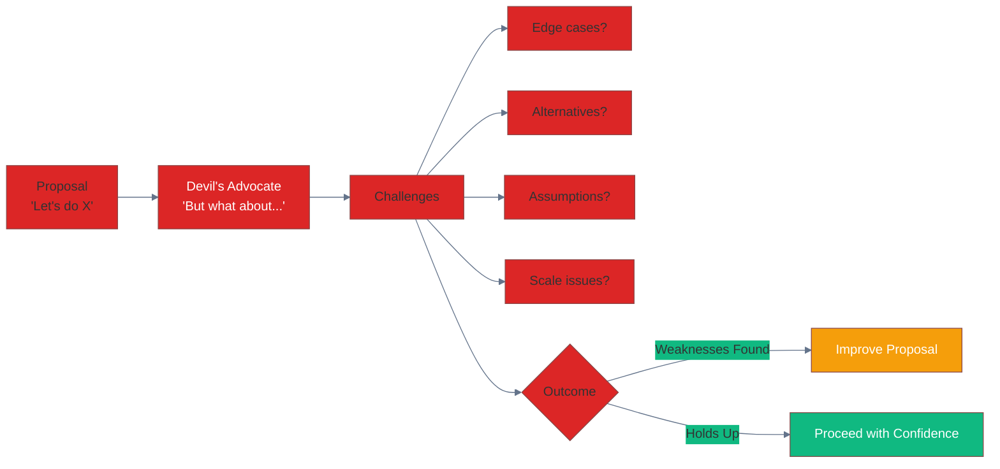
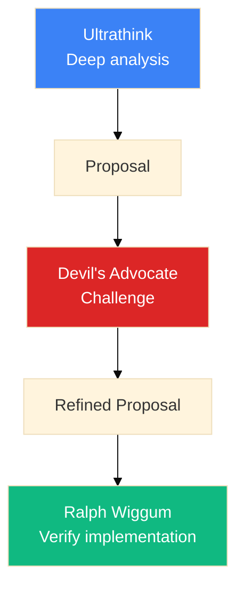

# Devil's Advocate Pattern

**Systematically challenging assumptions and decisions to find weaknesses.**

## What is Devil's Advocate?

The Devil's Advocate pattern forces critical examination of proposed solutions by actively arguing against them. It prevents groupthink and catches issues before implementation.

## When to Use



### Good Use Cases

| Scenario | Why Devil's Advocate |
|----------|---------------------|
| **Architecture decisions** | High impact, hard to reverse |
| **Schema changes** | Breaking changes expensive |
| **Performance optimizations** | May introduce complexity |
| **Dependency choices** | Long-term commitment |
| **API design** | Public contracts are forever |

## How to Invoke

### Explicit Request

```
"Play devil's advocate on this approach"
"What could go wrong with this design?"
"Challenge my assumptions about..."
"Argue against using X for this"
```

### In Skills

Include devil's advocate phase:

```yaml
---
name: architecture-review
---

After proposing a solution:

## Devil's Advocate Phase

Challenge the proposal:
1. What are the hidden assumptions?
2. What edge cases could break this?
3. What's the worst-case scenario?
4. What alternatives weren't considered?
5. What would make this the wrong choice?
```

## Example: Schema Decision

```
User: I want to add a LocaleHumor node to store humor patterns.

Claude: That makes sense. Let me play devil's advocate:

## Devil's Advocate: Against LocaleHumor

**Challenge 1: Is this distinct enough?**
- LocaleVoice already has tone
- LocaleCulture has communication style
- Adding LocaleHumor creates overlap

**Challenge 2: Data availability**
- How will you populate 200+ locales?
- Humor is highly contextual
- Risk of stereotyping

**Challenge 3: Complexity cost**
- 15th knowledge node
- New relationships to maintain
- More context budget consumed

**Challenge 4: Alternative approaches**
- Could be a property on LocaleVoice.humor_level
- Could be embedded in LocaleCulture.communication_patterns
- Could be generated on-demand, not stored

**Challenge 5: Usage frequency**
- How often will generation actually need humor?
- Is this premature optimization?

---

**Counter-argument (defending LocaleHumor):**
- Humor is distinct from tone/culture
- QR Code AI does use humor in marketing
- Queryable humor allows targeted retrieval

**Verdict**: The challenges are valid but addressable.
Recommend proceeding with narrow scope:
- Start with 10 key locales
- Use SEMANTIC_LINK to LocaleCulture
- Add usage_frequency property for budget decisions
```

## Structured Challenge Framework

### The 5 Whys (Reversed)

Instead of asking "Why?" to find root cause, ask "Why not?" to find weaknesses:

1. **Why not just...?** — Simpler alternatives
2. **Why wouldn't this fail when...?** — Edge cases
3. **Why isn't everyone doing this?** — Hidden costs
4. **Why would this break at scale?** — Growth issues
5. **Why might we regret this?** — Long-term problems

### SWOT for Decisions

| Aspect | Questions |
|--------|-----------|
| **Strengths** | What makes this good? (confirm) |
| **Weaknesses** | What makes this bad? (devil's advocate) |
| **Opportunities** | What could this enable? (confirm) |
| **Threats** | What could go wrong? (devil's advocate) |

## Integration with Other Patterns



## Best Practices

### Do

- ✅ Use for irreversible decisions
- ✅ Be genuinely adversarial
- ✅ Consider alternatives seriously
- ✅ Document the challenges and responses

### Don't

- ❌ Use for trivial decisions
- ❌ Be contrarian without substance
- ❌ Abandon good ideas over minor issues
- ❌ Skip the "defend" phase after challenging

## Severity of Challenges

Rate challenges by impact:

| Level | Meaning | Action |
|-------|---------|--------|
| 🔴 **Blocking** | Fundamental flaw | Must address before proceeding |
| 🟠 **Serious** | Significant risk | Should address or mitigate |
| 🟡 **Notable** | Worth considering | Document and monitor |
| 🟢 **Minor** | Edge case | Acceptable risk |

## Example Output Format

```markdown
## Devil's Advocate: [Proposal Name]

### Challenges

#### 🔴 Blocking
- [Challenge that must be resolved]

#### 🟠 Serious
- [Significant risk to address]

#### 🟡 Notable
- [Worth documenting]

#### 🟢 Minor
- [Acceptable edge case]

### Defense

[Counter-arguments for each challenge]

### Verdict

[Proceed / Modify / Abandon] because [reasoning]
```

## Related Patterns

- **[Ultrathink](./ultrathink.md)** — Generate the proposal to challenge
- **[Ralph Wiggum](./ralph-wiggum.md)** — Verify the challenged solution
