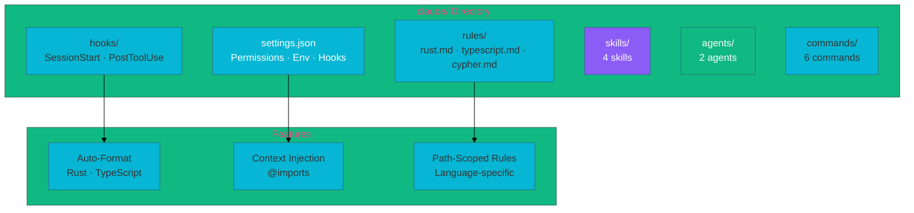

# Claude Code DX Overview

NovaNet uses Claude Code as the primary development interface. This section documents our custom skills, agents, and advanced patterns.

## Architecture



## Quick Reference

| Component | Count | Purpose |
|-----------|-------|---------|
| **Skills** | 4 | Automatic context injection |
| **Agents** | 2 | Specialized subagents |
| **Commands** | 6 | Slash commands (/schema, /novanet-*) |
| **Hooks** | 2 | SessionStart, PostToolUse |
| **Rules** | 3 | Path-specific (Rust, TS, Cypher) |

## Directory Structure

```
.claude/
├── settings.json          # Permissions, env, hooks config
├── hooks/
│   ├── session-start.sh   # Show project status on start
│   └── post-edit-format.sh# Auto-format after edits
├── rules/
│   ├── rust.md            # tools/novanet/**/*.rs
│   ├── typescript.md      # packages/, apps/**/*.ts
│   └── cypher.md          # packages/db/seed/**/*.cypher
├── skills/
│   ├── novanet-architecture/
│   ├── novanet-sync/
│   ├── codebase-audit/    # "Ralph Wiggum Loop"
│   └── token-audit/
├── agents/
│   ├── neo4j-architect.md
│   └── code-reviewer.md
└── commands/
    ├── novanet-arch.md
    ├── novanet-sync.md
    ├── schema.md
    ├── schema-add-node.md
    ├── schema-edit-node.md
    └── schema-add-relation.md
```

## Key Features

### 1. Auto-Imports (@imports)

CLAUDE.md automatically imports README, ROADMAP, and CHANGELOG:

```markdown
## Auto-Imported Context

@README.md @ROADMAP.md @CHANGELOG.md
```

### 2. Hooks

- **SessionStart**: Displays `NovaNet v9.0.1 | Branch: main | Uncommitted: X`
- **PostToolUse**: Auto-formats Rust (rustfmt) and TypeScript (prettier)

### 3. Path-Specific Rules

Rules apply only when working with matching files:

```yaml
---
paths:
  - "tools/novanet/**/*.rs"
---
# Rust-specific rules here
```

## Advanced Patterns

NovaNet uses several advanced Claude Code patterns:

- **[Ultrathink](./ultrathink.md)** — Extended thinking for complex decisions
- **[Context7](./context7.md)** — Live documentation lookup
- **[Ralph Wiggum Loop](./ralph-wiggum.md)** — Iterative codebase auditing
- **[Devil's Advocate](./devils-advocate.md)** — Challenging assumptions
