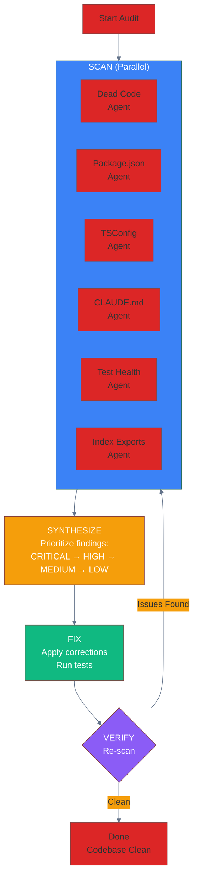
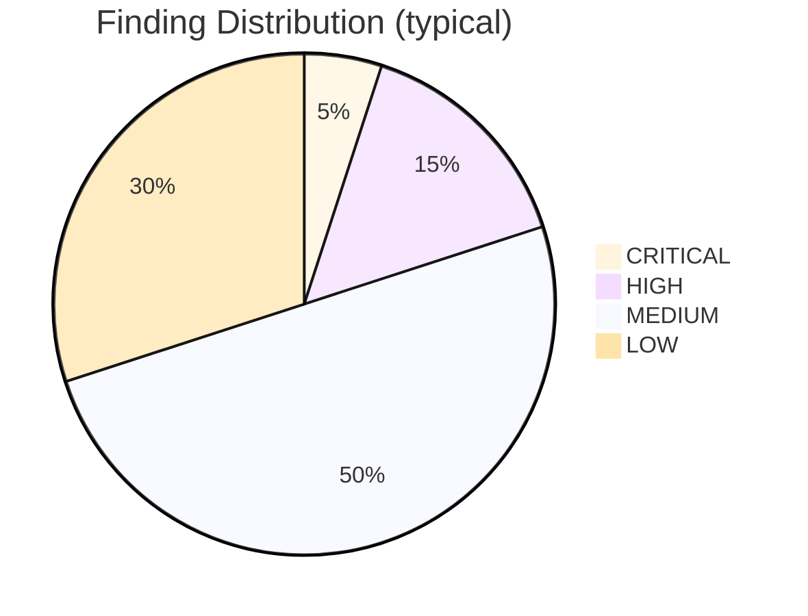

# Ralph Wiggum Loop

**Iterative codebase auditing with parallel agents and verification loops.**

## What is the Ralph Wiggum Loop?

The Ralph Wiggum Loop is an audit pattern that uses parallel agents to scan the codebase, then iteratively fixes issues until clean. Named for its persistent, thorough nature — it keeps going until the codebase is actually clean.

## Process Flow



## The Four Phases

### Phase 1: SCAN

Launch 4-6 parallel agents simultaneously:

| Agent | Focus |
|-------|-------|
| Dead Code | Unused exports, orphaned functions |
| Package.json | Broken scripts, version drift |
| TSConfig | Path aliases, compiler options |
| CLAUDE.md | Documentation accuracy |
| Test Health | Skipped tests, empty blocks |
| Index Exports | Barrel file integrity |

**Critical**: All agents must launch in ONE message for parallelism.

### Phase 2: SYNTHESIZE

Combine findings by severity:

| Severity | Criteria | Action |
|----------|----------|--------|
| **CRITICAL** | Breaks build/tests | Fix immediately |
| **HIGH** | Incorrect behavior | Fix soon |
| **MEDIUM** | Dead code, unused | Clean up |
| **LOW** | Style, cosmetic | Nice to have |

### Phase 3: FIX

Apply corrections in severity order:

1. Mark todo as `in_progress`
2. Apply fix with Edit tool
3. Run tests to verify
4. Mark todo as `completed`

### Phase 4: VERIFY

Re-run the entire scan:
- If new issues → Loop back to FIX
- If clean → Report success

## Usage

### Invoke via Skill

```
/codebase-audit
```

Or let Claude detect when to use it:
```
"Run a full codebase audit"
"Check for dead code and inconsistencies"
"Prepare the codebase for release"
```

### Manual Invocation

```
Launch parallel agents for:
1. Dead code analysis
2. Package.json audit
3. TSConfig verification
4. Documentation accuracy

Then synthesize findings and fix.
```

## Example Session

```
User: Run codebase audit

Claude: Starting Ralph Wiggum Loop...

[23:45:01] Launching 4 parallel agents (haiku)...

[23:45:34] Agent 1: Dead Code → 12 findings
[23:45:38] Agent 2: Package.json → 5 findings
[23:45:42] Agent 3: TSConfig → 2 findings
[23:45:45] Agent 4: CLAUDE.md → 4 findings

Synthesizing...

## Audit Results

| Severity | Count |
|----------|-------|
| CRITICAL | 2     |
| HIGH     | 3     |
| MEDIUM   | 8     |
| LOW      | 4     |

### CRITICAL
1. validate-docs.ts:94 - undefined RELATIONS_PATH
2. tsconfig.json:30 - path alias to /dist/src/

Shall I fix?

User: yes

Claude: [23:46:01] Fixing CRITICAL issues...
[23:46:15] Tests pass (264/264)
[23:46:20] Fixing HIGH issues...
...

[23:48:00] Starting verification loop...
[23:48:30] Verification complete

## Verification Complete

✅ All CRITICAL fixed
✅ All HIGH fixed
✅ Tests pass (797/797)
⚠️ 4 LOW remaining (cosmetic)

Codebase is clean!
```

## Why "Ralph Wiggum"?

Internal team reference. The loop's defining characteristic is persistence:

- It doesn't stop at "looks good"
- It verifies with actual re-scans
- It catches things manual review misses

Like the character, it's unexpectedly thorough.

## Best Practices

### Do

- ✅ Run before releases
- ✅ Run after major refactoring
- ✅ Use parallel agents (not sequential)
- ✅ Always verify with re-scan

### Don't

- ❌ Fix without running tests
- ❌ Trust "I think it's fixed"
- ❌ Skip the verification loop
- ❌ Launch agents sequentially

## Integration Points

| Skill | When to Combine |
|-------|-----------------|
| `novanet-sync` | YAML/TypeScript sync issues |
| `novanet-architecture` | Understand system before audit |
| `token-audit` | Design system consistency |

## Severity Guidelines



Typical healthy codebase:
- 0-2 CRITICAL (aim for zero)
- 3-5 HIGH
- 10-20 MEDIUM
- Variable LOW

## Related Patterns

- **[Ultrathink](./ultrathink.md)** — For complex fix decisions
- **[Devil's Advocate](./devils-advocate.md)** — Challenge fix approaches
