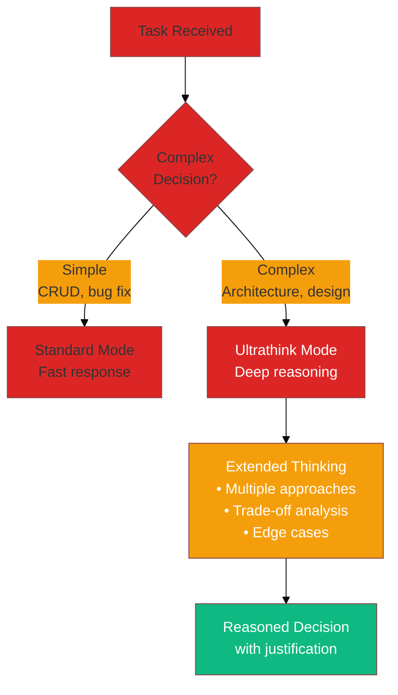

# Ultrathink Pattern

**Extended thinking mode for complex reasoning and architecture decisions.**

## What is Ultrathink?

Ultrathink activates Claude's extended thinking capability, allowing deeper reasoning chains for complex problems. When enabled, Claude takes more time to think through problems before responding.

## When to Use



### Good Use Cases

| Scenario | Why Ultrathink |
|----------|----------------|
| **Architecture decisions** | Need to weigh multiple approaches |
| **Schema design** | Complex relationships to model |
| **Performance optimization** | Many variables to consider |
| **Migration planning** | Sequence matters, edge cases |
| **Refactoring strategy** | Impact analysis needed |

### Not Needed For

- Simple bug fixes
- CRUD operations
- Documentation updates
- Formatting changes

## How to Enable

### In Skills

Add "ultrathink" anywhere in skill content:

```yaml
---
name: architecture-review
description: Deep architecture analysis
---

Enable ultrathink for this analysis.

When reviewing architecture:
1. Consider all stakeholders
2. Analyze trade-offs
3. Document assumptions
...
```

### In Conversation

Simply ask for deep thinking:

```
"Think deeply about this architecture decision..."
"Ultrathink: What's the best approach for..."
"I need careful analysis of..."
```

## Example: Schema Decision

Without ultrathink:
```
User: Should LocaleHumor be a separate node?
Claude: Yes, create LocaleHumor as a knowledge node.
```

With ultrathink:
```
User: Ultrathink: Should LocaleHumor be a separate node?

Claude: Let me think through this carefully...

**Option 1: Separate LocaleHumor node**
Pros:
- Clean separation of concerns
- Can have its own properties (intensity, formality)
- Queryable independently

Cons:
- Adds complexity (15th knowledge node)
- Needs new relationships
- Migration required

**Option 2: Property on LocaleCulture**
Pros:
- Simpler, no new node
- Culture already has tone-related data

Cons:
- Mixes concerns
- Harder to query humor specifically

**Option 3: Embedded in LocaleVoice**
...

**Recommendation**: Option 1, because humor is distinct
enough from culture/voice to warrant separation, and
queryability matters for generation context assembly.

**Migration path**: ...
```

## Integration with NovaNet

### In Schema Commands

`/schema:add-node` uses ultrathink implicitly for discovery:

```
/schema:add-node LocaleHumor

Claude: [Extended thinking activated]

Before creating this node, let me ask clarifying questions:

1. **Realm**: This sounds like locale knowledge → Global realm?
2. **Trait**: Knowledge (static reference data)?
3. **Relations**: Should it connect to LocaleCulture? LocaleVoice?
4. **Properties**: What attributes? intensity? formality? examples?
```

### In Architecture Skills

The `novanet-architecture` skill triggers ultrathink for system-wide analysis.

## Best Practices

1. **Don't overuse** — Reserve for genuinely complex decisions
2. **Be explicit** — Say "ultrathink" or "think deeply"
3. **Provide context** — More context = better reasoning
4. **Ask follow-ups** — Probe the reasoning

## Related Patterns

- **[Devil's Advocate](./devils-advocate.md)** — Challenge the ultrathink conclusions
- **[Ralph Wiggum](./ralph-wiggum.md)** — Verify ultrathink decisions with audits
