# NovaNet Neo4j Architecture (v7.0.0)

Architecture complète du graphe Neo4j avec données réelles du projet QR Code AI.

> **v7.0.0**: Standard node properties (key, display_name, icon, description, llm_context). Graph-native Locale with :FOR_LOCALE. Locale Knowledge nodes (LocaleIdentity, LocaleVoice, LocaleCulture, LocaleMarket, LocaleLexicon). :TARGETS split to :TARGETS_SEO/:TARGETS_GEO.
> **v7.2.2**: BrandL10n merged into ProjectL10n. VoiceExampleL10n removed (redundant with LocaleVoice).
>
> **v6.8**: ConceptContent → ConceptL10n, BlockContent → BlockL10n, PageContent → PageL10n, :HAS_CONTENT split into :HAS_L10N and :HAS_OUTPUT
>
> **v6.7**: Project node added, :ASSEMBLES removed
>
> **v6.5**: L10NType REMOVED, SEMANTIC_LINK simplified (10 types)

---

## 1. Vue d'ensemble

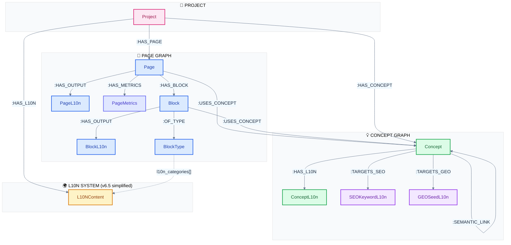

### Légende des couleurs

| Couleur | Domaine | Nodes |
|---------|---------|-------|
| 🩷 Rose | Project | Project (v6.7: new root node) |
| 🔵 Bleu | Page Graph | Page, PageL10n, Block, BlockL10n, BlockType |
| 🟣 Indigo | Metrics | PageMetrics (v6.8: new) |
| 🟢 Vert | Concept Graph | Concept, ConceptL10n (v6.8: renamed from ConceptContent) |
| 🟡 Orange | L10N System | L10NContent (v6.5: L10NType removed) |
| 💜 Violet | SEO/GEO | SEOKeywordL10n, GEOSeedL10n (v6.6: renamed) |

---

## 2. Page Graph - Données réelles

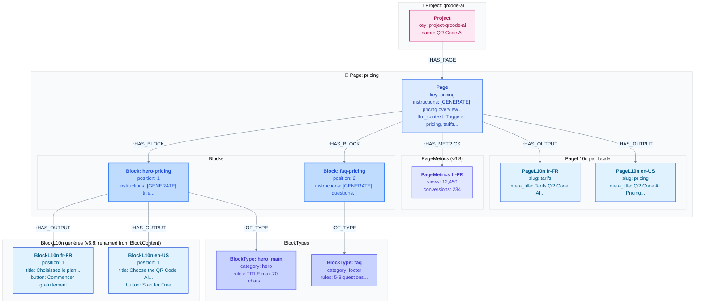

### Instructions des Blocks

```yaml
# blk_pricing_hero
instructions: |
  [GENERATE] title: catchy for pricing, use @tier-pro and @tier-free
  [GENERATE] description: reassuring, mention free trial
  [FIXED] button.url: /signup

# blk_pricing_faq
instructions: "[GENERATE] questions: 5-6 frequently asked questions about pricing. Use @tier-pro, @tier-free, @analytics"
```

---

## 3. Concept Graph avec Spreading Activation

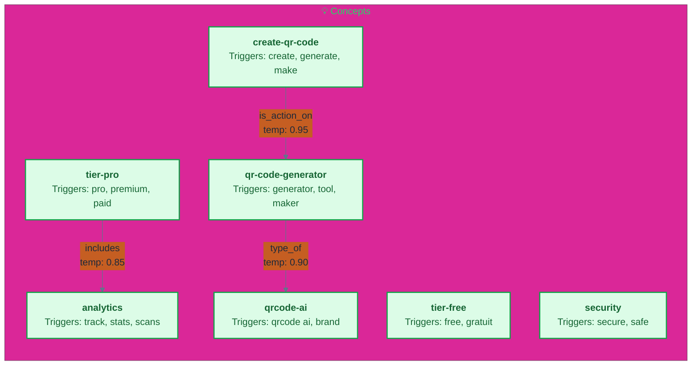

### Spreading Activation - Exemple

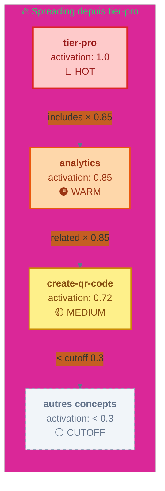

### Configuration Spreading

```yaml
spreading_config:
  cutoff: 0.3        # Stop si activation < 0.3
  max_depth: 2       # Maximum 2 sauts
  decay: 0.9         # Multiplicateur optionnel par saut
```

---

## 4. ConceptL10n - Données localisées (v6.8)

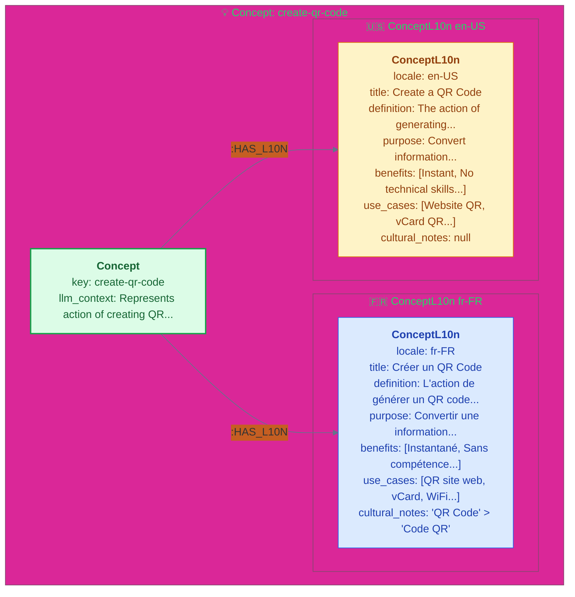

---

## 5. L10N System - Règles de localisation (v6.5 Simplified)

> **v6.5**: L10NType node REMOVED. L10NContent is now standalone with `category` field. BlockType.l10n_categories[] references categories directly.

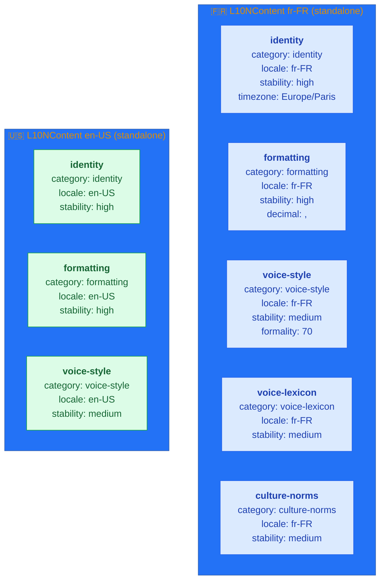

### L10N Categories (v6.5)

| Category | Description | Stability |
|----------|-------------|-----------|
| `identity` | Codes locale, script, timezone, fallback | High |
| `formatting` | Dates, nombres, monnaie, téléphones | High |
| `slug` | Règles de génération slugs | High |
| `voice-style` | Formalité, ton, vouvoiement/tutoiement | Medium |
| `voice-lexicon` | Vocabulaire préféré/évité | Medium |
| `culture-norms` | Normes culturelles, tabous | Medium |
| `culture-references` | Célébrités, événements locaux | Low |
| `market` | Contexte marché, concurrents | Low |

### BlockType → L10N (v6.5 - Property-based)

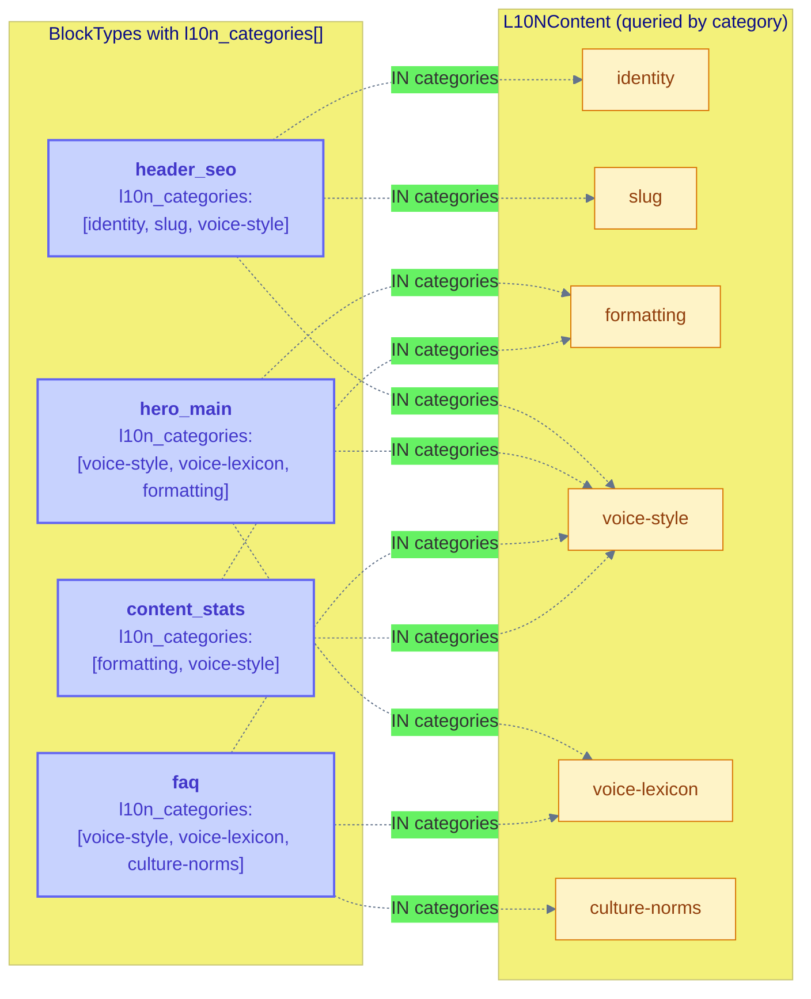

### L10N Query Pattern (v6.5)

```cypher
// Get L10N rules for a BlockType - NO graph traversal!
MATCH (bt:BlockType {key: $blockTypeKey})
MATCH (lc:L10NContent {locale: $locale})
WHERE lc.category IN bt.l10n_categories
RETURN lc.category, lc.content
```

---

## 6. SEO Keywords - SEOKeywordL10n (v6.6 :TARGETS)

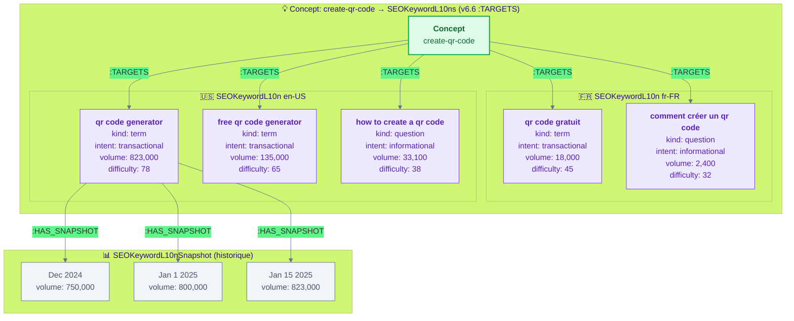

---

## 7. GEO Seeds - GEOSeedL10n & Mining (v6.6)

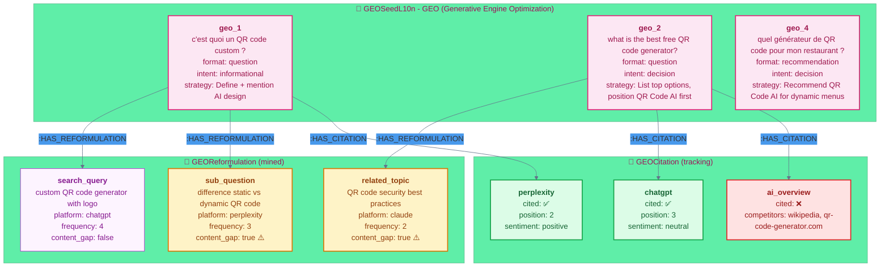

### Mining Run

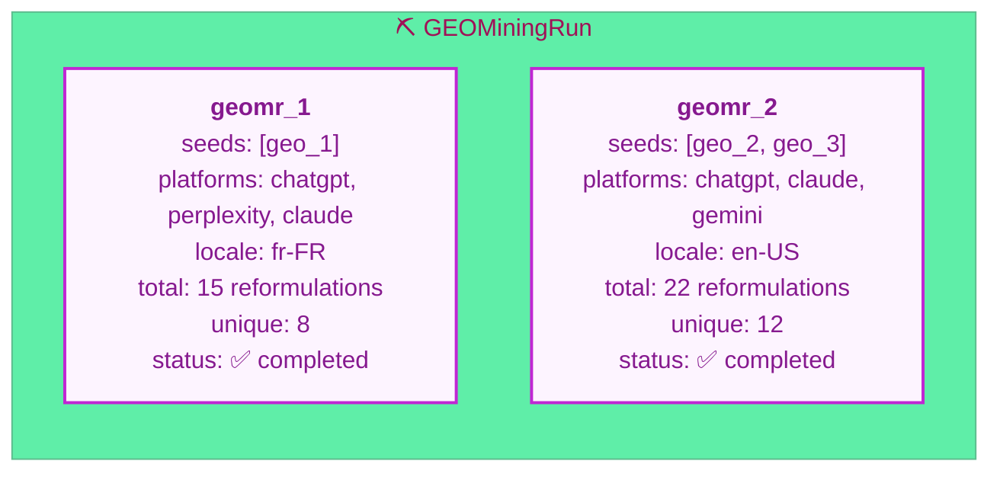

---

## 8. Flux Orchestrateur - Génération de contenu

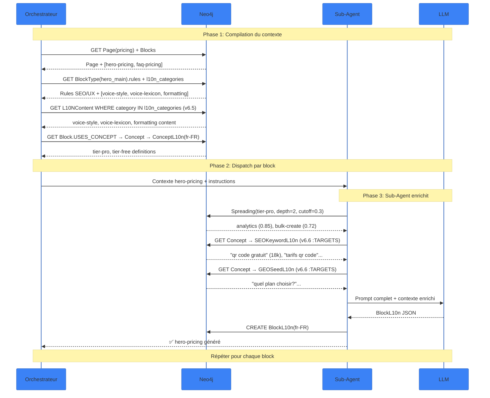

### Contexte chargé par niveau

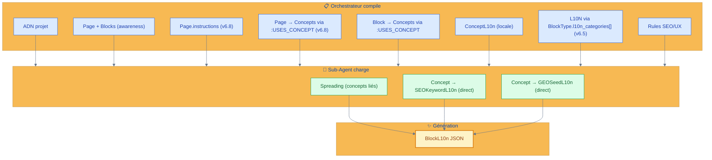

---

## 9. Block → Concept via :USES_CONCEPT

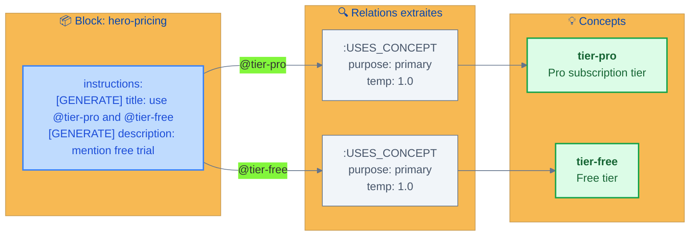

### FAQ Block avec plusieurs concepts

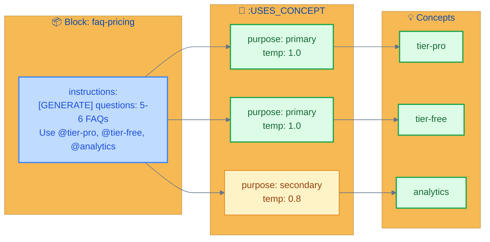

---

## 10. Résumé des relations (v6.8)

| Relation | From | To | Props | Description |
|----------|------|----|-------|-------------|
| `:HAS_PAGE` | Project | Page | - | **v6.7**: Project owns pages |
| `:HAS_CONCEPT` | Project | Concept | - | **v6.7**: Project owns concepts |
| `:HAS_L10N` | Project | L10NContent | - | **v6.7**: Project owns L10N rules |
| `:HAS_L10N` | Concept | ConceptL10n | - | **v6.8**: Concept localized data (replaces :HAS_CONTENT) |
| `:HAS_OUTPUT` | Page | PageL10n | - | **v6.8**: Page generated output (replaces :HAS_CONTENT) |
| `:HAS_OUTPUT` | Block | BlockL10n | - | **v6.8**: Block generated output (replaces :HAS_CONTENT) |
| `:HAS_METRICS` | Page | PageMetrics | - | **v6.8**: Page performance metrics |
| ~~`:HAS_CONTENT`~~ | ~~Page/Block/Concept~~ | ~~*Content~~ | - | **v6.8 REMOVED** → use `:HAS_OUTPUT` or `:HAS_L10N` |
| ~~`:ASSEMBLES`~~ | ~~PageL10n~~ | ~~BlockL10n~~ | ~~position~~ | **v6.7 REMOVED** → use `BlockL10n.position` |
| `:HAS_BLOCK` | Page | Block | - | Structure de page (position sur Block) |
| `:OF_TYPE` | Block | BlockType | - | Type du block |
| `:USES_CONCEPT` | Page | Concept | purpose, temperature | **v6.8**: Page-level concept references |
| `:USES_CONCEPT` | Block | Concept | purpose, temperature | Concepts référencés |
| ~~`:REQUIRES_L10N`~~ | ~~BlockType~~ | ~~L10NType~~ | - | **v6.5 REMOVED** → use `BlockType.l10n_categories[]` |
| `:SEMANTIC_LINK` | Concept | Concept | type, temperature | Spreading activation (v6.5: 10 types) |
| `:TARGETS` | Concept | SEOKeywordL10n/GEOSeedL10n | type | v6.6: renamed from :HAS_QUERY |
| `:HAS_SNAPSHOT` | SEOKeywordL10n | SEOKeywordL10nSnapshot | - | Historique SEO |
| `:HAS_REFORMULATION` | GEOSeedL10n | GEOReformulation | - | Mining LLM |
| `:HAS_CITATION` | GEOSeedL10n | GEOCitation | - | Tracking citations |

### SEMANTIC_LINK Types (v6.5 - Simplified)

| Type | Inverse | Temperature | Description |
|------|---------|-------------|-------------|
| `is_action_on` | `has_action` | 0.95 | Verb-noun (create → qr-code) |
| `has_action` | `is_action_on` | 0.90 | Noun-verb inverse |
| `includes` | `included_in` | 0.85 | Container (tier-pro → analytics) |
| `included_in` | `includes` | 0.80 | Part-whole inverse |
| `type_of` | `has_type` | 0.90 | Taxonomy (vcard → qr-code-type) |
| `has_type` | `type_of` | 0.85 | Is-a inverse |
| `requires` | `required_by` | 0.80 | Dependency |
| `required_by` | `requires` | 0.75 | Dependency inverse |
| `related` | symmetric | 0.60 | Generic association |
| `opposite` | symmetric | 0.40 | Contrast |

---

## Queries Cypher utiles

### Charger contexte complet d'un Block (v6.8)

```cypher
// v6.8: L10N via BlockType.l10n_categories[] property (no graph traversal)
// ConceptL10n replaces ConceptContent, :HAS_L10N replaces :HAS_CONTENT
MATCH (b:Block {key: "hero-pricing"})
MATCH (b)-[:USES_CONCEPT]->(c:Concept)-[:HAS_L10N]->(cl:ConceptL10n {locale: "fr-FR"})
MATCH (b)-[:OF_TYPE]->(bt:BlockType)
MATCH (lc:L10NContent {locale: "fr-FR"})
WHERE lc.category IN bt.l10n_categories
RETURN b.instructions,
       collect(DISTINCT {concept: c.key, title: cl.title, definition: cl.definition}) AS concepts,
       collect(DISTINCT {category: lc.category, content: lc.content}) AS l10n,
       bt.rules
```

### Page complète par locale (v6.8: via BlockL10n.position)

```cypher
// v6.8: PageL10n/BlockL10n replace PageContent/BlockContent
// :HAS_OUTPUT replaces :HAS_CONTENT for Page/Block
MATCH (p:Page {key: "pricing"})-[:HAS_OUTPUT]->(po:PageL10n {locale: "fr-FR"})
MATCH (p)-[:HAS_BLOCK]->(b:Block)-[:HAS_OUTPUT]->(bo:BlockL10n {locale: "fr-FR"})
RETURN p.instructions, po.slug, po.meta_title,
       collect({position: bo.position, content: bo}) AS blocks
ORDER BY bo.position
```

### Spreading Activation

```cypher
MATCH (c:Concept {key: "tier-pro"})-[r:SEMANTIC_LINK*1..2]->(c2:Concept)
WHERE ALL(rel IN r WHERE rel.temperature >= 0.3)
WITH c2, reduce(activation = 1.0, rel IN r | activation * rel.temperature) AS activation
WHERE activation >= 0.3
RETURN c2.key, activation
ORDER BY activation DESC
```

### Content Gaps (GEO)

```cypher
MATCH (georf:GEOReformulation {content_gap: true})
RETURN georf.value, georf.intent, georf.frequency
ORDER BY georf.frequency DESC
```
