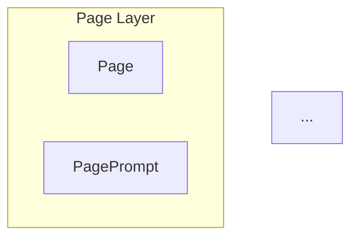

# Unified View System - Implementation Plan

> **Version**: v8.0.0
> **Date**: 2026-01-29
> **Status**: Ready for implementation

## Overview

Create a Unified View System where a single YAML view file serves THREE purposes:
1. **Markdown documentation** - Auto-generated docs in `models/`
2. **Neo4j Browser queries** - Cypher queries ready to copy/paste
3. **NovaNet Studio visualization** - React Flow graph rendering

## Design Decisions

| Decision | Choice | Rationale |
|----------|--------|-----------|
| Source of truth | Hybrid: YAML + Neo4j | YAML for structure, Neo4j for live stats |
| Hook timing | Pre-commit + CI | Auto-regen on changes, CI catches misses |
| Doc format | Tables + Mermaid | API reference style with visual diagrams |
| Cypher queries | Mix extracted + auto | Best of both worlds |
| View count | 9 MVP views | YAGNI applied to initial 16 |

## Views Registry (9 MVP Views)

### Category 1: Overview (2 views)

#### complete-graph
- **Purpose**: Full documentation, all 28 nodes and 50 relations
- **Users**: New developers, documentation readers
- **Output**: `models/GRAPH-DETAILED.md`

#### project-context
- **Purpose**: Project boundaries and configuration
- **Users**: Multi-project managers, architects
- **Shows**: Project → Pages → Blocks + BrandIdentity

### Category 2: Generation (2 views)

#### page-generation
- **Purpose**: Orchestrator context loading
- **Users**: Orchestrator agent
- **Traversal**:
```
Page → PagePrompt → Concepts → ConceptL10n
     → Blocks (ordered)
     → Locale → LocaleKnowledge
     → PageL10n (output)
```

#### block-generation
- **Purpose**: Sub-agent context loading
- **Users**: Block generation sub-agents
- **Traversal**:
```
Block → BlockPrompt → Concepts → ConceptL10n
      → BlockType → BlockRules
      → Locale → LocaleKnowledge (spreading)
      → BlockL10n (output)
```

### Category 3: Localization (2 views)

#### locale-knowledge
- **Purpose**: Understanding LocaleKnowledge system
- **Users**: Locale engineers, content architects
- **Shows**: Locale + all 14 LocaleKnowledge nodes

#### concept-network
- **Purpose**: Concept graph with semantic links
- **Users**: Content architects, ontologists
- **Shows**: Concepts + ConceptL10n + SEMANTIC_LINK

### Category 4: Semantic (1 view)

#### spreading-activation
- **Purpose**: Understand temperature-based traversal
- **Users**: Algorithm developers, ML engineers
- **Shows**: SEMANTIC_LINK with temperature weights

### Category 5: Mining (2 views)

#### seo-pipeline
- **Purpose**: SEO mining and internal linking workflow
- **Users**: SEO specialists
- **Shows**: SEOKeywordL10n → Variations → Snapshots + Links

#### geo-pipeline
- **Purpose**: GEO mining workflow
- **Users**: GEO specialists
- **Shows**: GEOSeedL10n → Reformulations → Citations

## View Schema Extension

```yaml
# models/views/page-generation.yaml
id: page-generation
name: Page Generation Context
description: Full context for orchestrator page generation

# EXISTING: NovaNetFilter + Studio
root:
  type: Page
  binding: key
include:
  - pagePrompt: { relation: HAS_PROMPT, direction: outgoing }
  - concepts: { relation: USES_CONCEPT, direction: outgoing }
  # ... etc

# NEW: Documentation metadata
docs:
  title: "Page Generation View"
  category: generation
  description: |
    This view loads the complete context needed by the orchestrator
    to generate a page across all its blocks.

  # Visual layers for Mermaid diagram
  layers:
    - name: "Page Layer"
      nodes: [Page, PagePrompt]
      color: blue
    - name: "Content Layer"
      nodes: [Block, Concept, ConceptL10n]
      color: green
    - name: "Locale Layer"
      nodes: [Locale, LocaleVoice, LocaleCulture]
      color: orange
    - name: "Output Layer"
      nodes: [PageL10n, BlockL10n]
      color: purple

  # Cypher examples to include in docs
  examples:
    - name: "Load page context for fr-FR"
      description: "Complete context for French page generation"
      query: |
        MATCH (p:Page {key: $pageKey})
        MATCH (p)-[:HAS_PROMPT]->(pp:PagePrompt)
        MATCH (p)-[:HAS_BLOCK]->(b:Block)
        MATCH (b)-[:USES_CONCEPT]->(c:Concept)
        MATCH (c)-[:HAS_L10N]->(cl:ConceptL10n)-[:FOR_LOCALE]->(l:Locale {key: $locale})
        RETURN p, pp, collect(b) AS blocks, collect(c) AS concepts, collect(cl) AS localizations
      params:
        pageKey: "page-pricing"
        locale: "fr-FR"

    - name: "Spreading activation from page concepts"
      description: "Get related concepts with temperature >= 0.3"
      query: |
        MATCH (p:Page {key: $pageKey})-[:HAS_BLOCK]->(b:Block)-[:USES_CONCEPT]->(c:Concept)
        MATCH (c)-[r:SEMANTIC_LINK*1..2]->(related:Concept)
        WHERE ALL(rel IN r WHERE rel.temperature >= 0.3)
        WITH related, reduce(a = 1.0, rel IN r | a * rel.temperature) AS activation
        WHERE activation >= 0.3
        RETURN DISTINCT related.key, activation
        ORDER BY activation DESC
```

## File Structure

```
src/
├── generators/
│   ├── index.ts                    # Exports
│   ├── ViewParser.ts               # Parse + validate view YAML
│   ├── MarkdownGenerator.ts        # Generate MD from view
│   ├── CypherExporter.ts           # Extract Cypher queries
│   └── types.ts                    # Generator types
│
├── __tests__/
│   └── generators/
│       ├── ViewParser.test.ts
│       ├── MarkdownGenerator.test.ts
│       ├── CypherExporter.test.ts
│       └── __snapshots__/          # MD snapshots
│
scripts/
├── generate-docs.ts                # CLI: npm run generate:docs
└── validate-docs.ts                # CLI: npm run validate:docs

models/views/
├── _registry.yaml                  # Extended with docs metadata
├── complete-graph.yaml
├── project-context.yaml
├── page-generation.yaml
├── block-generation.yaml
├── locale-knowledge.yaml
├── concept-network.yaml
├── spreading-activation.yaml
├── seo-pipeline.yaml
└── geo-pipeline.yaml
```

## Implementation Tasks

### Phase 1: Core Generator (Tasks 1-5)

#### Task 1: ViewParser types and schema
- [ ] Create `src/generators/types.ts` with ViewDefinition extension
- [ ] Add Zod schema for `docs` section validation
- [ ] Export types from `src/generators/index.ts`

#### Task 2: ViewParser implementation
- [ ] Create `src/generators/ViewParser.ts`
- [ ] Parse YAML with docs section
- [ ] Validate against schema
- [ ] Unit tests in `src/__tests__/generators/ViewParser.test.ts`

#### Task 3: MarkdownGenerator implementation
- [ ] Create `src/generators/MarkdownGenerator.ts`
- [ ] Generate header with metadata
- [ ] Generate Mermaid diagram from layers
- [ ] Generate node/relation tables
- [ ] Generate Cypher examples with syntax highlighting
- [ ] Unit tests with snapshots

#### Task 4: CypherExporter implementation
- [ ] Create `src/generators/CypherExporter.ts`
- [ ] Extract queries from view definition
- [ ] Generate combined Cypher file per view
- [ ] Unit tests

#### Task 5: Integration test
- [ ] Create `src/__tests__/integration/docs-generation.test.ts`
- [ ] Test full pipeline: YAML → MD
- [ ] Verify generated MD structure

### Phase 2: CLI & Hook (Tasks 6-8)

#### Task 6: generate-docs CLI
- [ ] Create `scripts/generate-docs.ts`
- [ ] Process all views in registry
- [ ] Write to `models/` directory
- [ ] Add `npm run generate:docs` script

#### Task 7: validate-docs CLI
- [ ] Create `scripts/validate-docs.ts`
- [ ] Compare generated vs committed
- [ ] Exit 1 if different
- [ ] Add `npm run validate:docs` script

#### Task 8: Pre-commit hook
- [ ] Create `.claude/hooks/pre-commit-docs.sh`
- [ ] Detect changes in `models/**/*.yaml` or `src/types/**`
- [ ] Run `npm run generate:docs`
- [ ] Auto-stage regenerated MD files

### Phase 3: Views (Tasks 9-11)

#### Task 9: Overview views
- [ ] Create `models/views/complete-graph.yaml` with docs section
- [ ] Create `models/views/project-context.yaml` with docs section
- [ ] Generate initial MD files

#### Task 10: Generation & Localization views
- [ ] Create `models/views/page-generation.yaml`
- [ ] Create `models/views/block-generation.yaml`
- [ ] Create `models/views/locale-knowledge.yaml`
- [ ] Create `models/views/concept-network.yaml`
- [ ] Generate MD files

#### Task 11: Semantic & Mining views
- [ ] Create `models/views/spreading-activation.yaml`
- [ ] Create `models/views/seo-pipeline.yaml`
- [ ] Create `models/views/geo-pipeline.yaml`
- [ ] Generate MD files

### Phase 4: Finalization (Tasks 12-13)

#### Task 12: Update GRAPH-DETAILED.md
- [ ] Replace manual content with generated version
- [ ] Ensure changelog is preserved (manual section)
- [ ] Verify all sections present

#### Task 13: CI integration
- [ ] Add `npm run validate:docs` to CI workflow
- [ ] Document in CLAUDE.md

## Generated Markdown Structure

Each view generates a markdown file with this structure:

```markdown
# {View Title}

> Generated from `models/views/{view-id}.yaml`
> Last updated: {timestamp}

## Overview

{description from docs section}

## Graph Diagram



## Nodes

| Node | Description | Key Properties |
|------|-------------|----------------|
| Page | ... | key, status |
| ... | ... | ... |

## Relations

| From | Relation | To | Description |
|------|----------|-----|-------------|
| Page | HAS_PROMPT | PagePrompt | ... |
| ... | ... | ... | ... |

## Cypher Queries

### Load page context for fr-FR

{description}

```cypher
MATCH (p:Page {key: $pageKey})
...
```

**Parameters:**
- `pageKey`: "page-pricing"
- `locale`: "fr-FR"

---

*Generated by NovaNet Unified View System v8.0.0*
```

## Success Criteria

1. **Single source of truth**: One YAML → Three outputs (MD, Cypher, Studio)
2. **Auto-sync**: Pre-commit hook keeps docs in sync
3. **CI validation**: Build fails if docs outdated
4. **9 views cover all use cases**: Generation, localization, semantic, mining
5. **Graceful degradation**: Works without Neo4j (YAML-only mode)
6. **Test coverage**: Unit + integration + snapshot tests

## Deferred to v8.1

- `output-provenance` view (requires :HAS_OUTPUT tracking)
- `version-history` view (requires timestamp tracking)
- Neo4j live stats injection (node counts, example data)
