# NovaNet Graph Architecture v8.0.0 - DETAILED

Complete visual representation of all 28 nodes and 50 relationships.

> **v8.0.0**: Now with auto-generated view documentation.
> Run `npm run generate:docs` to regenerate.

## View Documentation (Auto-Generated)

| View | Category | Description |
|------|----------|-------------|
| [Complete Graph](views/VIEW-COMPLETE-GRAPH.md) | Overview | Full graph with all 28 nodes and 50 relations |
| [Project Context](views/VIEW-PROJECT-CONTEXT.md) | Overview | Project boundaries and configuration |
| [Page Generation](views/VIEW-PAGE-GENERATION-CONTEXT.md) | Generation | Orchestrator context for page generation |
| [Block Generation](views/VIEW-BLOCK-GENERATION.md) | Generation | Sub-agent context for block generation |
| [Locale Knowledge](views/VIEW-LOCALE-FULL-KNOWLEDGE.md) | Localization | Complete locale knowledge system |
| [Concept Network](views/VIEW-CONCEPT-ECOSYSTEM.md) | Localization | Concept graph with semantic links |
| [Spreading Activation](views/VIEW-BLOCK-SEMANTIC-NETWORK.md) | Semantic | Temperature-based semantic traversal |
| [SEO Pipeline](views/VIEW-SEO-PIPELINE.md) | Mining | SEO keyword mining workflow |
| [GEO Pipeline](views/VIEW-GEO-PIPELINE.md) | Mining | GEO answer engine optimization |

---

## v7.12.1 Changes (SEO Anchor Optimization)

**LINKS_TO Extended Props (for anchor text optimization):**
- **anchor_type** (enum): `exact_match` | `partial_match` | `branded` | `generic`
  - `exact_match`: anchor = ConceptL10n.title exactly (5× traffic, use sparingly max 10%)
  - `partial_match`: anchor includes concept keywords (default)
  - `branded`: anchor = brand name (QR Code AI)
  - `generic`: anchor = "click here", "learn more" (low SEO value)
- **nofollow** (boolean, default false): Set true for login/legal pages to prevent link equity flow

**Updated Cypher Pattern:**
```cypher
-- Create internal link with full SEO control (v7.12.1)
MATCH (source:Page {key:'pricing'})
MATCH (target:Page {key:'tier-pro'})
CREATE (source)-[:LINKS_TO {
  concept_key: "tier-pro",
  context: "cta",
  seo_weight: 0.9,
  anchor_type: "exact_match",  -- v7.12.1
  nofollow: false              -- v7.12.1
}]->(target)
```

## v7.12.0 Changes (Page-to-Page Relationships for SEO)

**Added Relations:**
- **LINKS_TO** (Page → Page): Explicit internal link for SEO
  - Props: `concept_key` (anchor from ConceptL10n.title), `context`, `seo_weight`, `anchor_type`, `nofollow`
  - Note: Page is INVARIANT, anchor text is LOCALIZED via Concept → ConceptL10n
- **SUBTOPIC_OF** (Page → Page): Pillar-cluster SEO hierarchy
  - Cluster page is subtopic of pillar page

**Updated:**
- **PageType.category**: Added `pillar` | `cluster` enum values for SEO hierarchy

**Internal Link Generation Pattern:**
```cypher
-- Get internal links with localized anchors
MATCH (page:Page {key: $key})-[link:LINKS_TO]->(target:Page)
MATCH (c:Concept {key: link.concept_key})-[:HAS_L10N]->(cl:ConceptL10n)-[:FOR_LOCALE]->(l:Locale {key: $locale})
RETURN target.key AS target_page, cl.title AS anchor_text, link.context, link.seo_weight
ORDER BY link.seo_weight DESC
```

## v7.11.0 Changes (Versioning + Simplification)

**Added:**
- **PREVIOUS_VERSION** relation: BlockL10n/PageL10n → BlockL10n/PageL10n (history chain)
- **Versioning properties**: `version`, `published_at`, `replaced_at` on BlockL10n and PageL10n

**Removed:**
- **PageMetrics** node (query GA/PostHog with `published_at`/`replaced_at` date ranges instead)
- **HAS_METRICS** no longer applies to PageL10n → PageMetrics

**Deprecation Notice:**
- `priority`, `freshness`, `icon` standard properties marked for removal (YAGNI)

## v7.10.0 Changes (PageType Node)

**New Node:**
- **PageType**: Template defining meta requirements, layout rules, and block composition
- Mirrors BlockType pattern: `Page -[:OF_TYPE]-> PageType` (like `Block -[:OF_TYPE]-> BlockType`)

**Removed Properties (Page node):**
- `page_type` enum (replaced by PageType node)
- `generation_priority` (redundant with `priority`)

**New Relation:**
- `Page -[:OF_TYPE]-> PageType`

## v7.9.0 Changes (Scope-Based Folder Structure)

**Folder Restructure:**
- `nodes/` now organized by scope: `global/`, `shared/`, `project/`
- Aligns perfectly with Multi-Tenant Architecture below
- JSON Schema added for programmatic validation: `schema/nodes.schema.json`

**New Structure:**
```
models/nodes/
├── global/                       # 🌍 15 nodes - shared by ALL projects
│   ├── config/locale.yaml        # Locale configuration
│   └── knowledge/                # 14 LocaleKnowledge nodes
├── shared/                       # 🎯 6 nodes - reusable across projects
│   ├── seo/                      # SEOKeywordL10n, SEOKeywordMetrics, SEOMiningRun
│   └── geo/                      # GEOSeedL10n, GEOSeedMetrics, GEOMiningRun
└── project/                      # 📦 14 nodes - per-project instances (v7.11.0: -PageMetrics)
    ├── foundation/               # 🏢 Project, BrandIdentity, ProjectL10n
    ├── structure/                # 🔧 Page, Block
    ├── semantic/                 # 💡 Concept, ConceptL10n
    ├── instruction/              # 📝 PageType, PagePrompt, BlockPrompt, BlockType, BlockRules
    └── output/                   # 📤 PageL10n, BlockL10n (v7.11.0: PageMetrics removed)
```

## v7.8.5 Changes (Unified Metrics Pattern)

**Key Changes:**
- **Unified HAS_METRICS**: All time-series observations now use `HAS_METRICS` relation
- **Renamed Nodes**: SEOSnapshot → SEOKeywordMetrics, GEOCitation → GEOSeedMetrics
- **Removed Relations**: `HAS_SNAPSHOT` and `HAS_CITATION` (replaced by `HAS_METRICS`)
- **Standardized Timestamp**: All metrics nodes use `observed_at` field

**Semantic vs Auxiliary Relations:**
```
┌─────────────────────────────────────────────────────────────────────┐
│  SEMANTIC RELATIONS (used in spreading activation, LLM context):   │
│    - SEMANTIC_LINK (temperature: 0.0-1.0)                          │
│    - USES_CONCEPT (temperature: 0.0-1.0)                           │
│                                                                     │
│  AUXILIARY RELATIONS (excluded from spreading activation):          │
│    - HAS_METRICS (time-series observations, no temperature)        │
│    - PREVIOUS_VERSION (version history chain, v7.11.0)             │
│    - LINKS_TO, SUBTOPIC_OF (page relationships, v7.12.0)           │
│    - HAS_BLOCK, HAS_PAGE, OF_TYPE, etc. (structural)               │
└─────────────────────────────────────────────────────────────────────┘
```

## v7.8.0 Features (Hybrid OntologyRAG)

- **Vector Embeddings**: Concept, ConceptL10n, Page nodes now have HNSW embeddings
- **Spreading Activation**: Task-aware graph traversal via SEMANTIC_LINK temperatures
- **Inverse Relationships**: Bidirectional queries without full scans

**Inverse Relationships (v7.8.0):**
| Forward | Inverse | Purpose |
|---------|---------|---------|
| `HAS_L10N` | `L10N_OF` | ConceptL10n/ProjectL10n → Concept/Project |
| `HAS_OUTPUT` | `OUTPUT_OF` | PageL10n/BlockL10n → Page/Block |
| `HAS_BLOCK` | `BLOCK_OF` | Block → Page |
| `USES_CONCEPT` | `USED_BY` | Concept → Page/Block |
| `FOR_LOCALE` | `HAS_LOCALIZED_CONTENT` | Locale → *L10n nodes |

**v7.7.0 Dual-Linking Pattern:**
```
┌─────────────────────────────────────────────────────────────────────┐
│  TARGETS_SEO/GEO (Concept → SEO/GEO) = Cross-locale shortcut        │
│  HAS_SEO/GEO_TARGET (ConceptL10n → SEO/GEO) = Locale-aligned primary│
└─────────────────────────────────────────────────────────────────────┘
```

## Multi-Tenant Architecture

NovaNet uses a **3-layer scope architecture** for multi-tenancy:

```
┌─────────────────────────────────────────────────────────────────────────────┐
│                              SCOPE HIERARCHY                                 │
├─────────────────────────────────────────────────────────────────────────────┤
│                                                                             │
│  ┌───────────────────────────────────────────────────────────────────────┐  │
│  │  🌍 GLOBAL (15 nodes) - Single instance, shared by ALL projects       │  │
│  │                                                                       │  │
│  │  Locale + 14 LocaleKnowledge nodes                                    │  │
│  │                                                                       │  │
│  │  → One definition of "fr-FR" serves all projects                      │  │
│  │  → Cultural/linguistic knowledge is universal                         │  │
│  └───────────────────────────────────────────────────────────────────────┘  │
│                                                                             │
│  ┌───────────────────────────────────────────────────────────────────────┐  │
│  │  🎯 SHARED (8 nodes) - Independent of projects, reusable              │  │
│  │                                                                       │  │
│  │  SEOKeywordL10n, GEOSeedL10n + Discovery nodes + Mining jobs                  │  │
│  │                                                                       │  │
│  │  → Keywords/questions can serve multiple projects                     │  │
│  │  → "créer qr code gratuit" is reusable across projects               │  │
│  └───────────────────────────────────────────────────────────────────────┘  │
│                                                                             │
│  ┌───────────────────────────────────────────────────────────────────────┐  │
│  │  📦 PROJECT (14 nodes) - Per-project instances                        │  │
│  │                                                                       │  │
│  │  Project, BrandIdentity, Page, Block, Concept, Prompts, Outputs...    │  │
│  │                                                                       │  │
│  │  → Each project has its own copy                                      │  │
│  │  → QR Code AI ≠ Other Project                                         │  │
│  └───────────────────────────────────────────────────────────────────────┘  │
│                                                                             │
└─────────────────────────────────────────────────────────────────────────────┘
```

| Scope | Count | Description | Nodes |
|-------|-------|-------------|-------|
| 🌍 **GLOBAL** | 15 | Shared locale knowledge | Locale, LocaleIdentity, LocaleVoice, LocaleCulture, LocaleMarket, LocaleLexicon, LocaleRulesAdaptation, LocaleRulesFormatting, LocaleRulesSlug, LocaleCultureReferences, Expression, Reference, Metaphor, Pattern, Constraint |
| 🎯 **SHARED** | 6 | Reusable targeting data | SEOKeywordL10n, SEOKeywordMetrics, SEOMiningRun, GEOSeedL10n, GEOSeedMetrics, GEOMiningRun |
| 📦 **PROJECT** | 14 | Per-project content | Project, BrandIdentity, ProjectL10n, Page, Block, Concept, ConceptL10n, PageType, BlockType, BlockRules, PagePrompt, BlockPrompt, PageL10n, BlockL10n |

## Classification System

NovaNet nodes have **two orthogonal classification axes**:

1. **Locale Behavior** (🔵🟢🟣⚪⚙️) - How the node relates to locales
2. **Functional Role** (🏢🔧💡📝🌍🟣🎯📤⛏️⚙️📊) - What the node does in the system

## Naming Philosophy

```
┌─────────────────────────────────────────────────────────────────────┐
│  *L10n suffix → ALL localized content (human OR LLM generated)      │
│  :HAS_L10N    → human-curated (ConceptL10n, ProjectL10n)            │
│  :HAS_OUTPUT  → LLM-generated (PageL10n, BlockL10n)                 │
│  :HAS_SEO_TARGET → locale-aligned SEO targeting (v7.7.0)            │
│  :HAS_GEO_TARGET → locale-aligned GEO targeting (v7.7.0)            │
└─────────────────────────────────────────────────────────────────────┘
```

## Invariant vs Localized

```
┌─────────────────────────────────────────────────────────────────────┐
│  INVARIANT (🔵) = Language-independent, defined ONCE                │
│  LOCALIZED (🟢) = Per-locale content, has :FOR_LOCALE → Locale      │
│  LOCALE KNOWLEDGE (🟣) = Attached TO a Locale (not FOR a locale)    │
└─────────────────────────────────────────────────────────────────────┘
```

| Type | Nodes | Description |
|------|-------|-------------|
| **INVARIANT** 🔵 | Project, BrandIdentity, Concept, Page, Block, BlockType, PagePrompt, BlockPrompt, BlockRules, Locale | Defined once, no locale dependency |
| **LOCALIZED** 🟢 | ProjectL10n, ConceptL10n, PageL10n, BlockL10n, SEOKeywordL10n, GEOSeedL10n | Has `:FOR_LOCALE` → exists per locale |
| **LOCALE KNOWLEDGE** 🟣 | LocaleIdentity, LocaleVoice, LocaleCulture, LocaleMarket, LocaleLexicon, LocaleRulesAdaptation, LocaleRulesFormatting, LocaleRulesSlug, LocaleCultureReferences, Expression, Reference, Metaphor, Pattern, Constraint | Knowledge ABOUT a locale |
| **DERIVED** ⚪ | SEOKeywordMetrics, GEOSeedMetrics | Inherits locale from parent (v7.11.0: PageMetrics removed) |
| **JOBS** ⚙️ | SEOMiningRun, GEOMiningRun | Background jobs, no locale |

## Functional Role Classification

```
┌─────────────────────────────────────────────────────────────────────┐
│  FUNCTIONAL ROLE = What the node DOES in the generation pipeline    │
│  Orthogonal to locale behavior (a node has BOTH classifications)    │
└─────────────────────────────────────────────────────────────────────┘
```

**Within PROJECT scope (15 nodes):**

| Role | Icon | Description | Nodes |
|------|------|-------------|-------|
| **FOUNDATION** | 🏢 | Project root & identity | Project, BrandIdentity, ProjectL10n |
| **STRUCTURE** | 🔧 | Content scaffolding (what exists) | Page, Block |
| **SEMANTIC** | 💡 | Meaning & concepts for AI context | Concept, ConceptL10n |
| **INSTRUCTION** | 📝 | AI generation directives | PageType, PagePrompt, BlockPrompt, BlockType, BlockRules |
| **OUTPUT** | 📤 | LLM-generated content (v7.11.0: PageMetrics removed) | PageL10n, BlockL10n |

**Within GLOBAL scope (15 nodes):**

| Role | Icon | Description | Nodes |
|------|------|-------------|-------|
| **LOCALE_CONFIG** | 🌍 | Locale definitions & fallbacks | Locale |
| **LOCALE_KNOWLEDGE** | 🟣 | Cultural/linguistic knowledge | LocaleIdentity, LocaleVoice, LocaleCulture, LocaleMarket, LocaleLexicon, LocaleRulesAdaptation, LocaleRulesFormatting, LocaleRulesSlug, LocaleCultureReferences, Expression, Reference, Metaphor, Pattern, Constraint |

**Within SHARED scope (6 nodes):**

| Role | Icon | Description | Nodes |
|------|------|-------------|-------|
| **TARGETING** | 🎯 | SEO/GEO optimization goals | SEOKeywordL10n, GEOSeedL10n |
| **METRICS** | 📊 | Time-series observations (v7.8.5: unified pattern) | SEOKeywordMetrics, GEOSeedMetrics |
| **JOB** | ⚙️ | Background processing tasks | SEOMiningRun, GEOMiningRun |

### Generation Pipeline Flow

```
┌──────────────────────────────────────────────────────────────────────────────┐
│                        GENERATION PIPELINE                                    │
├──────────────────────────────────────────────────────────────────────────────┤
│                                                                              │
│   🏢 FOUNDATION          🔧 STRUCTURE          💡 SEMANTIC                   │
│   ┌─────────────┐       ┌─────────────┐       ┌─────────────┐               │
│   │ Project     │──────▶│ Page        │◀──────│ Concept     │               │
│   │ BrandId     │       │ Block       │       │ ConceptL10n │               │
│   │ ProjectL10n │       └──────┬──────┘       └─────────────┘               │
│   └─────────────┘              │                      │                      │
│                                │                      │                      │
│                                ▼                      ▼                      │
│                         📝 INSTRUCTION          🎯 TARGETING                 │
│                         ┌─────────────┐         ┌─────────────┐             │
│                         │ PagePrompt  │         │ SEOKeywordL10n  │             │
│                         │ BlockPrompt │         │ GEOSeedL10n     │             │
│                         │ BlockType   │         └──────┬──────┘             │
│                         │ BlockRules  │                │                    │
│                         └──────┬──────┘                │                    │
│                                │                       │                    │
│   🌍 LOCALE_CONFIG             │                       │                    │
│   ┌─────────────┐              │                       │                    │
│   │ Locale      │──────────────┼───────────────────────┤                    │
│   └──────┬──────┘              │                       │                    │
│          │                     ▼                       ▼                    │
│   🟣 LOCALE_KNOWLEDGE    ┌───────────────────────────────────┐              │
│   ┌─────────────┐        │         📤 OUTPUT                 │              │
│   │ Identity    │───────▶│  PageL10n ◀── assembles ── BlockL10n │           │
│   │ Voice       │        │                                   │              │
│   │ Culture     │        │  ┌─ PREVIOUS_VERSION ─┐          │              │
│   │ Market      │        │  │ (history chain)    │          │              │
│   │ Lexicon     │        │  └───────────────────┘           │              │
│   │ Rules*      │        └───────────────────────────────────┘              │
│   │ Expression  │                                                           │
│   │ Reference   │        (v7.11.0: PageMetrics removed -                    │
│   │ Metaphor    │         query GA/PostHog with date ranges)                │
│   │ Pattern     │                                                           │
│   │ Constraint  │                                                           │
│   └─────────────┘                                                           │
│                                                                              │
├──────────────────────────────────────────────────────────────────────────────┤
│                        MINING PIPELINE (async)                               │
├──────────────────────────────────────────────────────────────────────────────┤
│                                                                              │
│   🎯 TARGETING ──────▶ ⚙️ JOB ──────▶ 📊 METRICS (v7.8.5)                    │
│   ┌─────────────┐     ┌─────────────┐     ┌────────────────────┐            │
│   │ SEOKeywordL10n│────▶│ SEOMiningRun│     │ SEOKeywordMetrics  │            │
│   │ GEOSeedL10n   │────▶│ GEOMiningRun│     │ GEOSeedMetrics     │            │
│   └───────┬───────┘     └─────────────┘     └────────────────────┘            │
│           │                                           ▲                       │
│           └───────────[HAS_METRICS]───────────────────┘                       │
│                                                                              │
└──────────────────────────────────────────────────────────────────────────────┘
```

### Combined Classification Matrix

| Node | Scope | Locale Behavior | Functional Role |
|------|-------|-----------------|-----------------|
| Project | 📦 PROJECT | 🔵 INVARIANT | 🏢 FOUNDATION |
| BrandIdentity | 📦 PROJECT | 🔵 INVARIANT | 🏢 FOUNDATION |
| ProjectL10n | 📦 PROJECT | 🟢 LOCALIZED | 🏢 FOUNDATION |
| Page | 📦 PROJECT | 🔵 INVARIANT | 🔧 STRUCTURE |
| Block | 📦 PROJECT | 🔵 INVARIANT | 🔧 STRUCTURE |
| PageType | 📦 PROJECT | 🔵 INVARIANT | 📝 INSTRUCTION |
| BlockType | 📦 PROJECT | 🔵 INVARIANT | 📝 INSTRUCTION |
| Concept | 📦 PROJECT | 🔵 INVARIANT | 💡 SEMANTIC |
| ConceptL10n | 📦 PROJECT | 🟢 LOCALIZED | 💡 SEMANTIC |
| PagePrompt | 📦 PROJECT | 🔵 INVARIANT | 📝 INSTRUCTION |
| BlockPrompt | 📦 PROJECT | 🔵 INVARIANT | 📝 INSTRUCTION |
| BlockRules | 📦 PROJECT | 🔵 INVARIANT | 📝 INSTRUCTION |
| PageL10n | 📦 PROJECT | 🟢 LOCALIZED | 📤 OUTPUT |
| BlockL10n | 📦 PROJECT | 🟢 LOCALIZED | 📤 OUTPUT |
| Locale | 🌍 GLOBAL | 🔵 INVARIANT | 🌍 LOCALE_CONFIG |
| LocaleIdentity | 🌍 GLOBAL | 🟣 LOCALE_KNOWLEDGE | 🟣 LOCALE_KNOWLEDGE |
| LocaleVoice | 🌍 GLOBAL | 🟣 LOCALE_KNOWLEDGE | 🟣 LOCALE_KNOWLEDGE |
| LocaleCulture | 🌍 GLOBAL | 🟣 LOCALE_KNOWLEDGE | 🟣 LOCALE_KNOWLEDGE |
| LocaleMarket | 🌍 GLOBAL | 🟣 LOCALE_KNOWLEDGE | 🟣 LOCALE_KNOWLEDGE |
| LocaleLexicon | 🌍 GLOBAL | 🟣 LOCALE_KNOWLEDGE | 🟣 LOCALE_KNOWLEDGE |
| LocaleRulesAdaptation | 🌍 GLOBAL | 🟣 LOCALE_KNOWLEDGE | 🟣 LOCALE_KNOWLEDGE |
| LocaleRulesFormatting | 🌍 GLOBAL | 🟣 LOCALE_KNOWLEDGE | 🟣 LOCALE_KNOWLEDGE |
| LocaleRulesSlug | 🌍 GLOBAL | 🟣 LOCALE_KNOWLEDGE | 🟣 LOCALE_KNOWLEDGE |
| LocaleCultureReferences | 🌍 GLOBAL | 🟣 LOCALE_KNOWLEDGE | 🟣 LOCALE_KNOWLEDGE |
| Expression | 🌍 GLOBAL | 🟣 LOCALE_KNOWLEDGE | 🟣 LOCALE_KNOWLEDGE |
| Reference | 🌍 GLOBAL | 🟣 LOCALE_KNOWLEDGE | 🟣 LOCALE_KNOWLEDGE |
| Metaphor | 🌍 GLOBAL | 🟣 LOCALE_KNOWLEDGE | 🟣 LOCALE_KNOWLEDGE |
| Pattern | 🌍 GLOBAL | 🟣 LOCALE_KNOWLEDGE | 🟣 LOCALE_KNOWLEDGE |
| Constraint | 🌍 GLOBAL | 🟣 LOCALE_KNOWLEDGE | 🟣 LOCALE_KNOWLEDGE |
| SEOKeywordL10n | 🎯 SHARED | 🟢 LOCALIZED | 🎯 TARGETING |
| SEOKeywordMetrics | 🎯 SHARED | ⚪ DERIVED | 📊 METRICS |
| SEOMiningRun | 🎯 SHARED | ⚙️ JOB | ⚙️ JOB |
| GEOSeedL10n | 🎯 SHARED | 🟢 LOCALIZED | 🎯 TARGETING |
| GEOSeedMetrics | 🎯 SHARED | ⚪ DERIVED | 📊 METRICS |
| GEOMiningRun | 🎯 SHARED | ⚙️ JOB | ⚙️ JOB |

## Complete Graph

```mermaid
flowchart TB
    %% ═══════════════════════════════════════════════════════════════════════════
    %% STYLING
    %% ═══════════════════════════════════════════════════════════════════════════
    classDef invariant fill:#3b82f6,stroke:#1d4ed8,color:#fff
    classDef localized fill:#22c55e,stroke:#16a34a,color:#fff
    classDef localeKnowledge fill:#8b5cf6,stroke:#7c3aed,color:#fff
    classDef derived fill:#9ca3af,stroke:#6b7280,color:#fff
    classDef job fill:#6b7280,stroke:#4b5563,color:#fff

    %% ═══════════════════════════════════════════════════════════════════════════
    %% LAYER 1: GLOBAL (shared across ALL projects)
    %% ═══════════════════════════════════════════════════════════════════════════
    subgraph GLOBAL_LAYER["🌍 GLOBAL LAYER (15 nodes - shared)"]
        direction TB
        Locale["🔵 Locale<br/><i>INVARIANT</i><br/>fr-FR, en-US"]

        subgraph KNOWLEDGE["🟣 LOCALE KNOWLEDGE"]
            LocaleIdentity["LocaleIdentity"]
            LocaleVoice["LocaleVoice"]
            LocaleCulture["LocaleCulture"]
            LocaleMarket["LocaleMarket"]
            LocaleLexicon["LocaleLexicon"]
            LocaleRulesAdapt["RulesAdaptation"]
            LocaleRulesFmt["RulesFormatting"]
            LocaleRulesSlug["RulesSlug"]
        end

        subgraph DATA["🟣 LOCALE DATA"]
            LocaleCultureRefs["CultureReferences"]
            Expression["Expression"]
            Reference["Reference"]
            Metaphor["Metaphor"]
            Pattern["Pattern"]
            Constraint["Constraint"]
        end
    end

    %% ═══════════════════════════════════════════════════════════════════════════
    %% LAYER 2: SHARED (independent of projects, reusable)
    %% ═══════════════════════════════════════════════════════════════════════════
    subgraph SHARED_LAYER["🎯 SHARED LAYER (6 nodes - reusable)"]
        direction TB

        subgraph SEO["🔍 SEO"]
            SEOKeywordL10n["🟢 SEOKeywordL10n<br/><i>LOCALIZED</i>"]
            SEOKeywordMetrics["⚪ SEOKeywordMetrics<br/><i>DERIVED</i>"]
            SEOMiningRun["⚙️ SEOMiningRun<br/><i>JOB</i>"]
        end

        subgraph GEO["🤖 GEO"]
            GEOSeedL10n["🟢 GEOSeedL10n<br/><i>LOCALIZED</i>"]
            GEOSeedMetrics["⚪ GEOSeedMetrics<br/><i>DERIVED</i>"]
            GEOMiningRun["⚙️ GEOMiningRun<br/><i>JOB</i>"]
        end
    end

    %% ═══════════════════════════════════════════════════════════════════════════
    %% LAYER 3: PROJECT (per-project instances)
    %% ═══════════════════════════════════════════════════════════════════════════
    subgraph PROJECT_LAYER["📦 PROJECT LAYER (14 nodes - per-project)"]
        direction TB

        subgraph FOUNDATION["🏢 FOUNDATION"]
            Project["🔵 Project<br/><i>INVARIANT</i><br/>Multi-tenant root"]
            BrandIdentity["🔵 BrandIdentity<br/><i>INVARIANT</i><br/>Visual direction"]
            ProjectL10n["🟢 ProjectL10n<br/><i>LOCALIZED</i><br/>tagline, audience"]
        end

        subgraph STRUCTURE["🔧 STRUCTURE"]
            Page["🔵 Page<br/><i>INVARIANT</i><br/>Page structure"]
            Block["🔵 Block<br/><i>INVARIANT</i><br/>Page section"]
        end

        subgraph SEMANTIC["💡 SEMANTIC"]
            Concept["🔵 Concept<br/><i>INVARIANT</i><br/>Semantic unit"]
            ConceptL10n["🟢 ConceptL10n<br/><i>LOCALIZED</i><br/>title, summary"]
        end

        subgraph INSTRUCTION["📝 INSTRUCTION"]
            subgraph PAGE_TEMPLATE["📄 PAGE TEMPLATE"]
                PageType["🔵 PageType<br/><i>INVARIANT</i><br/>Template"]
                PagePrompt["🔵 PagePrompt<br/><i>INVARIANT</i>"]
            end
            subgraph BLOCK_TEMPLATE["🧩 BLOCK TEMPLATE"]
                BlockType["🔵 BlockType<br/><i>INVARIANT</i><br/>Template"]
                BlockRules["🔵 BlockRules<br/><i>INVARIANT</i>"]
                BlockPrompt["🔵 BlockPrompt<br/><i>INVARIANT</i>"]
            end
        end

        subgraph OUTPUT["📤 OUTPUT"]
            PageL10n["🟢 PageL10n<br/><i>LOCALIZED</i><br/>LLM assembled"]
            BlockL10n["🟢 BlockL10n<br/><i>LOCALIZED</i><br/>LLM generated"]
        end
    end

    %% ═══════════════════════════════════════════════════════════════════════════
    %% RELATIONSHIPS - PROJECT
    %% ═══════════════════════════════════════════════════════════════════════════
    Project -->|"HAS_BRAND_IDENTITY"| BrandIdentity
    Project -->|"HAS_L10N"| ProjectL10n
    Project -->|"HAS_CONCEPT"| Concept
    Project -->|"HAS_PAGE"| Page
    Project -->|"SUPPORTS_LOCALE<br/>{status}"| Locale
    Project -->|"DEFAULT_LOCALE"| Locale

    %% ═══════════════════════════════════════════════════════════════════════════
    %% RELATIONSHIPS - CONTENT
    %% ═══════════════════════════════════════════════════════════════════════════
    Concept -->|"HAS_L10N"| ConceptL10n
    Concept -->|"SEMANTIC_LINK<br/>{type, temperature}"| Concept
    Concept -->|"TARGETS_SEO<br/>(shortcut)"| SEOKeywordL10n
    Concept -->|"TARGETS_GEO<br/>(shortcut)"| GEOSeedL10n
    Page -->|"OF_TYPE"| PageType
    Page -->|"HAS_BLOCK<br/>{position}"| Block
    Page -->|"USES_CONCEPT"| Concept
    Page -->|"LINKS_TO<br/>{concept_key, context, seo_weight}"| Page
    Page -->|"SUBTOPIC_OF"| Page
    Page -->|"HAS_OUTPUT"| PageL10n
    Page -->|"HAS_PROMPT"| PagePrompt
    Block -->|"OF_TYPE"| BlockType
    Block -->|"USES_CONCEPT"| Concept
    Block -->|"HAS_OUTPUT"| BlockL10n
    Block -->|"HAS_PROMPT"| BlockPrompt

    %% ═══════════════════════════════════════════════════════════════════════════
    %% RELATIONSHIPS - FOR_LOCALE (localized content → Locale)
    %% ═══════════════════════════════════════════════════════════════════════════
    ProjectL10n -->|"FOR_LOCALE"| Locale
    ConceptL10n -->|"FOR_LOCALE"| Locale
    PageL10n -->|"FOR_LOCALE"| Locale
    BlockL10n -->|"FOR_LOCALE"| Locale
    SEOKeywordL10n -->|"FOR_LOCALE"| Locale
    GEOSeedL10n -->|"FOR_LOCALE"| Locale

    %% ═══════════════════════════════════════════════════════════════════════════
    %% RELATIONSHIPS - LOCALE-ALIGNED TARGETING (v7.7.0)
    %% Primary SEO/GEO targeting: ConceptL10n → SEOKeywordL10n/GEOSeedL10n (same locale)
    %% v7.8.1: Removed PAGE_TARGETS_SEO/GEO - use Concept path instead
    %% ═══════════════════════════════════════════════════════════════════════════
    ConceptL10n -->|"HAS_SEO_TARGET<br/>{role, priority}"| SEOKeywordL10n
    ConceptL10n -->|"HAS_GEO_TARGET<br/>{role, priority}"| GEOSeedL10n
    %% REMOVED v7.8.1: PAGE_TARGETS_SEO/GEO (bypasses semantic grouping)
    %% Correct flow: Page → Concept → ConceptL10n → SEOKeywordL10n/GEOSeedL10n

    %% ═══════════════════════════════════════════════════════════════════════════
    %% RELATIONSHIPS - LOCALE KNOWLEDGE (attached TO locale)
    %% ═══════════════════════════════════════════════════════════════════════════
    Locale -->|"FALLBACK_TO"| Locale
    Locale -->|"VARIANT_OF"| Locale
    Locale -->|"HAS_IDENTITY"| LocaleIdentity
    Locale -->|"HAS_VOICE"| LocaleVoice
    Locale -->|"HAS_CULTURE"| LocaleCulture
    Locale -->|"HAS_MARKET"| LocaleMarket
    Locale -->|"HAS_LEXICON"| LocaleLexicon
    Locale -->|"HAS_RULES_ADAPTATION"| LocaleRulesAdapt
    Locale -->|"HAS_RULES_FORMATTING"| LocaleRulesFmt
    Locale -->|"HAS_RULES_SLUG"| LocaleRulesSlug
    LocaleCulture -->|"HAS_CULTURE_REFERENCES"| LocaleCultureRefs
    LocaleCulture -->|"HAS_CONSTRAINT"| Constraint
    LocaleCultureRefs -->|"HAS_REFERENCE"| Reference
    LocaleCultureRefs -->|"HAS_METAPHOR"| Metaphor
    LocaleLexicon -->|"HAS_EXPRESSION"| Expression
    LocaleRulesFmt -->|"HAS_PATTERN"| Pattern

    %% ═══════════════════════════════════════════════════════════════════════════
    %% RELATIONSHIPS - GENERATION
    %% ═══════════════════════════════════════════════════════════════════════════
    BlockType -->|"HAS_RULES"| BlockRules
    PagePrompt -->|"GENERATED"| PageL10n
    BlockPrompt -->|"GENERATED"| BlockL10n
    PageL10n -->|"ASSEMBLES<br/>{position}"| BlockL10n
    PageL10n -->|"BELONGS_TO_PROJECT_L10N"| ProjectL10n
    PageL10n -->|"PREVIOUS_VERSION"| PageL10n
    BlockL10n -->|"PREVIOUS_VERSION"| BlockL10n

    %% ═══════════════════════════════════════════════════════════════════════════
    %% RELATIONSHIPS - PROVENANCE
    %% v7.9.0: REMOVED USED_SEO_KEYWORD, USED_GEO_SEED (SEO/GEO is at ConceptL10n level)
    %% Provenance: BlockL10n -> INFLUENCED_BY -> ConceptL10n -> HAS_*_TARGET -> SEO/GEO
    %% ═══════════════════════════════════════════════════════════════════════════
    BlockL10n -->|"INFLUENCED_BY<br/>{weight}"| ConceptL10n
    BlockL10n -->|"GENERATED_FROM"| BlockType

    %% ═══════════════════════════════════════════════════════════════════════════
    %% RELATIONSHIPS - SEO/GEO MINING (v7.8.5: unified HAS_METRICS)
    %% ═══════════════════════════════════════════════════════════════════════════
    SEOMiningRun -->|"SEO_MINES"| SEOKeywordL10n
    SEOKeywordL10n -->|"HAS_METRICS"| SEOKeywordMetrics
    GEOMiningRun -->|"GEO_MINES"| GEOSeedL10n
    GEOSeedL10n -->|"HAS_METRICS"| GEOSeedMetrics

    %% ═══════════════════════════════════════════════════════════════════════════
    %% APPLY STYLES
    %% ═══════════════════════════════════════════════════════════════════════════
    class Project,BrandIdentity,Concept,Page,Block,BlockType,PageType,Locale invariant
    class PagePrompt,BlockPrompt,BlockRules invariant
    class ProjectL10n,ConceptL10n,PageL10n,BlockL10n,SEOKeywordL10n,GEOSeedL10n localized
    class LocaleIdentity,LocaleVoice,LocaleCulture,LocaleMarket,LocaleLexicon localeKnowledge
    class LocaleRulesAdapt,LocaleRulesFmt,LocaleRulesSlug localeKnowledge
    class LocaleCultureRefs,Expression,Reference,Metaphor,Pattern,Constraint localeKnowledge
    class SEOKeywordMetrics,GEOSeedMetrics derived
    class SEOMiningRun,GEOMiningRun job
```



## Node Classification Summary

### 🔵 INVARIANT (11 nodes)
Defined once, language-independent. Same across all locales.

| Node | Purpose |
|------|---------|
| Project | Multi-tenant root |
| BrandIdentity | Visual identity (colors, fonts) |
| Concept | Semantic unit (action-create-qr) |
| Page | Page structure (page-pricing) |
| Block | Page section (block-hero) |
| PageType | Page template (meta, layout, required blocks) |
| BlockType | Block template definition |
| PagePrompt | Orchestrator instructions |
| BlockPrompt | Sub-agent instructions |
| BlockRules | Generation rules |
| Locale | Locale definition (fr-FR) |

### 🟢 LOCALIZED (6 nodes)
Per-locale content. Has `:FOR_LOCALE` → `Locale`.

| Node | Relationship | Source |
|------|--------------|--------|
| ProjectL10n | `:HAS_L10N` | Human-curated |
| ConceptL10n | `:HAS_L10N` | Human-curated |
| PageL10n | `:HAS_OUTPUT` | LLM-generated |
| BlockL10n | `:HAS_OUTPUT` | LLM-generated |
| SEOKeywordL10n | direct | SEO research |
| GEOSeedL10n | direct | GEO research |

### 🟣 LOCALE KNOWLEDGE (14 nodes)
Knowledge ABOUT a locale. Hierarchical attachment structure.

| Node | Parent | Relationship |
|------|--------|--------------|
| LocaleIdentity | Locale | HAS_IDENTITY |
| LocaleVoice | Locale | HAS_VOICE |
| LocaleCulture | Locale | HAS_CULTURE |
| LocaleMarket | Locale | HAS_MARKET |
| LocaleLexicon | Locale | HAS_LEXICON |
| LocaleRulesAdaptation | Locale | HAS_RULES_ADAPTATION |
| LocaleRulesFormatting | Locale | HAS_RULES_FORMATTING |
| LocaleRulesSlug | Locale | HAS_RULES_SLUG |
| LocaleCultureReferences | LocaleCulture | HAS_CULTURE_REFERENCES |
| Expression | LocaleLexicon | HAS_EXPRESSION |
| Reference | LocaleCultureReferences | HAS_REFERENCE |
| Metaphor | LocaleCultureReferences | HAS_METAPHOR |
| Pattern | LocaleRulesFormatting | HAS_PATTERN |
| Constraint | LocaleCulture | HAS_CONSTRAINT |

### ⚪ DERIVED (2 nodes)
Inherits locale from parent node. Uses unified `HAS_METRICS` relation (v7.8.5, v7.11.0: PageMetrics removed).

| Node | Parent | Inherits locale via |
|------|--------|---------------------|
| SEOKeywordMetrics | SEOKeywordL10n | HAS_METRICS |
| GEOSeedMetrics | GEOSeedL10n | HAS_METRICS |

### ⚙️ JOBS (2 nodes)
Background jobs, no locale association.

| Node | Purpose |
|------|---------|
| SEOMiningRun | SEO mining job |
| GEOMiningRun | GEO mining job |

## Relationship Properties Reference

| Relationship | Props | Description |
|--------------|-------|-------------|
| `SUPPORTS_LOCALE` | `status: str` | active \| pending \| disabled |
| `DEFAULT_LOCALE` | (none) | Exactly one per project |
| `HAS_BLOCK` | `position: int` | Display order |
| `USES_CONCEPT` | `purpose, temperature` | primary/secondary/contextual |
| `SEMANTIC_LINK` | `type, temperature` | Concept relationships |
| `HAS_SEO_TARGET` | `role, priority` | **v7.7.0** locale-aligned: primary/secondary/long-tail |
| `HAS_GEO_TARGET` | `role, priority` | **v7.7.0** locale-aligned: primary/contextual |
| `TARGETS_SEO` | `status, priority` | Cross-locale shortcut: active/paused/archived |
| `TARGETS_GEO` | `status, priority` | Cross-locale shortcut: active/monitoring/archived |
| ~~`PAGE_TARGETS_SEO`~~ | ~~`priority`~~ | **REMOVED v7.8.1** - use Page → Concept path |
| ~~`PAGE_TARGETS_GEO`~~ | ~~`priority`~~ | **REMOVED v7.8.1** - use Page → Concept path |
| `GENERATED` | `generated_at` | Provenance timestamp |
| `ASSEMBLES` | `position` | Block order in page |
| `INFLUENCED_BY` | `weight, concept_version` | Provenance tracking |
| `PREVIOUS_VERSION` | (none) | **v7.11.0** history chain: BlockL10n/PageL10n → previous |
| `LINKS_TO` | `concept_key, context, seo_weight` | **v7.12.0** explicit internal link (Page → Page) |
| `SUBTOPIC_OF` | (none) | **v7.12.0** pillar-cluster hierarchy (Page → Page) |

## Statistics

### By Scope (Multi-Tenant)

| Scope | Count | Description | Nodes |
|-------|-------|-------------|-------|
| 🌍 **GLOBAL** | 15 | Shared locale knowledge | Locale, LocaleIdentity, LocaleVoice, LocaleCulture, LocaleMarket, LocaleLexicon, LocaleRulesAdaptation, LocaleRulesFormatting, LocaleRulesSlug, LocaleCultureReferences, Expression, Reference, Metaphor, Pattern, Constraint |
| 🎯 **SHARED** | 6 | Reusable targeting data | SEOKeywordL10n, SEOKeywordMetrics, SEOMiningRun, GEOSeedL10n, GEOSeedMetrics, GEOMiningRun |
| 📦 **PROJECT** | 14 | Per-project content | Project, BrandIdentity, ProjectL10n, Page, Block, Concept, ConceptL10n, PageType, BlockType, BlockRules, PagePrompt, BlockPrompt, PageL10n, BlockL10n |

### By Locale Behavior

| Category | Count | Nodes |
|----------|-------|-------|
| 🔵 INVARIANT | 11 | Project, BrandIdentity, Concept, Page, Block, PageType, BlockType, PagePrompt, BlockPrompt, BlockRules, Locale |
| 🟢 LOCALIZED | 6 | ProjectL10n, ConceptL10n, PageL10n, BlockL10n, SEOKeywordL10n, GEOSeedL10n |
| 🟣 LOCALE_KNOWLEDGE | 14 | LocaleIdentity, LocaleVoice, LocaleCulture, LocaleMarket, LocaleLexicon, LocaleRulesAdaptation, LocaleRulesFormatting, LocaleRulesSlug, LocaleCultureReferences, Expression, Reference, Metaphor, Pattern, Constraint |
| ⚪ DERIVED | 2 | SEOKeywordMetrics, GEOSeedMetrics |
| ⚙️ JOB | 2 | SEOMiningRun, GEOMiningRun |

### By Functional Role (within PROJECT scope)

| Role | Count | Nodes |
|------|-------|-------|
| 🏢 FOUNDATION | 3 | Project, BrandIdentity, ProjectL10n |
| 🔧 STRUCTURE | 2 | Page, Block |
| 💡 SEMANTIC | 2 | Concept, ConceptL10n |
| 📝 INSTRUCTION | 5 | PageType, PagePrompt, BlockPrompt, BlockType, BlockRules |
| 📤 OUTPUT | 2 | PageL10n, BlockL10n |

### Summary

| Metric | Count |
|--------|-------|
| **Total Nodes** | 35 |
| **Total Relationships** | 63 |
| **Scope Layers** | 3 (Global, Shared, Project) |
| **Locale Behavior Categories** | 5 |
| **Functional Role Categories** | 5 (within PROJECT) |
| **Inverse Relationships** | 5 (v7.8.0) |
| **Page-to-Page Relations** | 2 (v7.12.0: LINKS_TO, SUBTOPIC_OF) |

## SEO/GEO Targeting Pattern (v7.7.0)

**Dual-Linking for Ontological Correctness + Query Performance:**

```
┌─────────────────────────────────────────────────────────────────────────────────┐
│                                                                                 │
│   Concept (INVARIANT)                                                           │
│       │                                                                         │
│       ├──[HAS_L10N]──────────► ConceptL10n (LOCALIZED)                         │
│       │                              │                                          │
│       │                              ├──[HAS_SEO_TARGET]──► SEOKeywordL10n ◄────┐  │
│       │                              │   (PRIMARY - locale-aligned)          │  │
│       │                              │                                       │  │
│       │                              └──[HAS_GEO_TARGET]──► GEOSeedL10n ◄────┐   │  │
│       │                                  (PRIMARY - locale-aligned)      │   │  │
│       │                                                                  │   │  │
│       └──[TARGETS_SEO]───────────────────────────────────────────────────┼───┘  │
│       └──[TARGETS_GEO]───────────────────────────────────────────────────┘      │
│              (SHORTCUT - cross-locale management view)                          │
│                                                                                 │
└─────────────────────────────────────────────────────────────────────────────────┘
```

**Query Examples:**

```cypher
-- PRIMARY: Get SEO keywords for a concept in a specific locale (efficient)
MATCH (cl:ConceptL10n {title: 'Créer un QR Code'})-[:HAS_SEO_TARGET]->(sk:SEOKeywordL10n)
RETURN sk.value, sk.volume

-- SHORTCUT: Get ALL SEO keywords for a concept across locales (management)
MATCH (c:Concept {key: 'action-create-qr'})-[:TARGETS_SEO]->(sk:SEOKeywordL10n)
MATCH (sk)-[:FOR_LOCALE]->(l:Locale)
RETURN sk.value, l.key AS locale
```

**Constraint:** ConceptL10n and SEOKeywordL10n/GEOSeedL10n must share the same locale (validated by application/SHACL).

## Inverse Relationships (v7.8.0)

**Purpose:** Enable bidirectional traversal without full graph scans.

```
┌───────────────────────────────────────────────────────────────────────────────┐
│                     FORWARD vs INVERSE RELATIONSHIPS                          │
├───────────────────────────────────────────────────────────────────────────────┤
│                                                                               │
│   Concept ──[HAS_L10N]──► ConceptL10n         (ownership: parent → child)    │
│   Concept ◄──[L10N_OF]── ConceptL10n          (inverse: child → parent)      │
│                                                                               │
│   Page ──[HAS_BLOCK]──► Block                 (ownership: page → block)       │
│   Page ◄──[BLOCK_OF]── Block                  (inverse: block → page)         │
│                                                                               │
│   Page/Block ──[USES_CONCEPT]──► Concept      (reference: user → concept)     │
│   Page/Block ◄──[USED_BY]── Concept           (inverse: concept → users)      │
│                                                                               │
│   *L10n ──[FOR_LOCALE]──► Locale              (targeting: content → locale)   │
│   *L10n ◄──[HAS_LOCALIZED_CONTENT]── Locale   (inverse: locale → content)     │
│                                                                               │
└───────────────────────────────────────────────────────────────────────────────┘
```

**Query Examples:**

```cypher
-- FORWARD: Get all localizations of a concept (standard)
MATCH (c:Concept {key: 'action-create-qr'})-[:HAS_L10N]->(cl:ConceptL10n)
MATCH (cl)-[:FOR_LOCALE]->(l:Locale)
RETURN cl.title, l.key AS locale

-- INVERSE: Get parent concept from localization (efficient with v7.8.0)
MATCH (cl:ConceptL10n)-[:L10N_OF]->(c:Concept)
WHERE cl.title = 'Créer un QR Code'
RETURN c.key, c.priority

-- INVERSE: Get all content for a locale (efficient with v7.8.0)
MATCH (l:Locale {key: 'fr-FR'})-[:HAS_LOCALIZED_CONTENT]->(content)
RETURN labels(content)[0] AS type, count(*) AS count
```

## Hybrid OntologyRAG (v7.8.0)

**Architecture:** Vector search + Graph traversal + Schema constraints

```
┌───────────────────────────────────────────────────────────────────────────────┐
│                      HYBRID ONTOLOGYRAG PIPELINE                              │
├───────────────────────────────────────────────────────────────────────────────┤
│                                                                               │
│   Query ──────────────────────────────────────────────────────────────────►   │
│          │                                                                    │
│          ├─► Vector Search (HNSW) ──► Top-K semantic matches                  │
│          │   - Concept embeddings (1536d)                                     │
│          │   - ConceptL10n embeddings (locale-specific)                       │
│          │   - Page embeddings                                                │
│          │                                                                    │
│          └─► Graph Traversal (Spreading Activation) ──► Related concepts     │
│              - Seed: vector matches                                           │
│              - Propagate: SEMANTIC_LINK × temperature                         │
│              - Decay: ρ per hop, retention: δ                                 │
│              - Task-aware boosts: CTA, FAQ, HERO, PRICING, TESTIMONIAL        │
│                                                                               │
│   Merge ──► Schema Constraints ──► Ranked Context                             │
│             - Priority filtering (critical, high, medium, low)                │
│             - Freshness filtering (realtime, hourly, daily, static)           │
│             - Activation threshold                                            │
│                                                                               │
└───────────────────────────────────────────────────────────────────────────────┘
```

**Spreading Activation Algorithm:**

```
1. Initialize seed concepts with activation = 1.0
2. For T propagation steps:
   - For each active concept (activation ≥ threshold):
     - Propagate to neighbors via SEMANTIC_LINK
     - new_activation = parent_activation × temperature × (1 - ρ)
     - Apply fan-out penalty if many neighbors
   - Apply retention: activation *= δ
3. Return concepts above output_threshold
```

**Task Modifiers:**

| Task | Propagation | Threshold | Priority Filter | Semantic Boosts |
|------|-------------|-----------|-----------------|-----------------|
| CTA | 2 steps | 0.25 | critical, high | urgency×1.3, value×1.2 |
| FAQ | 3 steps | 0.20 | all | type_of×1.2, related×1.1 |
| HERO | 2 steps | 0.30 | critical, high | is_action_on×1.3 |
| PRICING | 2 steps | 0.25 | critical, high | includes×1.3, type_of×1.2 |
| TESTIMONIAL | 2 steps | 0.25 | all | related×1.2 |
| DEFAULT | 2 steps | 0.30 | all | (none) |

**SEMANTIC_LINK Types:**

| Type | Inverse | Default Temp | Example |
|------|---------|--------------|---------|
| `is_action_on` | `has_action` | 0.95 | (create-qr)→(generator) |
| `includes` | `included_in` | 0.85 | (tier-pro)→(analytics) |
| `type_of` | `has_type` | 0.90 | (tier-free)→(pricing-tier) |
| `requires` | `required_by` | 0.80 | (scan-qr)→(qr-code) |
| `related` | `related` | 0.60 | (marketing)↔(analytics) |
| `opposite` | `opposite` | 0.40 | (tier-free)↔(tier-pro) |

**Query Example:**

```cypher
-- Spreading activation from a concept (2 hops, threshold 0.3)
MATCH (c:Concept {key: 'tier-pro'})-[r:SEMANTIC_LINK*1..2]->(c2:Concept)
WHERE ALL(rel IN r WHERE rel.temperature >= 0.3)
WITH c2, reduce(a = 1.0, rel IN r | a * rel.temperature) AS activation
WHERE activation >= 0.3
RETURN c2.key, c2.display_name, activation ORDER BY activation DESC
```
