# NovaNet Graph Architecture v7.6.0

Visual representation of all Neo4j nodes (37) and relationships.

## Naming Philosophy (v7.6.0)

```
*L10n suffix → ALL localized content (human OR LLM generated)
:HAS_L10N   → human-curated (ConceptL10n, ProjectL10n, AudienceL10n)
:HAS_OUTPUT → LLM-generated (PageL10n, BlockL10n)
```

## Full Graph Overview

```mermaid
flowchart TB
    subgraph PROJECT["📦 PROJECT"]
        Project((Project))
        BrandIdentity((BrandIdentity))
        ProjectL10n((ProjectL10n))
    end

    subgraph CONTENT["💡 CONTENT"]
        Concept((Concept))
        ConceptL10n((ConceptL10n))
        Page((Page))
        Block((Block))
        BlockType((BlockType))
    end

    subgraph LOCALE["🌍 LOCALE"]
        Locale((Locale))
        LocaleIdentity((LocaleIdentity))
        LocaleVoice((LocaleVoice))
        LocaleCulture((LocaleCulture))
        LocaleCultureRefs((LocaleCultureReferences))
        LocaleMarket((LocaleMarket))
        LocaleLexicon((LocaleLexicon))
        LocaleRulesAdapt((LocaleRulesAdaptation))
        LocaleRulesFmt((LocaleRulesFormatting))
        LocaleRulesSlug((LocaleRulesSlug))
        Expression((Expression))
        Reference((Reference))
        Metaphor((Metaphor))
        Pattern((Pattern))
        Constraint((Constraint))
    end

    subgraph GENERATION["⚡ GENERATION"]
        PagePrompt((PagePrompt))
        BlockPrompt((BlockPrompt))
        BlockRules((BlockRules))
        PageL10n((PageL10n))
        BlockL10n((BlockL10n))
    end

    subgraph SEO["🔍 SEO"]
        SEOKeyword((SEOKeyword))
        SEOVariation((SEOVariation))
        SEOSnapshot((SEOSnapshot))
        SEOMiningRun((SEOMiningRun))
    end

    subgraph GEO["🤖 GEO"]
        GEOSeed((GEOSeed))
        GEOReformulation((GEOReformulation))
        GEOCitation((GEOCitation))
        GEOMiningRun((GEOMiningRun))
    end

    subgraph ANALYTICS["📊 ANALYTICS"]
        PageMetrics((PageMetrics))
    end

    %% PROJECT RELATIONS
    Project -->|HAS_BRAND_IDENTITY| BrandIdentity
    Project -->|HAS_L10N| ProjectL10n
    Project -->|HAS_CONCEPT| Concept
    Project -->|HAS_PAGE| Page
    Project -->|SUPPORTS_LOCALE| Locale
    Project -->|DEFAULT_LOCALE| Locale

    %% CONTENT RELATIONS
    Concept -->|HAS_L10N| ConceptL10n
    Concept -->|SEMANTIC_LINK| Concept
    Concept -->|TARGETS_SEO| SEOKeyword
    Concept -->|TARGETS_GEO| GEOSeed
    Page -->|HAS_BLOCK| Block
    Page -->|USES_CONCEPT| Concept
    Page -->|HAS_OUTPUT| PageL10n
    Page -->|HAS_PROMPT| PagePrompt
    Page -->|PAGE_TARGETS_SEO| SEOKeyword
    Page -->|PAGE_TARGETS_GEO| GEOSeed
    Block -->|OF_TYPE| BlockType
    Block -->|USES_CONCEPT| Concept
    Block -->|HAS_OUTPUT| BlockL10n
    Block -->|HAS_PROMPT| BlockPrompt

    %% LOCALE RELATIONS
    Locale -->|FALLBACK_TO| Locale
    Locale -->|VARIANT_OF| Locale
    Locale -->|HAS_IDENTITY| LocaleIdentity
    Locale -->|HAS_VOICE| LocaleVoice
    Locale -->|HAS_CULTURE| LocaleCulture
    Locale -->|HAS_MARKET| LocaleMarket
    Locale -->|HAS_LEXICON| LocaleLexicon
    Locale -->|HAS_RULES_ADAPTATION| LocaleRulesAdapt
    Locale -->|HAS_RULES_FORMATTING| LocaleRulesFmt
    Locale -->|HAS_RULES_SLUG| LocaleRulesSlug
    LocaleCulture -->|HAS_CULTURE_REFERENCES| LocaleCultureRefs
    LocaleCulture -->|HAS_CONSTRAINT| Constraint
    LocaleCultureRefs -->|HAS_REFERENCE| Reference
    LocaleCultureRefs -->|HAS_METAPHOR| Metaphor
    LocaleLexicon -->|HAS_EXPRESSION| Expression
    LocaleRulesFmt -->|HAS_PATTERN| Pattern

    %% GENERATION RELATIONS
    BlockType -->|HAS_RULES| BlockRules
    PagePrompt -->|GENERATED| PageL10n
    BlockPrompt -->|GENERATED| BlockL10n
    PageL10n -->|ASSEMBLES| BlockL10n
    PageL10n -->|HAS_METRICS| PageMetrics
    PageL10n -->|BELONGS_TO_PROJECT| Project
    BlockL10n -->|INFLUENCED_BY| ConceptL10n
    BlockL10n -->|USED_SEO_KEYWORD| SEOKeyword
    BlockL10n -->|USED_GEO_SEED| GEOSeed
    BlockL10n -->|GENERATED_FROM| BlockType

    %% FOR_LOCALE (all localized content)
    ProjectL10n -->|FOR_LOCALE| Locale
    ConceptL10n -->|FOR_LOCALE| Locale
    PageL10n -->|FOR_LOCALE| Locale
    BlockL10n -->|FOR_LOCALE| Locale
    SEOKeyword -->|FOR_LOCALE| Locale
    GEOSeed -->|FOR_LOCALE| Locale

    %% SEO MINING RELATIONS
    SEOMiningRun -->|SEO_MINES| SEOKeyword
    SEOVariation -->|SEO_DISCOVERED_BY| SEOMiningRun
    SEOKeyword -->|HAS_VARIATION| SEOVariation
    SEOKeyword -->|HAS_SNAPSHOT| SEOSnapshot
    SEOVariation -->|VARIATES| SEOKeyword

    %% GEO MINING RELATIONS
    GEOMiningRun -->|GEO_MINES| GEOSeed
    GEOReformulation -->|GEO_DISCOVERED_BY| GEOMiningRun
    GEOSeed -->|HAS_REFORMULATION| GEOReformulation
    GEOSeed -->|HAS_CITATION| GEOCitation
    GEOReformulation -->|REFORMULATES| GEOSeed
```



## Node Categories

| Category | Count | Nodes |
|----------|-------|-------|
| **PROJECT** 📦 | 3 | Project, BrandIdentity, ProjectL10n |
| **CONTENT** 💡 | 5 | Concept, ConceptL10n, Page, Block, BlockType |
| **LOCALE** 🌍 | 15 | Locale, LocaleIdentity, LocaleVoice, LocaleCulture, LocaleCultureReferences, LocaleMarket, LocaleLexicon, LocaleRulesAdaptation, LocaleRulesFormatting, LocaleRulesSlug, Expression, Reference, Metaphor, Pattern, Constraint |
| **GENERATION** ⚡ | 5 | PagePrompt, BlockPrompt, BlockRules, PageL10n, BlockL10n |
| **SEO** 🔍 | 4 | SEOKeyword, SEOVariation, SEOSnapshot, SEOMiningRun |
| **GEO** 🤖 | 4 | GEOSeed, GEOReformulation, GEOCitation, GEOMiningRun |
| **ANALYTICS** 📊 | 1 | PageMetrics |
| **TOTAL** | **37** | |

## Relationship Summary

### Core Patterns

| Pattern | Relationship | Description |
|---------|--------------|-------------|
| Human L10n | `Invariant -[:HAS_L10N]-> *L10n -[:FOR_LOCALE]-> Locale` | Human-curated content |
| LLM Output | `Source -[:HAS_OUTPUT]-> *L10n -[:FOR_LOCALE]-> Locale` | LLM-generated content |
| Locale Knowledge | `Locale -[:HAS_*]-> Locale*` | Locale-specific knowledge |
| SEO/GEO Mining | `MiningRun -[:*_MINES]-> Seed` | Background mining jobs |

### All Relationships (37 types)

```yaml
# Project Root
HAS_CONCEPT:        Project → Concept
HAS_PAGE:           Project → Page
HAS_BRAND_IDENTITY: Project → BrandIdentity
SUPPORTS_LOCALE:    Project → Locale (props: status)
DEFAULT_LOCALE:     Project → Locale (one only)

# Localization
HAS_L10N:           [Concept, Project] → [ConceptL10n, ProjectL10n]
FOR_LOCALE:         [*L10n, SEOKeyword, GEOSeed] → Locale
FALLBACK_TO:        Locale → Locale
VARIANT_OF:         Locale → Locale

# Locale Knowledge
HAS_IDENTITY:            Locale → LocaleIdentity
HAS_VOICE:               Locale → LocaleVoice
HAS_CULTURE:             Locale → LocaleCulture
HAS_MARKET:              Locale → LocaleMarket
HAS_LEXICON:             Locale → LocaleLexicon
HAS_RULES_ADAPTATION:    Locale → LocaleRulesAdaptation
HAS_RULES_FORMATTING:    Locale → LocaleRulesFormatting
HAS_RULES_SLUG:          Locale → LocaleRulesSlug
HAS_CULTURE_REFERENCES:  LocaleCulture → LocaleCultureReferences
HAS_REFERENCE:           LocaleCultureReferences → Reference
HAS_METAPHOR:            LocaleCultureReferences → Metaphor
HAS_EXPRESSION:          LocaleLexicon → Expression
HAS_PATTERN:             LocaleRulesFormatting → Pattern
HAS_CONSTRAINT:          LocaleCulture → Constraint

# Page Structure
HAS_BLOCK:          Page → Block (props: position)
OF_TYPE:            Block → BlockType
USES_CONCEPT:       [Page, Block] → Concept

# Generation (Prompts + Output)
HAS_PROMPT:         [Page, Block] → [PagePrompt, BlockPrompt]
HAS_RULES:          BlockType → BlockRules
HAS_OUTPUT:         [Page, Block] → [PageL10n, BlockL10n]
GENERATED:          [PagePrompt, BlockPrompt] → [PageL10n, BlockL10n]
ASSEMBLES:          PageL10n → BlockL10n

# Provenance
INFLUENCED_BY:      BlockL10n → ConceptL10n
USED_SEO_KEYWORD:   BlockL10n → SEOKeyword
USED_GEO_SEED:      BlockL10n → GEOSeed
GENERATED_FROM:     BlockL10n → BlockType
BELONGS_TO_PROJECT: PageL10n → Project

# Metrics
HAS_METRICS:        PageL10n → PageMetrics

# SEO/GEO Targeting
TARGETS_SEO:        Concept → SEOKeyword
TARGETS_GEO:        Concept → GEOSeed
PAGE_TARGETS_SEO:   Page → SEOKeyword
PAGE_TARGETS_GEO:   Page → GEOSeed

# SEO Mining
SEO_MINES:          SEOMiningRun → SEOKeyword
SEO_DISCOVERED_BY:  SEOVariation → SEOMiningRun
HAS_VARIATION:      SEOKeyword → SEOVariation
HAS_SNAPSHOT:       SEOKeyword → SEOSnapshot
VARIATES:           SEOVariation → SEOKeyword

# GEO Mining
GEO_MINES:          GEOMiningRun → GEOSeed
GEO_DISCOVERED_BY:  GEOReformulation → GEOMiningRun
HAS_REFORMULATION:  GEOSeed → GEOReformulation
HAS_CITATION:       GEOSeed → GEOCitation
REFORMULATES:       GEOReformulation → GEOSeed

# Semantic
SEMANTIC_LINK:      Concept → Concept (props: type, temperature)
```

## Key Queries

### Get all localized content for a locale

```cypher
MATCH (l:Locale {key: 'fr-FR'})<-[:FOR_LOCALE]-(content)
RETURN labels(content)[0] AS type, count(*) AS count
```

### Get page generation context

```cypher
MATCH (p:Page {key: 'pricing'})-[:HAS_OUTPUT]->(pl:PageL10n)-[:FOR_LOCALE]->(l:Locale {key: 'fr-FR'})
MATCH (pl)-[:ASSEMBLES]->(bl:BlockL10n)
MATCH (bl)-[:INFLUENCED_BY]->(cl:ConceptL10n)
RETURN p, pl, bl, cl
```

### Spreading activation (semantic links)

```cypher
MATCH (c:Concept {key: $key})-[r:SEMANTIC_LINK*1..2]->(c2:Concept)
WHERE ALL(rel IN r WHERE rel.temperature >= 0.3)
WITH c2, reduce(a = 1.0, rel IN r | a * rel.temperature) AS activation
WHERE activation >= 0.3
RETURN c2.key, activation ORDER BY activation DESC
```
