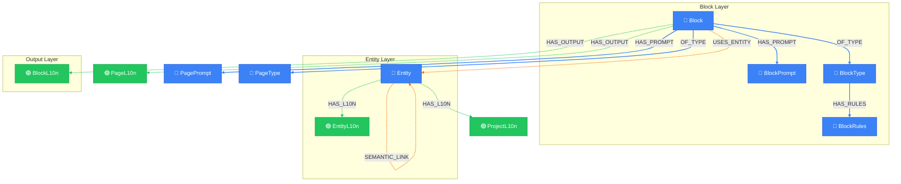

# Block Generation Context

> Auto-generated by novanet v10.4.0. Do not edit manually.

## Overview

Context loading for sub-agent when generating a single block.
This is the core view for native content generation, providing:
- Block definition with type and rules
- Block-specific prompt and instruction
- Related entities with localized content
- Spreading activation for semantic context

### Legend

| Color | Trait | Description |
|-------|-------|-------------|
| 🔵 Blue | Invariant | Nodes that don't change between locales |
| 🟢 Green | Localized | Nodes with locale-specific content |
| 🟣 Purple | Knowledge | Cultural/linguistic knowledge per locale |
| ⚪ Gray | Derived | Computed/aggregated data |
| ⚙️ Gray | Job | Background processing tasks |

## Graph Diagram

## Notes

- Sub-agents receive this context to generate ONE block natively
- The LLM context is entirely in the target locale
- Spreading activation provides related entities for richer context

---

*Generated by novanet ViewMermaidGenerator — view: block-generation*
