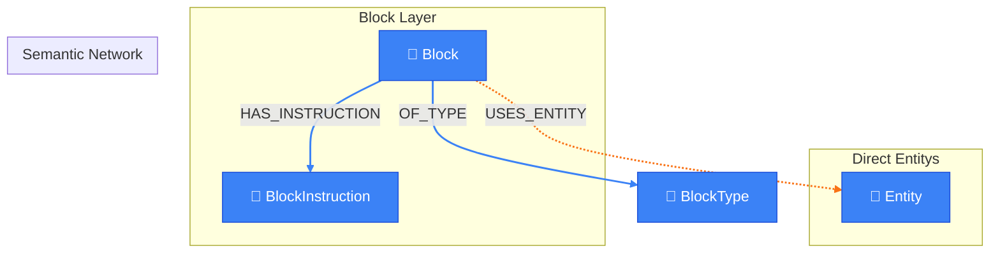

# Spreading Activation View

> Auto-generated by novanet v0.12.0. Do not edit manually.

## Overview

Demonstrates the spreading activation algorithm for semantic context retrieval.

**How it works:**
1. Start from a Block's USES_ENTITY relationships
2. Follow SEMANTIC_LINK edges with temperature >= threshold
3. Multiply temperatures along path to compute activation
4. Return concepts with activation >= minimum threshold

**Temperature-based traversal:**
- temperature 1.0 = strong semantic link
- temperature 0.5 = moderate link
- temperature < 0.3 = weak link (often pruned)

### Legend

| Color | Trait | Description |
|-------|-------|-------------|
| 🔵 Blue | Invariant | Nodes that don't change between locales |
| 🟢 Green | Localized | Nodes with locale-specific content |
| 🟣 Purple | Knowledge | Cultural/linguistic knowledge per locale |
| ⚪ Gray | Derived | Computed/aggregated data |
| ⚙️ Gray | Job | Background processing tasks |

## Graph Diagram

## Notes

- Temperature threshold of 0.3 is the default minimum
- Activation = product of temperatures along path
- Maximum depth is typically 2 hops to avoid noise
- Used by sub-agents to enrich generation context

---

*Generated by novanet ViewMermaidGenerator — view: block-semantic-network*
