# NovaNet Complete Graph

> Auto-generated by novanet v0.12.0. Do not edit manually.

## Overview

This diagram shows the complete NovaNet graph schema with all 42 node types and their relationships.

### Legend (ADR-024)

| Color | Trait | Description |
|-------|-------|-------------|
| 🔵 Blue | Defined | Nodes that don't change between locales |
| 🟢 Green | Authored | Nodes with locale-specific content |
| 🟣 Purple | Imported | Cultural/linguistic knowledge per locale |
| 🌟 Gold | Generated | LLM-generated output |
| ⚪ Gray | Retrieved | Computed/retrieved data |

### Realms

- **🌍 SHARED** — Locale configuration and knowledge (shared across all projects)
- **📦 PROJECT** — Project-specific content structure and generation

## Graph Diagram

```mermaid
flowchart TB
  %% NovaNet Graph v0.12.0
  %% Generated: 59 nodes, 163 arcs
  %% Source: node-kinds/ + arc-kinds/ + taxonomy.yaml

  %% Trait styling (node_trait)
  classDef defined fill:#3b82f6,stroke:#1d4ed8,color:#fff
  classDef authored fill:#22c55e,stroke:#16a34a,color:#fff
  classDef imported fill:#8b5cf6,stroke:#7c3aed,color:#fff
  classDef generated fill:#b58900,stroke:#996f00,color:#fff
  classDef retrieved fill:#6c71c4,stroke:#5761b3,color:#fff

  subgraph SHARED_REALM["🌍 SHARED"]
    direction TB
    subgraph SHARED_config["Config"]
      EntityCategory["🔵 EntityCategory"]
      Locale["🔵 Locale"]
      SEOKeywordFormat["🔵 SEOKeywordFormat"]
    end
    subgraph SHARED_locale["Locale"]
      Adaptation["🟣 Adaptation"]
      Culture["🟣 Culture"]
      Formatting["🟣 Formatting"]
      Market["🟣 Market"]
      Slugification["🟣 Slugification"]
      Style["🟣 Style"]
    end
    subgraph SHARED_geography["Geography"]
      Continent["🔵 Continent"]
      EconomicRegion["🔵 EconomicRegion"]
      GeoRegion["🔵 GeoRegion"]
      GeoSubRegion["🔵 GeoSubRegion"]
      IncomeGroup["🔵 IncomeGroup"]
      LendingCategory["🔵 LendingCategory"]
    end
    subgraph SHARED_knowledge["Knowledge"]
      AudienceSet["🔵 AudienceSet"]
      AudienceTrait["🟣 AudienceTrait"]
      CulturalRealm["🟣 CulturalRealm"]
      CulturalSubRealm["🟣 CulturalSubRealm"]
      CultureRef["🟣 CultureRef"]
      CultureSet["🔵 CultureSet"]
      Expression["🟣 Expression"]
      ExpressionSet["🔵 ExpressionSet"]
      GEOAnswer["⚪ GEOAnswer"]
      GEOQuery["🟣 GEOQuery"]
      GEOQuerySet["🔵 GEOQuerySet"]
      LanguageBranch["🟣 LanguageBranch"]
      LanguageFamily["🟣 LanguageFamily"]
      Pattern["🟣 Pattern"]
      PatternSet["🔵 PatternSet"]
      PopulationCluster["🟣 PopulationCluster"]
      PopulationSubCluster["🟣 PopulationSubCluster"]
      SEOKeyword["🟣 SEOKeyword"]
      SEOKeywordMetrics["⚪ SEOKeywordMetrics"]
      SEOKeywordSet["🔵 SEOKeywordSet"]
      Taboo["🟣 Taboo"]
      TabooSet["🔵 TabooSet"]
      Term["🟣 Term"]
      TermSet["🔵 TermSet"]
    end
  end

  subgraph ORG_REALM["🏢 ORG"]
    direction TB
    subgraph ORG_config["Config"]
      OrgConfig["🔵 OrgConfig"]
    end
    subgraph ORG_semantic["Semantic Layer"]
      AudiencePersona["🔵 AudiencePersona"]
      ChannelSurface["🔵 ChannelSurface"]
      Entity["🔵 Entity"]
      EntityContent["🟢 EntityContent"]
    end
    subgraph ORG_foundation["Foundation"]
      BrandIdentity["🔵 BrandIdentity"]
      Project["🔵 Project"]
      ProjectContent["🟢 ProjectContent"]
    end
    subgraph ORG_structure["Structure"]
      Block["🔵 Block"]
      ContentSlot["🔵 ContentSlot"]
      Page["🔵 Page"]
    end
    subgraph ORG_instruction["Instructions"]
      BlockInstruction["🔵 BlockInstruction"]
      BlockRules["🔵 BlockRules"]
      BlockType["🔵 BlockType"]
      PageInstruction["🔵 PageInstruction"]
      PageStructure["🔵 PageStructure"]
      PromptArtifact["🌟 PromptArtifact"]
    end
    subgraph ORG_output["Generated Output"]
      BlockGenerated["🌟 BlockGenerated"]
      OutputArtifact["🌟 OutputArtifact"]
      PageGenerated["🌟 PageGenerated"]
    end
  end

  %% Relationships (styled by arc family)
  AudienceSet -->|CONTAINS_AUDIENCE_TRAIT| AudienceTrait
  Block -->|BLOCK_OF| Page
  Block -.->|FILLS_SLOT| ContentSlot
  Block ==>|HAS_GENERATED| BlockGenerated
  Block ==>|HAS_GENERATED| PageGenerated
  Block -->|HAS_INSTRUCTION| BlockInstruction
  Block -->|OF_TYPE| BlockType
  Block -.->|TARGETS_PERSONA| AudiencePersona
  Block -.->|USES_ENTITY| Entity
  BlockGenerated -.->|FOR_CHANNEL| ChannelSurface
  BlockGenerated -.->|FOR_LOCALE| Locale
  BlockGenerated ==>|GENERATED_FOR| Block
  BlockGenerated ==>|GENERATED_FOR| Page
  BlockGenerated ==>|GENERATED_FROM| BlockType
  BlockGenerated -.->|HAS_INTERNAL_LINK| PageGenerated
  BlockGenerated ==>|INFLUENCED_BY| EntityContent
  BlockGenerated ==>|PREVIOUS_VERSION| BlockGenerated
  BlockGenerated ==>|PREVIOUS_VERSION| OutputArtifact
  BlockGenerated ==>|PREVIOUS_VERSION| PageGenerated
  BlockInstruction ==>|GENERATED| BlockGenerated
  BlockInstruction ==>|GENERATED| PageGenerated
  BlockInstruction ==>|INCLUDES_STYLE| Style
  BlockInstruction -->|INSTRUCTION_OF| Block
  BlockInstruction -->|INSTRUCTION_OF| Page
  BlockInstruction -.->|REFERENCES_ENTITY| Entity
  BlockInstruction -.->|REFERENCES_PAGE| Page
  BlockType -->|HAS_RULES| BlockRules
  ContentSlot -->|ACCEPTS_BLOCK_TYPE| BlockType
  CulturalSubRealm -->|PART_OF_REALM| CulturalRealm
  CultureSet -->|CONTAINS_CULTURE_REF| CultureRef
  Entity -.->|ACTS_ON| Entity
  Entity -.->|ALTERNATIVE_TO| Entity
  Entity -.->|APPLIES_TO| Entity
  Entity -->|BELONGS_TO| EntityCategory
  Entity -->|CHILD_OF| Entity
  Entity -.->|COMPETES_WITH| Entity
  Entity -.->|ENABLED_BY| Entity
  Entity -.->|ENABLES| Entity
  Entity -.->|ENHANCED_BY| Entity
  Entity -.->|ENHANCES| Entity
  Entity -->|ENTITY_OF| Project
  Entity -.->|HAS_APPLICATION| Entity
  Entity -->|HAS_CHILD| Entity
  Entity -.->|HAS_CONTENT| EntityContent
  Entity -.->|HAS_CONTENT| ProjectContent
  Entity -.->|HAS_TYPE| Entity
  Entity -.->|HAS_VARIANT| Entity
  Entity -.->|INCLUDED_IN| Entity
  Entity -.->|INCLUDES| Entity
  Entity -.->|MATERIALIZES_AS| Page
  Entity -.->|OPERATED_BY| Entity
  Entity -.->|POPULAR_IN| Continent
  Entity -.->|POPULAR_IN| GeoRegion
  Entity -.->|POPULAR_IN| GeoSubRegion
  Entity -.->|READS| Entity
  Entity -.->|READ_BY| Entity
  Entity -.->|REQUIRED_BY| Entity
  Entity -.->|REQUIRES| Entity
  Entity -.->|SEMANTIC_LINK| Entity
  Entity -.->|SIMILAR_TO| Entity
  Entity -.->|TARGETS_PERSONA| AudiencePersona
  Entity -.->|TYPE_OF| Entity
  Entity -.->|USED_BY| Block
  Entity -.->|USED_BY| Page
  Entity -.->|VARIANT_OF| Entity
  EntityContent -.->|CONTENT_OF| Entity
  EntityContent -.->|CONTENT_OF| Project
  EntityContent -.->|FOR_LOCALE| Locale
  EntityContent -.->|MONITORS_GEO| GEOQuery
  EntityContent -.->|TARGETS| SEOKeyword
  ExpressionSet -->|CONTAINS_EXPRESSION| Expression
  GEOQuery -->|HAS_GEO_ANSWERS| GEOAnswer
  GEOQuerySet -->|CONTAINS_GEO_QUERY| GEOQuery
  GeoRegion -->|IN_CONTINENT| Continent
  GeoSubRegion -->|IN_REGION| GeoRegion
  LanguageBranch -->|BRANCH_OF| LanguageFamily
  Locale -.->|CULTURALLY_SIMILAR| Locale
  Locale -.->|FALLBACK_TO| Locale
  Locale -->|HAS_ADAPTATION| Adaptation
  Locale -->|HAS_AUDIENCE| AudienceSet
  Locale -->|HAS_CULTURE| Culture
  Locale -->|HAS_CULTURE_SET| CultureSet
  Locale -->|HAS_EXPRESSIONS| ExpressionSet
  Locale -->|HAS_FORMATTING| Formatting
  Locale -->|HAS_GEO_QUERIES| GEOQuerySet
  Locale -.->|HAS_INCOME_LEVEL| IncomeGroup
  Locale -.->|HAS_LENDING_TYPE| LendingCategory
  Locale -.->|HAS_LOCALIZED_CONTENT| BlockGenerated
  Locale -.->|HAS_LOCALIZED_CONTENT| EntityContent
  Locale -.->|HAS_LOCALIZED_CONTENT| PageGenerated
  Locale -.->|HAS_LOCALIZED_CONTENT| ProjectContent
  Locale -->|HAS_MARKET| Market
  Locale -->|HAS_PATTERNS| PatternSet
  Locale -.->|HAS_POPULATION| PopulationSubCluster
  Locale -.->|HAS_PRIMARY_POPULATION| PopulationCluster
  Locale -->|HAS_SEO_KEYWORDS| SEOKeywordSet
  Locale -->|HAS_SLUGIFICATION| Slugification
  Locale -->|HAS_STYLE| Style
  Locale -->|HAS_TABOOS| TabooSet
  Locale -->|HAS_TERMS| TermSet
  Locale -.->|IN_CULTURAL_SUBREALM| CulturalSubRealm
  Locale -.->|IN_ECONOMIC_REGION| EconomicRegion
  Locale -.->|IN_SUBREGION| GeoRegion
  Locale -.->|IN_SUBREGION| GeoSubRegion
  Locale -.->|LOCALE_VARIANT_OF| Locale
  Locale -.->|SPEAKS_BRANCH| LanguageBranch
  OrgConfig -->|HAS_PROJECT| Project
  OutputArtifact ==>|BUNDLES| BlockGenerated
  OutputArtifact ==>|BUNDLES| PageGenerated
  OutputArtifact -.->|FOR_LOCALE| Locale
  OutputArtifact ==>|PREVIOUS_VERSION| BlockGenerated
  OutputArtifact ==>|PREVIOUS_VERSION| OutputArtifact
  OutputArtifact ==>|PREVIOUS_VERSION| PageGenerated
  Page -->|HAS_BLOCK| Block
  Page ==>|HAS_GENERATED| BlockGenerated
  Page ==>|HAS_GENERATED| PageGenerated
  Page -->|HAS_INSTRUCTION| BlockInstruction
  Page -->|HAS_SLOT| ContentSlot
  Page -->|HAS_STRUCTURE| PageStructure
  Page -.->|LINKS_TO| Page
  Page -->|PAGE_OF| Project
  Page -.->|SUBTOPIC_OF| Page
  Page -.->|TARGETS_PERSONA| AudiencePersona
  Page -.->|USES_ENTITY| Entity
  PageGenerated ==>|ASSEMBLES| BlockGenerated
  PageGenerated -->|BELONGS_TO_PROJECT_CONTENT| ProjectContent
  PageGenerated -.->|FOR_CHANNEL| ChannelSurface
  PageGenerated -.->|FOR_LOCALE| Locale
  PageGenerated ==>|GENERATED_FOR| Block
  PageGenerated ==>|GENERATED_FOR| Page
  PageGenerated ==>|PREVIOUS_VERSION| BlockGenerated
  PageGenerated ==>|PREVIOUS_VERSION| OutputArtifact
  PageGenerated ==>|PREVIOUS_VERSION| PageGenerated
  PageInstruction ==>|GENERATED| BlockGenerated
  PageInstruction ==>|GENERATED| PageGenerated
  PageInstruction ==>|INCLUDES_STYLE| Style
  PatternSet -->|CONTAINS_PATTERN| Pattern
  PopulationSubCluster -->|CLUSTER_OF| PopulationCluster
  Project -->|BELONGS_TO_ORG| OrgConfig
  Project -->|DEFAULT_LOCALE| Locale
  Project -->|HAS_BRAND_IDENTITY| BrandIdentity
  Project -.->|HAS_CONTENT| EntityContent
  Project -.->|HAS_CONTENT| ProjectContent
  Project -->|HAS_ENTITY| Entity
  Project -->|HAS_PAGE| Page
  Project -->|PROJECT_OF| OrgConfig
  Project -->|SUPPORTS_LOCALE| Locale
  ProjectContent -.->|CONTENT_OF| Entity
  ProjectContent -.->|CONTENT_OF| Project
  ProjectContent -.->|FOR_LOCALE| Locale
  PromptArtifact ==>|COMPILED_FROM| BlockInstruction
  PromptArtifact ==>|COMPILED_FROM| PageInstruction
  PromptArtifact ==>|INCLUDES_ENTITY| Entity
  SEOKeyword -.->|COMPARES_A| Entity
  SEOKeyword -.->|COMPARES_B| Entity
  SEOKeyword -.->|EXPRESSES| Entity
  SEOKeyword -->|HAS_FORMAT| SEOKeywordFormat
  SEOKeyword --o|HAS_METRICS| SEOKeywordMetrics
  SEOKeyword -.->|MENTIONS_BRAND| Entity
  SEOKeyword -.->|USE_CASE_FOR| Entity
  SEOKeywordSet -->|CONTAINS_SEO_KEYWORD| SEOKeyword
  TabooSet -->|CONTAINS_TABOO| Taboo
  TermSet -->|CONTAINS_TERM| Term

  %% Arc colors by family
  linkStyle 3,4,11,12,13,15,16,17,18,19,20,21,107,108,110,111,112,114,115,124,128,129,130,131,132,133,134,135,150,151,152 stroke:#8b5cf6,stroke-width:2px
  linkStyle 10,14,43,44,65,66,67,77,85,86,87,88,89,90,93,94,100,101,102,103,104,105,109,127,141,142,147,148,149 stroke:#22c55e,stroke-width:2px
  linkStyle 157 stroke:#ec4899,stroke-width:2px
  linkStyle 0,1,5,6,22,23,26,27,28,29,33,34,40,42,70,71,72,73,74,75,78,79,80,81,82,83,84,91,92,95,96,97,98,99,106,113,116,117,118,120,125,136,137,138,139,140,143,144,145,146,156,160,161,162 stroke:#3b82f6,stroke-width:2px
  linkStyle 2,7,8,9,24,25,30,31,32,35,36,37,38,39,41,45,46,47,48,49,50,51,52,53,54,55,56,57,58,59,60,61,62,63,64,68,69,76,119,121,122,123,126,153,154,155,158,159 stroke:#f97316,stroke-width:2px

  %% Class assignments
  class Adaptation imported
  class AudiencePersona defined
  class AudienceSet defined
  class AudienceTrait imported
  class Block defined
  class BlockGenerated generated
  class BlockInstruction defined
  class BlockRules defined
  class BlockType defined
  class BrandIdentity defined
  class ChannelSurface defined
  class ContentSlot defined
  class Continent defined
  class CulturalRealm imported
  class CulturalSubRealm imported
  class Culture imported
  class CultureRef imported
  class CultureSet defined
  class EconomicRegion defined
  class Entity defined
  class EntityCategory defined
  class EntityContent authored
  class Expression imported
  class ExpressionSet defined
  class Formatting imported
  class GEOAnswer retrieved
  class GEOQuery imported
  class GEOQuerySet defined
  class GeoRegion defined
  class GeoSubRegion defined
  class IncomeGroup defined
  class LanguageBranch imported
  class LanguageFamily imported
  class LendingCategory defined
  class Locale defined
  class Market imported
  class OrgConfig defined
  class OutputArtifact generated
  class Page defined
  class PageGenerated generated
  class PageInstruction defined
  class PageStructure defined
  class Pattern imported
  class PatternSet defined
  class PopulationCluster imported
  class PopulationSubCluster imported
  class Project defined
  class ProjectContent authored
  class PromptArtifact generated
  class SEOKeyword imported
  class SEOKeywordFormat defined
  class SEOKeywordMetrics retrieved
  class SEOKeywordSet defined
  class Slugification imported
  class Style imported
  class Taboo imported
  class TabooSet defined
  class Term imported
  class TermSet defined
```

## Arc Families

| Arrow | Family | Description |
|-------|--------|-------------|
| `-->` | Ownership | Parent-child structural relationships |
| `.->` | Localization | Locale-specific content links |
| `.->` | Semantic | Meaning and concept connections |
| `==>` | Generation | LLM generation flow |
| `--o` | Mining | SEO keyword mining |

---

*Generated by novanet MermaidGenerator*
