# NovaNet Complete Graph

> Auto-generated by novanet v9.0.0. Do not edit manually.

## Overview

This diagram shows the complete NovaNet graph schema with all 46 node types and their relationships.

### Legend

| Color | Trait | Description |
|-------|-------|-------------|
| 🔵 Blue | Invariant | Nodes that don't change between locales |
| 🟢 Green | Localized | Nodes with locale-specific content |
| 🟣 Purple | Knowledge | Cultural/linguistic knowledge per locale |
| ⚪ Gray | Derived | Computed/aggregated data |
| ⚙️ Gray | Job | Background processing tasks |

### Realms

- **🌍 GLOBAL** — Locale configuration and knowledge (shared across all projects)
- **📦 PROJECT** — Project-specific content structure and generation
- **🎯 SHARED** — SEO/GEO optimization data (shared across projects)

## Graph Diagram

```mermaid
flowchart TB
  %% NovaNet Graph v9.0.0
  %% Generated: 42 nodes, 120 edges
  %% Source: 46 node YAMLs + relations.yaml + taxonomy.yaml

  %% Trait styling (node_trait)
  classDef invariant fill:#3b82f6,stroke:#1d4ed8,color:#fff
  classDef localized fill:#22c55e,stroke:#16a34a,color:#fff
  classDef knowledge fill:#8b5cf6,stroke:#7c3aed,color:#fff
  classDef derived fill:#9ca3af,stroke:#6b7280,color:#fff
  classDef job fill:#6b7280,stroke:#4b5563,color:#fff

  subgraph GLOBAL_REALM["🌍 GLOBAL"]
    direction TB
    subgraph GLOBAL_config["Configuration"]
      Locale["🔵 Locale"]
    end
    subgraph GLOBAL_knowledge["Locale Knowledge"]
      Adaptation["🟣 Adaptation"]
      AudienceSet["🟣 AudienceSet"]
      CultureSet["🟣 CultureSet"]
      ExpressionSet["🟣 ExpressionSet"]
      Formatting["🟣 Formatting"]
      PatternSet["🟣 PatternSet"]
      Slugification["🟣 Slugification"]
      Style["🟣 Style"]
      TabooSet["🟣 TabooSet"]
      TermSet["🟣 TermSet"]
    end
  end

  subgraph PROJECT_REALM["📦 PROJECT"]
    direction TB
    subgraph PROJECT_foundation["Foundation"]
      BrandIdentity["🔵 BrandIdentity"]
      Project["🔵 Project"]
      ProjectL10n["🟢 ProjectL10n"]
    end
    subgraph PROJECT_structure["Structure"]
      Block["🔵 Block"]
      ContentSlot["🔵 ContentSlot"]
      Page["🔵 Page"]
    end
    subgraph PROJECT_semantic["Semantic Layer"]
      AudiencePersona["🔵 AudiencePersona"]
      ChannelSurface["🔵 ChannelSurface"]
      Concept["🔵 Concept"]
      ConceptL10n["🟢 ConceptL10n"]
      SearchIntent["🔵 SearchIntent"]
      TopicCluster["🔵 TopicCluster"]
    end
    subgraph PROJECT_instruction["Instructions"]
      BlockPrompt["🔵 BlockPrompt"]
      BlockRules["🔵 BlockRules"]
      BlockType["🔵 BlockType"]
      PagePrompt["🔵 PagePrompt"]
      PageType["🔵 PageType"]
      PromptArtifact["⚪ PromptArtifact"]
    end
    subgraph PROJECT_output["Generated Output"]
      BlockL10n["🟢 BlockL10n"]
      EvaluationSignal["⚪ EvaluationSignal"]
      GenerationJob["⚙️ GenerationJob"]
      OutputArtifact["⚪ OutputArtifact"]
      PageL10n["🟢 PageL10n"]
    end
  end

  subgraph SHARED_REALM["🎯 SHARED"]
    direction TB
    subgraph SHARED_seo["SEO Intelligence"]
      SEOKeywordL10n["🟢 SEOKeywordL10n"]
      SEOKeywordMetrics["⚪ SEOKeywordMetrics"]
      SEOMiningRun["⚙️ SEOMiningRun"]
    end
    subgraph SHARED_geo["GEO Intelligence"]
      GEOMiningRun["⚙️ GEOMiningRun"]
      GEOSeedL10n["🟢 GEOSeedL10n"]
      GEOSeedMetrics["⚪ GEOSeedMetrics"]
      Thing["🔵 Thing"]
      ThingL10n["🟢 ThingL10n"]
    end
  end

  %% Relationships (styled by arc family)
  Block -->|BLOCK_OF| Page
  Block -.->|FILLS_SLOT| ContentSlot
  Block -.->|FOR_INTENT| SearchIntent
  Block -.->|HAS_OUTPUT| BlockL10n
  Block -.->|HAS_OUTPUT| PageL10n
  Block -->|HAS_PROMPT| BlockPrompt
  Block -->|HAS_PROMPT| PagePrompt
  Block -.->|MENTIONS| Thing
  Block -->|OF_TYPE| BlockType
  Block -->|OF_TYPE| PageType
  Block -.->|USES_CONCEPT| Concept
  BlockL10n -.->|FOR_LOCALE| Locale
  BlockL10n ==>|GENERATED_FROM| BlockType
  BlockL10n ==>|HAS_EVALUATION| EvaluationSignal
  BlockL10n ==>|INFLUENCED_BY| ConceptL10n
  BlockL10n -.->|OUTPUT_OF| Block
  BlockL10n -.->|OUTPUT_OF| Page
  BlockL10n ==>|PREVIOUS_VERSION| BlockL10n
  BlockL10n ==>|PREVIOUS_VERSION| OutputArtifact
  BlockL10n ==>|PREVIOUS_VERSION| PageL10n
  BlockPrompt ==>|GENERATED| BlockL10n
  BlockPrompt ==>|GENERATED| PageL10n
  BlockType -->|HAS_RULES| BlockRules
  Concept -.->|HAS_L10N| ConceptL10n
  Concept -.->|HAS_L10N| ProjectL10n
  Concept -.->|HAS_L10N| ThingL10n
  Concept -.->|SEMANTIC_LINK| Concept
  Concept --o|TARGETS_GEO| GEOSeedL10n
  Concept --o|TARGETS_SEO| SEOKeywordL10n
  Concept -.->|USED_BY| Block
  Concept -.->|USED_BY| Page
  ConceptL10n -.->|FOR_LOCALE| Locale
  ConceptL10n --o|HAS_GEO_TARGET| GEOSeedL10n
  ConceptL10n --o|HAS_SEO_TARGET| SEOKeywordL10n
  ConceptL10n -.->|L10N_OF| Concept
  ConceptL10n -.->|L10N_OF| Project
  ContentSlot -->|ACCEPTS_BLOCK_TYPE| BlockType
  EvaluationSignal ==>|EVALUATED_BY_JOB| GenerationJob
  GEOMiningRun --o|GEO_MINES| GEOSeedL10n
  GEOSeedL10n -.->|FOR_LOCALE| Locale
  GEOSeedL10n --o|HAS_METRICS| GEOSeedMetrics
  GEOSeedL10n --o|HAS_METRICS| SEOKeywordMetrics
  GenerationJob ==>|CREATES_CONTENT| BlockL10n
  GenerationJob ==>|CREATES_CONTENT| PageL10n
  GenerationJob -.->|FOR_LOCALE| Locale
  GenerationJob ==>|PRODUCES| OutputArtifact
  GenerationJob ==>|TRIGGERED_BY| Project
  GenerationJob ==>|USES_PROMPT| PromptArtifact
  Locale -.->|FALLBACK_TO| Locale
  Locale -.->|HAS_LOCALIZED_CONTENT| BlockL10n
  Locale -.->|HAS_LOCALIZED_CONTENT| ConceptL10n
  Locale -.->|HAS_LOCALIZED_CONTENT| GEOSeedL10n
  Locale -.->|HAS_LOCALIZED_CONTENT| PageL10n
  Locale -.->|HAS_LOCALIZED_CONTENT| ProjectL10n
  Locale -.->|HAS_LOCALIZED_CONTENT| SEOKeywordL10n
  Locale -.->|VARIANT_OF| Locale
  OutputArtifact -.->|FOR_LOCALE| Locale
  OutputArtifact ==>|HAS_EVALUATION| EvaluationSignal
  OutputArtifact ==>|INCLUDES| BlockL10n
  OutputArtifact ==>|INCLUDES| PageL10n
  OutputArtifact ==>|PREVIOUS_VERSION| BlockL10n
  OutputArtifact ==>|PREVIOUS_VERSION| OutputArtifact
  OutputArtifact ==>|PREVIOUS_VERSION| PageL10n
  Page -.->|COVERS| Thing
  Page -.->|FOR_CHANNEL| ChannelSurface
  Page -->|HAS_BLOCK| Block
  Page -.->|HAS_OUTPUT| BlockL10n
  Page -.->|HAS_OUTPUT| PageL10n
  Page -->|HAS_PROMPT| BlockPrompt
  Page -->|HAS_PROMPT| PagePrompt
  Page -->|HAS_SLOT| ContentSlot
  Page -.->|LINKS_TO| Page
  Page -->|OF_TYPE| BlockType
  Page -->|OF_TYPE| PageType
  Page -.->|SATISFIES_INTENT| SearchIntent
  Page -.->|SUBTOPIC_OF| Page
  Page -.->|TARGETS_PERSONA| AudiencePersona
  Page -.->|USES_CONCEPT| Concept
  PageL10n ==>|ASSEMBLES| BlockL10n
  PageL10n -->|BELONGS_TO_PROJECT_L10N| ProjectL10n
  PageL10n -.->|FOR_LOCALE| Locale
  PageL10n ==>|HAS_EVALUATION| EvaluationSignal
  PageL10n -.->|OUTPUT_OF| Block
  PageL10n -.->|OUTPUT_OF| Page
  PageL10n ==>|PREVIOUS_VERSION| BlockL10n
  PageL10n ==>|PREVIOUS_VERSION| OutputArtifact
  PageL10n ==>|PREVIOUS_VERSION| PageL10n
  PagePrompt ==>|GENERATED| BlockL10n
  PagePrompt ==>|GENERATED| PageL10n
  Project -->|DEFAULT_LOCALE| Locale
  Project -->|HAS_BRAND_IDENTITY| BrandIdentity
  Project -->|HAS_CONCEPT| Concept
  Project -.->|HAS_L10N| ConceptL10n
  Project -.->|HAS_L10N| ProjectL10n
  Project -.->|HAS_L10N| ThingL10n
  Project -->|HAS_PAGE| Page
  Project -->|SUPPORTS_LOCALE| Locale
  ProjectL10n -.->|FOR_LOCALE| Locale
  ProjectL10n -.->|L10N_OF| Concept
  ProjectL10n -.->|L10N_OF| Project
  PromptArtifact ==>|COMPILED_FROM| BlockPrompt
  PromptArtifact ==>|COMPILED_FROM| PagePrompt
  PromptArtifact ==>|INCLUDES_CONCEPT| Concept
  PromptArtifact ==>|INCLUDES_STYLE| Style
  SEOKeywordL10n -.->|FOR_LOCALE| Locale
  SEOKeywordL10n --o|HAS_METRICS| GEOSeedMetrics
  SEOKeywordL10n --o|HAS_METRICS| SEOKeywordMetrics
  SEOKeywordL10n --o|TARGETS_THING| Thing
  SEOMiningRun --o|SEO_MINES| SEOKeywordL10n
  SearchIntent -.->|MAPS_TO_CONCEPT| Concept
  SearchIntent --o|TARGETS_KEYWORD| SEOKeywordL10n
  Thing -.->|HAS_L10N| ConceptL10n
  Thing -.->|HAS_L10N| ProjectL10n
  Thing -.->|HAS_L10N| ThingL10n
  Thing -.->|RELATED_THING| Thing
  Thing -.->|SPECIALIZES| Thing
  ThingL10n -.->|FOR_LOCALE| Locale
  TopicCluster -.->|CLUSTERS_TOPIC| Concept
  TopicCluster -->|CLUSTER_PAGE| Page
  TopicCluster -->|PILLAR_PAGE| Page

  %% Edge colors by family
  linkStyle 12,13,14,17,18,19,20,21,37,42,43,45,46,47,57,58,59,60,61,62,78,81,84,85,86,87,88,100,101,102,103 stroke:#8b5cf6,stroke-width:2px
  linkStyle 3,4,11,15,16,23,24,25,31,34,35,39,44,48,49,50,51,52,53,54,55,56,66,67,80,82,83,92,93,94,97,98,99,104,111,112,113,116 stroke:#22c55e,stroke-width:2px
  linkStyle 27,28,32,33,38,40,41,105,106,107,108,110 stroke:#ec4899,stroke-width:2px
  linkStyle 0,5,6,8,9,22,36,65,68,69,70,72,73,79,89,90,91,95,96,118,119 stroke:#3b82f6,stroke-width:2px
  linkStyle 1,2,7,10,26,29,30,63,64,71,74,75,76,77,109,114,115,117 stroke:#f97316,stroke-width:2px

  %% Class assignments
  class Adaptation knowledge
  class AudiencePersona invariant
  class AudienceSet knowledge
  class Block invariant
  class BlockL10n localized
  class BlockPrompt invariant
  class BlockRules invariant
  class BlockType invariant
  class BrandIdentity invariant
  class ChannelSurface invariant
  class Concept invariant
  class ConceptL10n localized
  class ContentSlot invariant
  class CultureSet knowledge
  class EvaluationSignal derived
  class ExpressionSet knowledge
  class Formatting knowledge
  class GEOMiningRun job
  class GEOSeedL10n localized
  class GEOSeedMetrics derived
  class GenerationJob job
  class Locale invariant
  class OutputArtifact derived
  class Page invariant
  class PageL10n localized
  class PagePrompt invariant
  class PageType invariant
  class PatternSet knowledge
  class Project invariant
  class ProjectL10n localized
  class PromptArtifact derived
  class SEOKeywordL10n localized
  class SEOKeywordMetrics derived
  class SEOMiningRun job
  class SearchIntent invariant
  class Slugification knowledge
  class Style knowledge
  class TabooSet knowledge
  class TermSet knowledge
  class Thing invariant
  class ThingL10n localized
  class TopicCluster invariant
```

## Edge Families

| Arrow | Family | Description |
|-------|--------|-------------|
| `-->` | Ownership | Parent-child structural relationships |
| `.->` | Localization | Locale-specific content links |
| `.->` | Semantic | Meaning and concept connections |
| `==>` | Generation | LLM generation flow |
| `--o` | Mining | SEO/GEO data extraction |

---

*Generated by novanet MermaidGenerator*
