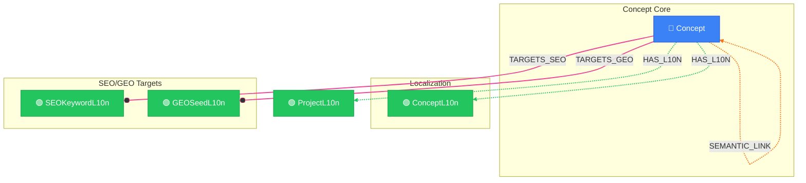

# Concept Network View

> Auto-generated by novanet v9.0.0. Do not edit manually.

## Overview

The concept network showing semantic relationships between concepts.
Concepts are the core semantic building blocks of NovaNet:
- Each Concept has localized versions (ConceptL10n) per locale
- Concepts connect via SEMANTIC_LINK with temperature weights
- Concepts can target SEO keywords and GEO seeds

### Legend

| Color | Trait | Description |
|-------|-------|-------------|
| 🔵 Blue | Invariant | Nodes that don't change between locales |
| 🟢 Green | Localized | Nodes with locale-specific content |
| 🟣 Purple | Knowledge | Cultural/linguistic knowledge per locale |
| ⚪ Gray | Derived | Computed/aggregated data |
| ⚙️ Gray | Job | Background processing tasks |

## Graph Diagram

## Notes

- Concepts are INVARIANT - they exist independently of locale
- ConceptL10n provides locale-specific title, definition, examples
- SEMANTIC_LINK temperature controls spreading activation strength

---

*Generated by novanet ViewMermaidGenerator — view: concept-ecosystem*
