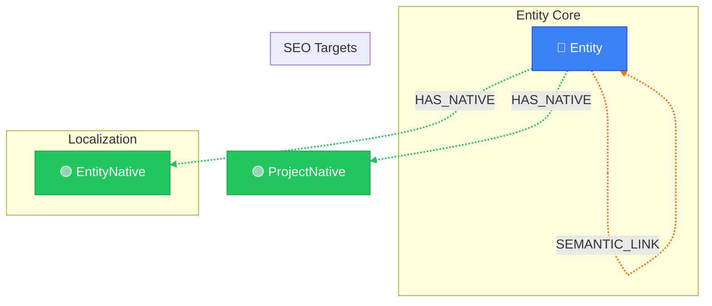

# Entity Network View

> Auto-generated by novanet v0.12.0. Do not edit manually.

## Overview

The entity network showing semantic relationships between entities.
Entities are the core semantic building blocks of NovaNet:
- Each Entity has localized versions (EntityNative) per locale
- Entities connect via SEMANTIC_LINK with temperature weights
- EntityNative expresses SEO keywords via EXPRESSES arc

### Legend

| Color | Trait | Description |
|-------|-------|-------------|
| 🔵 Blue | Invariant | Nodes that don't change between locales |
| 🟢 Green | Localized | Nodes with locale-specific content |
| 🟣 Purple | Knowledge | Cultural/linguistic knowledge per locale |
| ⚪ Gray | Derived | Computed/aggregated data |
| ⚙️ Gray | Job | Background processing tasks |

## Graph Diagram

## Notes

- Entities are INVARIANT - they exist independently of locale
- EntityNative provides locale-specific title, definition, examples
- SEO keywords linked to EntityNative (same locale) via EXPRESSES
- SEMANTIC_LINK temperature controls spreading activation strength

---

*Generated by novanet ViewMermaidGenerator — view: entity-ecosystem*
