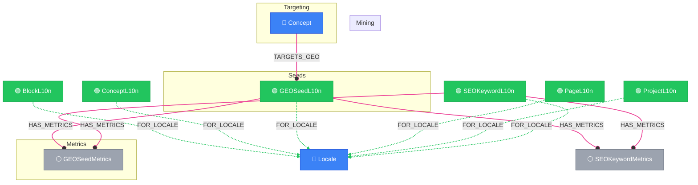

# GEO Pipeline View

> Auto-generated by novanet v9.0.0. Do not edit manually.

## Overview

Generative Engine Optimization (GEO) for AI answer engines.

**What is GEO:**
Optimization for AI-powered search engines (Perplexity, ChatGPT, Claude)
that generate answers rather than list links.

**Pipeline stages:**
1. **Mining**: GEOMiningRun discovers questions per locale
2. **Targeting**: Concepts target GEOSeedL10n questions
3. **Metrics**: GEOSeedMetrics tracks citation performance
4. **Optimization**: Content optimized for AI citations

**Node types:**
- GEOSeedL10n: Localized question/query (locale-specific)
- GEOSeedMetrics: Citation and visibility metrics
- GEOMiningRun: Mining job metadata

### Legend

| Color | Trait | Description |
|-------|-------|-------------|
| 🔵 Blue | Invariant | Nodes that don't change between locales |
| 🟢 Green | Localized | Nodes with locale-specific content |
| 🟣 Purple | Knowledge | Cultural/linguistic knowledge per locale |
| ⚪ Gray | Derived | Computed/aggregated data |
| ⚙️ Gray | Job | Background processing tasks |

## Graph Diagram

## Notes

- GEO is for AI answer engines, not traditional search
- GEOSeedL10n questions are locale-specific
- Citation metrics track how often AI cites our content
- Higher visibility_score = more prominent in AI answers

---

*Generated by novanet ViewMermaidGenerator — view: geo-pipeline*
