# Global Layer View

> Auto-generated by novanet v9.0.0. Do not edit manually.

## Overview

The Global scope contains nodes shared across ALL projects.
This is the foundation for native content generation.

**15 nodes organized by category:**
- **Config (1)**: Locale - the root configuration node
- **Knowledge (14)**: LocaleIdentity, LocaleVoice, LocaleCulture, LocaleMarket,
  LocaleLexicon, and supporting data nodes (Expression, Reference, etc.)

**Key insight:**
Global nodes are NEVER project-specific. They represent knowledge ABOUT locales,
not content IN locales. This knowledge enables LLMs to generate natively.

### Legend

| Color | Trait | Description |
|-------|-------|-------------|
| 🔵 Blue | Invariant | Nodes that don't change between locales |
| 🟢 Green | Localized | Nodes with locale-specific content |
| 🟣 Purple | Knowledge | Cultural/linguistic knowledge per locale |
| ⚪ Gray | Derived | Computed/aggregated data |
| ⚙️ Gray | Job | Background processing tasks |

## Graph Diagram

```mermaid
flowchart TB
  %% View: Global Layer (global-layer)
  %% 10 nodes, 10 edges

  %% Trait styling (locale_behavior)
  classDef invariant fill:#3b82f6,stroke:#1d4ed8,color:#fff
  classDef localized fill:#22c55e,stroke:#16a34a,color:#fff
  classDef knowledge fill:#8b5cf6,stroke:#7c3aed,color:#fff
  classDef derived fill:#9ca3af,stroke:#6b7280,color:#fff
  classDef job fill:#6b7280,stroke:#4b5563,color:#fff

  subgraph CONFIG["Config"]
    Locale["🔵 Locale"]
  end

  subgraph IDENTITY___VOICE["Identity & Voice"]
    LocaleIdentity["🟣 LocaleIdentity"]
    LocaleVoice["🟣 LocaleVoice"]
  end

  subgraph CULTURE___MARKET["Culture & Market"]
    LocaleCulture["🟣 LocaleCulture"]
    LocaleMarket["🟣 LocaleMarket"]
  end

  subgraph RULES["Rules"]
    LocaleRulesAdaptation["🟣 LocaleRulesAdaptation"]
    LocaleRulesFormatting["🟣 LocaleRulesFormatting"]
    LocaleRulesSlug["🟣 LocaleRulesSlug"]
  end

  subgraph LEXICON["Lexicon"]
    LocaleLexicon["🟣 LocaleLexicon"]
    Expression["🟣 Expression"]
  end

  %% Relationships (styled by edge family)
  Locale -.->|FALLBACK_TO| Locale
  Locale -.->|HAS_CULTURE| LocaleCulture
  Locale -.->|HAS_IDENTITY| LocaleIdentity
  Locale -.->|HAS_LEXICON| LocaleLexicon
  Locale -.->|HAS_MARKET| LocaleMarket
  Locale -.->|HAS_RULES_ADAPTATION| LocaleRulesAdaptation
  Locale -.->|HAS_RULES_FORMATTING| LocaleRulesFormatting
  Locale -.->|HAS_RULES_SLUG| LocaleRulesSlug
  Locale -.->|HAS_VOICE| LocaleVoice
  LocaleLexicon -.->|HAS_EXPRESSION| Expression

  %% Edge colors by family
  linkStyle 0,1,2,3,4,5,6,7,8,9 stroke:#22c55e,stroke-width:2px

  %% Class assignments
  class Expression knowledge
  class Locale invariant
  class LocaleCulture knowledge
  class LocaleIdentity knowledge
  class LocaleLexicon knowledge
  class LocaleMarket knowledge
  class LocaleRulesAdaptation knowledge
  class LocaleRulesFormatting knowledge
  class LocaleRulesSlug knowledge
  class LocaleVoice knowledge
```

## Notes

- Global nodes are shared across ALL projects - never duplicated
- LocaleKnowledge enables native generation, not translation
- Expressions are filtered by semantic_field for relevant context
- Fallback chain: fr-CA → fr-FR → en-US (example)

---

*Generated by novanet ViewMermaidGenerator — view: global-layer*
