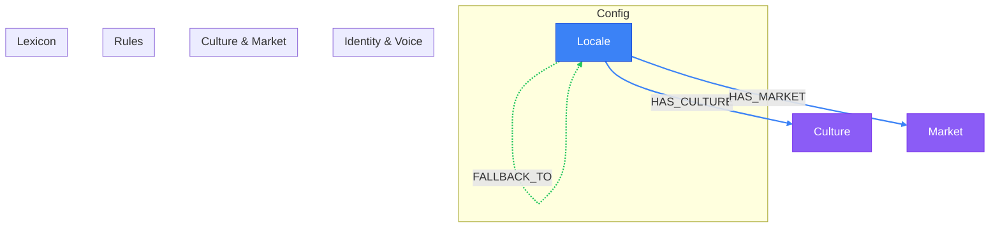

# Shared Layer View

> Auto-generated by novanet v11.8.0. Do not edit manually.

## Overview

The Shared scope contains nodes shared across ALL organizations.
This is the foundation for native content generation.

**15 nodes organized by category:**
- **Config (1)**: Locale - the root configuration node
- **Knowledge (14)**: LocaleIdentity, LocaleVoice, LocaleCulture, LocaleMarket,
  LocaleLexicon, and supporting data nodes (Expression, Reference, etc.)

**Key insight:**
Shared nodes are NEVER organization-specific. They represent knowledge ABOUT locales,
not content IN locales. This knowledge enables LLMs to generate natively.

### Legend

| Color | Trait | Description |
|-------|-------|-------------|
| Blue | Defined | Structurally fixed, version-controlled definitions |
| Green | Authored | Human-authored locale-specific content |
| Purple | Imported | External data from authoritative sources |
| Gray | Generated | LLM-generated output |
| Gray | Retrieved | Computed/aggregated from external APIs |

## Graph Diagram

## Notes

- Shared nodes are shared across ALL organizations - never duplicated
- LocaleKnowledge enables native generation, not translation
- Expressions are filtered by semantic_field for relevant context
- Fallback chain: fr-CA -> fr-FR -> en-US (example)

---

*Generated by novanet ViewMermaidGenerator - view: shared-layer*
