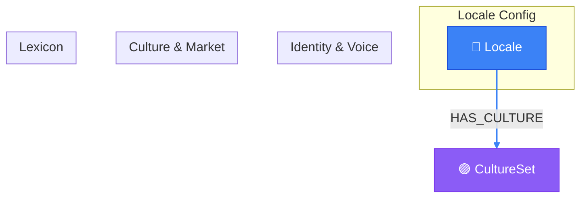

# Locale Knowledge View

> Auto-generated by novanet v10.0.0. Do not edit manually.

## Overview

Complete locale knowledge system for native content generation.
The LocaleKnowledge nodes provide cultural and linguistic context
that enables LLMs to generate content natively in each locale.

**14 LocaleKnowledge nodes organized by domain:**
- Identity: locale code, name, region, script
- Voice: formality, tone, directness, humor
- Culture: values, taboos, holidays, heroes
- Market: currency, payment methods, competitors
- Lexicon: domain-specific expressions and idioms

### Legend

| Color | Trait | Description |
|-------|-------|-------------|
| 🔵 Blue | Invariant | Nodes that don't change between locales |
| 🟢 Green | Localized | Nodes with locale-specific content |
| 🟣 Purple | Knowledge | Cultural/linguistic knowledge per locale |
| ⚪ Gray | Derived | Computed/aggregated data |
| ⚙️ Gray | Job | Background processing tasks |

## Graph Diagram

## Notes

- LocaleKnowledge is GLOBAL - shared across all projects
- Expressions are filtered by semantic_field for relevant context
- Semantic field filters ensure relevant knowledge is included

---

*Generated by novanet ViewMermaidGenerator — view: locale-full-knowledge*
