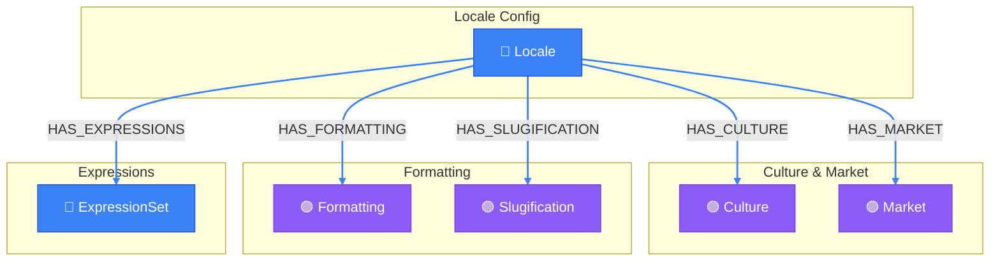

# Locale Knowledge View

> Auto-generated by novanet v0.12.0. Do not edit manually.

## Overview

Complete locale knowledge system for native content generation.
Provides cultural and linguistic context that enables LLMs to
generate content natively in each locale.

**5 knowledge domains:**
- Culture: values, taboos, holidays, heroes
- Market: currency, payment methods, competitors
- Formatting: date/time/number formats
- Slugification: URL-safe transformations
- Expressions: domain-specific vocabulary

### Legend

| Color | Trait | Description |
|-------|-------|-------------|
| 🔵 Blue | Invariant | Nodes that don't change between locales |
| 🟢 Green | Localized | Nodes with locale-specific content |
| 🟣 Purple | Knowledge | Cultural/linguistic knowledge per locale |
| ⚪ Gray | Derived | Computed/aggregated data |
| ⚙️ Gray | Job | Background processing tasks |

## Graph Diagram

## Notes

- Locale knowledge is in SHARED realm - read-only, shared across all projects
- ExpressionSet contains locale-specific expressions

---

*Generated by novanet ViewMermaidGenerator — view: locale-full-knowledge*
