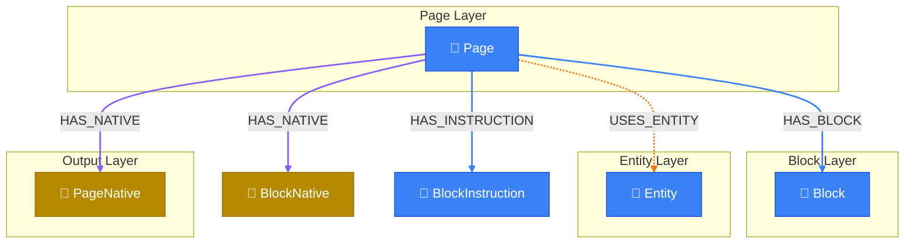

# Page Generation Context

> Auto-generated by novanet v0.12.0. Do not edit manually.

## Overview

Context loading for the orchestrator agent when generating a complete page.
This view retrieves:
- The page definition and its instruction
- All blocks with their positions
- Related concepts via spreading activation
- Locale-specific knowledge for native generation

### Legend

| Color | Trait | Description |
|-------|-------|-------------|
| 🔵 Blue | Invariant | Nodes that don't change between locales |
| 🟢 Green | Localized | Nodes with locale-specific content |
| 🟣 Purple | Knowledge | Cultural/linguistic knowledge per locale |
| ⚪ Gray | Derived | Computed/aggregated data |
| ⚙️ Gray | Job | Background processing tasks |

## Graph Diagram

## Notes

- The orchestrator uses this context to dispatch block generation tasks
- Spreading activation depth is 2 for related concepts
- Only active instructions are included

---

*Generated by novanet ViewMermaidGenerator — view: page-generation-context*
