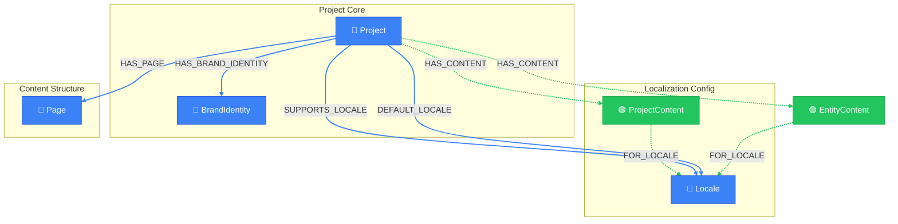

# Project Context View

> Auto-generated by novanet v0.12.0. Do not edit manually.

## Overview

Project-level view showing boundaries and configuration for multi-project management.
Use this view to understand:
- Which locales a project supports
- The project's brand identity
- All pages belonging to the project

### Legend

| Color | Trait | Description |
|-------|-------|-------------|
| 🔵 Blue | Invariant | Nodes that don't change between locales |
| 🟢 Green | Localized | Nodes with locale-specific content |
| 🟣 Purple | Knowledge | Cultural/linguistic knowledge per locale |
| ⚪ Gray | Derived | Computed/aggregated data |
| ⚙️ Gray | Job | Background processing tasks |

## Graph Diagram

## Notes

- Each Project has a unique key used for routing and identification
- BrandIdentity contains visual identity (colors, logos, typography)
- ProjectContent contains localized project metadata (tagline, description)

---

*Generated by novanet ViewMermaidGenerator — view: project-context*
