# Project Layer View

> Auto-generated by novanet v10.6.0. Do not edit manually.

## Overview

The Project scope contains all nodes specific to a single project.
This is where content generation happens.

**14 nodes organized by category:**
- **Foundation (3)**: Project, BrandIdentity, ProjectContent
- **Structure (2)**: Page, Block
- **Semantic (2)**: Entity, EntityContent
- **Instruction (5)**: PageType, PagePrompt, BlockType, BlockPrompt, BlockRules
- **Output (2)**: PageGenerated, BlockGenerated

**Key insight:**
The Project layer is where invariant structure meets localized output.
Pages and Blocks are invariant scaffolding; PageGenerated and BlockGenerated are generated.

### Legend

| Color | Trait | Description |
|-------|-------|-------------|
| 🔵 Blue | Invariant | Nodes that don't change between locales |
| 🟢 Green | Localized | Nodes with locale-specific content |
| 🟣 Purple | Knowledge | Cultural/linguistic knowledge per locale |
| ⚪ Gray | Derived | Computed/aggregated data |
| ⚙️ Gray | Job | Background processing tasks |

## Graph Diagram

```mermaid
flowchart TB
  %% View: Project Layer (project-layer)
  %% 13 nodes, 19 arcs

  %% Trait styling (node_trait)
  classDef invariant fill:#3b82f6,stroke:#1d4ed8,color:#fff
  classDef localized fill:#22c55e,stroke:#16a34a,color:#fff
  classDef knowledge fill:#8b5cf6,stroke:#7c3aed,color:#fff
  classDef derived fill:#9ca3af,stroke:#6b7280,color:#fff
  classDef job fill:#6b7280,stroke:#4b5563,color:#fff

  subgraph FOUNDATION["Foundation"]
    Project["🔵 Project"]
    BrandIdentity["🔵 BrandIdentity"]
    ProjectContent["🟢 ProjectContent"]
  end

  subgraph STRUCTURE["Structure"]
    Page["🔵 Page"]
    Block["🔵 Block"]
  end

  subgraph SEMANTIC["Semantic"]
    EntityContent["🟢 EntityContent"]
  end

  subgraph INSTRUCTION["Instruction"]
    PageType["🔵 PageType"]
    PagePrompt["🔵 PagePrompt"]
    BlockType["🔵 BlockType"]
    BlockPrompt["🔵 BlockPrompt"]
  end

  subgraph OUTPUT["Output"]
    PageGenerated["⚪ PageGenerated"]
    BlockGenerated["⚪ BlockGenerated"]
  end

  %% Additional reachable nodes
  Locale["🔵 Locale"]

  %% Relationships (styled by arc family)
  Block -.->|HAS_GENERATED| BlockGenerated
  Block -.->|HAS_GENERATED| PageGenerated
  Block -->|HAS_PROMPT| BlockPrompt
  Block -->|HAS_PROMPT| PagePrompt
  Block -->|OF_TYPE| BlockType
  Block -->|OF_TYPE| PageType
  Page -->|HAS_BLOCK| Block
  Page -.->|HAS_GENERATED| BlockGenerated
  Page -.->|HAS_GENERATED| PageGenerated
  Page -->|HAS_PROMPT| BlockPrompt
  Page -->|HAS_PROMPT| PagePrompt
  Page -->|OF_TYPE| BlockType
  Page -->|OF_TYPE| PageType
  Project -->|DEFAULT_LOCALE| Locale
  Project -->|HAS_BRAND_IDENTITY| BrandIdentity
  Project -.->|HAS_CONTENT| EntityContent
  Project -.->|HAS_CONTENT| ProjectContent
  Project -->|HAS_PAGE| Page
  Project -->|SUPPORTS_LOCALE| Locale

  %% Arc colors by family
  linkStyle 0,1,7,8,15,16 stroke:#22c55e,stroke-width:2px
  linkStyle 2,3,4,5,6,9,10,11,12,13,14,17,18 stroke:#3b82f6,stroke-width:2px

  %% Class assignments
  class Block invariant
  class BlockGenerated derived
  class BlockPrompt invariant
  class BlockType invariant
  class BrandIdentity invariant
  class EntityContent localized
  class Locale invariant
  class Page invariant
  class PageGenerated derived
  class PagePrompt invariant
  class PageType invariant
  class Project invariant
  class ProjectContent localized
```

## Notes

- Project nodes are per-project - each project has its own instances
- Invariant nodes (Page, Block, Entity) are defined once per project
- Localized nodes (*L10n) are generated for each supported locale
- The orchestrator uses this view to coordinate generation
- Output nodes (PageGenerated, BlockGenerated) are LLM-generated, not human-written

---

*Generated by novanet ViewMermaidGenerator — view: project-layer*
