# Project Layer View

> Auto-generated by novanet v0.12.0. Do not edit manually.

## Overview

The Project scope contains all nodes specific to a single project.
This is where content generation happens.

**14 nodes organized by category:**
- **Foundation (3)**: Project, BrandIdentity, ProjectNative
- **Structure (2)**: Page, Block
- **Semantic (2)**: Entity, EntityNative
- **Instruction (5)**: PageStructure, PageInstruction, BlockType, BlockInstruction, BlockRules
- **Output (2)**: PageNative, BlockNative

**Key insight:**
The Project layer is where invariant structure meets localized output.
Pages and Blocks are invariant scaffolding; PageNative and BlockNative are generated.

### Legend

| Color | Trait | Description |
|-------|-------|-------------|
| 🔵 Blue | Invariant | Nodes that don't change between locales |
| 🟢 Green | Localized | Nodes with locale-specific content |
| 🟣 Purple | Knowledge | Cultural/linguistic knowledge per locale |
| ⚪ Gray | Derived | Computed/aggregated data |
| ⚙️ Gray | Job | Background processing tasks |

## Graph Diagram

```mermaid
flowchart TB
  %% View: Project Layer (project-layer)
  %% 14 nodes, 20 arcs

  %% Trait styling (node_trait)
  classDef defined fill:#3b82f6,stroke:#1d4ed8,color:#fff
  classDef authored fill:#22c55e,stroke:#16a34a,color:#fff
  classDef imported fill:#8b5cf6,stroke:#7c3aed,color:#fff
  classDef generated fill:#b58900,stroke:#996f00,color:#fff
  classDef retrieved fill:#6c71c4,stroke:#5761b3,color:#fff

  subgraph FOUNDATION["Foundation"]
    Project["🔵 Project"]
    BrandIdentity["🔵 BrandIdentity"]
    ProjectNative["🟢 ProjectNative"]
  end

  subgraph STRUCTURE["Structure"]
    Page["🔵 Page"]
    Block["🔵 Block"]
  end

  subgraph SEMANTIC["Semantic"]
    Entity["🔵 Entity"]
    EntityNative["🟢 EntityNative"]
  end

  subgraph INSTRUCTION["Instruction"]
    PageStructure["🔵 PageStructure"]
    BlockType["🔵 BlockType"]
    BlockInstruction["🔵 BlockInstruction"]
  end

  subgraph OUTPUT["Output"]
    PageNative["🌟 PageNative"]
    BlockNative["🌟 BlockNative"]
  end

  %% Additional reachable nodes
  EntityCategory["🔵 EntityCategory"]
  Locale["🔵 Locale"]

  %% Relationships (styled by arc family)
  Block ==>|HAS_NATIVE| BlockNative
  Block ==>|HAS_NATIVE| PageNative
  Block -->|HAS_INSTRUCTION| BlockInstruction
  Block -->|OF_TYPE| BlockType
  Entity -.->|BELONGS_TO| EntityCategory
  Entity -.->|HAS_NATIVE| EntityNative
  Entity -.->|HAS_NATIVE| ProjectNative
  Entity -.->|SEMANTIC_LINK| Entity
  Page -->|HAS_BLOCK| Block
  Page ==>|HAS_NATIVE| BlockNative
  Page ==>|HAS_NATIVE| PageNative
  Page -->|HAS_INSTRUCTION| BlockInstruction
  Page -->|HAS_STRUCTURE| PageStructure
  Project -->|DEFAULT_LOCALE| Locale
  Project -->|HAS_BRAND_IDENTITY| BrandIdentity
  Project -.->|HAS_NATIVE| EntityNative
  Project -.->|HAS_NATIVE| ProjectNative
  Project -->|HAS_ENTITY| Entity
  Project -->|HAS_PAGE| Page
  Project -->|SUPPORTS_LOCALE| Locale

  %% Arc colors by family
  linkStyle 0,1,9,10 stroke:#8b5cf6,stroke-width:2px
  linkStyle 5,6,15,16 stroke:#22c55e,stroke-width:2px
  linkStyle 2,3,8,11,12,13,14,17,18,19 stroke:#3b82f6,stroke-width:2px
  linkStyle 4,7 stroke:#f97316,stroke-width:2px

  %% Class assignments
  class Block defined
  class BlockNative generated
  class BlockInstruction defined
  class BlockType defined
  class BrandIdentity defined
  class Entity defined
  class EntityCategory defined
  class EntityNative authored
  class Locale defined
  class Page defined
  class PageNative generated
  class PageStructure defined
  class Project defined
  class ProjectNative authored
```

## Notes

- Project nodes are per-project - each project has its own instances
- Invariant nodes (Page, Block, Entity) are defined once per project
- Localized nodes (*Content/*Generated) are generated for each supported locale
- The orchestrator uses this view to coordinate generation
- Output nodes (PageNative, BlockNative) are LLM-generated, not human-written

---

*Generated by novanet ViewMermaidGenerator — view: project-layer*
