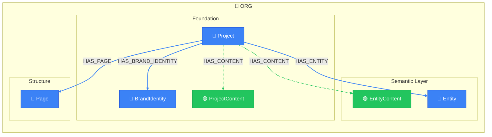

# Project Overview

> Auto-generated by novanet v0.12.0. Do not edit manually.

## Overview

Project dashboard with pages, entities, and brand identity

### Legend

| Color | Trait | Description |
|-------|-------|-------------|
| 🔵 Blue | Invariant | Nodes that don't change between locales |
| 🟢 Green | Localized | Nodes with locale-specific content |
| 🟣 Purple | Knowledge | Cultural/linguistic knowledge per locale |
| ⚪ Gray | Derived | Computed/aggregated data |
| ⚙️ Gray | Job | Background processing tasks |

## Graph Diagram

---

*Generated by novanet ViewMermaidGenerator — view: project-overview*
