# SEO Keywords View

> Auto-generated by novanet v10.6.0. Do not edit manually.

## Overview

SEO nodes in the global realm, organized per-locale.
These are reusable across multiple projects.

**3 nodes (v10.4):**
- SEOKeyword, SEOKeywordMetrics, SEOMiningRun

**Key insight:**
SEO keywords bridge Entity localization and search optimization.
A keyword like "QR code generator" can be targeted by multiple projects.

**v10.1 Architecture:**
- SEOKeyword is linked to EntityContent (locale-aligned targeting)
- Pattern: EntityContent -[:EXPRESSES]-> SEOKeyword -[:FOR_LOCALE]-> Locale

### Legend

| Color | Trait | Description |
|-------|-------|-------------|
| 🔵 Blue | Invariant | Nodes that don't change between locales |
| 🟢 Green | Localized | Nodes with locale-specific content |
| 🟣 Purple | Knowledge | Cultural/linguistic knowledge per locale |
| ⚪ Gray | Derived | Computed/aggregated data |
| ⚙️ Gray | Job | Background processing tasks |

## Graph Diagram

```mermaid
flowchart TB
  %% View: SEO Keywords (seo-keywords)
  %% 7 nodes, 6 arcs

  %% Trait styling (node_trait)
  classDef invariant fill:#3b82f6,stroke:#1d4ed8,color:#fff
  classDef localized fill:#22c55e,stroke:#16a34a,color:#fff
  classDef knowledge fill:#8b5cf6,stroke:#7c3aed,color:#fff
  classDef derived fill:#9ca3af,stroke:#6b7280,color:#fff
  classDef job fill:#6b7280,stroke:#4b5563,color:#fff

  subgraph SEO_KEYWORDS["SEO Keywords"]
  end

  subgraph SEO_METRICS["SEO Metrics"]
  end

  subgraph SEO_MINING["SEO Mining"]
  end

  %% Additional reachable nodes
  BlockGenerated["⚪ BlockGenerated"]
  EntityContent["🟢 EntityContent"]
  GenerationJob["⚙️ GenerationJob"]
  Locale["🔵 Locale"]
  OutputArtifact["⚪ OutputArtifact"]
  PageGenerated["⚪ PageGenerated"]
  ProjectL10n["🟢 ProjectL10n"]

  %% Relationships (styled by arc family)
  BlockGenerated -.->|FOR_LOCALE| Locale
  EntityContent -.->|FOR_LOCALE| Locale
  GenerationJob -.->|FOR_LOCALE| Locale
  OutputArtifact -.->|FOR_LOCALE| Locale
  PageGenerated -.->|FOR_LOCALE| Locale
  ProjectL10n -.->|FOR_LOCALE| Locale

  %% Arc colors by family
  linkStyle 0,1,2,3,4,5 stroke:#22c55e,stroke-width:2px

  %% Class assignments
  class BlockGenerated derived
  class EntityContent localized
  class GenerationJob job
  class Locale invariant
  class OutputArtifact derived
  class PageGenerated derived
  class ProjectL10n localized
```

## Notes

- SEO nodes are project-independent but locale-specific
- SEO keywords can be targeted by multiple projects via EntityContent
- v10.4: SEOKeyword linked to EntityContent -[:EXPRESSES]-> SEOKeyword
- Metrics are time-series - always use latest for current state

---

*Generated by novanet ViewMermaidGenerator — view: seo-keywords*
