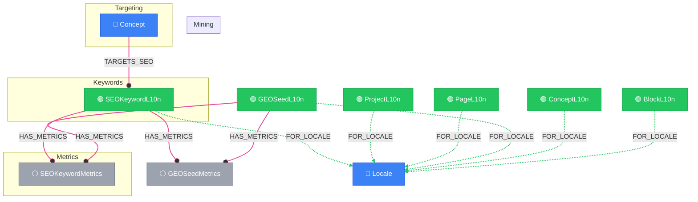

# SEO Pipeline View

> Auto-generated by novanet v9.0.0. Do not edit manually.

## Overview

SEO keyword mining and optimization workflow.

**Pipeline stages:**
1. **Mining**: SEOMiningRun discovers keywords per locale
2. **Targeting**: Concepts target SEOKeywordL10n
3. **Metrics**: SEOKeywordMetrics tracks performance
4. **Linking**: Pages link via LINKS_TO with SEO weight

**Node types:**
- SEOKeywordL10n: Localized keyword (locale-specific)
- SEOKeywordMetrics: Performance metrics (search volume, difficulty)
- SEOMiningRun: Mining job metadata

### Legend

| Color | Trait | Description |
|-------|-------|-------------|
| 🔵 Blue | Invariant | Nodes that don't change between locales |
| 🟢 Green | Localized | Nodes with locale-specific content |
| 🟣 Purple | Knowledge | Cultural/linguistic knowledge per locale |
| ⚪ Gray | Derived | Computed/aggregated data |
| ⚙️ Gray | Job | Background processing tasks |

## Graph Diagram

## Notes

- SEOKeywordL10n is locale-specific (keyword varies by locale)
- Metrics are time-series - use latest for current state
- LINKS_TO relation includes seo_weight for link juice optimization

---

*Generated by novanet ViewMermaidGenerator — view: seo-pipeline*
